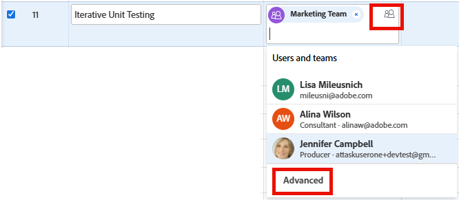

# 고급 할당 만들기

<!-- Audited: 11/2025-->

<!--remove the bullet indicated when we get rid of the new/old experience of editing tasks-->

<!--
 

The highlighted information on this page refers to functionality not yet generally available. It is available only in the Preview environment for all customers. The same features will also be available in the Production environment for all customers starting with  a week from the Preview release.      

For more information, see [Interface modernization](/help/quicksilver/product-announcements/product-releases/interface-modernization/interface-modernization.md).  

 -->

고급 할당을 사용하여 작업 또는 문제 할당을 관리할 수 있습니다.

고급 발령을 수행할 때 다음 발령 정보를 조정할 수 있습니다.

* 작업 또는 문제에 사용자를 할당합니다(고급 할당 외부에서 수행할 수 있음).
* 각 할당자가 할당된 시간을 조정하고 재배포합니다.
* 작업 또는 문제의 소유자 또는 기본 피할당자로 지정되어야 하는 사용자를 결정합니다.
* 작업 또는 문제를 작업할 때 각 사용자가 수행할 역할을 지정합니다.
  <!--* Override the billing rate for a job role.-->

>[!NOTE]
>
>작업에 사용자를 할당할 때 예약에 따라 가용성이 작업 및 문제의 계획 및 예상 일자에 영향을 줍니다. 일정에 대한 자세한 내용은 [일정 만들기](../../../administration-and-setup/set-up-workfront/configure-timesheets-schedules/create-schedules.md)를 참조하십시오.

## 고급 할당을 수행할 수 있는 Adobe Workfront 영역

이 문서에서는 작업 또는 문제 헤더의 고급 할당에 액세스하는 방법에 대해 설명합니다.

또한 Workfront의 다음 영역에서 고급 할당을 수행할 수 있습니다.

* 목록 및 보고서에서 할당 필드가 보기에 표시됩니다.
* 작업을 편집할 때 할당 섹션에서 다음을 수행합니다. 자세한 내용은 [작업 편집](../../../manage-work/tasks/manage-tasks/edit-tasks.md)을 참조하십시오. <!--When we remove the old/ new experience: take this bullet out completely; in the new Edit Task experience, this is no longer possible-->
* 작업 또는 문제 헤더의 할당 영역에서 다음을 수행합니다.
* 업무 균형자에서. 자세한 내용은 [업무 균형자를 사용하여 수동으로 작업 할당](../../../resource-mgmt/workload-balancer/assign-work-in-workload-balancer-manually.md)을 참조하십시오.

## 액세스 요구 사항

+++ 을 확장하여 이 문서의 기능에 대한 액세스 요구 사항을 봅니다.

<table style="table-layout:auto"> 
 <col> 
 <col> 
 <tbody> 
  <tr> 
   <td>Adobe Workfront 패키지</td> 
   <td> 
임의
 </td> 
  </tr> 
  <tr> 
   <td>Adobe Workfront 라이선스</td> 
   <td> 
표준

   
작업 이상

   </td> 
  </tr> 
  <tr> 
   <td role>액세스 수준 구성</td> 
   <td> 
작업 및 문제에 대한 액세스 편집
  </td> 
  </tr> 
  <tr> 
   <td>개체 권한</td> 
   <td> 
작업 또는 문제에 대한 기여 또는 더 높은 권한
</td> 
  </tr> 
 </tbody> 
</table>

자세한 내용은 [Workfront 설명서의 액세스 요구 사항](/help/quicksilver/administration-and-setup/add-users/access-levels-and-object-permissions/access-level-requirements-in-documentation.md)을 참조하십시오.

+++

## 고급 할당 만들기

1. 작업 또는 문제를 할당할 프로젝트로 이동합니다.
1. 왼쪽 패널에서 **작업** 또는 **문제**&#x200B;를 클릭한 다음 목록에서 작업 또는 문제의 이름을 클릭합니다.

   >[!TIP]
   >
   >작업 또는 문제 목록에서 직접 고급 할당을 수행할 수 있습니다. 작업 또는 문제와 같은 줄에 있는 **할당** 필드 내부를 클릭한 다음, 목록의 맨 아래에 있는 **고급** 또는 할당 상자의 오른쪽 위 모서리에 있는 **사람 아이콘**&#x200B;을 클릭하여 고급 할당 창을 엽니다. 5단계로 건너뛰고 고급 할당을 계속 작성합니다.
   >

1. 작업 또는 문제의 헤더에 있는 **할당** 필드에서 **할당 대상**&#x200B;을 클릭합니다

   또는

   작업 또는 문제가 이미 할당된 경우 할당된 이름 중 하나를 클릭합니다.

1. **고급**&#x200B;을 클릭합니다.

   

1. **사람, 역할 및 팀 검색** 필드에서 사용자, 역할 또는 팀의 이름을 입력한 다음 드롭다운 목록에 나타나면 이름을 클릭합니다.

   >[!NOTE]
   >
   >사용자 이름에 특수 문자가 포함되어 있으면 검색 필드에 특수 문자를 포함해야 합니다.

1. (선택 사항) **사람, 역할 및 팀 검색** 상자에서 피할당자를 계속 추가하여 작업 또는 문제에 여러 리소스를 추가합니다.

   >[!TIP]
   >
   >* 여러 사용자, 작업 역할 또는 팀을 할당할 수 있습니다. 활성 사용자, 작업 역할 및 팀만 할당할 수 있습니다.
   >
   >
   >* 사용자 할당을 추가할 때 아바타, 사용자의 기본 역할 또는 이메일 주소에 따라 이름이 동일한 사용자가 구분되는지 확인합니다.
   >사용자를 추가할 때 이를 보려면 사용자를 하나 이상의 작업 역할과 연결해야 합니다.
   >사용자의 이메일을 보려면 사용자의 액세스 수준에서 연락처 정보 보기 설정을 활성화해야 합니다. 자세한 내용은 [사용자에게 액세스 권한 부여](../../../administration-and-setup/add-users/configure-and-grant-access/grant-access-other-users.md)를 참조하십시오.
   >
   >
   >* 비활성화되기 전에 사용자, 작업 역할 또는 팀이 할당된 경우 작업 항목에 할당된 상태로 유지됩니다. 이 경우 다음 사항을 권장합니다.
   >   
   >   * 작업 항목을 활성 리소스에 재할당합니다.
   >   * 비활성화된 팀의 사용자를 활성 팀과 연결하고 작업 항목을 활성 팀에 재할당합니다.

   <!-- SHOULD BE THIRD BULLET POINT IN TIP TABLE WHEN THIS FEATURE IS RELEASED 
    * When adding a job role assignment, you can search for the job role or location. Select the System/Default Job Role to use the default billing rate for the assignment, or select a Rate Card Job Role to override the rate at the assignment level. For more information on rate cards, see [Manage rate cards](/help/quicksilver/administration-and-setup/set-up-workfront/configure-system-defaults/manage-rate-cards.md).
    -->

1. **피할당자** 열의 각 사용자에 대해 다음 정보를 지정하십시오.

   * **소유자**: 피할당자를 작업 또는 문제 소유자로 표시하려면 피할당자의 이름을 마우스로 가리킨 다음 소유자 필드의 **기본 항목으로 설정**&#x200B;을 클릭합니다. 녹색 확인란은 지정된 사용자가 작업 또는 문제의 기본 담당자임을 나타냅니다. Adobe Workfront은 작업 또는 문제에 할당한 첫 번째 사용자 또는 작업 역할을 소유자 또는 기본 할당으로 표시합니다. 팀을 작업 또는 문제의 기본 소유자로 지정할 수 없습니다.

     >[!IMPORTANT]
     >
     >Workfront 관리자 또는 그룹 관리자가 프로젝트 환경 설정을 설정하는 방법에 따라 Workfront은 작업에 여러 명의 사용자를 할당한 경우 작업 소유자의 일정을 사용하여 작업의 타임라인을 계산할 수 있습니다. 여러 작업 할당자에 대한 자세한 내용은 문서 [작업 할당](../../../manage-work/tasks/assign-tasks/assign-tasks.md)의 &quot;작업에 여러 사용자 할당&quot; 섹션을 참조하십시오.

   * **할당**: 작업의 기간 유형이 간단한 경우 각 사용자 또는 작업 역할이 작업에 할당되어야 하는 시간을 지정합니다. 각 사용자에 대해 할당된 모든 시간의 합계는 [할당] 열의 맨 아래에 있는 **계획된 시간** 필드의 숫자와 같습니다. 다른 모든 경우에는 할당자가 작업 또는 문제를 해결하는 데 소비할 시간(또는 할당)의 백분율을 지정합니다.

     >[!TIP]
     >   
     >   * 작업에 대한 할당 할당을 수동으로 수정한 후 작업의 계획된 시간이 그에 따라 업데이트될 수 있습니다. 자세한 내용은 문서 [계획된 시간 개요](../../../manage-work/tasks/task-information/planned-hours.md)의 &quot;사용자 할당을 관리할 때 작업 계획된 시간 업데이트&quot; 섹션을 참조하십시오.
     >   * 문제에 대한 할당 할당을 수동으로 수정할 수 없습니다.
     >   * 작업에 할당된 팀의 할당은 수동으로 수정할 수 없습니다.

   * **피할당자의 역할:** 이 할당을 수행할 때 사용자가 사용해야 하는 역할을 선택합니다.  사용자의 기본 역할 이 기본적으로 표시됩니다. **피할당자의 역할** 상자를 클릭하여 다른 역할을 선택합니다. 먼저 작업 또는 문제를 역할에 할당한 다음 해당 역할을 수행할 수 있는 사용자를 두 번째 할당으로 추가하면 제안된 사용자 목록이 작업 및 문제에 이미 할당된 역할을 수행할 수 있는 사용자에 대해 필터링됩니다.

     

   <!--

   * **Location**: The location comes from the rate card, if a rate card attached to the project uses locations with the job roles. The location can't be changed. 

   * **Billing Rates**: The billing rate for a user comes from the system rate for the user or their associated job role. The billing rate for a job role comes from the system rate or from the rate card, if a rate card is attached to the project. Existing billing rates are not displayed in this field. Click in the field to change the billing rate for this specific task assignment.

   
-->

   * **기간 유형**: 작업에만 사용할 수 있습니다. 기간 유형 이름을 클릭하고 드롭다운 메뉴에서 기간 유형 을 선택합니다. 기간 유형에 대한 자세한 내용은 [작업 기간 및 기간 유형 개요](../../../manage-work/tasks/taskdurtn/task-duration-and-duration-type.md)를 참조하십시오.

   * **기간:** 작업에 대한 관리 권한이 있는 경우 작업에 대해 이 필드를 업데이트할 수 있습니다.

     자세한 내용은 [작업 기간 및 기간 유형 개요](../../../manage-work/tasks/taskdurtn/task-duration-and-duration-type.md)를 참조하십시오. 할당 정보를 일괄 편집할 때 사용자, 시간, 할당 및 작업 소유자를 할당하는 유사한 대화 상자가 나타납니다.

   * **계획된 시간**: 기간 유형이 계산된 할당이거나 단순이면 계획된 시간 수를 업데이트하십시오. 결과적으로 각 리소스에 대한 할당 백분율 또는 시간이 균등하게 분배됩니다. Workfront은 기간 유형이 계산된 작업 또는 작업량 고정 시 계획된 시간을 계산합니다. 자세한 내용은 [작업 기간 및 기간 유형 개요](../../../manage-work/tasks/taskdurtn/task-duration-and-duration-type.md)를 참조하십시오.

1. **저장**&#x200B;을 클릭합니다.
