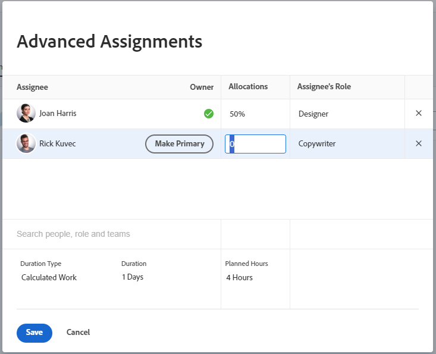

# 작업에 대한 사용자 또는 역할 할당 백분율 관리

<!--remove new/old experience references when they remove the New/ Old experience toggle from the Edit Tasks box-->

이 페이지에서 강조 표시된 정보는 아직 일반적으로 사용할 수 없는 기능을 참조합니다. 모든 고객을 위한 미리보기 환경에서만 사용할 수 있습니다. 미리보기 릴리스의 1주일부터 모든 고객을 위한 프로덕션 환경에서도 동일한 기능을 사용할 수 있습니다.

자세한 내용은 [인터페이스 현대화](/help/quicksilver/product-announcements/product-releases/interface-modernization/interface-modernization.md)를 참조하십시오.

할당 백분율은 할당된 자원이 하루 동안 작업에 대해 작업할 계획인 시간을 나타냅니다. 작업 기간 동안 자원이 할당되는 근무일(사용자 또는 프로젝트 일정에 따라)의 백분율입니다.

작업에 대한 고급 할당을 수행할 때 할당 백분율을 수정할 수 있습니다.

>[!NOTE]
>
>작업에 사용자를 할당할 때 예약에 따라 가용성이 작업 및 문제의 계획 및 예상 일자에 영향을 줍니다. 일정에 대한 자세한 내용은 [일정 만들기](../../../administration-and-setup/set-up-workfront/configure-timesheets-schedules/create-schedules.md)를 참조하십시오.

## 액세스 요구 사항

+++ 을 확장하여 이 문서의 기능에 대한 액세스 요구 사항을 봅니다.

<table style="table-layout:auto"> 
 <col> 
 <col> 
 <tbody> 
  <tr> 
   <td>Adobe Workfront 패키지</td> 
   <td> 
임의
 </td> 
  </tr> 
  <tr> 
   <td>Adobe Workfront 라이선스</td> 
   <td> 
표준

   
작업 이상

   </td> 
  </tr> 
  <tr> 
   <td>액세스 수준 구성</td> 
   <td>작업에 대한 액세스 편집</td> 
  </tr> 
  <tr> 
   <td>개체 권한</td>
   <td>
작업에 대한 또는 더 높은 권한 부여

   
이(가) 이전 환경을 사용하여 작업을 편집할 때 작업 편집 상자에서 할당 비율을 업데이트하도록 권한을 편집합니다. 새 경험에서 작업을 편집할 때 작업 편집 상자에서 할당 비율을 더 이상 관리할 수 없습니다.
 
자세한 내용은 <a href="/help/quicksilver/manage-work/tasks/manage-tasks/edit-tasks.md">작업 편집</a>을 참조하세요.
.</td>
  </tr>
 </tbody>
</table>

자세한 내용은 [Workfront 설명서의 액세스 요구 사항](/help/quicksilver/administration-and-setup/add-users/access-levels-and-object-permissions/access-level-requirements-in-documentation.md)을 참조하십시오.

+++

<!--
Take this piece out of the table above when we remove the new experience/ after production release in the task box: 

Edit permissions to update allocation percentage in the Edit Task box when editing tasks using the old experience. You can no longer manage allocation percentage in the Edit task box when editing tasks in the new experience.
 
For information, see <a href="/help/quicksilver/manage-work/tasks/manage-tasks/edit-tasks.md">Edit tasks</a>
.
-->

## 작업에 대한 비율 할당 수정에 대한 고려 사항

* 사용자에게는 기본적으로 할당된 작업에 동일한 시간의 비율이 할당됩니다.
* 작업의 기간 유형이 계산된 작업 또는 작업량 고정 인 경우에만 작업에 할당된 사용자 및 작업 역할에 대한 할당 비율을 수동으로 수정할 수 있습니다.

  자세한 내용은 [작업 기간 및 기간 유형 개요](../../../manage-work/tasks/taskdurtn/task-duration-and-duration-type.md)를 참조하십시오.

* 작업에 할당된 팀에 대한 비율 할당은 수정할 수 없습니다.
* 문제에 할당된 사용자 및 작업 역할에 대한 백분율 할당을 수정할 수 없습니다.

## 작업에 대한 사용자 또는 역할 비율 할당 수정

1. 퍼센트 할당을 변경할 자원에 대한 작업으로 이동합니다.
1. 작업 헤더의 **할당** 영역을 클릭한 다음 **고급**&#x200B;을 클릭합니다.

1. 작업의 **기간 유형**&#x200B;이(가) 다음 중 하나인지 확인하십시오.

   * 계산된 작업
   * 작업량 고정

   >[!TIP]
   >
   >* 계산된 할당 기간 유형의 경우 Workfront에서는 다음 수식을 사용하여 각 할당자의 할당 백분율을 계산합니다. `Allocation Percentage = (Work Required / Number of days in the Duration) / Number of hours per work day / Number of assignees`.
   >* 단순 기간 유형의 경우 할당 퍼센트가 아니라 각 자원에 할당된 시간을 예상할 수 있습니다.

1. 각 작업 할당자에 대한 **할당** 필드를 수정합니다.

   사용자 및 작업 역할 할당에 대한 할당 퍼센트만 수정할 수 있습니다.

   작업에 할당된 팀의 할당 백분율을 수정할 수 없습니다.

   

1. **저장**&#x200B;을 클릭합니다.
