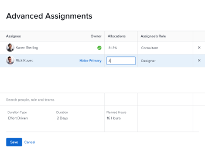

# 작업에 대한 사용자 또는 역할 할당 백분율 관리

이 페이지에서 강조 표시된 정보는 아직 일반적으로 사용할 수 없는 기능을 참조합니다. 모든 고객의 미리보기 환경 또는 빠른 릴리스를 활성화한 고객의 프로덕션 환경에서만 사용할 수 있습니다.

빠른 릴리스에 대한 자세한 내용은 [조직의 빠른 릴리스 활성화 또는 비활성화](/help/quicksilver/administration-and-setup/set-up-workfront/configure-system-defaults/enable-fast-release-process.md).

현재 릴리스에 대한 자세한 내용은 [2024년 3분기 릴리스 개요](/help/quicksilver/product-announcements/product-releases/24-q3-release-activity/24-q3-release-overview.md).

할당 백분율은 할당된 자원이 하루 동안 작업에 대해 작업할 계획인 시간을 나타냅니다. 작업 기간 동안 자원이 할당되는 근무일(사용자 또는 프로젝트 일정에 따라)의 백분율입니다.

>[!NOTE]
>
>작업에 사용자를 할당할 때 예약에 따라 가용성이 작업 및 문제의 계획 및 예상 일자에 영향을 줍니다. 일정에 대한 자세한 내용은 [일정 만들기](../../../administration-and-setup/set-up-workfront/configure-timesheets-schedules/create-schedules.md).

## 액세스 요구 사항

이 문서의 단계를 수행하려면 다음 액세스 권한이 있어야 합니다.

<table style="table-layout:auto"> 
 <col> 
 <col> 
 <tbody> 
  <tr> 
   <td role="rowheader">Adobe Workfront 플랜*</td> 
   <td> 
임의
 </td> 
  </tr> 
  <tr> 
   <td role="rowheader">Adobe Workfront 라이센스*</td> 
   <td> 
작업 이상
 </td> 
  </tr> 
  <tr> 
   <td role="rowheader">액세스 수준 구성*</td> 
   <td> 
작업에 대한 액세스 편집
 
참고: 여전히 액세스 권한이 없는 경우 Workfront 관리자에게 액세스 수준에서 추가 제한을 설정하는지 문의하십시오. Workfront 관리자가 액세스 수준을 수정하는 방법에 대한 자세한 내용은 <a href="../../../administration-and-setup/add-users/configure-and-grant-access/create-modify-access-levels.md" class="MCXref xref">사용자 정의 액세스 수준 만들기 또는 수정</a>.
 </td> 
  </tr> 
  <tr> 
   <td role="rowheader">개체 권한</td> 
   <td> 
작업에 대한 또는 더 높은 권한 부여
 
작업 편집 상자에서 할당 비율을 업데이트하는 권한 편집
 
추가 액세스 요청에 대한 자세한 내용은 <a href="../../../workfront-basics/grant-and-request-access-to-objects/request-access.md" class="MCXref xref">오브젝트에 대한 액세스 요청 </a>.
 </td> 
  </tr> 
 </tbody> 
</table>

&#42;보유 중인 플랜, 라이선스 유형 또는 액세스 권한을 확인하려면 Workfront 관리자에게 문의하십시오.

## 작업에 대한 비율 할당 수정에 대한 고려 사항

* 사용자에게는 기본적으로 할당된 작업에 동일한 시간의 비율이 할당됩니다.
* 작업의 기간 유형이 계산된 작업 또는 작업량 고정 인 경우에만 작업에 할당된 사용자 및 작업 역할에 대한 할당 비율을 수동으로 수정할 수 있습니다.

  자세한 내용은 [작업 기간 및 기간 유형 개요](../../../manage-work/tasks/taskdurtn/task-duration-and-duration-type.md).

* 작업에 할당된 팀에 대한 비율 할당은 수정할 수 없습니다.
* 문제에 할당된 사용자 및 작업 역할에 대한 백분율 할당을 수정할 수 없습니다.

## 작업에 대한 사용자 또는 역할 비율 할당 수정

1. 퍼센트 할당을 변경할 자원에 대한 작업으로 이동합니다.
1. 다음을 클릭합니다. **자세히** 메뉴  작업 이름 옆에 있는 을 클릭합니다. **편집**.

   또는

   다음을 클릭합니다. **할당** 작업 머리글의 영역을 클릭한 다음 **고급**.

1. 다음을 확인합니다. **기간 유형** 작업 중 은(는) 다음 중 하나입니다.

   * 계산된 작업
   * 작업량 고정

   >[!TIP]
   >
   >* 계산된 할당 기간 유형의 경우 Workfront은 다음 공식을 사용하여 각 할당자의 할당 백분율을 계산합니다. `Allocation Percentage = (Work Required / Number of days in the Duration) / Number of hours per work day / Number of assignees`.
   >* 단순 기간 유형의 경우 할당 퍼센트가 아니라 각 자원에 할당된 시간을 예상할 수 있습니다.

1. 클릭 **할당**&#x200B;을 클릭한 다음 을(를) 수정합니다. **할당** 각 작업 할당자에 대해.

   사용자 및 작업 역할 할당에 대한 할당 퍼센트만 수정할 수 있습니다.

   작업에 할당된 팀의 할당 백분율을 수정할 수 없습니다.

   프로덕션 환경의 샘플 이미지:
   

   미리보기 환경의 샘플 이미지:
   

1. **저장**&#x200B;을 클릭합니다.
