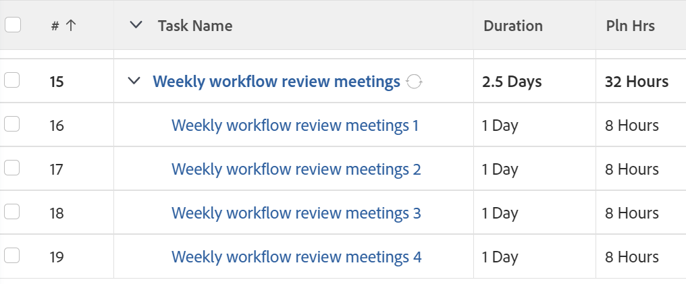

# 반복 작업 만들기

<!--Audited: 01/2024-->

단일 프로젝트의 일부로 반복해야 하는 작업에 대해 반복 작업을 만들 수 있습니다.

기존 반복 작업 편집의 영향을 포함하여 반복 작업에 대한 일반적인 정보는 [반복 작업 개요](../../../manage-work/tasks/manage-tasks/recurring-tasks-overview.md)를 참조하십시오.

## 액세스 요구 사항

+++ 을 확장하여 이 문서의 기능에 대한 액세스 요구 사항을 봅니다.

이 문서의 단계를 수행하려면 다음 액세스 권한이 있어야 합니다.

<table style="table-layout:auto"> 
 <col> 
 <col> 
 <tbody> 
  <tr> 
   <td role="rowheader">Adobe Workfront 플랜*</td> 
   <td> 
임의
 </td> 
  </tr> 
  <tr> 
   <td role="rowheader">Adobe Workfront 라이센스*</td> 
   <td> 
새로운 기능: 표준
 
   
현재: 작업 시간 이상
 </td> 
  </tr> 
  <tr> 
   <td role="rowheader">액세스 수준 구성*</td> 
   <td> 
작업 및 프로젝트에 대한 액세스 편집
 </td> 
  </tr> 
  <tr> 
   <td role="rowheader">개체 권한</td> 
   <td> 
작업 이상을 추가할 수 있는 프로젝트에 대한 Contribute 권한
 
   
작업을 만들 때 작업에 대한 관리 권한을 자동으로 받습니다
 
   
 작업 권한에 대한 자세한 내용은 <a href="../../../workfront-basics/grant-and-request-access-to-objects/share-a-task.md" class="MCXref xref">작업 공유 </a>를 참조하십시오.
  </td> 
  </tr> 
 </tbody> 
</table>

&#42;보유 중인 플랜, 라이선스 유형 또는 액세스 권한을 확인하려면 Workfront 관리자에게 문의하십시오. 액세스 요구 사항에 대한 자세한 내용은 [Workfront 설명서의 액세스 요구 사항](/help/quicksilver/administration-and-setup/add-users/access-levels-and-object-permissions/access-level-requirements-in-documentation.md)을 참조하십시오.

+++

## 반복 작업 만들기

>[!NOTE]
>
>기존 작업을 수정하여 반복 작업을 만들 수 없습니다. 처음부터 작업을 만들어야 합니다.

1. 되풀이 작업을 만들 프로젝트로 이동한 다음 왼쪽 패널의 **작업** 섹션을 클릭합니다.
1. **새 작업**&#x200B;을 클릭합니다.

   새 작업 대화 상자가 표시됩니다.

   

1. **추가 옵션**&#x200B;을 클릭한 다음 **작업 이름** 필드에 작업 이름을 입력하십시오.
1. 새 작업을 추가했을 때와 같은 방법으로 작업을 계속 업데이트합니다. 새 작업을 추가하는 방법에 대한 자세한 내용은 [프로젝트에서 작업 만들기](../../../manage-work/tasks/create-tasks/create-tasks-in-project.md)를 참조하십시오.

   >[!TIP]
   >
   >   새 반복 작업에 표시된 기간 및 계획된 시간은 각 발생의 기간 및 계획된 시간입니다. 상위 작업의 기간은 가장 빠른 작업의 계획된 시작 일자와 가장 최근 작업의 계획된 완료 일자 사이의 시간입니다. 상위 작업의 계획된 시간은 모든 발생 항목에서 모든 계획된 시간의 합계입니다.

1. 왼쪽 패널에서 **개요**&#x200B;를 클릭합니다.
1. **되풀이 일정** 섹션까지 아래로 스크롤한 다음 **되풀이 작업으로 만들기** 옵션을 선택하십시오.

   

1. **빈도** 드롭다운 목록에서 작업을 수행할 시간 단위 수와 시간 단위 유형을 선택합니다. 다음 옵션 중에서 선택합니다.

   <table style="table-layout:auto"> 
    <col> 
    <col> 
    <thead> 
     <tr> 
      <th>자동연장 유형</th> 
      <th>설명</th> 
     </tr> 
    </thead> 
    <tbody> 
     <tr> 
      <td role="rowheader"><strong>일</strong> </td> 
      <td> 
작업은 선택한 케이던스에 따라 매일, 2일마다, 3일마다 반복됩니다. 6일마다 작업을 반복하도록 구성할 수 있습니다. 기본 설정은 1일입니다. 
 </td> 
     </tr> 
     <tr> 
      <td role="rowheader"><strong>근무일</strong> </td> 
      <td> 
 작업은 선택한 케이던스에 따라 매일, 2일, 3일 등의 작업을 반복합니다. 최대 6일 근무일까지 반복되도록 작업을 구성할 수 있습니다.
 
이 옵션은 <a href="../../../administration-and-setup/set-up-workfront/configure-timesheets-schedules/create-schedules.md" class="MCXref xref">일정 만들기</a>에 설명된 대로 시스템 관리자가 정의한 기본 일정을 사용합니다.
 </td> 
     </tr> 
     <tr> 
      <td role="rowheader"><strong>주</strong> </td> 
      <td> 
 작업은 선택한 케이던스에 따라 매주, 2주마다, 3주마다 반복됩니다.
 
<strong>반복</strong> 필드에서 각 작업을 수행할 요일을 선택합니다. 여러 날을 선택할 수 있습니다. 
 </td> 
     </tr> 
     <tr> 
      <td role="rowheader"><strong>개월</strong> </td> 
      <td> 
작업은 선택한 케이던스에 따라 매월, 2개월마다, 3개월마다 반복됩니다. 1개월에서 12개월 중에 선택할 수 있습니다. 
 
작업을 수행하려면 <strong>반복</strong> 필드에서 다음 옵션 중에서 선택하십시오.
 
       <ul> 
        <li> 
<strong>매달 &lt;월 날짜&gt;</strong>일 
 
1일에서 30일까지 날짜를 선택하거나 <strong>마지막</strong>을(를) 선택할 수 있습니다. 예를 들어 "30일에 매달"를 선택할 수 있습니다. 
 </li> 
        <li> 
<strong>매달 &lt;숫자&gt; &lt;요일&gt;</strong>에 
 
첫 번째 드롭다운 메뉴에서 해당 월의 주 수에 대해 1에서 4 사이의 숫자를 선택하거나 "마지막"을 선택할 수 있습니다. 
 
두 번째 드롭다운 메뉴에서 요일을 선택할 수 있습니다. 
 
예를 들어 "매월 두 번째 화요일에"를 선택할 수 있습니다. 
 </li> 
       </ul> </td> 
     </tr> 
    </tbody> 
   </table>

   >[!NOTE]
   >
   >프로젝트의 일정과 연계된 일정 예외가 있는 경우 예외 중에는 반복 작업을 시작할 수 없습니다. 일정 예외 동안 발생하는 반복 작업은 예외 다음의 첫 번째 영업일에 시작하도록 예약됩니다. 일정 예외에 대한 자세한 내용은 문서 [일정 만들기](../../../administration-and-setup/set-up-workfront/configure-timesheets-schedules/create-schedules.md)를 참조하세요.

1. **시작** 필드에서 반복 작업을 시작할 날짜와 시간을 선택합니다.
1. **종료** 필드에서 반복 작업을 완료할 날짜와 시간을 선택합니다

   또는

   **반복 작업 발생 후`<number>`회**&#x200B;를 선택하여 반복 작업의 횟수를 나타냅니다. Workfront은 이 필드에 지정한 횟수와 동일한 횟수의 재귀를 작업에 대해 생성합니다.

1. **작업 만들기**&#x200B;를 클릭합니다.

   작업 목록이 표시됩니다. 반복 작업이 상위로 생성되며 모든 반복이 그 하위가 됩니다. Workfront은 상위 항목에 입력한 이름 뒤에 숫자가 붙은 을 사용하여 하위 작업의 이름을 자동으로 생성했습니다. 반복 작업은 작업 목록 끝에 배치됩니다.

   상위 반복 작업에서 자동으로 채워지는 필드에 대한 자세한 내용은 [반복 작업 개요](../../../manage-work/tasks/manage-tasks/recurring-tasks-overview.md)를 참조하십시오.

   

1. (선택 사항) 프로젝트의 다른 작업과 마찬가지로 각 반복 작업을 수정합니다.

   예를 들어 할당, 전임 작업, 기간을 추가하고 사용자 정의 필드를 포함하여 작업에 대한 다른 정보를 수정할 수 있습니다.

   >[!IMPORTANT]
   >
   >자식이 개별적으로 수정된 후 부모 재발을 수정하면 자식 간 또는 자식과 부모 간에 다른 정보가 발생할 수 있습니다. 자세한 내용은 [반복 작업 개요](../../../manage-work/tasks/manage-tasks/recurring-tasks-overview.md)를 참조하십시오.
