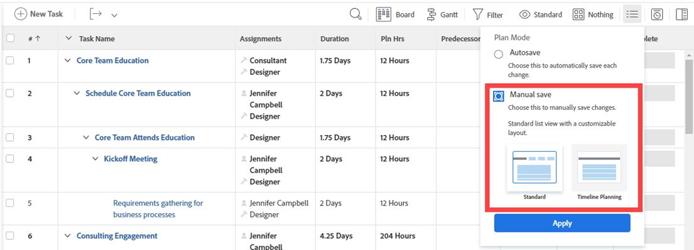

# 프로젝트에서 작업 만들기

<!-- Audited: 10/2024 -->

Adobe Workfront에서 다음과 같은 방법으로 작업을 만들 수 있습니다.

* 프로젝트를 만든 후 처음부터 프로젝트에서 작업을 만듭니다.

  프로젝트를 만든 후 작업을 추가하고 수정하여 프로젝트 계획을 구성할 수 있습니다. 프로젝트 만들기에 대한 자세한 내용은 [프로젝트 만들기](../../../manage-work/projects/create-projects/create-project.md)를 참조하십시오.

* 프로젝트에 템플릿을 추가하여 작업을 만듭니다.

  자세한 내용은 [프로젝트에 템플릿 첨부](/help/quicksilver/manage-work/projects/create-and-manage-templates/attach-template-to-project.md)를 참조하십시오.

* 개인 작업을 생성하여 프로젝트로 이동합니다.

  다음 중 하나를 수행하여 개인 태스크를 생성할 수 있습니다.

   * 임시 작업 요청을 만들고 사용자에게 보냅니다.
   * 홈 영역에 할 일 항목 만들기

  프로젝트에 없는 개인 작업을 만드는 방법에 대한 자세한 내용은 [개인 작업 만들기](/help/quicksilver/workfront-basics/updating-work-items-and-viewing-updates/create-personal-tasks.md)를 참조하십시오.

  개인 작업을 프로젝트로 이동할 수 있으며 작업 작업이 됩니다.

이 문서에서는 처음부터 작업을 만드는 방법과 개인 작업을 프로젝트로 이동하는 방법에 대해 설명합니다.

다음과 같은 방법으로 작업을 생성할 수도 있습니다.

* 기존 작업을 복사하거나 복제합니다. 자세한 내용은 [작업 복사 및 복제](../../../manage-work/tasks/manage-tasks/copy-and-duplicate-tasks.md)를 참조하십시오.
* 한 프로젝트에서 다른 프로젝트로 작업 이동 자세한 내용은 [작업 이동](../../../manage-work/tasks/manage-tasks/move-tasks.md)을 참조하세요.

## 액세스 요구 사항

+++ 를 확장하여 액세스 요구 사항을 확인합니다.

<table style="table-layout:auto"> 
 <col> 
 <col> 
 <tbody> 
  <tr> 
   <td role="rowheader">Adobe Workfront 플랜</td> 
   <td> 
임의
 </td> 
  </tr> 
  <tr> 
   <td role="rowheader"> 
Adobe Workfront 라이선스
 </td> 
   <td>
표준
 
   
작업 이상

   </td> 
  </tr> 
  <tr> 
   <td role="rowheader">액세스 수준 구성*</td> 
   <td> 
작업 및 프로젝트에 대한 액세스 편집
</td> 
  </tr> 
  <tr> 
   <td role="rowheader">개체 권한</td> 
   <td> 
작업 이상을 추가할 수 있는 권한으로 프로젝트에 참여
 
작업을 만들 때 작업에 대한 관리 권한을 자동으로 받습니다
 
 작업 권한에 대한 자세한 내용은 <a href="../../../workfront-basics/grant-and-request-access-to-objects/share-a-task.md" class="MCXref xref">작업 공유 </a>를 참조하십시오. 
 
추가 권한 요청에 대한 자세한 내용은 <a href="../../../workfront-basics/grant-and-request-access-to-objects/request-access.md" class="MCXref xref">개체에 대한 액세스 권한 요청을 참조하십시오. </a>
 </td> 
  </tr> 
 </tbody> 
</table>

이 표의 정보에 대한 자세한 내용은 [Workfront 설명서의 액세스 요구 사항](/help/quicksilver/administration-and-setup/add-users/access-levels-and-object-permissions/access-level-requirements-in-documentation.md)을 참조하십시오.

+++

## 프로젝트에서 작업 만들기

프로젝트에서 작업을 만드는 것은 템플릿에 작업을 만드는 것과 비슷합니다. 템플릿에 템플릿 작업을 추가할 때 아래 설명된 단계를 따를 수 있습니다.

프로젝트에서 작업을 생성하려면 다음을 수행하십시오.

1. 작업을 만들 프로젝트로 이동합니다.
1. 왼쪽 패널에서 **작업**&#x200B;을 클릭합니다.
1. (조건부) 현재 애자일 보기에서 작업 목록을 보고 있는 경우 오른쪽 상단의 **목록 보기** 아이콘 을 클릭하여 작업 목록을 표시합니다.
1. (선택 사항) **계획 모드** 아이콘 을 클릭하고 **수동 저장**&#x200B;을 선택한 다음 **표준** 또는 **타임라인 계획 수립**&#x200B;을 선택합니다. 기본적으로 사용되는 **자동 저장** 옵션이 비활성화됩니다.

   

   >[!TIP]
   >
   >수동 저장을 선택하면 변경 사항을 되돌릴 수 있습니다.

1. 다음 중 하나를 수행하여 새 작업을 만듭니다.

   * 작업 목록 맨 위에서 **새 작업**&#x200B;을 클릭합니다.
   * 작업 목록 맨 아래에 있는 **작업 추가**&#x200B;를 클릭합니다.

   

1. (조건부) **새 작업**&#x200B;을 클릭한 경우 다음 작업을 수행하십시오.

   1. **새 작업** 상자 내의 제한된 필드 목록에 있는 필드를 지정한 다음 작업을 빠르게 만들려면 **작업 만들기**&#x200B;를 클릭하십시오.

      또는

      작업의 모든 필드를 업데이트하려면 **추가 옵션**&#x200B;을 클릭하여 **작업 만들기** 상자를 엽니다.

      

      **작업 만들기** 상자가 열립니다.

      

      >[!NOTE]
      >
      >Workfront 관리자가 레이아웃 템플릿을 설정하는 방법에 따라 작업 만들기 상자의 필드에 환경의 다른 필드가 표시될 수 있습니다. 자세한 내용은 [레이아웃 템플릿을 사용하여 세부 정보 보기 사용자 지정](../../../administration-and-setup/customize-workfront/use-layout-templates/customize-details-view-layout-template.md)을 참조하십시오.

   1. 작업 만들기 상자의 왼쪽 패널에서 다음 영역에 대한 정보를 지정합니다.

      * 작업 이름
      * 개요
      * 할당
      * 사용자 정의 양식
      * 재무
      * 설정

        작업의 모든 작업 관련 필드 정의에 대한 자세한 내용은 [작업 편집](../../../manage-work/tasks/manage-tasks/edit-tasks.md)을 참조하십시오.

   1. (조건부 및 선택 사항) 작업을 반복하려면 **반복 빈도** 필드를 업데이트하십시오. 반복 작업 만들기에 대한 자세한 내용은 [반복 작업 만들기](../../../manage-work/tasks/create-tasks/create-recurring-tasks.md)를 참조하세요.
   1. (선택 사항) 왼쪽 패널에서 **문서**&#x200B;를 클릭하여 새 작업에 문서를 첨부한 다음 **파일 추가 또는 연결**&#x200B;을 클릭하여 컴퓨터 또는 다른 서비스에서 작업에 문서를 추가하거나 컴퓨터 또는 다른 서비스에서 문서 및 폴더를 연결합니다.

1. (조건부) 5단계에서 **작업 추가**&#x200B;를 클릭한 경우 인라인 편집을 사용하여 작업 정보 입력을 시작한 다음 Enter 키를 누릅니다.

   <!--
   
(NOTE: ensure this stays accurate)

   -->

   특히 목록에 여러 작업을 추가할 때 이 옵션을 사용하는 것이 좋습니다.

   

1. (조건부) 다음 중 하나를 수행합니다.

   * 5단계에서 **새 작업**&#x200B;을 클릭한 경우 **작업 만들기**&#x200B;를 클릭하여 변경 내용을 저장하고 새 작업을 프로젝트에 추가합니다.

     <!--   
     
(NOTE: is this step still right?)
   
     -->

   * 5단계에서 **작업 추가**&#x200B;를 클릭한 경우 다음을 수행하십시오.

     <!--   
     
(NOTE: is this step still right?) 
   
     -->

      1. 브라우저에서 아무 곳이나 클릭하여 변경 내용을 제출하거나 Enter 키를 누릅니다.
      1. (선택 사항) 작업 목록에서 새로 만든 작업을 선택한 다음 **들여쓰기**&#x200B;를 클릭합니다.

         이렇게 하면 새 작업이 이전 작업의 하위 작업 또는 하위 작업이 됩니다.

         하위 작업에 대한 자세한 내용은 문서 [하위 작업 만들기](/help/quicksilver/manage-work/tasks/create-tasks/create-subtasks.md)의 &quot;작업 하위 작업 섹션에서 하위 작업 만들기&quot; 섹션을 참조하십시오.

      1. (조건부) **작업 추가**&#x200B;를 누른 후 **자동 저장** 옵션을 비활성화한 경우 다음을 수행할 수 있습니다.

         * 언제든지 **실행 취소**&#x200B;를 클릭하여 마지막 변경 내용을 취소하거나 **취소**&#x200B;를 클릭하여 작업 목록에 적용한 모든 변경 내용을 취소합니다.
         * 이전에 **실행 취소**&#x200B;를 클릭한 경우 **다시 실행**&#x200B;을 클릭하여 마지막으로 취소한 변경 내용을 다시 적용합니다.
         * 작업 목록에 변경 사항을 저장하려면 **저장**&#x200B;을 클릭하세요.
   1. (선택 사항) 작업 목록에서 **전임 작업** 섹션을 클릭하여 작업에 전임 작업을 추가합니다. 자세한 내용은 [전임 작업 영역을 사용하여 전임 작업 관계 만들기](/help/quicksilver/manage-work/tasks/use-prdcssrs/create-predecessors-in-predecessors-area.md)를 참조하십시오.
   1. (선택 사항) 작업 목록에서 **하위 작업** 섹션을 클릭하여 하위 작업을 추가합니다. 자세한 내용은 [하위 작업 만들기](/help/quicksilver/manage-work/tasks/create-tasks/create-subtasks.md)를 참조하십시오.

## 개인 작업을 프로젝트로 이동하여 작업 만들기

1. (조건부) 사용자 또는 다른 사용자가 개인 작업을 생성했는지 확인합니다.

   자세한 내용은 [개인 작업 만들기](/help/quicksilver/workfront-basics/updating-work-items-and-viewing-updates/create-personal-tasks.md)를 참조하세요.
1. 개인 작업 필터를 만들어 작업 보고서 또는 목록에 적용합니다.

   자세한 내용은 [필터: 개인 작업](/help/quicksilver/reports-and-dashboards/reports/custom-view-filter-grouping-samples/filter-personal-tasks.md)을 참조하세요.

   
1. 개인 작업 보고서에서 작업 이름을 눌러 엽니다.

   Workfront은 개인 작업을 항상 &quot;&lt; 사용자의 전체 이름 > 의 작업&quot; 패턴에 따라 이름이 지정되는 목록에 없는 개인 프로젝트에 저장합니다. 예를 들어 개인 프로젝트의 이름을 &quot;Rick&#39;s Tasks&quot;로 지정할 수 있습니다.

1. 작업 페이지에서 **추가 메뉴** 를 클릭한 다음 **이동**&#x200B;을 클릭합니다. 작업 이동에 대한 자세한 내용은 [작업 이동](/help/quicksilver/manage-work/tasks/manage-tasks/move-tasks.md)을 참조하십시오.

   작업 이동이 완료되면 선택한 프로젝트에 작업이 표시됩니다. 프로젝트 타임라인은 새 작업의 타임라인에 의해 영향을 받을 수 있습니다.
