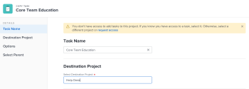

# 작업 복사 및 복제

프로젝트에서 다른 프로젝트로 작업을 복사하거나 동일한 프로젝트 내에서 작업을 복제할 수 있습니다.

한 번에 하나 또는 여러 작업 또는 상위 작업을 복사하거나 복제할 수 있습니다.

## 액세스 요구 사항

이 문서의 절차를 수행하려면 다음 액세스 권한이 있어야 합니다.

<table style="table-layout:auto"> 
 <col> 
 <col> 
 <tbody> 
  <tr> 
   <td role="rowheader">Adobe Workfront 플랜*</td> 
   <td> 
모든
 </td> 
  </tr> 
  <tr> 
   <td role="rowheader">Adobe Workfront 라이선스*</td> 
   <td> 
작업 이상 
 </td> 
  </tr> 
  <tr> 
   <td role="rowheader">액세스 수준 구성*</td> 
   <td> 
작업 및 프로젝트에 대한 액세스 편집
 
참고: 여전히 액세스 권한이 없는 경우 Workfront 관리자에게 액세스 수준에서 추가 제한 사항을 설정하는지 문의하십시오. Workfront 관리자가 액세스 수준을 수정하는 방법에 대한 자세한 내용은 <a href="../../../administration-and-setup/add-users/configure-and-grant-access/create-modify-access-levels.md" class="MCXref xref">사용자 정의 액세스 수준 만들기 또는 수정</a>.
 </td> 
  </tr> 
  <tr> 
   <td role="rowheader">개체 권한</td> 
   <td> 
작업에 대한 권한 관리 
 
프로젝트에 대한 권한 부여 이상
 
추가 액세스 요청에 대한 자세한 내용은 <a href="../../../workfront-basics/grant-and-request-access-to-objects/request-access.md" class="MCXref xref">개체에 대한 액세스 요청 </a>.
 </td> 
  </tr> 
 </tbody> 
</table>

&#42;어떤 계획, 라이선스 유형 또는 액세스 권한을 보유하고 있는지 알아보려면 Workfront 관리자에게 문의하십시오.

## 작업 복사 고려 사항

작업을 복사할 때 다음 사항을 고려하십시오.

* 문제는 작업에 복사되지 않습니다.
* 이정표는 복사된 작업에 전송되고 원래 작업에서 제거됩니다.

Adobe Workfront 웹 애플리케이션의 다음 영역에서 작업을 복사할 수 있습니다.

* 작업 수준에서 **자세히 아이콘**  작업 이름의 오른쪽에 있습니다.

   자세한 내용은 [작업 수준에서 작업 복사](#copy-a-task-at-the-task-level) 섹션에 자세히 설명되어 있습니다.

* 작업 목록에서 다음 중 하나를 수행하여 다음을 수행합니다.

   * 작업 이름을 마우스 오른쪽 단추로 클릭합니다.
   * 작업(또는 작업)을 선택하고 **자세히** 아이콘  작업 목록의 맨 위에 있습니다.
   * 작업 선택 및 확장 **자세히** 아이콘  작업 이름 옆에 표시됩니다.

      여러 작업을 선택할 때는 이 옵션을 사용할 수 없습니다.
   자세한 내용은 [목록의 작업 복사](#copy-tasks-in-a-list) 섹션에 자세히 설명되어 있습니다.

## 목록의 작업 복사 {#copy-tasks-in-a-list}

1. 복사하려는 작업이나 작업이 포함된 프로젝트로 이동합니다.

   또는

   작업 보고서로 이동합니다.

1. 클릭 **작업** 왼쪽 패널에 표시됩니다.
1. 을(를) 클릭합니다. **계획 모드 메뉴**  , 그런 다음 **자동 저장**.

   >[!IMPORTANT]
   >
   >변경 사항을 자동으로 저장할 때만 목록에 작업을 복사할 수 있습니다. 작업 편집 시 옵션 저장에 대한 자세한 내용은 [목록의 작업 편집](../../../manage-work/tasks/manage-tasks/edit-tasks-in-a-list.md).

1. 복사할 작업 또는 작업을 선택하고 다음 중 하나를 수행합니다.

   * 을(를) 클릭합니다. **추가 메뉴** 작업 목록의 맨 위에서 을 클릭합니다. **복사 대상**.
   * 선택한 작업을 마우스 오른쪽 단추로 클릭한 다음 **복사 대상**.
   * 작업 하나를 선택하면 **자세히** 메뉴  목록의 작업 이름 옆에 있는 **복사 대상**.
   

1. 섹션에 설명된 대로 작업 복사를 계속합니다 [작업 수준에서 작업 복사](#copy-a-task-at-the-task-level) 4단계 시작.

   <!--
   <MadCap:conditionalText data-mc-conditions="QuicksilverOrClassic.Draft mode">
   (NOTE: is this still accurate?!)
   </MadCap:conditionalText>
   -->

## 작업 수준에서 작업 복사 {#copy-a-task-at-the-task-level}

작업 목록에서 작업을 복사하는 것 외에도 작업을 연 후 복사할 수도 있습니다. 

1. Workfront 시스템에서 작업을 검색하여 찾습니다.
1. 작업 이름을 클릭하여 엽니다. 
1. 을(를) 클릭합니다. **자세히** 드롭다운 메뉴  작업 이름 옆에 있는 **복사** **to**.

   

   작업 복사 상자가 표시됩니다.

1. (선택 사항) **작업 이름**.

   >[!TIP]
   >
   >목록에서 여러 작업을 복사하도록 선택하면 이 필드는 흐리게 표시되어 편집할 수 없습니다. 작업 이름 필드를 마우스로 가리키면 선택한 모든 작업 목록이 표시됩니다.
   >
   >

1. 이름 입력 **대상 프로젝트** 에서 작업을 복사할 위치 **대상 프로젝트 선택** 필드. 

   >[!TIP]
   >
   >* 프로젝트 이름은 대/소문자를 구분합니다.
   >* 참조 번호 입력을 시작하거나 프로젝트 ID를 입력할 수도 있습니다. 이렇게 하면 이름이 같은 프로젝트를 구분하는 데 도움이 될 수 있습니다.
   >* 목록에 100개의 프로젝트만 표시됩니다.

   기본적으로 현재 프로젝트 이름이 표시됩니다. 동일한 프로젝트 내에서 작업을 복사하려면 이 필드를 그대로 둡니다.

1. (조건부) 클릭 **요청 액세스** 프로젝트에 대한 액세스를 요청하려면 선택한 프로젝트에 대한 액세스 권한이 없는 경우 선택합니다.
1. (조건부) 대상 프로젝트의 작업 중 하나에 작업을 추가할 수 있는 액세스 권한이 있으면 액세스를 요청하지 않고 선택한 대상 프로젝트에 작업을 계속 복사합니다.

   

   >[!TIP]
   >
   >Workfront 관리자가 이러한 프로젝트에 작업을 추가할 수 없을 때 선택한 프로젝트가 승인 보류 중, 완료 또는 사용 중지 상태인 경우 유사한 메시지가 표시됩니다. 자세한 내용은 [시스템 전체 프로젝트 환경 설정 구성](../../../administration-and-setup/set-up-workfront/configure-system-defaults/set-project-preferences.md).

1. 클릭 **옵션** 왼쪽 패널에서 작업과 함께 복사하지 않으려는 작업 속성을 선택 취소합니다. 기본적으로 모든 옵션이 선택됩니다.

   >[!TIP]
   선택 후 선택 취소 **모두 선택** 모든 옵션을 선택 취소합니다.

   다음 옵션 중에서 선택 취소하여 복사한 작업에 전송하지 않습니다. 다음 표에서는 옵션을 선택 취소하면 수행되는 작업을 설명합니다.

   <table style="table-layout:auto"> 
    <col> 
    <col> 
    <tbody> 
     <tr> 
      <td role="rowheader">제한</td> 
      <td> 
작업 제약 조건은 프로젝트 예약 모드 설정에 따라 가능한 한 빨리 또는 최대한 늦게 설정됩니다.
 
 선택한 경우 작업의 현재 제약 조건이 복사된 작업으로 전송됩니다. 
 
참고: 일자 특정 제약 조건이 있는 태스크를 다른 프로젝트로 이동하거나 복사하거나 태스크의 제약 일자가 신규 프로젝트의 일자 이외의 경우 태스크 제약은 가능한 한 빨리 또는 최대한 늦게 또는 프로젝트의 계획 시작 또는 계획 완료 일자가 조정됩니다. 날짜별 제한 사항의 몇 가지 예는 시작, 완료 시기, 시작 시기 또는 다음 이후 시작 등을 사용해야 합니다. 작업 제한 및 작업 제한 또는 프로젝트 날짜가 영향을 받을 수 있는 방법에 대한 자세한 내용은 <a href="../../../manage-work/tasks/task-constraints/task-constraint-overview.md" class="MCXref xref">작업 제한 개요</a> 특정 제약 조건을 찾습니다.
 </td> 
     </tr> 
     <tr> 
      <td role="rowheader">할당</td> 
      <td> 
모든 할당이 작업에서 제거됩니다. 
 </td> 
     </tr> 
     <tr> 
      <td role="rowheader">승인 진행</td> 
      <td>모든 승인 프로세스가 작업에서 제거됩니다.</td> 
     </tr> 
     <tr> 
      <td role="rowheader">진행</td> 
      <td>작업 상태는 새로 만들기 입니다. 그렇지 않으면 복사된 작업이 기존 작업의 상태를 유지합니다.</td> 
     </tr> 
     <tr> 
      <td role="rowheader">재무 정보</td> 
      <td>작업의 재무 정보가 제거됩니다.</td> 
     </tr> 
     <tr> 
      <td role="rowheader">모든 선행 작업</td> 
      <td> 
이것은 종속성이 복사된 작업에 전달되지 않음을 의미합니다. 
 
선택하면 복사된 작업 그룹 내의 선행 작업이 보존되고 다른 선행 작업이 삭제됩니다.
 </td> 
     </tr> 
     <tr> 
      <td role="rowheader">문서</td> 
      <td> 
작업에 첨부된 문서는 복사된 작업에 전송되지 않습니다. 여기에는 버전, 증명 및 연결된 문서가 포함됩니다.
 
여기에는 문서 승인이 포함되지 않습니다. 작업이 복사되면 문서 승인을 복사할 수 없습니다.
 </td> 
     </tr> 
     <tr> 
      <td role="rowheader">미리 알림</td> 
      <td>작업 미리 알림은 복사한 작업에 전송되지 않습니다. </td> 
     </tr> 
     <tr> 
      <td role="rowheader">경비</td> 
      <td>작업에 로그된 비용은 복사된 작업에 전송되지 않습니다. </td> 
     </tr> 
     <tr> 
      <td role="rowheader">권한</td> 
      <td>Workfront은 작업의 공유 목록에 표시되는 모든 엔티티의 이름을 제거합니다. </td> 
     </tr> 
     <tr> 
      <td role="rowheader">사용자 정의 데이터</td> 
      <td> 
사용자 지정 필드의 값이 지워지고 사용자 지정 양식이 복사된 작업에 전송됩니다. 
 
선택한 경우, 양식 및 사용자 지정 필드의 값이 모두 복사된 작업으로 전송됩니다. 
 </td> 
     </tr> 
    </tbody> 
   </table>

1.  (선택 사항) **상위 선택** 왼쪽 패널에서 대상 프로젝트에서 복사한 작업의 상위 작업이 될 작업을 선택합니다.

   >[!TIP]
   목록에 있는 여러 작업을 복사하도록 선택하면 선택한 모든 작업이 선택한 상위의 하위 작업이 됩니다.

   다음 중 하나를 수행하여 상위를 선택합니다.

   * 작업 목록에서 프로젝트 계획에서 상위 중 하나를 선택합니다.
   * 검색 아이콘을 클릭합니다  이름으로 상위 작업을 검색합니다.
   작업이 목록에 나타납니다.

   

1. 라디오 단추를 찾은 후 상위의 라디오 단추를 선택합니다. 

   상위 작업을 선택하지 않으면 작업은 하위 작업이 아닌 기본 작업으로 복사되며 대상 프로젝트의 작업 목록 끝에 배치됩니다. 

1. 클릭 **작업 복사**

   또는

   클릭 **작업 복사** 목록에서 여러 작업을 선택하는 경우.
이제 복사된 작업은 지정된 프로젝트에 있으며 선택된 상위 작업에 하위 작업이거나 프로젝트의 마지막 작업입니다.

## 중복 작업

동일한 프로젝트에 동일한 작업이 필요한 경우 작업 목록에서 작업을 빠르게 복제할 수 있습니다.

* [작업 복제 고려 사항](#considerations-for-duplicating-tasks)
* [중복 작업](#duplicate-tasks)

### 작업 복제 고려 사항 {#considerations-for-duplicating-tasks}

* 목록이 작업 번호별로 정렬되는 경우에만 작업 목록에서 작업을 복제할 수 있습니다.

* 새 작업의 이름은 원래 작업과 동일합니다.
* 새 작업에 중복되는 정보는 선택할 수 없습니다. 원래 작업의 거의 모든 정보가 기본적으로 상위 관계를 포함한 중복 작업으로 전송됩니다.
* 다음 항목은 새 작업에 전송되지 않습니다.

   * 로그된 시간
   * 메모
   * 문제
   * 동일한 복사 작업 그룹에 있는 선행 작업만 후속 작업과 함께 복사됩니다.

      **예:** 예를 들어, Task 2와 Task 1을 동시에 복사하면 Task 2와 Task 1의 사본이 함께 제공됩니다. 작업 1의 사본은 작업 2의 이전 사본이 됩니다. 그러나 선행 작업을 복사하지 않고 작업 2만 복사하면 이전 복사본이 없습니다.

* 상위 작업을 복제하면 하위 작업이 선택되지 않은 경우에도 모든 하위 작업도 복제됩니다.
* 여러 작업을 동시에 복제할 수 있습니다.

   그러나 순차적 작업이 아닌 여러 작업은 동시에 복제할 수는 없습니다.

* 이정표는 새 작업으로 이동되고 원래 작업에서 제거됩니다.

### 중복 작업

1. 복제하려는 작업이나 작업이 포함된 프로젝트로 이동합니다.
1. 클릭 **작업** 왼쪽 패널에 표시됩니다.
1. 다음 중 하나를 수행하십시오.

   * (조건부) **계획 모드 메뉴**  > **자동 저장**&#x200B;을 클릭하고 복제할 작업을 선택한 다음 **추가 메뉴**  > **복제**.

      

   * (조건부) **계획 모드 메뉴**  > **수동 저장** > **표준** 또는 **타임라인 계획**&#x200B;를 입력한 후 다음을 수행합니다.

      1. 복제할 작업이나 작업을 선택하고 **복제**.
      1. (선택 사항) **실행 취소** 변경 사항을 취소하고 작업을 복제하지 않습니다.
      1. (선택 사항 및 조건부) **다시 실행** 이전에 **실행 취소**&#x200B;를 눌러 변경 사항을 유지하고 작업을 복제합니다.

      1. 클릭 **저장** 변경 사항을 저장하려면 을 클릭합니다.
   1. 목록의 작업 편집
