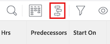

# 프로젝트 중요 경로 개요

<!-- Audited: 5/2025 -->

프로젝트의 중요 경로를 결정하는 것은 Adobe Workfront이 프로젝트의 타임라인에 영향을 줄 수 있는 프로젝트 작업 시퀀스에 플래그를 지정하는 자동 방법입니다. 프로젝트의 타임라인에 영향을 줄 수 있는 작업은 중요 경로 작업으로 플래그가 지정됩니다.

다음 기능은 프로젝트의 중요 경로에 영향을 줄 수 있습니다.

* 프로젝트의 작업 분류 구조.

  자세한 내용은 [프로젝트에서 작업 분류 구조 결정](../../../manage-work/projects/planning-a-project/determine-project-work-breakdown-structure.md)을 참조하십시오.

* 각 작업이 완료되는 데 소요되는 시간(기간)입니다.
* 작업 간의 종속성.

  다음 사항을 고려하십시오.

   * 중요 경로의 작업에 전임 작업 관계가 있는 경우 전임 작업이나 후임 작업의 날짜 변경이 종속 항목에 직접 영향을 주는 경우 해당 전임 작업이나 후임 작업도 중요 경로에 포함됩니다.

     >[!TIP]
     >
     >작업의 후속 작업 날짜가 종속 작업 또는 프로젝트 날짜에 직접 영향을 주지 않는 경우 후속 작업이 중요 경로에 없습니다.
     >
     >
     >     >
     >

   * 하위 작업이 중요 경로 작업으로 식별되는 경우, 예상 시작 일자와 상위 작업의 시간이 하위 작업의 시간과 동일한 경우, 상위 작업도 중요 경로 작업으로 식별됩니다.

이러한 기능을 고려하여 가장 이른 작업과 프로젝트 종료를 결정하는 작업 사이의 가장 긴 경로를 사용하여 중요 경로 를 계산합니다. 중요 경로 계산에서는 프로젝트를 더 길게 하지 않고도 각 작업을 시작하고 완료할 수 있는 가장 이른 시간과 가장 늦은 시간을 고려합니다. 이 프로세스는 &quot;위험&quot;(및 가장 긴 경로에 속함)한 작업과 &quot;총 부동&quot;(프로젝트를 더 길게 하지 않고 지연시킬 수 있음)을 갖는 작업을 결정합니다.

중요 경로에서 작업 활동이 지연되면 프로젝트의 예상 완료 일자에 직접 영향을 미칩니다. 중요 경로에는 부동 소수점이 없습니다.

## 액세스 요구 사항

+++ 을 확장하여 이 문서의 기능에 대한 액세스 요구 사항을 봅니다.

이 문서의 단계를 수행하려면 다음 액세스 권한이 있어야 합니다.

<table style="table-layout:auto"> 
 <col> 
 <col> 
 <tbody> 
  <tr> 
   <td role="rowheader">Adobe Workfront 플랜</td> 
   <td> 
임의
 </td> 
  </tr> 
  <tr> 
   <td role="rowheader">Adobe Workfront 라이선스</td> 
   <td> 
   
새로운 기능: 표준

   
또는

   
현재: 작업 시간 이상

    </td> 
  </tr> 
  <tr> 
   <td role="rowheader">액세스 수준 구성</td> 
   <td> 
작업에 대한 보기 또는 상위 액세스 권한
 
참고: 여전히 액세스 권한이 없는 경우 Workfront 관리자에게 액세스 수준에서 추가 제한을 설정하는지 문의하십시오. Workfront 관리자가 액세스 수준을 수정하는 방법에 대한 자세한 내용은 <a href="../../../administration-and-setup/add-users/configure-and-grant-access/create-modify-access-levels.md" class="MCXref xref">사용자 지정 액세스 수준 만들기 또는 수정</a>을 참조하십시오.
 </td> 
  </tr> 
  <tr> 
   <td role="rowheader">개체 권한</td> 
   <td> 
작업에 대한 이상의 권한 보기 
 
추가 액세스 요청에 대한 자세한 내용은 <a href="../../../workfront-basics/grant-and-request-access-to-objects/request-access.md" class="MCXref xref">개체 </a>에 대한 액세스 요청 을 참조하십시오.
 </td> 
  </tr> 
 </tbody> 
</table>

이 표의 정보에 대한 자세한 내용은 [Workfront 설명서의 액세스 요구 사항](/help/quicksilver/administration-and-setup/add-users/access-levels-and-object-permissions/access-level-requirements-in-documentation.md)을 참조하십시오.

+++

## 중요 경로 보기

Workfront 애플리케이션의 다음 영역에서 중요 경로에 속하는 작업을 볼 수 있습니다.

* [간트 차트에서 중요 경로 보기](#view-the-critical-path-in-the-gantt-chart)
* [작업 목록 또는 보고서에서 중요 경로 보기](#view-the-critical-path-in-a-task-list-or-report)

### 간트 차트에서 중요 경로 보기 {#view-the-critical-path-in-the-gantt-chart}

간트 차트의 중요 경로에서 작업을 보려면 다음과 같이 하십시오.

{{step1-to-projects}}

1. 프로젝트 목록에서 프로젝트를 선택합니다.

1. 왼쪽 패널에서 **작업**&#x200B;을 클릭합니다. **작업** 탭이 열립니다.

1. 작업 목록의 오른쪽 상단 모서리에서 **간트 차트** 아이콘을 클릭합니다.

   

1. 간트 차트 섹션의 오른쪽 상단 모서리에서 **옵션** 아이콘 을 클릭한 다음 나타나는 드롭다운에서 **중요 경로** 옵션을 선택합니다. 중요 경로에 있는 작업은 이제 타임라인 위에 빨간색 줄이 표시됩니다.

   

### 작업 목록 또는 보고서에서 중요 경로 보기 {#view-the-critical-path-in-a-task-list-or-report}

작업 목록에서 중요 경로에 있는 작업을 보려면 다음과 같이 하십시오.

{{step1-to-projects}}

1. 프로젝트 목록에서 프로젝트를 선택합니다.

1. 왼쪽 패널에서 **작업**&#x200B;을 클릭합니다. **작업** 탭이 열립니다.

1. **보기** 아이콘 을 클릭한 다음 **상태**&#x200B;를 선택합니다. 중요 경로에 있는 작업은 목록의 **플래그** 열에 **중요 경로** 플래그를 표시합니다.

   또는

   **필터** 아이콘 을 클릭한 다음 **+새 필터**&#x200B;를 선택하십시오.
1. 첫 번째 필드에 *중요*&#x200B;을 입력한 다음 목록의 **작업** 섹션에 나타나면 선택하십시오.

   

1. 두 번째 드롭다운 메뉴에서 **Is true**&#x200B;이(가) 선택되었는지 확인합니다.

   

1. 필터 패널을 닫습니다. 이제 작업 목록에는 중요 경로에 있는 작업만 표시됩니다.
