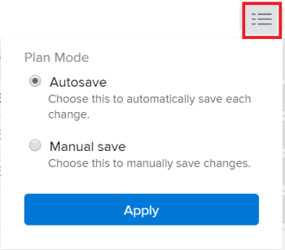

# 목록에서 작업 편집 {#edit-tasks-in-a-list}

<!-- Audited: 10/2025 -->

<!--

 

The highlighted information on this page refers to functionality not yet generally available. It is available only in the Preview environment for all customers. The same features will also be available in the Production environment for all customers starting with a week from the Preview release.      

For more information, see [Interface modernization](/help/quicksilver/product-announcements/product-releases/interface-modernization/interface-modernization.md).  

 -->

목록에 표시된 필드를 편집하여 작업 목록에서 작업 정보를 편집할 수 있습니다. 작업을 편집하는 다른 방법에 대한 자세한 내용은 [작업 편집](../../../manage-work/tasks/manage-tasks/edit-tasks.md)을 참조하세요.

## 액세스 요구 사항

+++ 이 문서의 기능에 대한 액세스 요구 사항을 보려면 확장하십시오.

<table style="table-layout:auto"> 
 <col> 
 <col> 
 <tbody> 
  <tr> 
   <td role="rowheader">Adobe Workfront 패키지</td> 
   <td> 
임의
 </td> 
  </tr> 
  <tr> 
   <td role="rowheader">Adobe Workfront 라이선스</td> 
   <td> 
표준

   
작업 이상

    </td> 
  </tr> 
  <tr> 
   <td role="rowheader">액세스 수준 구성</td> 
   <td> 
작업 및 프로젝트에 대한 액세스 편집
 </td> 
  </tr> 
  <tr> 
   <td role="rowheader">개체 권한</td> 
   <td> 
작업 및 프로젝트에 대한 상위 권한 기여
</td> 
  </tr> 
 </tbody> 
</table>

자세한 내용은 [Workfront 설명서의 액세스 요구 사항](/help/quicksilver/administration-and-setup/add-users/access-levels-and-object-permissions/access-level-requirements-in-documentation.md)을 참조하십시오.

+++ 

<!--Old:
<table style="table-layout:auto"> 
 <col> 
 <col> 
 <tbody> 
  <tr> 
   <td role="rowheader">Adobe Workfront plan</td> 
   <td> 
Any
 </td> 
  </tr> 
  <tr> 
   <td role="rowheader">Adobe Workfront license</td> 
   <td> 
New: Standard

   
Current: Work or higher

    </td> 
  </tr> 
  <tr> 
   <td role="rowheader">Access level configurations</td> 
   <td> 
Edit access to Tasks and Projects
 
Note: If you still don't have access, ask your Workfront administrator if they set additional restrictions in your access level. For information on how a Workfront administrator can change your access level, see <a href="../../../administration-and-setup/add-users/configure-and-grant-access/create-modify-access-levels.md" class="MCXref xref">Create or modify custom access levels</a>.
 </td> 
  </tr> 
  <tr> 
   <td role="rowheader">Object permissions</td> 
   <td> 
Contribute or higher permissions to the task and the project
 
For information on requesting additional access, see <a href="../../../workfront-basics/grant-and-request-access-to-objects/request-access.md" class="MCXref xref">Request access to objects </a>.
 </td> 
  </tr> 
 </tbody> 
</table>-->

## 목록에서 작업 편집에 대한 고려 사항 {#considerations-about-editing-tasks-in-a-list}

목록에서 작업을 편집하면 변경 사항이 프로젝트 타임라인에 미치는 영향을 명확하게 볼 수 있으며 여러 작업을 동시에 빠르게 변경할 수 있습니다.

목록에서 작업을 편집할 때 다음 사항을 고려하십시오.

* 편집 상자에서 작업을 편집할 때 작업에 대한 관리 권한이 필요한 것과 달리, 작업에 대한 기여 권한만 있으면 목록에서 작업을 편집할 수 있습니다. 이렇게 하면 작업에 대해 다음과 같은 제한된 정보를 편집할 수 있습니다.

   * 설명
   * 상태
   * 완료율
   * 사용자 정의 양식 정보

     >[!NOTE]
     >
     >필드를 업데이트할 권한이 있는 경우에만 목록에서 작업 사용자 정의 필드를 편집할 수 있습니다.

   * 로그 시간
   * 할당 수정
   * 재무 정보 보기
   * 경비, 작업 또는 문제 추가

* 다음 목록에서 작업을 편집할 수 있습니다.

   * 프로젝트의 작업 섹션
   * 프로젝트의 하위 작업 섹션
   * 작업 보고서

     >[!NOTE]
     >
     >기본적으로 Workfront은 작업에 대한 변경 사항을 하위 작업 섹션 또는 작업 보고서에 자동으로 저장합니다.

* 작업 편집을 시작하기 전에 계획 모드를 정의하여 Workfront에서 작업에 수행한 변경 사항을 목록에 저장하는 시기를 제어할 수 있습니다.

  다음 방법으로 변경 사항을 저장하는 Workfront 사이에서 결정할 수 있습니다.

   * 모든 변경 후 자동으로
   * 저장 을 클릭한 후에만 수동으로 수행합니다.

  Workfront에서 변경한 내용을 목록에 저장하는 시기를 구성하는 방법에 대한 자세한 내용은 이 문서의 [목록에서 작업을 편집하기 전에 계획 모드 수정](#modify-plan-mode-before-editing-tasks-in-a-list) 섹션을 참조하십시오.

* 다른 사용자는 작업에 대한 업데이트를 보려면 페이지를 새로 고쳐야 합니다.

## 목록에서 작업을 편집하기 전에 계획 모드 수정

목록의 작업에 대한 변경 사항이 발생할 때 자동으로 저장되는지 또는 각 변경 사항을 수동으로 저장할지 여부를 결정할 수 있습니다. 이렇게 하려면 작업을 편집하기 전에 작업 목록에서 계획 모드를 수정해야 합니다.

>[!IMPORTANT]
>
>작업을 자동으로 저장하는지 수동으로 저장하는지에 따라 목록에서 작업을 편집할 때 다른 사람의 정보를 덮어쓸 수 있습니다. 자세한 내용은 [작업 목록 내에 동시 변경 내용을 저장하는 개요](../../../manage-work/tasks/manage-tasks/save-concurrent-changes-in-a-task-list.md)를 참조하십시오.

업데이트 유형으로 자동 또는 자동 및 변경 시 가 선택된 프로젝트의 변경 사항을 목록에 저장하면 Workfront에서 프로젝트 내 및 프로젝트 간 종속성과 함께 프로젝트 타임라인을 업데이트합니다. 프로젝트가 크거나 종속성이 많은 경우 타임라인 계산에 시간이 오래 걸릴 수 있습니다. 변경 내용을 저장하기 위해 선택한 방법에 따라 작업 목록을 편집하는 방법 중 일부는 다른 방법보다 빠를 수 있습니다.

Workfront에서 작업에 대한 변경 사항을 목록에 저장하는 시기를 제어할 수 있습니다. 다음과 같은 시나리오가 있습니다.

* 각 업데이트 후에 Workfront에서 변경 사항을 자동으로 저장하도록 할 수 있습니다.

  자세한 내용은 이 문서에서 [변경 내용을 자동으로 저장하도록 플랜 모드 설정](#set-the-plan-mode-to-automatically-save-changes) 섹션을 참조하십시오.

* 저장 버튼을 사용하여 한 번에 여러 변경 사항을 적용하는 시기를 수동으로 제어할 수 있습니다.

  자세한 내용은 이 문서에서 [변경 내용을 수동으로 저장하려면 플랜 모드 설정](#set-the-plan-mode-to-manually-save-changes) 섹션을 참조하십시오.

### 변경 사항을 자동으로 저장하도록 계획 모드 설정

>[!TIP]
>
>프로젝트에 작업이 2000개 이상 있거나 종속 항목이 많은 경우 변경 사항 및 모든 프로젝트 종속성을 저장하는 것이 더 느려질 수 있습니다.

작업 목록 변경 사항을 자동으로 저장할 때 다음 사항을 고려하십시오.

* 작업 목록에 사용자 정의 보기를 적용하고 업데이트할 액세스 권한이 있는 작업 관련 필드를 편집할 수 있습니다.
* 자동 저장된 변경 사항은 되돌릴 수 없습니다. 기본 설정입니다.
* 프로젝트 업데이트 유형이 자동 또는 자동이고 변경 시 Workfront은 모든 변경 후 프로젝트의 타임라인과 모든 프로젝트 내 및 프로젝트 간 종속성을 자동으로 다시 계산합니다. 프로젝트 업데이트 형식에 대한 자세한 내용은 [프로젝트 업데이트 형식 선택](../../../manage-work/projects/manage-projects/select-project-update-type.md)을 참조하세요.

목록에서 작업을 편집하고 변경 사항을 자동으로 저장하려면 다음을 수행합니다.

{{step1-to-projects}}

1. **프로젝트** 페이지에서 프로젝트를 선택하십시오.
1. 왼쪽 패널에서 **작업** 섹션을 클릭합니다.

1. 목록 맨 위에 있는 **계획 모드** 아이콘 을 클릭하고 **자동 저장** 옵션이 선택되어 있는지 확인하십시오.

   

1. 수동으로 업데이트할 권한이 있는 필드를 편집합니다.

1. (선택 사항) 변경 내용을 취소하려면 **Esc**&#x200B;를 누르십시오.
1. 작업 및 프로젝트 타임라인에 대한 변경 내용을 저장하려면 키보드에서 **Enter**(Windows) 또는 **Return**(Mac)을 누르십시오.
1. (선택 사항) 수정할 작업을 마우스 오른쪽 버튼으로 클릭합니다.

   또는

   작업 이름 오른쪽에 있는 **자세히** 메뉴 을(를) 클릭합니다.

1. (선택 사항) 다음 옵션 중에서 선택합니다.

   <table style="table-layout:auto"> 
    <col> 
    <col> 
    <tbody> 
     <tr> 
      <td role="rowheader">새 탭에서 열기</td> 
      <td>새 브라우저 탭에서 작업을 엽니다. </td> 
     </tr> 
          <tr> 
      <td role="rowheader">위에 작업 삽입</td> 
      <td>선택한 작업 위에 작업을 삽입합니다.</td> 
     </tr> 
     <tr> 
      <td role="rowheader">아래에 작업 삽입</td> 
      <td>선택한 작업 아래에 작업을 삽입합니다.</td> 
     </tr>
     <tr> 
      <td role="rowheader">편집</td> 
      <td>
작업을 편집할 수 있는 작업 편집 상자를 엽니다.

작업 편집에 대한 자세한 내용은 <a href="#edit-tasks-in-a-list" class="MCXref xref">목록에서 작업 편집</a>을 참조하십시오.
</td> 
     </tr> 
     <tr> 
      <td role="rowheader">삭제</td> 
      <td>
작업을 삭제합니다.

작업 삭제에 대한 자세한 내용은 <a href="../../../manage-work/tasks/manage-tasks/delete-tasks.md" class="MCXref xref">작업 삭제</a>를 참조하십시오.
</td> 
     </tr> 
     <tr> 
      <td role="rowheader">한 수준 내리기</td> 
      <td>
작업을 한 수준씩 들여씁니다. 

이 옵션은 독립형 작업에만 표시됩니다.
</td> 
     </tr> 
     <tr> 
      <td role="rowheader">수준 올리기</td> 
      <td>
작업을 한 수준 내어씁니다. 

이 옵션은 하위 작업에만 표시됩니다. 
</td> 
     </tr>  
     <tr> 
      <td role="rowheader">복제</td> 
      <td>
동일한 프로젝트 내에 작업의 중복 버전을 만듭니다. 
</td> 
     </tr> 
     <tr> 
      <td role="rowheader">복사 위치...</td> 
      <td>
작업을 다른 프로젝트에 복사합니다.

작업 복사 및 복제에 대한 자세한 내용은 <a href="../../../manage-work/tasks/manage-tasks/copy-and-duplicate-tasks.md" class="MCXref xref">작업 복사 및 복제</a>를 참조하십시오.
</td> 
     </tr> 
     <tr> 
      <td role="rowheader">다음으로 이동...</td> 
      <td>
작업을 다른 프로젝트로 이동합니다.

작업 이동에 대한 자세한 내용은 <a href="../../../manage-work/tasks/manage-tasks/move-tasks.md" class="MCXref xref">작업 이동</a>을 참조하십시오.
</td> 
     </tr> 
    </tbody> 
   </table>

### 변경 사항을 수동으로 저장하려면 계획 모드 설정 {#edit-tasks-in-a-list-and-manually-save-changes}

작업에 대한 변경 사항을 목록에 수동으로 저장할 수 있습니다. 이러한 방식으로 변경 사항을 저장하면 저장하기 전에 변경 사항을 유연하게 되돌릴 수 있습니다.

>[!TIP]
>
>* 하위 작업 섹션 또는 작업 보고서에서 작업을 편집하는 경우 목록의 작업에 대한 변경 사항을 되돌릴 수 없습니다.
>* 되돌릴 수 있는 변경 사항의 수에는 제한이 없습니다. 작업의 원래 상태에 도달할 때까지 이러한 모든 작업을 하나씩 되돌릴 수 있습니다.
>

작업 목록에 변경 사항을 수동으로 저장할 때 다음 사항을 고려하십시오.

* 작업 목록 변경 사항을 수동으로 저장하려면 작업과 프로젝트를 모두 관리할 수 있는 권한이 필요합니다.
* 프로젝트를 편집할 수 없습니다. 프로젝트를 편집하는 옵션이 비활성화됩니다.
* 프로젝트 헤더에서 정보를 업데이트할 수 없습니다. 작업 목록에 변경 사항을 수동으로 저장할 때만 다음 작업을 수행할 수 있습니다.

   * 프로젝트 구독.
   * 프로젝트를 즐겨찾기 목록에 추가합니다.
   * 목록에서 해당 이름을 클릭하여 작업을 엽니다.

* 작업을 일괄적으로 편집합니다. 여러 작업을 선택할 때는 편집 아이콘이 비활성화됩니다.
* Workfront은 변경 사항을 저장한 후에만 작업에 수행한 변경 사항에 대한 알림을 트리거합니다.

목록의 작업에 대한 변경 사항을 수동으로 저장하는 방법에는 두 가지가 있습니다.

* [표준 수동 저장 옵션을 선택할 때 작업 목록에 변경 내용을 수동으로 저장](#save-changes-in-a-task-list-manually-when-you-select-the-manual-save-standard-option)
* [수동 타임라인 계획 수립 저장 옵션을 선택할 때 작업 목록에 변경 사항을 수동으로 저장](#save-changes-in-a-task-list-manually-when-you-select-the-manual-save-timeline-planning-option)

#### 수동 표준 저장 옵션을 선택할 때 작업 목록에 변경 사항을 수동으로 저장 {#save-changes-in-a-task-list-manually-when-you-select-the-manual-save-standard-option}

>[!TIP]
>
>프로젝트에 작업이 2000개 이상 있거나 종속 항목이 많은 경우 작업에 대한 변경 사항과 이러한 변경 사항이 모든 프로젝트 종속성에 미치는 영향을 시각적으로 식별하려면 시간이 걸릴 수 있습니다. 이 경우 변경 사항을 저장하는 데 예상보다 시간이 오래 걸릴 수 있습니다.

수동 표준 저장 옵션을 선택한 후 목록에서 작업을 업데이트할 때에는 다음 사항을 고려하십시오.

* 작업 목록에 사용자 정의 보기를 적용하고 해당 보기에서 관리할 권한이 있는 작업 관련 필드를 편집할 수 있습니다.
* 프로젝트 업데이트 유형이 자동 또는 자동이고 변경 시 Workfront은 저장을 클릭한 후 프로젝트의 타임라인과 모든 프로젝트 내 및 프로젝트 간 종속성을 계산합니다. 프로젝트 업데이트 형식에 대한 자세한 내용은 [프로젝트 업데이트 형식 선택](../../../manage-work/projects/manage-projects/select-project-update-type.md)을 참조하세요.

수동 표준 저장 옵션을 선택할 때 목록에서 작업을 편집하려면 다음과 같이 하십시오.

{{step1-to-projects}}

1. **프로젝트** 페이지에서 프로젝트를 선택하십시오.

1. 왼쪽 패널에서 **작업** 섹션을 클릭합니다.

1. 목록 맨 위에 있는 **계획 모드** 아이콘 을 클릭합니다.

1. **플랜 모드** 대화 상자에서 **수동 저장**&#x200B;을 선택한 다음 **표준**&#x200B;을 클릭합니다.

   

1. **적용**&#x200B;을 클릭합니다. 도구 모음 설정은 변경 내용을 실행 취소, 재실행 및 저장하는 옵션과 함께 표시됩니다.

   

1. 수동으로 업데이트할 권한이 있는 필드 내부를 클릭합니다. 필드는 편집 가능해지며 변경할 수 있습니다.

1. 키보드에서 **Enter**(Windows) 또는 **Return**(Mac)을 눌러 변경 내용을 임시로 저장합니다.

1. (선택 사항) 변경 내용을 취소하고 필드를 원래 상태로 되돌리려면 **실행 취소** 아이콘 을 클릭합니다.

1. (선택 사항 및 조건부) **다시 실행** 아이콘 을 클릭하여 취소한 변경 내용을 복원합니다.

1. (선택 사항) 수정할 작업을 마우스 오른쪽 버튼으로 클릭합니다.

   또는

   **자세히** 메뉴 을(를) 클릭합니다.

1. (선택 사항) 다음 옵션 중에서 선택합니다.

   <table style="table-layout:auto"> 
    <col> 
    <col> 
    <tbody> 
     <tr> 
      <td role="rowheader">새 탭에서 열기</td> 
      <td>새 브라우저 탭에서 작업을 엽니다. </td> 
     </tr> 
          <tr> 
      <td role="rowheader">위에 작업 삽입</td> 
      <td>선택한 작업 위에 작업을 삽입합니다.</td> 
     </tr> 
     <tr> 
      <td role="rowheader">아래에 작업 삽입</td> 
      <td>선택한 작업 아래에 작업을 삽입합니다.</td> 
     </tr> 
     <tr> 
      <td role="rowheader">삭제</td> 
      <td>작업 삭제에 대한 자세한 내용은 <a href="../../../manage-work/tasks/manage-tasks/delete-tasks.md" class="MCXref xref">작업 삭제</a>를 참조하십시오.</td> 
     </tr> 
     <tr> 
      <td role="rowheader">한 수준 내리기</td> 
      <td> 
작업을 한 수준씩 들여씁니다. 
 
이 옵션은 독립형 작업에만 표시됩니다.
 </td> 
     </tr> 
     <tr> 
      <td role="rowheader">수준 올리기</td> 
      <td> 
작업을 한 수준 내어씁니다. 
 
이 옵션은 하위 작업에만 표시됩니다. 
 </td> 
     </tr> 
     <tr> 
      <td role="rowheader">복제</td> 
      <td> 
동일한 프로젝트 내에 작업의 중복 버전을 만듭니다. 
 
작업 복사 및 복제에 대한 자세한 내용은 <a href="../../../manage-work/tasks/manage-tasks/copy-and-duplicate-tasks.md" class="MCXref xref">작업 복사 및 복제</a>를 참조하십시오.
 </td> 
     </tr> 
    </tbody> 
   </table>

1. Workfront은 작업 타임라인을 변경할 때 모든 프로젝트 내 및 프로젝트 간 종속성을 업데이트합니다.
1. 작업 변경 내용을 영구적으로 유지하고 프로젝트의 타임라인을 저장하려면 **저장**&#x200B;을 클릭합니다.

#### 수동 타임라인 계획 수립 저장 옵션을 선택할 때 작업 목록에 변경 사항을 수동으로 저장 {#save-changes-in-a-task-list-manually-when-you-select-the-manual-save-timeline-planning-option}

변경 사항 및 모든 프로젝트 종속성을 저장하는 것이 더 빠릅니다. 작업이 2000개를 초과하는 프로젝트에는 사용할 수 없습니다.

>[!IMPORTANT]
>
>종속성이 많은 수백 개 이상의 큰 작업 목록을 편집할 때는 이 옵션을 사용하는 것이 좋습니다. 이 옵션을 사용하면 수동 저장 옵션을 사용하는 것보다 훨씬 빠르게 변경 사항을 시각적으로 식별할 수 있습니다.

작업 목록에서 타임라인 계획 수립 수동 저장 옵션을 사용할 때는 다음 사항을 고려하십시오.

* 작업이 2000개를 초과하는 프로젝트에는 수동 타임라인 계획 수립 저장 옵션을 적용할 수 없습니다.
* 작업 목록에 사용자 지정 보기, 필터 또는 그룹화를 적용할 수 없습니다. 보기, 필터 및 그룹화 드롭다운 메뉴와 애자일 보기 아이콘이 비활성화됩니다. 기본적으로 적용되는 보기에는 제한된 수의 필드가 포함되어 있습니다.
* 프로젝트 업데이트 유형이 자동 또는 자동이고 변경 시 프로젝트의 타임라인과 모든 프로젝트 내 종속성이 각 변경 후 자동으로 계산됩니다.
* 프로젝트 업데이트 유형이 자동 또는 자동이고 변경 시 저장 을 클릭하면 프로젝트 간 종속성이 계산됩니다. 프로젝트 업데이트 형식에 대한 자세한 내용은 [프로젝트 업데이트 형식 선택](../../../manage-work/projects/manage-projects/select-project-update-type.md)을 참조하세요.

수동 타임라인 계획 수립 저장 옵션을 사용할 때 목록에서 작업을 편집하려면 다음을 수행합니다.

{{step1-to-projects}}

1. **프로젝트** 페이지에서 프로젝트를 선택하십시오.

1. 왼쪽 패널에서 **작업** 섹션을 클릭합니다.

1. 목록 맨 위에 있는 **계획 모드** 아이콘 을 클릭합니다.

1. **계획 모드** 대화 상자에서 **수동 저장**&#x200B;을 선택한 다음 **타임라인 계획 수립**&#x200B;을 클릭합니다.

   

   >[!TIP]
   >
   >작업이 2000개가 넘는 프로젝트의 경우 **시간 계획** 옵션이 흐리게 표시됩니다.

1. **적용**&#x200B;을 클릭합니다.

   다음 변경 사항이 목록에서 발생합니다.

   * 보기, 그룹화 및 필터 드롭다운 메뉴가 제거되고 보기가 다음 필드로 바뀝니다.

      * 작업 번호
      * 작업 이름
      * 제한 유형
      * 기간
      * 계획된 시작 일자
      * 계획된 완료 일자 기준
      * 전임 작업
      * 할당
      * 상태
      * 완료율

   * 애자일 보기 아이콘이 제거됩니다.
   * 도구 모음 설정은 변경 내용을 실행 취소, 재실행 및 저장하는 옵션과 함께 표시됩니다.

     

1. 수동으로 업데이트할 권한이 있는 필드를 편집합니다.

1. 키보드에서 **Enter**(Windows) 또는 **Return**(Mac)을 눌러 변경 내용을 임시로 저장합니다.
1. (선택 사항) 변경 내용을 취소하고 필드를 원래 상태로 되돌리려면 **실행 취소** 아이콘 을 클릭합니다.
1. (선택 사항 및 조건부) **다시 실행** 아이콘 을 클릭하여 취소한 변경 내용을 복원합니다.

1. (선택 사항) 수정할 작업을 마우스 오른쪽 버튼으로 클릭합니다.

   또는

   **자세히** 메뉴 을(를) 클릭합니다.

1. 다음 옵션 중에서 선택합니다.

   <table style="table-layout:auto"> 
    <col> 
    <col> 
    <tbody> 
     <tr> 
      <td role="rowheader">새 탭에서 열기</td> 
      <td>새 브라우저 탭에서 작업을 엽니다. </td> 
     </tr> 
          <tr> 
      <td role="rowheader">위에 작업 삽입</td> 
      <td>선택한 작업 위에 작업을 삽입합니다.</td> 
     </tr> 
     <tr> 
      <td role="rowheader">아래에 작업 삽입</td> 
      <td>선택한 작업 아래에 작업을 삽입합니다.</td> 
     </tr> 
     <tr> 
      <td role="rowheader">삭제</td> 
      <td>작업 삭제에 대한 자세한 내용은 <a href="../../../manage-work/tasks/manage-tasks/delete-tasks.md" class="MCXref xref">작업 삭제</a>를 참조하십시오.</td> 
     </tr> 
     <tr> 
      <td role="rowheader">한 수준 내리기</td> 
      <td> 
작업을 한 수준씩 들여씁니다. 
 
이 옵션은 독립형 작업에만 표시됩니다.
 </td> 
     </tr> 
     <tr> 
      <td role="rowheader">수준 올리기</td> 
      <td> 
작업을 한 수준 내어씁니다. 
 
이 옵션은 하위 작업에만 표시됩니다. 
 </td> 
     </tr> 
     <tr> 
      <td role="rowheader">복제</td> 
      <td> 
동일한 프로젝트 내에 작업의 중복 버전을 만듭니다. 
 
작업 복사 및 복제에 대한 자세한 내용은 <a href="../../../manage-work/tasks/manage-tasks/copy-and-duplicate-tasks.md" class="MCXref xref">작업 복사 및 복제</a>를 참조하십시오.
 </td> 
     </tr> 
    </tbody> 
   </table>

1. Workfront은 작업의 타임라인을 변경하면 모든 프로젝트 내 및 프로젝트 간 종속성을 업데이트합니다.
1. 작업 변경 내용을 영구적으로 유지하고 프로젝트의 타임라인을 저장하려면 **저장**&#x200B;을 클릭합니다.

## 요약을 사용하여 목록에서 작업 편집

{{step1-to-projects}}

1. **프로젝트** 페이지에서 프로젝트를 선택하십시오.

1. 왼쪽 패널에서 **작업** 섹션을 클릭합니다. 프로젝트의 작업 목록이 표시됩니다.

1. 편집할 작업을 선택한 다음 목록의 오른쪽 상단에 있는 **요약 열기** 아이콘 을 클릭합니다. **작업 요약** 패널이 열립니다.

1. (선택 사항) **업데이트** 영역에 작업에 대한 업데이트를 입력합니다.
1. 작업으로 이동하여 작업 수준에서 정보를 편집하려면 다음 아이콘 또는 영역을 클릭하십시오.

<table style="table-layout:auto"> 
    <col> 
    <col> 
    <tbody> 
     <tr> 
      <td role="rowheader">문서</td> 
      <td>작업에 문서를 추가합니다. </td> 
     </tr> 
          <tr> 
      <td role="rowheader">사용자 정의 양식</td> 
      <td>사용자 정의 양식을 추가 또는 제거하거나 양식에 대한 정보를 업데이트합니다.</td> 
     </tr> 
     <tr> 
      <td role="rowheader">시간</td> 
      <td>시간을 기록합니다.</td> 
     </tr> 
     <tr> 
      <td role="rowheader">승인</td> 
      <td>작업 승인을 추가합니다.</td> 
     </tr> 
     <tr> 
    </tbody> 
   </table>

1. 패널의 오른쪽 위 모서리에 있는 **X**&#x200B;을(를) 클릭하여 닫습니다.

## 일괄 작업 편집

여러 작업을 한 번에 편집할 수 있습니다. 작업을 편집할 수 있도록 관리 권한이 있는지 확인하십시오.

{{step1-to-projects}}

1. **프로젝트** 페이지에서 프로젝트를 선택하십시오.
1. 왼쪽 패널에서 **작업** 섹션을 클릭합니다.

1. 목록 맨 위에 있는 **계획 모드** 아이콘 을 클릭하고 **자동 저장** 옵션이 선택되어 있는지 확인하십시오.

   

   >[!IMPORTANT]
   >
   >작업을 수동으로 저장할 때 작업을 일괄적으로 편집할 수 없습니다.

1. 작업 목록에서 작업을 두 개 이상 선택합니다.
1. (선택 사항) 작업 목록 맨 위에 있는 **자세히** 메뉴 를 클릭한 다음 **식을 다시 계산**&#x200B;하여 계산된 사용자 지정 필드의 모든 정보를 업데이트합니다.
1. **편집** 아이콘 을 클릭합니다. **작업 편집** 대화 상자가 새 환경에서 열립니다.

   모든 작업에 대한 정보를 편집하는 것은 한 작업에 대한 정보를 편집하는 것과 동일합니다.

   작업 편집에 대한 자세한 내용은 [작업 편집](../../../manage-work/tasks/manage-tasks/edit-tasks.md)을 참조하세요.

1. (조건부) 새 경험에서 다음을 수행합니다.

   1. 다음 영역 중 하나에서 선택한 모든 작업에 대해 변경할 정보를 지정합니다.

      * 개요
      * 할당
      * 사용자 정의 양식
      * 재무
      * 설정
      * 설정
      * 댓글

      >[!NOTE]
      >
      >* 선택한 모든 작업에 대해 변경 중인 정보는 **할당** 필드를 제외한 개별 작업에 대한 기존 정보를 재정의합니다. 일괄 편집에서 새 피할당자를 추가하면 해당 피할당자가 선택한 모든 작업에 추가됩니다. 다른 할당자가 선택한 작업에 할당되면 일괄 편집을 통해 추가된 할당자와 함께 할당된 상태로 유지됩니다.
      >* 작업 기간을 편집하려면 선택한 작업의 작업 제한 사항이 동일해야 합니다. 그렇지 않으면 **기간** 필드가 채워지지 않습니다.
      >
      >* 활성 사용자 정의 양식만 목록에 표시됩니다. 선택한 작업에 일반적인 사용자 정의 양식이 없는 경우 이 섹션에 양식이 나열되지 않습니다.
      >* 선택한 모든 작업에 첨부되고 편집 권한이 있는 양식의 필드만 편집할 수 있습니다.  사용자 정의 양식을 대량으로 편집하는 방법에 대한 자세한 내용은 [개체에 첨부된 사용자 정의 양식 관리](../../../workfront-basics/work-with-custom-forms/manage-custom-forms-attached-to-objects.md)를 참조하십시오.

   1. **저장**&#x200B;을 클릭합니다.
   1. (선택 사항) **작업 편집** 상자 아래쪽에 있는 **이전 경험으로 다시 전환**&#x200B;을 클릭합니다.

1. (조건부) 이전 경험에서 다음 작업을 수행합니다.

   1. 다음 영역 중 하나에서 선택한 모든 작업에 대해 변경할 정보를 지정합니다.

      * 개요
      * 설정
      * 할당
      * 사용자 정의 양식
      * 댓글

   1. (선택 사항) **사용자 지정 Forms** 섹션에서 **사용자 지정 표현식 다시 계산** 옵션을 선택하여 선택한 작업에 첨부된 사용자 지정 양식에 있는 모든 계산된 사용자 지정 필드가 최신 상태가 되도록 합니다.
   1. **변경 내용 저장**&#x200B;을 클릭합니다. 이제 선택한 모든 작업에 변경 사항이 모두 표시됩니다.

