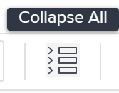

# 작업 세부 정보 섹션에서 작업 재무 관리

<!--

(NOTE: some of the information (fields) in this article is also in the Edit tasks article; if you need to update one field, to it in both articles)

-->

작업 세부 정보 섹션의 개요 영역에 액세스하여 작업의 재무 정보를 보거나 편집할 수 있습니다. 이 영역에서 보거나 편집할 수 있는 필드의 수는 제한되어 있습니다.

작업의 모든 재무 정보를 편집하는 방법에 대한 자세한 내용은 [작업 편집](../../../manage-work/tasks/manage-tasks/edit-tasks.md)을 참조하십시오.

## 액세스 요구 사항

+++ 이 문서의 기능에 대한 액세스 요구 사항을 보려면 확장하십시오. 

<table style="table-layout:auto"> 
 <col> 
 <col> 
 <tbody> 
  <tr> 
   <td role="rowheader">Adobe Workfront 패키지</td> 
   <td> 
임의
 </td> 
  </tr> 
  <tr> 
   <td role="rowheader">Adobe Workfront 라이선스</td> 
   <td>
표준
 
   
작업 이상
 </td> 
  </tr> 
  <tr> 
   <td role="rowheader">액세스 수준 구성</td> 
   <td> 
프로젝트 및 작업에 대한 액세스 편집
 
재무 데이터 또는 그 이상에 대한 액세스 보기
 
작업에 대한 재무 정보를 편집하려면 재무 데이터에 대한 편집 액세스 권한이 있어야 합니다.
 </td> 
  </tr> 
  <tr> 
   <td role="rowheader">개체 권한</td> 
   <td> 
재무 보기 이상이 포함된 작업에 대한 권한 보기
 
작업에 대한 재무 정보를 편집하려면 재무 편집이 포함된 작업에 대한 관리 권한이 있어야 합니다.
</td> 
  </tr> 
 </tbody> 
</table>

자세한 내용은 [Workfront 설명서의 액세스 요구 사항](/help/quicksilver/administration-and-setup/add-users/access-levels-and-object-permissions/access-level-requirements-in-documentation.md)을 참조하십시오.

+++

<!--Old:
<table style="table-layout:auto"> 
 <col> 
 <col> 
 <tbody> 
  <tr> 
   <td role="rowheader">Adobe Workfront plan*</td> 
   <td> 
Any
 </td> 
  </tr> 
  <tr> 
   <td role="rowheader">Adobe Workfront license*</td> 
   <td> 
Work or higher
 </td> 
  </tr> 
  <tr> 
   <td role="rowheader">Access level configurations*</td> 
   <td> 
Edit access to Projects and Tasks
 
View access to Financial Data or higher
 
You must have Edit access to Financial Data to edit financial information on tasks
 
Note: If you still don't have access, ask your Workfront administrator if they set additional restrictions in your access level. For information on how a Workfront administrator can change your access level, see <a href="../../../administration-and-setup/add-users/configure-and-grant-access/create-modify-access-levels.md" class="MCXref xref">Create or modify custom access levels</a>.
 </td> 
  </tr> 
  <tr> 
   <td role="rowheader">Object permissions</td> 
   <td> 
View permissions to the task that include View Finance or higher
 
You must have Manage permissions on the task that include Edit Finance to edit financial information on tasks
 
For information on requesting additional access, see <a href="../../../workfront-basics/grant-and-request-access-to-objects/request-access.md" class="MCXref xref">Request access to objects </a>.
 </td> 
  </tr> 
 </tbody> 
</table>-->

## 작업 세부 정보 섹션에서 작업 재무 편집

1. 작업을 보려는 프로젝트로 이동합니다.

   >[!NOTE]
   >
   >작업을 찾으려면 해당 작업을 검색하고 이름을 눌러 작업에 액세스할 수도 있습니다. Workfront에서 개체를 검색하는 방법에 대한 자세한 내용은 [Adobe Workfront 검색](../../../workfront-basics/navigate-workfront/search/search-workfront.md)을 참조하십시오.

1. 왼쪽 패널에서 **작업**&#x200B;을 클릭합니다.
1. 보려는 작업의 이름을 클릭합니다.
1. **작업 세부 정보**&#x200B;를 클릭합니다.
1. (선택 사항) 작업 세부 정보 페이지의 오른쪽 상단에 있는 **모두 축소** 아이콘을 클릭합니다.

   

   >[!NOTE]
   >
   >Workfront 관리자 또는 그룹 관리자가 레이아웃 템플릿을 설정하는 방법에 따라 작업 세부 정보 섹션의 필드가 재배열되거나 표시되지 않을 수 있습니다. 자세한 내용은 [레이아웃 템플릿을 사용하여 세부 정보 보기 사용자 지정](../../../administration-and-setup/customize-workfront/use-layout-templates/customize-details-view-layout-template.md)을 참조하십시오.

1. **재무**&#x200B;을(를) 클릭하여 확장하여 작업에 대한 재무 정보를 봅니다.

   세부 정보 섹션의 오른쪽 상단에 있는 **편집** 아이콘 을(를) 클릭한 다음 **재무**&#x200B;을(를) 클릭합니다.

1. 필드를 한 번 클릭하여 편집할 수 있는 필드를 편집하거나 **+추가**&#x200B;를 클릭하여 빈 필드에 정보를 추가하십시오.
1. **재무** 영역에서 다음 정보를 검토하거나 편집하십시오.

   <table style="table-layout:auto"> 
    <col> 
    <col> 
    <tbody> 
     <tr> 
      <td role="rowheader">비용 유형</td> 
      <td> 
작업에 대한 비용 유형을 지정합니다. 작업의 시간 수를 기반으로 작업의 비용 계산 방법을 결정합니다. 
 
다음 옵션 중에서 선택합니다. 
 
       <ul> 
        <li> 
비용 없음
 </li> 
        <li> 
고정 시간별 
 </li> 
        <li> 
 시간별 사용자 
 </li> 
        <li> 
 시간별 역할
 </li> 
       </ul> 
비용 추적에 대한 자세한 내용은 <a href="../../../manage-work/projects/project-finances/track-costs.md" class="MCXref xref">비용 추적</a> 을 참조하십시오. Workfront 관리자 또는 그룹 관리자는 시스템 또는 그룹의 작업에 대해 기본 비용 유형 설정을 선택합니다. 프로젝트 기본값 설정에 대한 자세한 내용은 <a href="../../../administration-and-setup/set-up-workfront/configure-system-defaults/set-project-preferences.md" class="MCXref xref">시스템 차원의 프로젝트 환경 설정 구성</a> 을 참조하십시오.
 </td> 
     </tr> 
     <tr> 
      <td role="rowheader">수익 유형</td> 
      <td> 
작업에 대한 수익 유형을 지정합니다. 작업의 시간 수를 기반으로 작업의 매출 계산 방법을 결정합니다. 
 
다음 옵션 중에서 선택합니다. 
 
       <ul> 
        <li> 
 과금 불가 
 </li> 
        <li> 
시간별 사용자 
 </li> 
        <li> 
시간별 역할 
 </li> 
        <li> 
고정 시간별 
 </li> 
        <li> 
시간별 사용자(상한 포함) 
 </li> 
        <li> 
시간별 역할(수용작업량 포함) 
 </li> 
        <li> 
시간별 + 고정 사용자 
 </li> 
        <li> 
시간별 + 고정 역할 
 </li> 
        <li> 
고정 수입 
 </li> 
       </ul> 
수익 추적에 대한 자세한 내용은 <a href="../../../manage-work/projects/project-finances/billing-and-revenue-overview.md" class="MCXref xref">청구 및 수익 개요</a> 를 참조하십시오. 
 
Workfront 관리자 또는 그룹 관리자는 시스템 또는 그룹의 작업에 대한 기본 수익 유형 설정을 선택합니다. 프로젝트 기본값 설정에 대한 자세한 내용은 <a href="../../../administration-and-setup/set-up-workfront/configure-system-defaults/set-project-preferences.md" class="MCXref xref">시스템 차원의 프로젝트 환경 설정 구성</a>을 참조하십시오.
 </td> 
     </tr> 
     <tr> 
      <td role="rowheader">계획된 비용</td> 
      <td> 
계획된 시간, 비용 유형 및 사용자 또는 작업 역할에 대한 시간당 요금을 기반으로 작업 비용을 표시하는 계산입니다. 비용 추적에 대한 자세한 내용은 <a href="../../../manage-work/projects/project-finances/track-costs.md" class="MCXref xref">비용 추적</a>을 참조하세요. 
 </td> 
     </tr> 
     <tr> 
      <td role="rowheader">실제 비용</td> 
      <td> 
 실제 시간, 비용 유형 및 사용자 또는 작업 역할에 대한 시간당 요금을 기반으로 작업 비용을 표시하는 계산입니다. 비용 추적에 대한 자세한 내용은 <a href="../../../manage-work/projects/project-finances/track-costs.md" class="MCXref xref">비용 추적</a>을 참조하세요.
 </td> 
     </tr> 
     <tr> 
      <td role="rowheader">계획된 수익</td> 
      <td> 
계획된 시간, 수익 유형 및 사용자 또는 작업 역할에 대한 시간당 요금을 기반으로 작업과 연결된 수익을 표시하는 계산입니다. 비용 추적에 대한 자세한 내용은 <a href="../../../manage-work/projects/project-finances/track-costs.md" class="MCXref xref">비용 추적</a>을 참조하세요.
 </td> 
     </tr> 
     <tr> 
      <td role="rowheader">실제 수익</td> 
      <td> 
실제 시간, 수익 유형 및 사용자 또는 작업 역할에 대한 시간당 요금을 기반으로 작업과 연결된 수익을 표시하는 계산입니다. 비용 추적에 대한 자세한 내용은 <a href="../../../manage-work/projects/project-finances/track-costs.md" class="MCXref xref">비용 추적</a>을 참조하세요.
 </td> 
     </tr> 
     <tr> 
      <td role="rowheader"><strong>CPI/SPI/CSI</strong> </td> 
      <td> 
지정된 시간에 작업이 수행되는 방식을 보여 주는 작업 성능 지표입니다. 이 값은 프로젝트의 성과 지수 방법을 기반으로 계산됩니다. 자세한 내용은 다음 문서를 참조하십시오.
 
       <ul> 
        <li> 
<a href="../../../manage-work/projects/project-finances/calculate-cpi.md" class="MCXref xref">CPI(비용 성과 지표) 계산</a> 
 </li> 
        <li> 
<a href="../../../manage-work/projects/project-finances/calculate-spi.md" class="MCXref xref">SPI(일정 성과 지수) 계산 </a> 
 </li> 
        <li> 
 
<a href="../../../manage-work/projects/project-finances/calculate-csi.md" class="MCXref xref">CSI(비용 일정 성과 지표) 계산</a> 
 
 </li> 
       </ul> </td> 
     </tr> 
     <tr> 
      <td role="rowheader">완료 시 추정(EAC)</td> 
      <td> 
완료 시 작업의 총 비용을 표시하는 계산입니다. 완료 시 예상 값에 대한 자세한 내용은 <a href="../../../manage-work/projects/project-finances/calculate-eac.md" class="MCXref xref">EAC(완료 시 예상 값 계산)</a>을 참조하십시오.
 </td> 
     </tr> 
    </tbody> 
   </table>

1. (조건부) 재무 섹션의 필드를 편집하는 경우 **변경 내용 저장**&#x200B;**1&rbrace;을 클릭합니다.**
