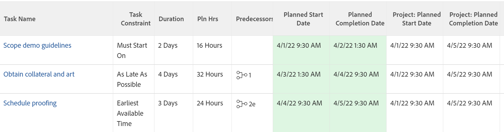

# 작업 제한 개요: 사용 가능한 가장 이른 시간

가장 빠른 가용 시간은 전임 작업 관계를 고려한 후 가장 빠른 가용 시간에 작업을 시작하도록 스케줄링하는 작업 제한입니다.

작업에 대한 작업 제한을 업데이트하는 방법에 대한 자세한 내용은 [작업의 작업 제한 업데이트](../../../manage-work/tasks/task-constraints/update-task-constraint-of-task.md)를 참조하십시오.

<!--

(NOTE: replaced with new article linked above) 

-->

<!--

To update the Task Constraint to Earliest Available Time:

-->

<!--
   <li value="1" data-mc-conditions="QuicksilverOrClassic.Draft mode">Go to a task whose constraint you want to modify. </li>
   -->

<!--
   
Click <strong>Edit Task</strong>.

   -->

<!--
   
Click the <strong>More</strong> icon  next to the task name, then click <strong>Edit</strong>.

   -->

<!--
   
In the <strong>Overview</strong> section, expand the <strong>Task Constraint</strong> drop-down menu.

   -->

<!--
   
Select <strong>Earliest Available Time</strong>.

   -->

<!--
   <li value="5" data-mc-conditions="QuicksilverOrClassic.Draft mode">Click <strong>Save Changes</strong>.</li>
   -->

## 가능한 가장 빠른 시간과 가능한 빠른 시간의 차이

<!--

(NOTE: [! This section is duplicated in "Earliest Available Time"])

-->

다음 기준이 모두 있는 경우 가장 빠른 가용 시간 제약조건이 가능한 한 빨리 제약조건과 다릅니다.

* 프로젝트가 완료부터 예약됩니다.
* 프로젝트의 작업에 전임 작업 관계가 있습니다.
* 전임 작업은 유연한 작업 제한 사항이 있습니다.

이 경우:

* **가장 빠른 사용 가능한 시간:** 후속 작업에 가장 빠른 사용 가능한 시간 제한을 사용하면 전임 작업의 유연한 제한 사항에 우선 순위를 둘 수 있습니다.

  **예**

  작업 A는 작업 B의 전임자입니다. 작업 B는 가장 빠른 가용 시간 제한을 가지며 작업 A는 가능한 한 늦게 제한을 갖습니다. 이러한 상황에서 작업 B는 최대한 프로젝트 완료에 가깝게 일정이 잡혀 있다.

  

* **가능한 한 빨리:** 이 시나리오에서는 후임 작업에 대해 가능한 한 빨리 제한을 사용하면 후임 작업에 우선 순위가 지정됩니다.

  **예**

  작업 A는 작업 B의 전임자입니다. 작업 B에는 가능한 한 빨리 제한이 있고 작업 A에는 가능한 한 늦게 제한이 있습니다. 이러한 상황에서 작업 B는 가능한 프로젝트 시작에 가깝게 일정이 잡혀 있다.

  
