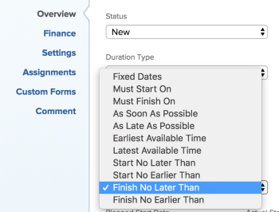

# 작업 제한 개요: 다음 이후에 완료

다음보다 늦지 않게 완료(FNLT)는 지정한 일자 이전에 작업이 완료되도록 예약하는 작업 제한입니다.

## 다음보다 늦지 않게 완료 제한 개요

작업에 대해 다음 이후에 완료(FNLT) 제한을 사용할 때는 다음 사항을 고려하십시오.

* 프로젝트가 시작 날짜부터 예약된 경우 이 제한을 사용해야 합니다. 이 경우 다른 종속 작업이 위험 상태로 표시되기 전에 작업에 대한 소프트 제한을 제공할 수 있습니다.
* 완료 일자부터 스케줄 프로젝트와 함께 FNLT 제한조건을 사용하는 경우 이 제한조건은 가능한 한 늦게 작업을 스케줄링합니다.
* FNET 제한 사항이 있는 작업을 다른 프로젝트로 이동하거나 복사하는 경우 제한 일자가 무엇이고 프로젝트의 시작 및 완료 일자가 무엇인지에 따라 작업 제한 사항이나 프로젝트 일자가 변경될 수 있습니다. 다음과 같은 시나리오가 있습니다.

   * 대상 프로젝트가 시작부터 예약된 경우:

      * 작업의 제한 일자가 프로젝트 계획 시작 일자보다 빠를 경우 작업 제한 사항은 가능한 한 빨리 로 변경됩니다.
      * 작업의 제한 일자가 프로젝트 계획 완료 일자보다 늦으면 프로젝트 계획 완료 일자가 작업의 완료 제한 일자와 일치하도록 변경됩니다.

      * 대상 프로젝트가 완료부터 예약된 경우:

         * 작업의 제한 일자가 프로젝트 완료 일자보다 늦으면 작업 제한 사항이 가능한 한 늦게 변경됩니다.
         * 작업의 제한 일자가 프로젝트의 계획된 시작 일자보다 빠를 경우 프로젝트의 계획된 시작 일자가 작업의 시작 제한 일자와 일치하도록 변경됩니다.

      * 프로젝트의 일정에 관계없이 작업의 제한 일자가 프로젝트의 시작 및 완료 일자 내에 있으면 작업 제한 일자 또는 프로젝트 일자에 대한 변경 사항이 없습니다.

  작업 이동에 대한 자세한 내용은 [작업 이동](../../../manage-work/tasks/manage-tasks/move-tasks.md)을 참조하십시오. 작업 복사에 대한 자세한 내용은 [작업 복사 및 복제](../../../manage-work/tasks/manage-tasks/copy-and-duplicate-tasks.md)를 참조하십시오.

작업에 대한 작업 제한을 업데이트하는 방법에 대한 자세한 내용은 [작업의 작업 제한 업데이트](../../../manage-work/tasks/task-constraints/update-task-constraint-of-task.md)를 참조하십시오.

<!--

<h2>Use the Finish No Later Than constraint</h2>

To update the Task Constraint to Finish No Later Than:

<ol>
<li value="1">Go to a task whose Task Constraint you want to update.</li>
<li value="2"> 
Click the <strong>More</strong> icon  next to the task name, then click <strong>Edit</strong>.
 </li>
<li value="3">In the <strong>Overview</strong> section, expand the <strong>Task Constraint</strong> drop-down menu.</li>
<li value="4"> 
Select <strong>Finish No Later Than</strong>.
 
  
 </li>
<li value="5"> 
Specify a <strong>Planned Completion Date</strong>.
 
You must complete the task on and not later than this date. 
 </li>
<li value="6">Click <strong>Save Changes</strong>.</li>
</ol>

-->
