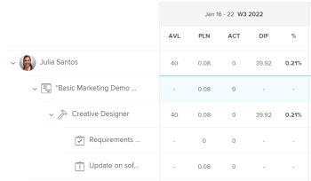

# 계획 시간 개요

작업, 문제 또는 프로젝트와 연관된 계획 시간은 지정된 사용자가 작업, 문제 또는 프로젝트를 완료하는 데 필요한 시간을 나타냅니다.

## Adobe Workfront에서 계획된 시간에 대한 고려 사항

* 계획 시간은 주로 Adobe Workfront의 작업 항목(작업 및 문제)과 연결됩니다. 작업 품목의 계획 시간은 해당 프로젝트의 계획 시간으로 롤업됩니다.
* 기본적으로 Workfront은 작업을 배포하고 작업 또는 문제의 기간 내 모든 일수에 동일한 계획 시간을 발행합니다.
* 사용자 및 역할이 태스크 및 문제에 지정되면 태스크 및 문제의 계획 시간이 사용자 또는 롤 지정과 연관됩니다.
* Workfront에서 리소스 관리 도구를 사용하려면 작업 및 문제에 대해 계획된 시간 값을 정의해야 합니다.
* 일부 기간 유형에 대해서만 작업에 대한 계획 시간 값을 수정할 수 있습니다.

   작업의 기간 유형과 관련된 작업에 대한 계획 시간 수정에 대한 자세한 내용은 섹션을 참조하십시오 [기간 유형에 따라 작업 계획 시간 업데이트](#update-task-planned-hours-based-on-duration-type) 참조하십시오.

* 언제든지 문제에 대한 계획 시간 값을 수정할 수 있습니다.
* 프로젝트 또는 상위 태스크의 계획 시간 값은 모든 태스크 및 하위 태스크의 모든 계획 시간의 계산된 합계이므로 수정할 수 없습니다.
* 자원 관리 도구를 사용하여 사용자 할당을 관리하는 경우 작업, 문제, 프로젝트 및 작업 항목과 연관된 발령의 계획 시간 수가 변경될 수 있습니다.

## 프로젝트에 대한 계획 시간과 프로젝트의 계획 시간 {#planned-hours-on-tasks-vs-planned-hours-on-projects}

태스크에서 계획된 시간은 프로젝트의 계획 시간으로 롤업됩니다. 문제로부터 계획된 시간이 프로젝트의 계획 시간에 항상 롤업되는 것은 아닙니다.

이 섹션에서는 작업과 프로젝트 계획 시간 간의 차이를 설명합니다. 프로젝트에 롤업되는 문제 계획 시간을 볼 수 있는 위치도 설명합니다.

* [작업에 대한 계획 시간](#planned-hours-on-tasks)
* [프로젝트에 대한 계획 시간](#planned-hours-on-projects)

### 작업에 대한 계획 시간 {#planned-hours-on-tasks}

작업의 계획 시간은 작업의 실제 작업이 소요될 수 있는 예상 시간을 나타냅니다. 기본적으로 Workfront은 각 작업의 기간 내에 각 날에 대한 총 계획 시간 크기를 균등하게 분배합니다. 계획 시간의 일별 양은 태스크에 대한 일별 할당이 됩니다. 작업이 여러 자원에 할당되면 기본적으로 각 리소스는 동일한 일별 시간을 할당합니다.

작업 로드 밸런서를 사용하여 작업에 할당된 사용자에 대한 일별 할당을 수정할 수 있습니다. 또한 작업 기간 유형이 단순인 경우 작업의 계획 시간을 업데이트할 수 있습니다. 자세한 내용은 문서의 &quot;사용자 할당을 관리할 때 작업 계획 시간 업데이트&quot; 섹션을 참조하십시오 [작업 로드 밸런서에서 사용자 할당 관리](../../../resource-mgmt/workload-balancer/manage-user-allocations-workload-balancer.md).

태스크에 하위 태스크가 포함되어 있는 경우 상위 태스크의 계획 시간은 하위 태스크에서 모든 계획 시간의 합계입니다. 상위 작업의 계획 시간(시)은 업데이트할 수 없습니다.

>[!NOTE]
>
>계획 시간과 달리 상위 작업의 실제 시간은 상위 작업에 직접 로그온된 시간입니다. 하위 작업의 실제 시간 합계를 나타내지 않습니다.\
>실제 시간에 대한 자세한 내용은 [실제 시간 보기](../../../manage-work/tasks/task-information/actual-hours.md).

### 프로젝트에 대한 계획 시간 {#planned-hours-on-projects}

프로젝트에 대한 계획 시간의 양은 편집할 수 없습니다. 프로젝트의 계획 시간은 프로젝트의 모든 작업에서 모든 계획 시간의 계산된 합계입니다.

계획 시간 계산에 문제가 포함되는지 여부는 계획 시간을 보고 있는 프로젝트 내의 위치에 따라 다릅니다. 프로젝트 내의 다음 위치에서 프로젝트 계획 시간을 조회할 수 있습니다.

* **프로젝트 세부 사항** **섹션** ****그리고&#x200B;**프로젝트 편집**상자&#x200B;**:**프로젝트의 작업에 대한 계획 시간만 고려됩니다. 프로젝트 상세내역 섹션이나 프로젝트 편집 박스에서 프로젝트의 총 계획 시간 수를 볼 때 프로젝트 문제에 대한 계획 시간은 고려되지 않습니다.

* ****작업 로드 밸런서: 작업 로드 밸런서에 표시되는 작업과 연관된 계획된 시간만 프로젝트의 작업 로드 밸런서에 표시됩니다. 사용자 일별 할당은 작업 로드 밸런서에서 프로젝트 일별 계획 시간을 변경할 수 있습니다.
* **사용률 섹션 :** 가동률 섹션에서 프로젝트에 대한 총 계획 시간 수를 볼 때 작업에 지정된 사용자와 연관된 계획 시간 및 프로젝트의 문제가 고려됩니다.
* **역할 할당 패널** 작업 목록: 작업 롤이나 작업 롤과 연관된 사용자에게 할당된 프로젝트의 작업 및 문제에 대한 계획 시간이 이 영역에 표시됩니다. 할당되지 않거나 팀에 할당된 작업 및 문제와 관련된 계획된 시간이 이 영역에 표시되지 않습니다. 자세한 내용은 [역할 할당 패널에서 프로젝트 계획 시간 보기](../../../manage-work/projects/planning-a-project/view-planed-hours-in-role-allocation-panel.md).

## 작업 기간에 대한 계획 시간 배포

기본적으로 Workfront은 작업 기간에 걸쳐 계획 시간을 균등하게 분배하여 프로젝트 스케줄의 가용성에 따라 각 작업 날에 대해 동일한 수의 계획 시간을 할당합니다.

예를 들어, 작업이 오후 4시에 시작되도록 설정되어 있고 일정이 작업의 첫 번째 날에 1시간이 남아 있는 경우, Workfront은 작업 기간의 첫 날에 1개의 계획 시간을 지정한 다음 남은 계획 시간을 작업 기간의 나머지 일 간에 균등하게 나눕니다.

>[!NOTE]
>
>일별 계획 시간 또는 일별 할당은 태스크 기간 동안 각 일별 계획 시간 할당이 됩니다. 태스크에 하나의 지정이 있는 경우 이 숫자는 발령당 일별 계획 시간 을 나타냅니다. 작업에 여러 개의 할당이 있는 경우 발령당 하루 계획 시간은 태스크에 대한 하루 계획 시간과 다릅니다. Workfront에는 여러 개의 할당이 있는 작업의 경우 할당당 하루 계획 시간 수에 대한 시각적 표현이 없습니다.

## 계획 시간 값 찾기 및 이해

Workfront의 다양한 영역에서 계획 시간 값을 찾을 수 있습니다. 

표시되는 계획 시간 수는 프로젝트의 작업 항목에서 시작되거나, 표시되는 영역 및 객체에 따라 다르게 계산됩니다.

Workfront의 다음 영역에서 계획 시간을 찾을 수 있습니다.

* [프로젝트, 작업 또는 문제의 세부 정보 섹션](#the-details-section-of-a-project-task-or-issue)
* [작업 편집 또는 문제 편집 상자](#the-edit-task-or-edit-issue-box)
* [보고서](#reports)
* [작업 로드 밸런서](#the-workload-balancer)
* [리소스 플래너](#the-resource-planner)
* [활용률 보고서](#the-utilization-report)
* [역할 할당 패널](#The%C2%A0Role)

### 프로젝트, 작업 또는 문제의 세부 정보 섹션 {#the-details-section-of-a-project-task-or-issue}

작업, 문제 또는 프로젝트의 상세내역 섹션의 계획 시간은 각 항목과 연관된 총 계획 시간입니다.

프로젝트 계획 시간에 대한 자세한 내용은 [프로젝트에 대한 계획 시간과 프로젝트의 계획 시간](#planned-hours-on-tasks-vs-planned-hours-on-projects) 섹션에 자세히 설명되어 있습니다.

### 작업 편집 또는 문제 편집 상자 {#the-edit-task-or-edit-issue-box}

작업 또는 문제의 편집 상자에 있는 계획 시간은 각 항목의 총 계획 시간입니다.

프로젝트 계획 시간에 대한 자세한 내용은 [프로젝트에 대한 계획 시간과 프로젝트의 계획 시간](#planned-hours-on-tasks-vs-planned-hours-on-projects) 섹션에 자세히 설명되어 있습니다.

작업의 경우 특정 기간 유형에 대해서만 계획 시간 양을 편집할 수 있습니다. 자세한 내용은 [기간 유형에 따라 작업 계획 시간 업데이트](#update-task-planned-hours-based-on-duration-type) 섹션에 자세히 설명되어 있습니다.

지정 영역에서 태스크 또는 문제에 지정된 각 사용자 또는 Job 역할에 대한 계획 시간의 개별 할당을 볼 수 있습니다.

### 보고서 {#reports}

프로젝트, 작업 및 문제 보고서에서 계획 시간 필드를 추가할 수 있습니다.

계획 시간 열은 기본적으로 작업 목록의 표준 보기에 포함됩니다.

태스크, 출고 또는 프로젝트 보고서의 계획 시간은 각 항목의 상세내역 섹션이나 항목의 편집 상자에 표시되는 총 계획 시간입니다.

보고서 만들기에 대한 내용은 [사용자 지정 보고서 만들기](../../../reports-and-dashboards/reports/creating-and-managing-reports/create-custom-report.md).

>[!NOTE]
>
>프로젝트(재무 데이터) 보고서를 생성하고 일별로 그룹핑하는 경우, 계획 시간은 프로젝트 작업 타임라인에 따라 프로젝트의 계획 시간의 일부를 표시할 수 있습니다. 기본적으로 Workfront은 작업 기간 동안 각 날에 대해 작업 계획 시간을 균등하게 분배합니다. 특정 시간 프레임에 대한 계획 시간은 프로젝트(재무 데이터) 보고서의 해당 시간 프레임에 대해 Workfront에 설정된 동일한 배포 세트와 일치합니다.

<!--
### The Scheduling areas  {#the-scheduling-areas}

The Planned Hours for tasks and issues display in the Scheduling areas in the Planned Hours field.

You can view the daily allocation of Planned Hours for each user assigned to a task or an issue in the Scheduling areas.

The daily hour amount represents one of the following:

* the default amount equally distributed by Workfront for each day of the Duration of the tasks or issues
* the adjusted daily allocation managed by resource managers.

  For information about adjusting daily allocations in the Scheduling tools, see [Manage user allocations in the Scheduling areas](../../../resource-mgmt/resource-scheduling/manage-allocations-scheduling-areas.md).
-->

### 작업 로드 밸런서 {#the-workload-balancer}

작업 로드 밸런서에 작업, 문제 및 프로젝트에 대한 다음 계획 시간이 작업, 문제 또는 프로젝트 이름의 오른쪽에 표시됩니다.

* 작업 및 문제에 대해 연관된 계획 시간이 표시됩니다.
* 프로젝트의 경우 화면 디스플레이에 표시되는 작업 및 문제로부터 총 계획된 시간입니다.

   >[!TIP]
   >
   >작업 로드 밸런서는 프로젝트 세부 정보 영역에 표시된 대로 프로젝트의 모든 계획 시간을 표시하지 않습니다.

작업에 지정된 각 사용자 또는 작업 로드 밸런서에서 문제에 대한 계획 시간의 일별 할당을 볼 수 있습니다.

계획 시간 일별 시간 금액은 다음 중 하나를 나타냅니다. 

* 작업, 문제 또는 프로젝트의 지속 기간 동안 매일 Workfront에서 균등하게 분배하는 기본 금액입니다
* 리소스 관리자가 관리하는 조정된 일별 할당.

   작업 로드 밸런서에서 일별 할당 조정에 대한 자세한 내용은 [작업 로드 밸런서에서 사용자 할당 관리](../../../resource-mgmt/workload-balancer/manage-user-allocations-workload-balancer.md).

### 리소스 플래너 {#the-resource-planner}

자원 계획자는 프로젝트, 작업, 문제에 대한 계획 시간을 표시합니다.

자원 계획자의 PLN 열에서 작업 항목과 연관된 사용자 및 작업 역할에 대한 계획 시간의 주간 할당을 볼 수 있습니다.

>[!TIP]
>
>작업 로드 밸런서의 일별 할당 조정은 리소스 플래너의 작업 및 문제에 대한 주간 할당에 영향을 줍니다.

각 객체에 대한 계획 시간 수는 Resource Planner에 적용하는 뷰에 따라 다릅니다. 자세한 내용은 [리소스 계획자의 프로젝트 및 역할 뷰의 시간, FTE 및 비용 정보 개요](../../../resource-mgmt/resource-planning/overview-of-planner-hour-fte-cost-information-in-role-project-views.md).

작업 및 문제에 대한 주간 시간 계획 시간은 다음 중 하나를 나타냅니다. 

* 작업 또는 문제의 기간 중 각 날에 대해 Workfront이 균등하게 분배하는 기본 주별 금액
* 작업 로드 밸런서에서 자원 관리자가 관리하는 조정된 주간 할당.

   작업 로드 밸런서에서 일별 할당 조정에 대한 자세한 내용은 [작업 로드 밸런서에서 사용자 할당 관리](../../../resource-mgmt/workload-balancer/manage-user-allocations-workload-balancer.md).

프로젝트, 사용자 및 역할에 대한 주간 금액은 해당 작업과 관련된 문제에 대한 주간 계획 시간 금액의 영향을 받습니다.

### 활용률 보고서 {#the-utilization-report}

계획 시간 프로젝트는 각 태스크 및 문제에 대한 발령과 연관된 것입니다.

>[!IMPORTANT]
>
>가동률 보고서의 계획시간은 작업 및 문제 자체가 아니라 발령과 연관되어 있습니다. 활용률 보고서의 계획 시간이 프로젝트의 태스크 및 문제에 대한 계획 시간과 항상 일치하지 않습니다. 하지만 계획 시간은 태스크 및 문제에 대한 발령과 연관된 시간과 일치합니다.

가동률 보고서에서 다음 유형의 계획 시간을 조회할 수 있습니다.

* 포함된 프로젝트의 전체 수명 동안 프로젝트에 대한 모든 발령의 총 계획 시간
* 지정된 일자 범위에 대해서만 모든 발령의 총 계획 시간(개별 주 또는 월을 지정할 수 있음)입니다.

   작업 로드 밸런서를 사용하여 시간 단위 사용자 일별 할당이 조정되면, 가동률 보고서에서 선택한 날짜에 작업 또는 문제 기간 중 일부만 포함되어 있으면 특정 날짜 범위에 대한 계획 시간이 영향을 받을 수 있습니다. 사용자의 일별 할당 조정에 대한 자세한 내용은 [작업 로드 밸런서에서 사용자 할당 관리](../../../resource-mgmt/workload-balancer/manage-user-allocations-workload-balancer.md).

자세한 내용은 [자원 사용률 정보 보기](../../../resource-mgmt/resource-utilization/view-utilization-information.md).

### 역할 할당 패널

역할 할당 패널의 계획 시간은 프로젝트의 총 기간 동안 프로젝트의 작업 또는 문제에 지정된 각 작업 역할과 연관된 계획 시간 수를 나타냅니다. 숫자는 자원 계획자에서 계획 시간 역할과 일치합니다.

>[!TIP]
사용자와 연관된 계획 시간은 역할 할당 패널에 표시되지 않습니다.

자세한 내용은 [작업 로드 밸런서에서 프로젝트 및 이니셔티브에 대한 역할 할당 표시](../../../scenario-planner/show-role-allocation-workload-balancer.md).

## 기간 유형에 따라 작업 계획 시간 업데이트 {#update-task-planned-hours-based-on-duration-type}

작업에 특정 기간 유형이 있는 경우에만 작업을 편집할 때 작업에 대한 총 계획 시간을 업데이트할 수 있습니다.

다음 시나리오가 있습니다.

* 작업을 편집할 때 계산된 지정 또는 단순 기간 유형을 사용하는 경우에만 태스크에 대한 계획 시간을 수정할 수 있습니다.

   계산된 지정 기간 유형에 대한 자세한 내용은 [기간 유형 개요: 계산된 할당](../../../manage-work/tasks/taskdurtn/calculated-assignment.md).

   단순 기간 유형에 대한 자세한 내용은 [기간 유형 개요: 단순](../../../manage-work/tasks/taskdurtn/simple-duration-type.md).

* 작업에 대한 사용자 할당을 관리할 때 작업 로드 밸런서에서 작업 계획 시간을 단순 기간 유형 작업에 대해서만 갱신할 수 있습니다. 작업 로드 밸런서에서 사용자 할당 관리에 대한 자세한 내용은 다음을 참조하십시오 [작업 로드 밸런서에서 사용자 할당 관리](../../../resource-mgmt/workload-balancer/manage-user-allocations-workload-balancer.md).
* 기간 유형의 투입 또는 계산된 작업량으로 태스크에 대한 계획 시간을 수정할 수 없습니다. 이러한 경우 Workfront은 작업의 지속 시간을 기준으로 계획 시간을 결정합니다. 그러나 이 경우 계획 시간은 항상 기간(시간)과 같으며 할당된 자원의 퍼센트 할당에 영향을 받지 않습니다.

   투입 제어 기간 유형에 대한 자세한 내용은 [기간 유형 개요: 작업 기반](../../../manage-work/tasks/taskdurtn/effort-driven.md).

   계산된 작업 기간 유형에 대한 자세한 내용은 [기간 유형 개요: 계산된 작업 시간](../../../manage-work/tasks/taskdurtn/calculated-work.md).

## 사용자 할당을 관리할 때 작업 계획 시간 업데이트

사용자 또는 작업 역할 할당을 태스크로 수동으로 갱신할 때 태스크에 대한 계획 시간을 갱신할 수 있습니다. 작업에 단순 기간 유형이 있는 경우에만 가능합니다.

자세한 내용은 [기간 유형 개요: 단순](../../../manage-work/tasks/taskdurtn/simple-duration-type.md).

작업에 할당된 사용자 및 역할의 전체 할당 또는 작업 로드 밸런서를 사용할 때 사용자 일별 할당을 갱신할 수 있습니다.

작업의 전체 사용자 및 작업 역할 할당 관리에 대한 자세한 내용은 [작업에 대한 사용자 및 역할 할당 시간 관리](../../../manage-work/tasks/assign-tasks/manage-allocation-hours-on-tasks.md).

작업에 대한 일별 할당 관리에 대한 자세한 내용은 [작업 로드 밸런서에서 사용자 할당 관리](../../../resource-mgmt/workload-balancer/manage-user-allocations-workload-balancer.md).

작업에 대한 사용자 또는 작업 역할 할당을 수동으로 업데이트할 때 다음 시나리오가 존재합니다.

* 개별 사용자 또는 역할 할당을 수동으로 갱신하여 계획 시간 작업의 변경을 트리거하지 않은 경우, 작업에서 할당을 추가, 제거 또는 교체할 때 계획 시간은 변경되지 않습니다. 작업에 새 할당을 추가할 때 개별 할당이 모든 할당자 간에 다시 배포됩니다.
* 작업 계획 시간 변경을 트리거하기 위해 할당을 수동으로 갱신한 경우 작업에서 지정을 제거하면 계획 시간이 줄어듭니다. 할당을 바꿀 때 변경되지 않은 상태로 유지됩니다.
* 계획 시간 작업의 변경을 트리거하기 위해 할당을 수동으로 갱신하고 태스크에 지정을 추가한 경우 기본적으로 새 할당이 0시간에 할당됩니다. 계획 시간에 영향을 줄 수 있는 태스크에 대한 할당을 수동으로 갱신해야 합니다.
* 작업 계획 시간 변경을 트리거하기 위해 할당을 수동으로 갱신하지 않고 작업에 대한 모든 지정을 제거한 경우 계획 시간은 변경되지 않습니다.
* 작업 계획 시간 변경을 트리거하기 위해 할당을 수동으로 갱신하고 작업에 대한 모든 지정을 제거하면 계획 시간도 제거되고 작업의 계획 시간이 0이 됩니다.

>[!NOTE]
예를 들어, 작업에 10개의 계획 시간이 있고 2개의 지정 담당자가 있는 경우 각각 5시간 동안 기본적으로 할당됩니다.
* 작업 로드 밸런서를 사용하여 개별 사용자 할당 또는 일별 할당을 갱신하지 않고 작업에서 모든 할당을 제거하는 경우 계획 시간은 10시간으로 유지됩니다.
* 발령의 할당을 각각 4시간 및 6시간으로 수동으로 변경하고, 6시간에 할당된 사용자와 해당 직무 역할에 할당된 사용자를 제거하면 계획 시간 태스크가 4시간으로 갱신됩니다. 4시간에 할당되지만 제거된 사용자와 연관된 작업 역할을 유지하는 사용자도 제거해도 작업의 계획 시간은 4시간으로 유지됩니다. 작업 역할과 4시간에 할당된 마지막 사용자를 제거하고 작업이 할당되지 않은 상태로 남아 있는 경우 작업의 계획 시간이 0이 됩니다.

## 작업 노력을 사용하여 작업 계획 시간 자동 갱신

작업 노력을 사용하여 작업을 완료하는 데 필요한 노력을 추정하는 경우, 작업에 대한 계획 시간의 양은 자동으로 업데이트됩니다. 단순 기간 유형을 사용하는 작업에만 이 작업이 가능합니다.

작업 노력을 사용하여 작업 노력을 추정하는 방법에 대한 자세한 내용은 [작업 시간 개요](../../../manage-work/tasks/task-information/work-effort.md).

<!--

(NOTE: this issue has the explanation of how Planned Hours should work - from Vazgen and Anna: https://hub.workfront.com/issue/6217dced00730b7034c4b808339a35ce/

-->

<!--

Details of their comments: 

-->

<!--

Anna Asatryan

3/22/2022 At 3:16 PM

&nbsp;

to Mark Paul, Corrie Butler, Arman Simonyan, Gagik Khalatyan, Alina Wilson, Artur Sargsyan, Vazgen Babayan, Anna Asatryan

I have done some rough calculations on what the planned hours/revenues should look like Book.xlsx . And if we look, for example at the 2 users highlighted in one of the screenshots their planned hours look way off from what the calculation looks like in the spreadsheet (i.e. equally distributed allocation). When looking at the Workload balancer (the second screenshot), as an example for the user Yashas Mitta, I can see that the allocation has been modified. Obviously the utilization report calculates the allocations based on the modified contouring using the new work per day calculation. The project financial report uses the old, equal distribution of allocation along the full duration of the task. Hence. there is a difference when grouping per periods.

Vazgen Babayan

I believe we will need to prioritise syncing the project financial data report with the new work per day.

Alina Wilson

@Anna Asatryan , do you have a definition of what we should say in documentation (glossary, for example) for how the Planned Hours (or Planned Revenue) is calculated, keeping in mind that we don't document the concept of "workPerDay". We call them "daily allocations", for example, but let me know if that's accurate, too.

Vazgen Babayan

Last Thursday at 3:13 PM

I think an important note here is that regardless the calculation, even if the both views used the same formula, they will not display the same data, because the underlying data sources are different. The Financial Data report does not respect user-entered allocations in Workload Balancer at this moment. So there will be a clear discrepancy, as Anna showed in her message. My recommendation for communication will be to explain that the data sources are different so there can be a mismatch in data and that we will look into addressing that on our roadmap.

Alina Wilson

So far, I hear you guys say this (with my questions for confirmation/ comments in bold):

- the utilization report calculates the allocations based on the modified contouring using the new work per day calculation (so this is what we see in the Workload Balancer, right?)

- the project financial report uses the old, equal distribution of allocation along the full duration of the task (this is before the daily allocations for example were modified in the WB, right?)

I have these additional questions:

- what does the Project Details show? Which Planned Hours, for instance - because earlier, we had a question about this also. - which numbers?

- what does any Planned Hours/ Planned Revenue field that can be pulled in any other report (outside of Financial Data and Utilization reports) show? - which numbers?

- are there any other areas I am not thinking of that we need to document, @Corrie Butler

I will try to document all the possible areas where these display but please help. Thanks!

Vazgen Babayan

Last Saturday at 3:41 PM

<ul>
<li> 
Confirming the first two points 
 </li>
</ul>

For the following questions

<ul>
<li> 
Project details show an aggregated sum of task planned hours. It doesn't have anything to do with the work per day because it always deals with total numbers for the whole duration of the Project/Task.
 </li>
<li> 
Same thing applies to the Planned Hours and Planned Revenue fields in reports - they show totals for the whole Project/Task duration and thus have no use of work per day.
 </li>
<li> 
Can't think of any other fields related to this right now.
 </li>
<li> 
In general, if I were to summarize the system behavior, it's as follows:
 </li>
<li> 
Every area that only deals with total numbers of Planned Hours / Planned Revenue, uses the numbers entered on the tasks. Those are Task / Project Details, reports exposing those fields.
 </li>
<li> 
Areas that deal with time-sensitive portions of Planned Hours / Planned Revenue, use work per day. Those are all Resource Management tools - Workload Balancer, Resource Planner, Utilization Report, importing projects via Scenario Planner.
 </li>
<li> 
All the areas in the second point support user-edited allocations made in Workload Balancer.
 </li>
<li> 
Scheduling area and Project Financial Data reports use the old version of the work per day, which doesn't respect user-edited allocations from Workload Balancer.
 </li>
<li> 
Scheduling will be removed this year, and we need to do work to move the Project Financial Data reports to the new work per day sometime after Q3.
 </li>
</ul>

Alina Wilson

@Vazgen Babayan , one clarifying question: when you say "Scheduling and Project Financial Data reports use the old version of the work per day, which doesn't respect user-edited allocations from WB" - you mean that those use the system default which spreads the allocations evenly, correct? Because you can edit (daily) allocations in Scheduling tools, but it doesn't use that, correct? It uses the default of the daily allocation that the system figures out when dividing the Planned Hours by the number of days in the Duration. Please let me know. And thanks!

Anna Asatryan

Yesterday at 11:42 AM

@Alina Wilson , that's correct, when saying "Scheduling and Project Financial Data reports use the old version of the work per day, which doesn't respect user-edited allocations from WB" Vazgen meant that it spreads the allocation evenly.

As for the scheduling, the allocation modification that's being done there isn't reflected anywhere else in the application other than in the Scheduling itself. That's probably one of the reasons it's being deprecated.

-->

<!--

   

-->

<!--

(NOTE: everything below is drafted because I replaced it with the table above)

-->

<!--

You can find the Planned Hours information on tasks, issues, or projects in the following locations:

-->

<!--

The Planned Hours in the Details  section  of a task, issue, or project are the total Planned Hours of the respective item. 

Finding the Planned Hours in the Details  section  is identical for tasks, issues, and projects. 
 <note type="tip">
You cannot edit the Planned Hours of projects manually, as they are a calculation of all Planned Hours of all the tasks on the project.
</note>

To locate the Planned Hours value on the Details  section  of a task: 

<ol>
<li value="1">Go to a task for which you want to review the Planned Hours.</li>
<li value="2"> 
Click <strong>Task Details</strong> in the left panel. 
 </li>
<li value="3"> 
Click the <strong>Overview</strong> area and notice the Planned Hours value.
 
This value represents the time it would take the user assigned to the task to complete it. 
 </li>
</ol>

-->

<!--

<h3> </h3>

The Planned Hours in the Edit box of a task, issue, or project are the total Planned Hours of the respective item. 

Finding the Planned Hours while editing a task or an issue is identical. 
 <note type="tip">
You cannot edit the Planned Hours of projects manually, as they are a calculation of all Planned Hours of all the tasks on the project.
</note>

To locate the value of Planned Hours while editing a task:

<ol>
<li value="1">Go to the task or issue you want to view Planned Hours for.</li>
<li value="2"> 
Click the <strong>More</strong> icon  next to the task name, then click <strong>Edit</strong>.
 
The Planned Hours are located in the <strong>Overview</strong> section. 
 </li>
</ol>

-->

<!--

The Planned Hours column is included in the Standard view of a task list, by default. For issues and projects, you can add it to the view, when you are editing the view or when you build a report. 

The Planned Hours in a task, issue, or project report are the total Planned Hours of the respective item as they display in the Details  section  or the Edit box of the items. 

Adding the Planned Hours column to a project view is similar to building a view in a project report. 

To show Planned Hours in a project report:

<ol>
<li value="1"> 
Click the <strong>Main Menu</strong> icon  in the upper-right corner of Workfront, then click <strong>Reports</strong>. 
 </li>
<li value="2">Click <strong>New Report</strong>, then choose <strong>Project</strong> as your object.</li>
<li value="3">Click <strong>Add Column</strong>, and start typing <strong>Planned Hours</strong> when the <strong>Show in this column</strong> drop-down field is displayed. Select the field when it appears in the list.</li>
<li value="4"> 
Click <strong>Save + Close</strong> to save the report. 
 
The Planned Hours column shows the total number of Planned Hours on each project. 
 </li>
</ol>

-->

<!--

Planned Hours in Resource Management tools
 <note type="important">
When viewing Planned Hours in the Resource Management tools by a specific time frame, the daily allocations for each work item and the daily allocations for the resources assigned to the work items during that time frame can influence the daily Planned Hours of projects or work items.
</note>

You can see the value of Planned Hours for your tasks, issues, or projects when using the following Resource Management tools:

<ul>
<li> 
Resource Planner
 
For information about using the Resource Planner, see <a href="../../../resource-mgmt/resource-planning/get-started-resource-planner.md" class="MCXref xref">Resource Planner overview</a>.
 </li>
<li> 
Utilization Report.
 
For information about the utilization report, see <a href="../../../reports-and-dashboards/reports/using-built-in-reports/resource-utilization-report.md" class="MCXref xref">Overview of the Resource Utilization report</a>.
 </li>
<li>

Workload Balancer or Scheduling areas in the following sections:

<ul>
<li>Scheduling or Workload Balancer sections in the Resourcing area</li>
<li>Scheduling or Workload Balancer section at the project level</li>
<li>Schedule or Workload Balancer section at the team level</li>
</ul>

 
For information about scheduling resources, see <a href="../../../resource-mgmt/resource-scheduling/get-started-resource-scheduling.md" class="MCXref xref">Get started with Resource Scheduling</a>.
 
For information about the Workload Balancer, see <a href="../../../resource-mgmt/workload-balancer/overview-workload-balancer.md" class="MCXref xref">Overview of the Workload Balancer</a>. 
 </li>
<li> 
<b>Role Allocation panel</b> in the project  task list or  Workload Balancer: The Planned Hours for the tasks and the issues on the project that are assigned to a job role or a user associated with a job role are taken into account in this area. For more information, see <a href="../../../manage-work/projects/planning-a-project/view-planed-hours-in-role-allocation-panel.md" class="MCXref xref">View project Planned Hours in the Role Allocation panel</a>. 
 </li>
</ul>

-->
