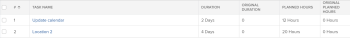

# 태스크 개요 최초 기간 및 최초 계획 시간

프로젝트 계획의 일부로 프로젝트의 모든 작업의 계획 시간 및 기간(또는 계획 기간)에 대한 값을 결정해야 합니다.

작업에 대한 계획 시간에 대한 자세한 내용은 [계획 시간 개요](../../../manage-work/tasks/task-information/planned-hours.md).

작업 기간에 대한 자세한 내용은 [작업 기간 및 기간 유형 개요](../../../manage-work/tasks/taskdurtn/task-duration-and-duration-type.md).

작업 세부 사항 탭에서 또는 작업을 편집하는 동안 이러한 값을 볼 수 있습니다.

작업 목록 또는 작업 보고서에 대한 뷰를 작성할 경우 작업에 대한 최초 계획 시간 및 최초 기간 필드를 추가로 볼 수 있습니다.

## 원래 계획된 시간

태스크의 최초 계획 시간 은 태스크가 상위 태스크가 되기 전에 원래 있었던 계획 시간 수를 나타냅니다. 태스크가 상위 태스크가 되면 하위 태스크의 계획 시간이 상위 태스크로 롤업되어 상위 태스크의 계획 시간을 나타냅니다.

태스크 보고서나 목록에 최초 계획 시간 필드를 표시하면 태스크가 해당 1차 하위 구성요소의 계획 시간 수를 상속하기 전 최초 계획 시간 수를 볼 수 있습니다.

>[!NOTE]
>
>작업을 생성할 때 최초 계획 시간 수는 0입니다. 태스크가 상위 태스크가 되면 이 필드의 값은 상위 태스크로 변경되기 전의 작업 계획 시간 수로 채워집니다. 이 값은 작업이 다시 독립형 작업으로 돌아가는 경우에도 이 필드에 유지됩니다.

## 원래 기간

Original Duration of a task는 원래 작업이 부모 작업이 되기 전에 작업이 완료되었던 기간(분)입니다. 태스크가 상위가 되면, 가장 이른 하위의 계획 시작 일자와 마지막 하위의 계획 완료 일자 사이의 기간은 상위 태스크로 롤업되어 상위 태스크의 기간이 됩니다. 원래 작업의 기간을 대체합니다.

작업 보고서 또는 목록에 원래 기간 필드를 표시하면 해당 하위 기간의 기간을 상속하기 전에 작업 기간 동안의 원래 기간(일)을 볼 수 있습니다.

>[!NOTE]
>
>작업을 만들 때 원래 기간은 0입니다. 작업이 상위 태스크가 되면 이 필드의 값은 상위 태스크로 변경되기 전의 작업 기간 값으로 채워집니다. 이 값은 작업이 다시 독립형 작업으로 돌아가는 경우에도 이 필드에 유지됩니다. 이 값은 분 단위로 표시됩니다.

## 예

예를 들어, 두 작업이 독립형 작업인 경우, 원래 기간과 최초 계획 시간은 0입니다.

첫 번째 태스크가 두 번째 태스크의 상위가 되면 원래 기간 및 최초 계획 시간 필드는 상위가 되기 전에 태스크의 기간 및 계획 시간 값으로 채워집니다. 원래 지속 시간이 분 단위로 표시됩니다. 1차 하위 구성요소의 기간 및 계획 시간은 상위의 기간 및 계획 시간이 됩니다.

상위가 다시 독립형 태스크가 되면 기간 및 계획 시간은 원래 값으로 되돌아가며 최초 기간 및 최초 계획 시간은 채워지지 않습니다. 그것들은 0으로 돌아가지 않습니다.

