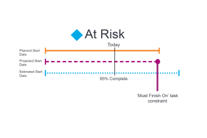

# 작업 진행 상태 개요

<!-- Audited: 1/2024 -->

Adobe Workfront은 타임라인에서 작업의 진행 상태를 보고 작업의 진행 상태를 결정합니다. 작업의 진행 상태 값을 기반으로 프로젝트의 상태를 결정하도록 Workfront을 구성할 수 있습니다. 프로젝트 상태 구성에 대한 자세한 내용은 문서 [프로젝트 상태 및 상태 형식 개요](../../../manage-work/projects/manage-projects/project-condition-and-condition-type.md)를 참조하십시오.

## 작업의 진행 상태를 결정하는 기준

프로젝트의 진행 상태에 대한 자세한 내용은 [프로젝트 진행 상태 개요](../../../manage-work/projects/planning-a-project/project-progress-status.md)를 참조하십시오.

작업의 진행 상황을 추적하는 방법에 대한 자세한 내용은 [작업 추적 모드 개요](../../../manage-work/tasks/task-information/task-tracking-mode.md)를 참조하세요.

작업의 진행 상태는 다음 기준에 따라 결정됩니다.

<table> 
 <col> 
 <col> 
 <thead> 
  <tr> 
   <th> 
<strong>진행 상태</strong> 
 </th> 
   <th> 
<strong>기준 확인</strong> 
 </th> 
  </tr> 
 </thead> 
 <tbody> 
  <tr valign="top"> 
   <td scope="col"> 
 
 
<strong>정시</strong> 
 </td> 
   <td scope="col"> 
모든 계획된 일자가 예상 일자와 일치하면 작업은 <strong>정시</strong>(으)로 간주됩니다. 이 진행 상태는 프로젝트가 일정보다 빠를 수 있으며 예상 일자는 계획 일자 이전일 수 있습니다.
 
예상 날짜에 대한 자세한 내용은 <a href="../../../manage-work/projects/planning-a-project/project-projected-completion-date.md" class="MCXref xref">프로젝트, 작업 및 문제에 대한 예상 완료 날짜 개요</a>를 참조하십시오.
 
작업 계획 완료 일자에 대한 자세한 내용은 다음 문서를 참조하십시오.
 
    <ul> 
     <li> 
<a href="../../../manage-work/tasks/task-information/task-planned-start-date.md" class="MCXref xref">작업 계획 시작 날짜 개요</a> 
 </li> 
     <li> 
<a href="../../../manage-work/tasks/task-information/task-planned-completion-date.md" class="MCXref xref">작업 계획 완료 일자 개요</a> 
 </li> 
    </ul> </td> 
  </tr> 
  <tr> 
   <td>

 
<strong>위험 상태</strong> 
 </td> 
   <td>
예상 완료 일자가 계획된 완료 일자보다 늦고 예상 완료 일자보다 늦으면 작업은 <strong>위험</strong> 상태로 간주됩니다. 작업의 제한 사항이 <strong>다음까지 완료</strong> 또는 <strong>다음부터 시작</strong>인데 완료율 또는 작업의 전임 작업 관계가 지정한 날짜에 완료하거나 시작할 수 없는 경우 이 문제가 발생할 수 있습니다. 

 작업 제한을 <strong>다음까지 완료</strong>(으)로 설정하면 계획된 완료 일자가 특정 일자로 수동 설정됩니다. 이 경우의 예상 완료 일자는 계획된 완료 일자와 일치합니다. 이 제한 사항의 경우 Workfront은 작업을 분석하여 완료율을 기준으로 완료 시간을 계산합니다. 이 계산은 예상 기한으로 저장됩니다. 예상 납기 일자가 예상 완료 일자 이후인 경우 작업이 지연될 위험이 있는 것으로 간주됩니다. 
 
 작업 제한을 <strong>다음부터 시작해야</strong>(으)로 설정하면 계획된 시작 날짜가 특정 날짜로 수동으로 설정됩니다. 이 경우의 예상 시작 일자는 계획된 시작 일자와 일치합니다. 이 제한 사항의 경우 Workfront은 작업을 분석하여 전임 작업 관계에 따라 시작될 시간을 계산합니다. 이 계산은 예상 시작 일자로 저장됩니다. 지정된 시작 일자에 작업을 시작할 수 없도록 하는 강제 적용된 전임 작업이 있는 경우 예상 시작 일자는 예상 완료 일자 이후가 될 수 있습니다. 그 일은 늦을 위험이 있는 것으로 간주된다. 
 
참고: 일반적으로 예상 날짜는 예상 날짜와 일치합니다. 단, <strong>은(는) </strong>에 시작해야 합니다. 또는 <strong>은(는) </strong>에 완료해야 합니다. 이러한 경우 예상 일자는 완료율 및 기타 요소(전임 작업 관계)에 따라 계속 계산되지만 예상 일자는 수동으로 설정된 계획 일자와 일치해야 합니다.
 </td> 
  </tr> 
  <tr> 
   <td> 
<strong>늦음</strong> 
 </td> 
   <td> 
예상 완료 일자가 계획된 완료 일자보다 늦거나 같고 예상 완료 일자보다 빠를 경우 작업은 <strong>지연됨</strong>으로 간주됩니다.
 
예상 완료 일자는 이전 진행 상황을 기준으로 작업이 완료되는 시점의 실시간 보기입니다. 작업이 늦게 시작되었지만 계획 및 예상 완료 일자가 아직 미래이고 작업이 여전히 제시간에 완료될 수 있으므로 아직 늦지 않은 것으로 간주됩니다.
 
참고: <strong>지연됨</strong> 및 <strong>위험 상태</strong> 진행 상태는 거의 동일합니다. 그러나 <strong>위험</strong>은(는) 계획된 날짜 중 하나 또는 둘 다에 일부 강제 작업 제한(완료일, 시작일, 고정 날짜)이 있음을 나타냅니다. 작업에 강제 제한이 없는 경우 예상 일자는 예상 일자와 동일하며 작업의 현재 진행 상황을 기준으로 완료 일자의 시스템 계산을 반영합니다. 계획된 완료 일자와 예상 완료 일자가 아직 미래이고 작업이 아직 정시에 완료될 수 있으므로 작업이 아직 늦지 않은 것으로 간주됩니다. 예상 날짜와 예상 날짜에 대한 자세한 내용은 <a href="../../../manage-work/tasks/task-information/differentiate-projected-estimated-dates.md" class="MCXref xref">예상 날짜와 예상 날짜 차이 </a>를 참조하십시오.
 </td> 
  </tr> 
  <tr valign="top"> 
   <td> 
<strong>지연</strong> 
 </td> 
   <td> 
계획된 완료 일자가 오늘 일자 이전인 경우 작업은 <strong>지연</strong>됩니다. 
 </td> 
  </tr> 
 </tbody> 
</table>

<!--hiding this because some users find the images confusing, as they don't really show the dates mentioned in the descriptions above. Keep the pictures though, in case some users will complain that we hid them. 

## How task Progress Status updates over time

The different date types in our projects tell us how tasks are progressing over time:

* On Time

  

* At Risk

  

* Behind

  

* Late

  

-->