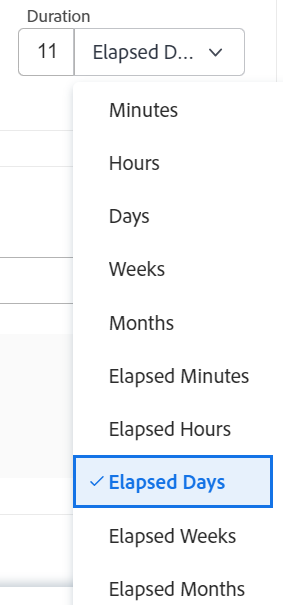

# 작업 기간 및 기간 유형 개요

작업 기간은 작업의 계획된 완료 일자와 계획된 시작 일자 간의 차이입니다. 기간은 작업을 완료하는 데 사용할 수 있는 기간을 나타냅니다.

작업의 기간 유형은 작업에 할당된 리소스 수, 총 작업량 및 작업의 총 기간 간의 관계를 식별합니다.

## 작업 기간 개요

작업의 실제 시작 및 실제 완료 일자가 프로젝트, 기본 담당자 또는 기본 일정의 일정을 벗어나는 경우 작업 기간은 0입니다.

**예:** 오전 9시에 시작하여 오후 12시에 끝나는 일정과 오후 2시에 시작하여 오후 4시에 끝나도록 예정된 작업이 있는 경우 작업의 기간은 0입니다.

다음은 Adobe Workfront에서 기간을 계산할 때 발생하는 두 가지 시나리오입니다.

* 작업이 사용자 Workfront에 할당된 경우 에서는 다음 일정 중 하나를 이 순서로 사용하여 기간을 계산합니다.

   1. Workfront은 사용자의 일정을 고려합니다.
   1. 사용자가 일정과 연결되어 있지 않으면 Workfront에서 프로젝트의 일정을 고려합니다.
   1. 프로젝트가 일정과 연결되어 있지 않으면 Workfront은 시스템의 기본 일정을 고려합니다. 일정에 대한 자세한 내용은 [일정 만들기](../../../administration-and-setup/set-up-workfront/configure-timesheets-schedules/create-schedules.md).

* 작업이 여러 사용자에게 할당된 경우:

   1. Workfront은 프로젝트 또는 기본 피할당자의 일정을 고려합니다.

  Workfront 관리자는 작업이 여러 사용자에게 할당될 때 Workfront에서 사용하는 일정을 결정합니다. 자세한 내용은 [시스템 전체 프로젝트 환경 설정 구성](../../../administration-and-setup/set-up-workfront/configure-system-defaults/set-project-preferences.md).

  단계는 Workfront에서 기간을 계산하는 데 사용하는 일정을 파악한 후 첫 번째 시나리오와 유사합니다.

>[!NOTE]
>
>프로젝트에 대한 기본 피할당자의 휴가를 고려할 때 작업의 계획된 일자가 조정될 수 있지만 작업의 기간은 동일하게 유지됩니다. 프로젝트를 계획할 때 기본 피할당자의 휴무 고려에 대한 자세한 내용은  [시스템 전체 프로젝트 환경 설정 구성](../../../administration-and-setup/set-up-workfront/configure-system-defaults/set-project-preferences.md).

## 작업 기간 단위

정규 시간과 계획된 시작 일자와 계획된 완료 일자 사이의 경과 시간 모두에 작업 기간을 표시할 수 있습니다.

목록의 작업 기간을 업데이트할 때 Workfront에서 시간 단위를 표시하기 위해 다음 약자를 사용할 수 있습니다.

| 시간 단위 | 약어 |
|---|---|
| 분 | M |
| 시간 | H |
| 일. 이것이 기본값입니다. | D |
| 주 | 주 |
| 개월 | T |
| 경과 시간(분) | EM |
| 경과 시간 | EH |
| 경과 일수 | 에드 |
| 경과 주수 | EW |
| 경과 기간(월) | ET |

{style="table-layout:auto"}

**예:** 작업의 기간을 3일 경과로 나타내려면 작업 목록 의 기간 필드에 &quot;3 ED&quot;를 입력합니다.  작업을 편집할 때 또는 작업 세부 정보 섹션에서 사용 가능한 드롭다운 메뉴에서 기간 단위 기본 옵션을 선택할 수도 있습니다. 작업 편집에 대한 자세한 내용은 [작업 편집](../../../manage-work/tasks/manage-tasks/edit-tasks.md).

<!--

(NOTE: stays QS only forever; for the pictures below: make the first one classic at preview time and the second one stays QS always. The second one is yellow >> take out at 21.2 production!!)

-->

작업 기간을 표시할 때는 다음 사항을 고려하십시오.

* 경과 시간은 작업 기간에 대한 시간 단위입니다. 휴일, 주말 및 휴무를 포함하는 작업의 계획된 시작 일자와 계획된 완료 일자 사이의 시간입니다. 즉, 경과 시간은 역일이 경과된 때이다.
* 정규 시간은 공휴일, 주말 및 휴무를 고려하여 작업 기간에서 제외합니다.

* 작업 기간을 주 단위로 표시하면 Workfront은 Workfront 관리자가 설정의 프로젝트 환경 설정 영역에서 설정한 주당 일반 근무일 및 근무일당 일반 시간 설정을 기반으로 기간을 계산합니다.
* Workfront은 기간(월)을 계산할 때 한 달에 대해 4주의 기본 기간을 사용합니다.

## 작업 기간 유형 개요

작업의 기간 유형을 관리하면 작업의 요구 사항에 따라 일관된 자원 할당을 설정할 수 있습니다.

기간 유형은 다음 질문에 답변하는 데 도움이 됩니다.

* 얼마나 바쁜가요?
* 그 일은 얼마나 큰가요?
* 얼마나 걸리나요?

## 기간 유형 정의

<table border="1" cellspacing="15" cellpadding="1"> 
 <col> 
 <col> 
 <col> 
 <thead> 
  <tr> 
   <th scope="row">
<strong>기간 유형</strong>
</th> 
   <th scope="col"> 
<strong>함수</strong> 
 </th> 
   <th scope="col"> 
<strong>자원이 It에 미치는 영향</strong> 
 </th> 
  </tr> 
 </thead> 
 <tbody> 
  <tr> 
   <th scope="col"> 
<strong>계산된 할당</strong> 
 </th> 
   <td scope="col"> 
작업의 각 할당자에 대한 할당 비율을 계산합니다. 
 
이 기간 유형을 선택하면 작업에 대해 개별 기간 및 계획된 시간을 입력할 수 있습니다. Workfront은 계획된 시간을 작업 기간 내의 시간 수로 나눈 다음 작업에 할당된 리소스 수로 나누어 각 할당자에 대한 할당을 계산합니다.
 
자세한 내용은 <a href="../../../manage-work/tasks/taskdurtn/calculated-assignment.md" class="MCXref xref">기간 유형 개요: 계산된 지정</a>.
 </td> 
   <td scope="col">작업에 할당자를 추가하거나 제거할 때 기간 및 계획된 시간은 변경되지 않습니다. </td> 
  </tr> 
  <tr> 
   <th scope="col"> 
<strong>계산된 작업</strong> 
 </th> 
   <td scope="col"> 
작업을 완료하는 데 필요한 계획된 시간(작업량)을 결정합니다.
 
일반적으로 작업에 할당된 리소스가 작업의 전체 기간 동안 할당되는 경우 사용됩니다.
 
이 기간 유형을 선택하면 작업에 대해 개별 기간을 입력할 수 있습니다. Workfront은 해당 기간의 일 수에 일정의 작업 시간 수와 작업에 대한 할당자 수를 곱하여 작업에 대한 계획된 시간을 계산합니다. 
 
각 할당자의 할당 백분율을 수동으로 작업에 변경하여 계획된 시간의 양을 줄일 수 있습니다.
 
자세한 내용은 <a href="../../../manage-work/tasks/taskdurtn/calculated-work.md" class="MCXref xref">기간 유형 개요: 계산된 작업</a>.
 </td> 
   <td scope="col"> 
피할당자가 작업에 추가되면 계획된 시간이 늘어납니다. 
 
피할당자가 작업에서 제거되면 계획된 시간이 감소합니다.
 </td> 
  </tr> 
  <tr> 
   <th scope="col"> 
<strong>작업량 고정</strong>
 </th> 
   <td scope="col"> 
리소스 수에 따라 계획된 시간을 결정합니다.
 
이 기간 유형을 선택하면 작업에 대해 개별 기간을 입력할 수 있습니다. Workfront은 해당 기간의 일 수에 일정의 작업 시간을 곱한 후 이를 작업에 대한 할당자 수로 나누어 작업의 계획된 시간을 계산합니다. 
 
작업에 대한 각 할당자의 할당 백분율을 수동으로 변경할 수 있지만 계획된 시간 수는 동일하게 유지됩니다.
 
자세한 내용은 <a href="../../../manage-work/tasks/taskdurtn/effort-driven.md" class="MCXref xref">기간 유형 개요: 작업량 고정</a>.
 </td> 
   <td scope="col"> 
피할당자가 작업에서 제거되면 계획된 시간이 증가합니다.
 
피할당자가 작업에 추가되면 계획된 시간이 줄어듭니다. 
 
피할당자 수 또는 일정이 변경되더라도 기간은 변경되지 않습니다. 
 
기간은 계획된 시간과 같습니다. 계획된 기간은 계획된 시간을 할당자의 수로 나눈 시간과 같습니다.
 </td> 
  </tr> 
  <tr> 
   <th scope="col"> 
<strong>단순</strong> 
 </th> 
   <td scope="col"> 
각 할당자에 할당된 시간을 기반으로 하여 계획된 시간과 기간(이 기간 유형에 대해 동일함)을 결정합니다. 
 
Workfront은 각 할당자에 대해 계획된 할당 시간을 합산하여 계획된 시간을 계산합니다. 
 
각 할당자가 할당된 시간을 수동으로 변경할 수 있으며 계획된 시간 수 및 기간 금액이 그에 따라 변경됩니다. 모든 피할당자에 대해 할당된 총 시간 수를 선택하는 경우 해당 시간은 각 피할당자 간에 균등하게 분할됩니다.
 
자세한 내용은 <a href="../../../manage-work/tasks/taskdurtn/simple-duration-type.md" class="MCXref xref">기간 유형 개요: 단순</a>.
 </td> 
   <td scope="col"> 
할당된 총 시간 수를 선택하면 시간이 할당자 간에 균등하게 분배됩니다. 그러나 프로젝트 관리자는 각 할당자에 대해 시간을 수동으로 조정할 수 있습니다. 
 
단순 기간 유형 인라인 또는 작업 수준에서 작업의 계획된 시간 및 기간을 편집할 수 있습니다. 
 
애자일 팀이 작업에 할당되면 기간 유형이 자동으로 단순으로 설정되며 변경할 수 없습니다. 애자일 팀의 작업 기간은 0분 이상이어야 합니다.
 </td> 
  </tr> 
 </tbody> 
</table>

## 새 작업의 기간 유형

새 작업의 기간 유형이 시스템에 설정된 기간 유형과 일치합니다. 기본 기간 유형은 계산된 지정입니다. Workfront 관리자 또는 그룹 관리자는 시스템 또는 프로젝트와 연결된 그룹에 대한 기본 기간 유형을 업데이트할 수 있습니다. 자세한 내용은 [시스템 전체 작업 및 문제 환경 설정 구성](../../../administration-and-setup/set-up-workfront/configure-system-defaults/set-task-issue-preferences.md).

## 작업의 기간 유형 변경

작업의 기간 유형 변경에 대한 자세한 내용은 [작업의 기간 유형 업데이트](../../../manage-work/tasks/taskdurtn/update-duration-type-of-task.md).
