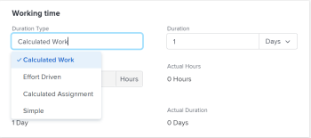

# 작업의 기간 유형 업데이트

작업의 기간 유형은 작업에 할당된 리소스 수, 총 작업량 및 작업의 총 기간 간의 관계를 식별합니다. 자세한 내용은 [작업 기간 및 기간 유형 개요](../../../manage-work/tasks/taskdurtn/task-duration-and-duration-type.md)를 참조하십시오.

## 액세스 요구 사항

+++ 이 문서의 기능에 대한 액세스 요구 사항을 보려면 확장하십시오.

<table style="table-layout:auto"> 
 <col> 
 <col> 
 <tbody> 
  <tr> 
   <td role="rowheader">Adobe Workfront 패키지</td> 
   <td> 
Any
 </td> 
  </tr> 
  <tr> 
   <td role="rowheader">Adobe Workfront 라이선스</td> 
   <td>
표준 이상
 
   
작업 이상
 </td> 
  </tr> 
  <tr> 
   <td role="rowheader">액세스 수준 구성</td> 
   <td> 
프로젝트에 대한 보기 또는 상위 액세스 권한
 
작업에 대한 액세스 편집
 </td> 
  </tr> 
  <tr> 
   <td role="rowheader">개체 권한</td> 
   <td> 
작업에 대한 액세스 관리 
</td> 
  </tr> 
 </tbody> 
</table>

자세한 내용은 [Workfront 설명서의 액세스 요구 사항](/help/quicksilver/administration-and-setup/add-users/access-levels-and-object-permissions/access-level-requirements-in-documentation.md)을 참조하십시오.

+++

<!--
Old:

<table style="table-layout:auto"> 
 <col> 
 <col> 
 <tbody> 
  <tr> 
   <td role="rowheader">Adobe Workfront plan*</td> 
   <td> 
Any 
 </td> 
  </tr> 
  <tr> 
   <td role="rowheader">Adobe Workfront license*</td> 
   <td> 
Work or higher
 </td> 
  </tr> 
  <tr> 
   <td role="rowheader">Access level configurations*</td> 
   <td> 
View or higher access to Projects
 
Edit access to Tasks
 
Note: If you still don't have access, ask your Workfront administrator if they set additional restrictions in your access level. For information on how a Workfront administrator can modify your access level, see <a href="../../../administration-and-setup/add-users/configure-and-grant-access/create-modify-access-levels.md" class="MCXref xref">Create or modify custom access levels</a>.
 </td> 
  </tr> 
  <tr> 
   <td role="rowheader">Object permissions</td> 
   <td> 
Manage access to the task 
 
For information on requesting additional access, see <a href="../../../workfront-basics/grant-and-request-access-to-objects/request-access.md" class="MCXref xref">Request access to objects </a>.
 </td> 
  </tr> 
 </tbody> 
</table>
-->

## 작업의 기간 유형 업데이트

이 문서에 설명된 대로 작업의 기간 유형을 업데이트하는 것 외에도 작업을 편집하거나 고급 할당을 수행할 때 기간 유형을 업데이트할 수 있습니다. 자세한 내용은 다음 문서를 참조하십시오.

* [작업 편집](../../../manage-work/tasks/manage-tasks/edit-tasks.md)
* [고급 할당 만들기](../../../manage-work/tasks/assign-tasks/create-advanced-assignments.md)

작업의 기간 유형을 갱신하려면

1. **기본 메뉴** > **프로젝트**&#x200B;를 클릭한 다음 프로젝트를 클릭하여 액세스합니다.
1. 왼쪽 패널에서 **작업** 섹션을 클릭합니다.
1. 왼쪽 패널에서 **작업 세부 정보**&#x200B;를 클릭한 다음 개요 영역에서 **기간 유형**&#x200B;을 클릭합니다.

   

1. 다음 옵션 중에서 선택합니다

   | 기간 유형 | 추가 정보 |
   |---|---|
   | 계산된 작업 | 자세한 내용은 [기간 유형 개요: 계산된 작업](../../../manage-work/tasks/taskdurtn/calculated-work.md)을 참조하세요. |
   | 작업량 고정 | 자세한 내용은 [기간 유형 개요: 작업량 고정](../../../manage-work/tasks/taskdurtn/effort-driven.md)을 참조하십시오. |
   | 계산된 할당 | 자세한 내용은 [기간 유형 개요: 계산된 할당](../../../manage-work/tasks/taskdurtn/calculated-assignment.md)을 참조하십시오. |
   | 단순 | 자세한 내용은 [기간 유형 개요: 단순](../../../manage-work/tasks/taskdurtn/simple-duration-type.md)을 참조하세요. |

1. **변경 내용 저장**&#x200B;을 클릭합니다.
