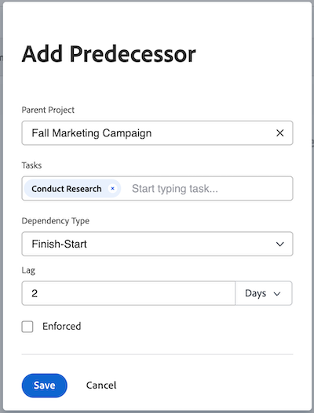

# 전임 작업 영역을 사용하여 전임 작업 관계 만들기

<!-- Audited: 5/2025 -->

전임 작업(또는 전임 작업만 사용)을 사용하여 다른 작업에 종속된 작업을 시작 또는 완료로 연결할 수 있습니다. 예를 들어 초대장(전임 작업)을 보내기 전에 파티(종속 작업)를 호스팅하고 싶지 않을 수 있습니다.

이 문서에서는 작업 내의 [전임 작업] 탭을 사용하여 전임 작업을 설정하는 방법을 보여 줍니다.

작업 목록에서 전임 작업을 설정하는 방법에 대한 자세한 내용은 [작업 목록에서 전임 작업 관계 만들기](../../../manage-work/tasks/use-prdcssrs/create-predecessors-on-task-list.md)를 참조하십시오.

Adobe Workfront의 다음 영역에서 작업의 전임 작업을 볼 수 있습니다.

* 종속 작업의 전임 작업 섹션에서 다음을 수행합니다.
* 간트 차트
* 전임 작업 열의 작업 목록

전임 작업에 대한 자세한 내용은 [작업 전임 작업 개요](../../../manage-work/tasks/use-prdcssrs/predecessors-overview.md)를 참조하십시오.

## 액세스 요구 사항

+++ 를 확장하여 액세스 요구 사항을 확인합니다.

<table style="table-layout:auto"> 
 <col> 
 <col> 
 <tbody> 
  <tr> 
   <td role="rowheader">Adobe Workfront 플랜</td> 
   <td> 
임의
 </td> 
  </tr> 
  <tr> 
   <td role="rowheader">Adobe Workfront 라이선스</td> 
   <td> 
   
표준 

    
플랜 
 </td> 
  </tr> 
  <tr> 
   <td role="rowheader">액세스 수준 구성</td> 
   <td> 
작업 및 프로젝트에 대한 액세스 편집
 
참고: 여전히 액세스 권한이 없는 경우 Workfront 관리자에게 액세스 수준에서 추가 제한을 설정하는지 문의하십시오. Workfront 관리자가 액세스 수준을 수정하는 방법에 대한 자세한 내용은 <a href="../../../administration-and-setup/add-users/configure-and-grant-access/create-modify-access-levels.md" class="MCXref xref">사용자 지정 액세스 수준 만들기 또는 수정</a>을 참조하십시오.
 </td> 
  </tr> 
  <tr> 
   <td role="rowheader">개체 권한</td> 
   <td> 
작업 및 프로젝트에 대한 권한 관리
 
추가 액세스 요청에 대한 자세한 내용은 <a href="../../../workfront-basics/grant-and-request-access-to-objects/request-access.md" class="MCXref xref">개체에 대한 액세스 요청</a>을 참조하십시오.
 </td> 
  </tr> 
 </tbody> 
</table>

이 표의 정보에 대한 자세한 내용은 [Workfront 설명서의 액세스 요구 사항](/help/quicksilver/administration-and-setup/add-users/access-levels-and-object-permissions/access-level-requirements-in-documentation.md)을 참조하십시오.

+++

## 작업에 대한 전임 작업 만들기

전임 작업 영역을 사용하여 프로젝트 작업에 대한 전임 작업을 만드는 것은 템플릿에 템플릿 작업에 대한 전임 작업을 만드는 것과 비슷합니다.

프로젝트 작업에 대한 전임 작업을 생성하려면 다음을 수행합니다.

1. 종속 작업으로 지정할 작업으로 이동합니다.

1. 왼쪽 패널에서 **전임 작업**&#x200B;을 클릭합니다.

1. **전임 작업** 섹션에서 **전임 작업 추가**&#x200B;를 클릭합니다. **전임 작업 추가** 대화 상자가 열립니다.

1. (선택 사항) 프로젝트 간 전임 작업을 추가하려면 **상위 프로젝트** 필드의 프로젝트 이름을 다른 프로젝트로 바꾸십시오.

   자세한 내용은 [프로젝트 간 전임 작업 만들기](../../../manage-work/tasks/use-prdcssrs/cross-project-predecessors.md)를 참조하십시오.

   >[!TIP]
   >
   >템플릿 작업에 대한 템플릿 간 전임 작업은 만들 수 없습니다.

1. **작업** 필드에 전임 작업으로 지정할 작업의 이름을 입력한 다음 드롭다운에 표시될 때 선택합니다.

1. **종속성 유형**&#x200B;을(를) 선택하십시오.

   자세한 내용은 [작업 종속성 유형 개요](../../../manage-work/tasks/use-prdcssrs/task-dependency-types.md)를 참조하십시오.

1. **Lag** 금액을 입력하십시오.

   자세한 내용은 {&#x200B;0}지연 유형 개요[를 참조하십시오.](../../../manage-work/tasks/use-prdcssrs/lag-types.md)

   

1. 두 작업 간에 전임 작업 관계를 적용하려면 **적용됨** 확인란을 선택하십시오.

   자세한 내용은 [전임 작업 적용](../../../manage-work/tasks/use-prdcssrs/enforced-predecessors.md)을 참조하십시오.

1. **저장**&#x200B;을 클릭합니다.

1. (선택 사항) 전임 작업을 제거하려면 전임 작업 목록에서 전임 작업을 선택한 다음 **제거** 아이콘 을 클릭합니다.

   전임 작업 이(가) 목록에서 제거됩니다. 전임 작업은 해당 프로젝트에서 삭제되지 않습니다.
