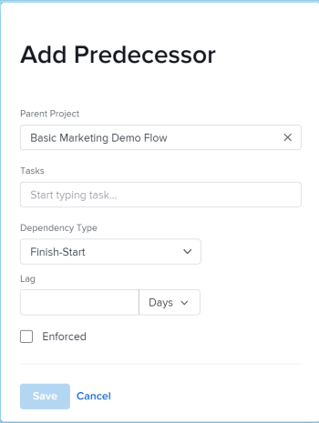

# 전임 작업 영역을 사용하여 전임 작업 관계 만들기

전임 작업(또는 전임 작업만 사용)을 사용하여 다른 작업에 종속된 작업을 시작 또는 완료로 연결할 수 있습니다. 예를 들어 초대장(전임 작업)을 보내기 전에 파티(종속 작업)를 호스팅하고 싶지 않을 수 있습니다.

이 문서에서는 작업 내의 [전임 작업] 탭을 사용하여 전임 작업을 설정하는 방법을 보여 줍니다.

작업 목록에서 전임 작업을 설정하는 방법에 대한 자세한 내용은 [작업 목록에서 전임 작업 관계 만들기](../../../manage-work/tasks/use-prdcssrs/create-predecessors-on-task-list.md)를 참조하십시오.

Adobe Workfront의 다음 영역에서 작업의 전임 작업을 볼 수 있습니다.

* 종속 작업의 전임 작업 섹션에서 다음을 수행합니다.
* 간트 차트
* 전임 작업 열의 작업 목록

전임 작업에 대한 자세한 내용은 [작업 전임 작업 개요](../../../manage-work/tasks/use-prdcssrs/predecessors-overview.md)를 참조하십시오.

## 액세스 요구 사항

이 문서의 단계를 수행하려면 다음 액세스 권한이 있어야 합니다.

<table style="table-layout:auto"> 
 <col> 
 <col> 
 <tbody> 
  <tr> 
   <td role="rowheader">Adobe Workfront 플랜*</td> 
   <td> 
임의
 </td> 
  </tr> 
  <tr> 
   <td role="rowheader">Adobe Workfront 라이센스*</td> 
   <td> 
플랜 
 </td> 
  </tr> 
  <tr> 
   <td role="rowheader">액세스 수준 구성*</td> 
   <td> 
작업 및 프로젝트에 대한 액세스 편집
 
참고: 여전히 액세스 권한이 없는 경우 Workfront 관리자에게 액세스 수준에서 추가 제한을 설정하는지 문의하십시오. Workfront 관리자가 액세스 수준을 수정하는 방법에 대한 자세한 내용은 <a href="../../../administration-and-setup/add-users/configure-and-grant-access/create-modify-access-levels.md" class="MCXref xref">사용자 지정 액세스 수준 만들기 또는 수정</a>을 참조하십시오.
 </td> 
  </tr> 
  <tr> 
   <td role="rowheader">개체 권한</td> 
   <td> 
작업 및 프로젝트에 대한 권한 관리
 
추가 액세스 요청에 대한 자세한 내용은 <a href="../../../workfront-basics/grant-and-request-access-to-objects/request-access.md" class="MCXref xref">개체 </a>에 대한 액세스 요청 을 참조하십시오.
 </td> 
  </tr> 
 </tbody> 
</table>

&#42;보유 중인 플랜, 라이선스 유형 또는 액세스 권한을 확인하려면 Workfront 관리자에게 문의하십시오.

## 작업에 대한 전임 작업 만들기

1. 종속 작업으로 지정할 작업으로 이동한 다음 왼쪽 패널에서 **전임 작업**&#x200B;을 클릭합니다.

   **자세히 표시**&#x200B;를 클릭한 다음 **전임 작업**&#x200B;을 클릭해야 할 수 있습니다.

1. **+전임 작업 추가**&#x200B;를 클릭합니다.
1. (선택 사항) 프로젝트 간 전임 작업을 추가하려면 **상위 프로젝트** 필드의 프로젝트 이름을 다른 프로젝트로 바꾼 다음 전임 작업으로 사용할 작업 이름을 입력하십시오.

   프로젝트 간 전임 작업 추가에 대한 자세한 내용은 [프로젝트 간 전임 작업 만들기](../../../manage-work/tasks/use-prdcssrs/cross-project-predecessors.md)를 참조하십시오.

1. 전임 작업으로 지정할 작업의 이름을 입력합니다.

   

1. **종속성 유형**&#x200B;을(를) 선택하십시오.

   작업 종속성 유형에 대한 자세한 내용은 [작업 종속성 유형 개요](../../../manage-work/tasks/use-prdcssrs/task-dependency-types.md)를 참조하세요.

1. 일 단위로 **Lag** 금액을 지정하십시오.

   지연 유형에 대한 자세한 내용은 {&#x200B;0}지연 유형 개요[&#128279;](../../../manage-work/tasks/use-prdcssrs/lag-types.md)를 참조하십시오.

1. 두 작업 간에 전임 작업 관계를 적용하려면 **적용됨**&#x200B;을 선택합니다.

   전임 작업을 적용하는 방법에 대한 자세한 내용은 [전임 작업 적용](../../../manage-work/tasks/use-prdcssrs/enforced-predecessors.md)을 참조하십시오.

1. **저장**&#x200B;을 클릭합니다.
