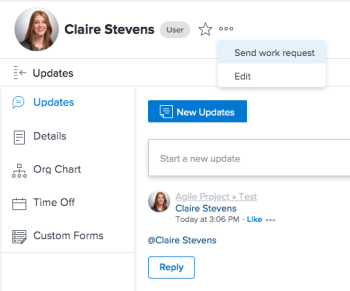

# 작업에 대한 [!UICONTROL 완료] 단추 구성

[!UICONTROL 완료] 단추를 사용하면 작업 또는 문제의 상태를 자동으로 설정할 수 있습니다. 기본적으로 [!UICONTROL Adobe Workfront]은(는) 피할당자가 작업 항목에서 완료 표시를 클릭하면 작업을 [!UICONTROL 완료됨] (으)로 표시합니다.

>[!NOTE]
>
>완료 버튼은 Workfront의 모든 영역에서 완료로 표시로 표시됩니다.

## 개요

특정 권한이 있는 사용자는 [!UICONTROL 완료] 단추를 구성하여 시스템의 특정 상태와 연결할 수 있습니다. [!UICONTROL Workfront]의 작업에 대해 [!UICONTROL 완료] 단추가 작동하는 방법은 두 가지가 있습니다.

* 사용자에게 할당된 홈 팀이 있는 경우 [!DNL Workfront] 관리자 또는 [!UICONTROL 계획] 라이선스가 있는 사용자가 팀 구성원의 특정 상태를 반영하도록 [!UICONTROL 완료] 단추를 구성할 수 있습니다. 이 문서에서 [팀에 대한 [!UICONTROL 완료] 단추 구성](#configure-the-uicontrol-done-button-for-a-team)을(를) 참조하십시오.
* 사용자에게 [!UICONTROL 홈 팀]이 없지만 프로필에 [!UICONTROL 다른 팀]이 있는 경우 Workfront은 사용자와 연결된 모든 팀에서 [!UICONTROL 완료] 단추 설정을 검색합니다. 선택은 임의이며 팀과 연관된 상태가 작업에 사용됩니다.
* 사용자에게 할당된 홈 팀이 없는 경우 작업의 [!UICONTROL 완료] 단추가 완료 상태로 연결됩니다. 이 시나리오에는 사용 가능한 구성 옵션이 없습니다. [!UICONTROL 완료] 단추의 기본값은 자동으로 이 상태입니다.

## 액세스 요구 사항

+++ 을 확장하여 이 문서의 기능에 대한 액세스 요구 사항을 봅니다.

이 문서의 단계를 수행하려면 다음 액세스 권한이 있어야 합니다.

<table style="table-layout:auto"> 
 <col> 
 <col> 
 <tbody> 
  <tr data-mc-conditions=""> 
   <td role="rowheader"> 
Adobe Workfront 플랜
 </td> 
   <td>임의</td> 
  </tr> 
  <tr> 
   <td role="rowheader">Adobe Workfront 라이선스</td> 
   <td>
   
새로운 기능: 표준

   
또는

   
현재: 플랜
</td>
  </tr> 
 </tbody> 
</table>

이 표의 정보에 대한 자세한 내용은 [Workfront 설명서의 액세스 요구 사항](/help/quicksilver/administration-and-setup/add-users/access-levels-and-object-permissions/access-level-requirements-in-documentation.md)을 참조하십시오.

+++

## 팀에 대한 [!UICONTROL 완료] 단추 구성

[!UICONTROL 완료] 단추를 사용하여 작업 항목에 적용되는 상태를 변경할 수 있습니다. 여러 상태를 설정하고 사용자가 적절한 상태를 선택할 수도 있습니다.

{{step1-to-team}}

1. **[!UICONTROL 팀 전환]** 아이콘을 클릭한 다음 드롭다운 메뉴에서 새 팀을 선택하거나 검색 막대에서 팀을 검색합니다.
1. **[!UICONTROL 자세히]** 메뉴를 클릭한 다음 **[!UICONTROL 편집]**&#x200B;을 클릭합니다.
1. **[!UICONTROL 팀 설정]** 페이지 아래쪽에서 **[!UICONTROL 완료 단추]** 섹션을 찾습니다.

1. 각 작업 항목 유형에 대해 하나 이상의 상태를 선택하거나 상태를 선택합니다.

   >[!NOTE]
   >
   >작업 또는 문제의 상태를 선택할 때는 다음 사항을 고려하십시오.
   >
   >* 각 작업 항목 유형에 대해 하나의 상태를 선택하면 사용자가 해당 항목에서 [!UICONTROL 완료]를 클릭하면 작업 또는 문제 상태가 해당 상태로 설정됩니다. 각 작업 항목 유형에 대해 여러 상태를 설정하면 [!UICONTROL 완료] 단추에 드롭다운 메뉴가 추가되며 사용자가 작업 항목의 상태를 변경하려면 상태를 선택해야 합니다.
   >* [!UICONTROL 완료] 단추에는 시스템 수준 상태만 연결할 수 있습니다. 그룹별 상태를 작업 항목 상태와 연결할 수 없습니다.
   >* 항목에 할당된 사용자가 항목을 [!UICONTROL 완료] 단추와 연결된 상태로 두면 선택한 상태가 [!UICONTROL 완료] 또는 [!UICONTROL 마감됨] 상태이거나 작업 상태인지에 관계없이 해당 사용자에 대해 항목이 [!UICONTROL 완료]로 표시됩니다.
   >   
   >   
   >  예를 들어 [!UICONTROL 완료] 단추를 [!UICONTROL 진행 중]과 연결하면 [!UICONTROL 새로 만들기]에서 [!UICONTROL 진행 중] (으)로 상태를 변경하는 사용자의 작업 항목이 [!UICONTROL 완료]로 표시됩니다.
   >   
   >* 문제 유형은 사용자 정의할 수 있으며 사용자 환경에 아래에 나열된 것과 다른 이름을 가질 수 있습니다.\
   >  다음은 기본 작업 및 문제 유형입니다.
   >     
   >   * [!UICONTROL 작업]
   >   * [!UICONTROL 문제]
   >   * [!UICONTROL 요청]
   >   * [!UICONTROL 순서 변경]
   >   * [!UICONTROL 버그 신고]

   작업 또는 문제가 여러 사용자에게 할당된 경우 팀에 대해 선택한 여러 상태 외에 드롭다운 메뉴에 &quot;[!UICONTROL 내 부분으로 완료]&quot; 옵션이 표시됩니다.

1. **[!UICONTROL 변경 내용 저장]**&#x200B;을 클릭합니다.

## 홈 팀과 사용자 연결

[!UICONTROL 완료] 단추 기능에 대한 변경 내용을 사용자에게 표시하기 위해 설정을 변경한 팀을 사용자의 홈 팀으로 만들 수 있습니다.

사용자를 홈 팀과 연결하려면 다음 작업을 수행하십시오.

1. [!DNL Adobe Workfront]의 오른쪽 위 모서리에 있는 **[!UICONTROL 주 메뉴]** 아이콘 을(를) 클릭합니다.

1. **[!UICONTROL 사용자]**&#x200B;를 클릭한 다음 홈 팀에 연결할 사용자를 선택하십시오.
1. **[!UICONTROL 자세히]** 메뉴를 클릭한 다음 **[!UICONTROL 편집]**&#x200B;을 클릭합니다.\
   

1. **[!UICONTROL 조직]** 섹션에서 **[!UICONTROL 홈 팀]** 필드를 선택합니다. 설정을 사용자와 연결할 팀의 이름을 입력하십시오. 목록에 팀의 이름이 표시되면 클릭합니다.

1. **[!UICONTROL 변경 내용 저장]**&#x200B;을 클릭합니다.\
   선택한 사용자가 이제 홈 팀과 연결되었습니다.
이제 [!UICONTROL 완료] 단추와 연결된 상태를 포함한 모든 팀 설정이 이 사용자에게 표시됩니다.
