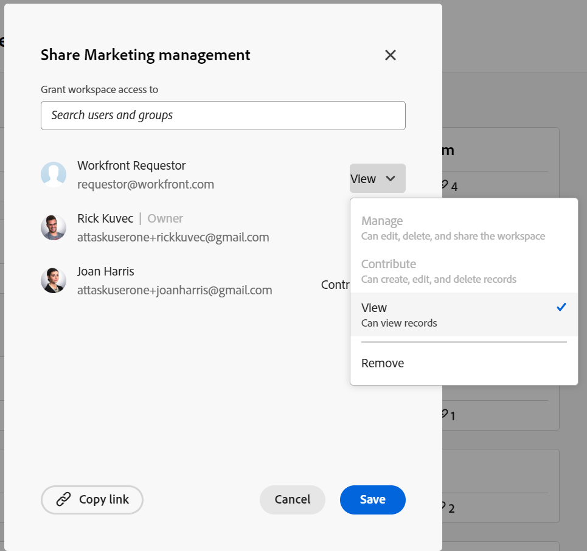

<!--update the metadata with real things when making this public; also update the description with something like this: Not all users in the organization have the same access and permissions to use Adobe Workfront plannint. This article describes the levels of access that users could have to Adobe Workfront Planning. -->
<!--update the title and the metadata title if Workfront Planning is NOT its own product - because the title is too generic for it being a Workfront capability-->

# Adobe Workfront Planning 사용 시 라이선스 유형 개요

{{planning-important-intro}}

Adobe Workfront 라이선스 유형은 Adobe Workfront Planning 권한과 함께 작동하여 다음 액세스 권한을 부여합니다.

* 작업 영역 보기, 기여 또는 관리
* 보기를 보거나 관리합니다.

Workfront Planning의 개체에 대한 사용 권한에 대한 자세한 내용은 [Adobe Workfront Planning의 사용 권한 공유 개요](/help/quicksilver/planning/access/sharing-permissions-overview.md)를 참조하십시오.

## Workfront 라이선스 유형과 Workfront Planning 권한 간의 관계

아래 표에서는 Adobe Workfront에 있는 사용자의 라이선스 유형과 해당 라이선스를 기반으로 Adobe Workfront Planning 개체에 부여할 수 있는 권한 수준 간의 관계를 설명합니다.

작업 영역에 대한 사용자 권한을 부여하면 레코드 유형, 레코드 및 필드에 대한 권한도 부여됩니다.

| Adobe Workfront 라이선스 유형* | Adobe Workfront Planning에서 허용되는 가장 높은 권한 |
|------------------------------------------------|-------------------------------------------------------------------------------------------------------------------------------------------------------------------------------|
| 새로 만들기: 표준   또는  현재: 플랜 | 사용자는 작업 공간을 관리할 수 있습니다. 작업 공간, 레코드 유형, 레코드 및 필드를 작성, 편집 또는 삭제할 수 있습니다.   시스템 관리자는 만들지 않은 작업 영역을 포함하여 모든 작업 영역에 대한 관리 권한을 가집니다. |
| 새로운 기능: Light, 기여자   또는  현재: 작업, 요청자, 검토자 | 사용자는 공유된 작업 공간과 해당 작업 공간의 레코드 유형, 레코드 및 필드를 볼 수 있습니다.   사용자는 작업 공간, 레코드 종류, 레코드 또는 필드를 만들거나 편집하거나 삭제할 수 없습니다. |

*자세한 내용은 [Workfront 설명서의 액세스 요구 사항](/help/quicksilver/administration-and-setup/add-users/access-levels-and-object-permissions/access-level-requirements-in-documentation.md)을 참조하십시오.

### 라이선스 유형 및 작업 영역 권한

Standard(또는 Plan) 라이선스가 있는 사용자만 작업 공간에 대한 Contribute 또는 관리 권한을 가질 수 있습니다. 다른 모든 라이선스 유형을 가진 사용자는 공유된 작업 공간에 대한 보기 권한을 가질 수 있습니다.

시스템 관리자는 작성하지 않은 작업 영역까지 시스템의 모든 작업 영역을 볼 수 있습니다.

>[!INFO]
>
>**예:**
>
>요청자(또는 새 라이선스 모델에 따라 공동 작업자)는 작업 공간 및 해당 개체에 기여하거나 관리할 수 없습니다.
>
>하위 수준 라이선스를 보유하고 있는 경우 이러한 권한 수준이 흐리게 표시되므로 사용자에게 작업 영역에 기여하거나 관리할 수 있는 권한을 부여할 수 없다는 표시가 공유 상자에 표시됩니다.
>
>

### 라이선스 유형 및 보기 권한

표준(또는 플랜) 라이선스가 있는 사용자만 보기에 대한 관리 권한을 가질 수 있습니다. 다른 모든 라이선스 유형을 가진 사용자는 공유된 보기에 대한 보기 권한을 가질 수 있습니다.

>[!INFO]
>
>**예:**
>
>공동 작업자(또는 요청자 및 검토자)가 보기를 관리할 수 없습니다. 액세스 가능한 보기에 임시 필터, 정렬 또는 그룹화를 적용할 수 있습니다.
>
>하위 수준 라이선스를 보유하고 있는 경우 이러한 권한 수준이 흐리게 표시되므로 사용자에게 보기 관리에 대한 권한을 부여할 수 없다는 표시가 공유 상자에 있습니다.
>
>

<!--Replace all of the above with this:

The table below describes the relationship between the license type of a user in Adobe Workfront and the level of permissions you can grant to them to Adobe Workfront Planning objects based on that license. 

Granting a user permissions to a workspace also grants them permissions to record types, records, and fields. 

You must grant view permissions separately from workspace permissions. 

| Adobe Workfront license type*                                   | Highest permissions allowed in Adobe Workfront Planning                                                                                                                                             |
|------------------------------------------------|-------------------------------------------------------------------------------------------------------------------------------------------------------------------------------|
|New: Standard   or  Current: Plan                    | <ul><li>Users can contribute to or manage workspaces and they can manage views. They can create, edit, or delete workspaces, record types, records, fields, and views.</li> <li> System administrators have Manage permissions to all workspaces, including the ones they did not create.</li> <li> System administrators can only access views they created.</li></ul>                                                                                                                     |
|New: Light, Contributor   or  Current: Work, Requestor, Reviewer                      | <ul><li>Users can view the workspaces shared with them, as well as the record types, records, and fields of those workspaces.</li> <li>Users can access views shared with them and apply temporary filters, sorts, or groupings, but they cannot modify the views. </li><li> Users cannot create, edit, or delete workspaces, record types, records, fields, or views.</li></ul>|

*For more information, see [Access requirements in Workfront documentation](/help/quicksilver/administration-and-setup/add-users/access-levels-and-object-permissions/access-level-requirements-in-documentation.md). 

-->