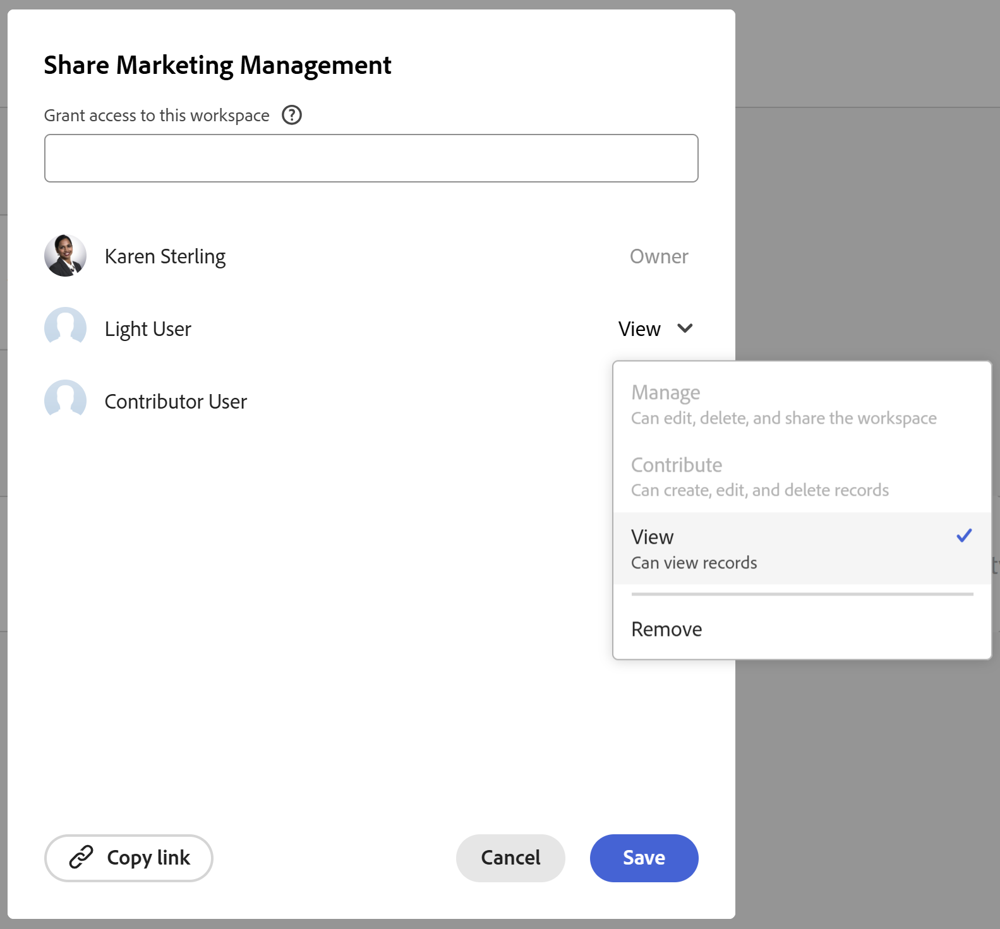

# Adobe Workfront Planning 사용 시 라이선스 유형 개요

이 페이지에서 강조 표시된 정보는 아직 일반적으로 사용할 수 없는 기능을 참조합니다. 모든 고객을 위한 미리보기 환경에서만 사용할 수 있습니다. 월별 프로덕션 릴리스 이후 빠른 릴리스를 활성화한 고객을 위해 프로덕션 환경에서도 동일한 기능을 사용할 수 있습니다. 

빠른 릴리스에 대한 자세한 내용은 [조직의 빠른 릴리스 사용 또는 사용 안 함](/help/quicksilver/administration-and-setup/set-up-workfront/configure-system-defaults/enable-fast-release-process.md)을 참조하세요. 

{{planning-important-intro}}

Adobe Workfront 라이선스 유형은 Adobe Workfront Planning 권한과 함께 작동하여 다음 액세스 권한을 부여합니다.

* 작업 영역 또는 레코드 종류을(를) 보고, 기여하거나 관리합니다.
* 보기를 보거나 관리합니다.

Workfront Planning의 개체에 대한 사용 권한에 대한 자세한 내용은 [Adobe Workfront Planning의 사용 권한 공유 개요](/help/quicksilver/planning/access/sharing-permissions-overview.md)를 참조하십시오.

Workfront Planning에 액세스하는 방법에 대한 자세한 내용은 [Adobe Planning 액세스 개요](/help/quicksilver/planning/access/access-overview.md)를 참조하십시오.

## Workfront 라이선스 유형과 Workfront Planning 권한 간의 관계

아래 표에서는 Adobe Workfront에 있는 사용자의 라이선스 유형과 해당 라이선스를 기반으로 Adobe Workfront Planning 개체에 부여할 수 있는 권한 수준 간의 관계를 설명합니다.

작업 영역에 대한 사용자 권한을 부여하면 레코드 유형, 레코드 및 필드에 대한 권한도 부여됩니다.

보기에 액세스하고 관리할 수 있도록 작업 공간에 대해 보유하고 있는 권한 외에 보기에 대한 별도의 권한을 사용자에게 부여해야 합니다.

레코드 유형 권한으로 작업할 때 다음 사항을 고려하십시오.

* 사용자는 작업 영역에서 레코드 유형 권한을 자동으로 상속합니다.
* 사용자가 작업 영역에 대한 관리 권한을 가지고 있으면 레코드 유형에 대해 더 적은 액세스 권한을 가질 수 없습니다.
* 사용자는 레코드 유형이 속한 작업 영역에 대해 가지고 있는 권한보다 레코드 유형에 대해 더 큰 권한을 가질 수 없습니다.
* 레코드 유형에 대한 사용자의 권한을 제거해도 작업 공간에 대한 사용자의 권한이 제거되지는 않으므로 작업 공간의 모든 레코드 유형에 대한 보기 액세스 권한은 제거되지 않습니다.

| Adobe Workfront 라이선스 유형* | Adobe Workfront Planning에서 허용되는 가장 높은 권한 |
|------------------------------------------------|-------------------------------------------------------------------------------------------------------------------------------------------------------------------------------|
| 표준 | 
사용자는 작업 영역 , 레코드 종류,  및 보기를 관리할 수 있습니다. 작업 공간, 레코드 유형, 레코드, 필드 및 보기를 생성, 편집 또는 삭제할 수 있습니다.
   
시스템 관리자는 만들지 않은 작업 영역을 포함하여 모든 작업 영역에 대한 관리 권한을 가집니다.
 |
| 라이트 또는 기여자 | 
사용자는 공유된 작업 공간과 해당 작업 공간의 레코드 유형, 레코드 및 필드를 볼 수 있습니다.
   
사용자는 공유된 보기를 볼 수 있지만 자신의 보기를 만들 수는 없습니다. 
  
사용자는 작업 공간, 레코드 유형, 레코드 또는 필드를 작성, 편집 또는 삭제할 수 없습니다.
 |

*Workfront Planning은 기존 Workfront 라이선스에 사용할 수 없습니다.
자세한 내용은 [Workfront 설명서의 액세스 요구 사항](/help/quicksilver/administration-and-setup/add-users/access-levels-and-object-permissions/access-level-requirements-in-documentation.md)을 참조하십시오.

### 작업 공간 및 레코드 유형에 대한 라이선스 유형 및 권한

표준 라이선스가 있는 사용자만 작업 영역  및 레코드 종류에 대한 Contribute 또는 Manage 권한을 가질 수 있습니다. 작업 영역 과(와) 레코드 종류에 대한 Contribute 및 Manage 권한도 레코드와 필드로 전송됩니다.

다른 모든 라이선스 유형을 가진 사용자는 작업 영역  및 공유된 레코드 유형 과(와) 해당 레코드 및 필드에 대한 보기 권한을 가질 수 있습니다.

시스템 관리자는 작성하지 않은 작업 영역을 포함하여 시스템의 모든 작업 영역을 볼 수 있습니다.

>[!INFO]
>
>**예:**
>
>기여자 또는 라이트 라이선스 사용자는 작업 공간 및 해당 개체에 기여하거나 관리할 수 없습니다.
>
>하위 수준 라이선스를 보유하고 있는 경우 이러한 권한 수준이 흐리게 표시되므로 사용자에게 작업 영역에 기여하거나 관리할 수 있는 권한을 부여할 수 없다는 표시가 공유 상자에 표시됩니다.
>
>

### 라이선스 유형 및 보기에 대한 권한

Standard 라이선스를 가진 사용자만 보기에 대한 관리 권한을 가질 수 있습니다. 다른 모든 라이선스 유형을 가진 사용자는 공유된 보기에 대한 보기 권한을 가질 수 있습니다.

>[!INFO]
>
>**예:**
>
>기여자 또는 라이트 라이선스 사용자는 보기를 관리할 수 없습니다. 액세스 가능한 보기에 임시 필터, 정렬 또는 그룹화를 적용할 수 있습니다.
>
>하위 수준 라이선스를 보유하고 있는 경우 이러한 권한 수준이 흐리게 표시되므로 사용자에게 보기 관리에 대한 권한을 부여할 수 없다는 표시가 공유 상자에 있습니다.
>
>
