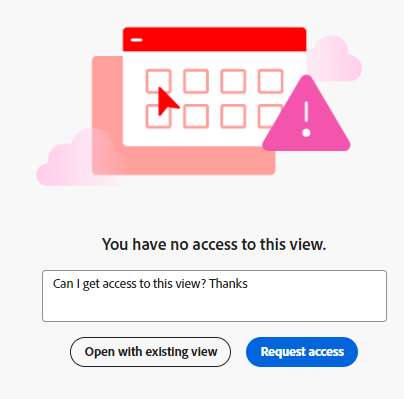

# 보기 또는 작업 영역에 대한 권한 요청

이 페이지에서 강조 표시된 정보는 아직 일반적으로 사용할 수 없는 기능을 참조합니다. 모든 고객을 위한 미리보기 환경에서만 사용할 수 있습니다. 미리보기에 릴리스된 후 빠른 릴리스를 활성화한 고객을 위해 프로덕션 환경에서도 매월 동일한 기능을 사용할 수 있습니다. 

빠른 릴리스에 대한 자세한 내용은 [조직의 빠른 릴리스 사용 또는 사용 안 함](/help/quicksilver/administration-and-setup/set-up-workfront/configure-system-defaults/enable-fast-release-process.md)을 참조하세요. 

<!-- 
no longer needed: 
>[!IMPORTANT]
>
>The functionality described in this article is available only when your organization has been onboarded to the Adobe Unified Experience. 
>
>For more information, see [Adobe Unified Experience for Workfront](/help/quicksilver/workfront-basics/navigate-workfront/workfront-navigation/adobe-unified-experience.md). 
-->

다른 사용자가 액세스 권한이 없는 보기 또는 작업 영역에 대한 링크를 사용자와 공유하는 경우 보기 또는 작업 영역에 대한 권한을 요청할 수 있습니다.

보기에 대한 권한을 요청하는 것은 작업 공간에 권한을 요청하는 것과 비슷합니다.

이 문서에서는 다른 사용자가 나와 링크를 공유하지만 공유 페이지에 액세스할 수 없는 경우 보기 또는 작업 영역에 대한 액세스를 요청하는 방법에 대해 설명합니다.

보기 및 작업 공간에 대한 권한 부여에 대한 자세한 내용은 다음 문서를 참조하십시오.

* [보기 공유](/help/quicksilver/planning/access/share-views.md)
* [작업 공간 공유](/help/quicksilver/planning/access/share-workspaces.md)

## 액세스 요구 사항

+++ 이 문서의 기능에 대한 액세스 요구 사항을 보려면 확장하십시오. 

<table style="table-layout:auto"> 
<col> 
</col> 
<col> 
</col> 
<tbody> 
    <tr> 
<tr> 
   <td role="rowheader">
Adobe Workfront 패키지
</td> 
   <td> 

모든 Workfront 및 Planning 패키지
 
또는

모든 워크플로우 및 계획 패키지
 
 </tr>

<tr> 
   <td role="rowheader">
Adobe Workfront 라이선스
</td> 
   <td>
Any
 
  </td> 
  </tr> 
  <tr> 
   <td role="rowheader">
액세스 수준 구성
</td> 
   <td> 
Adobe Workfront Planning에 대한 액세스 수준 제어가 없습니다.
   
</td> 
  </tr> 
<tr> 
   <td role="rowheader">
개체 권한
</td> 
   <td>  
권한 요청이 부여되면 다음 권한을 얻을 수 있습니다.

   <ul><li>
보기에 대한 보기 또는 관리
</li>
   <li>
작업 공간에 대한 보기, 기여 또는 관리
</li>
   <li>
레코드 종류에 대한 보기, 기여 또는 관리
</li>
   <li>
레코드에 대한 보기 또는 관리
</li>
   </ul>  
   
작업 공간 및 보기에 대한 관리 권한이 있는 사용자만 보기를 공개적으로 공유할 수 있습니다.
</td> 
  </tr> 
</tbody> 
</table>

Workfront 액세스 요구 사항에 대한 자세한 내용은 Workfront 설명서의 [액세스 요구 사항](/help/quicksilver/administration-and-setup/add-users/access-levels-and-object-permissions/access-level-requirements-in-documentation.md)을 참조하십시오.

+++

<!--
 Old:
 
 <table style="table-layout:auto"> 
<col> 
</col> 
<col> 
</col> 
<tbody> 
    <tr> 
<tr> 
<td> 
   
 Products
 </td> 
   <td> 
   <ul><li>
 Adobe Workfront
</li> 
   <li>
 Adobe Workfront Planning
</li></ul></td> 
  </tr>   
<tr> 
   <td role="rowheader">
Adobe Workfront plan*
</td> 
   <td> 

Any of the following Workfront plans:
 
<ul><li>Select</li> 
<li>Prime</li> 
<li>Ultimate</li></ul> 

Workfront Planning is not available for legacy Workfront plans
 
   </td> 
<tr> 
   <td role="rowheader">
Adobe Workfront Planning package*
</td> 
   <td> 

Any 
 

For more information about what is included in each Workfront Planning plan, contact your Workfront account manager. 
 
   </td> 
 <tr> 
   <td role="rowheader">
Adobe Workfront platform
</td> 
   <td> 

Your organization's instance of Workfront must be onboarded to the Adobe Unified Experience to be able to access Workfront Planning.
 

<b>IMPORTANT</b>

The users in your organization can request permissions for views and workspaces only when your organization is onboarded to the Adobe Unified Experience. 

For more information, see <a href="/help/quicksilver/workfront-basics/navigate-workfront/workfront-navigation/adobe-unified-experience.md">Adobe Unified Experience for Workfront</a>. 
 
   </td> 
   </tr> 
  </tr> 
  <tr> 
   <td role="rowheader">
Adobe Workfront license*
</td> 
   <td>
 Standard, Light, or Contributor

   
Workfront Planning is not available for legacy Workfront licenses
 
  </td> 
  </tr> 
  <tr> 
   <td role="rowheader">
Access level configuration
</td> 
   <td> 
There are no access level controls for Adobe Workfront Planning
   
</td> 
  </tr> 
<tr> 
   <td role="rowheader">
Object permissions
</td> 
   <td>  
After your request for permission is granted, you could gain the following permissions:

   <ul><li>
View or Manage for a view
</li>
   <li>
View, Contribute, or Manage to a workspace
</li></ul>  
   
Only users with Manage permissions to a workspace and a view can share a view publicly.
</td> 
  </tr> 
<tr>
   <td role="rowheader">
Layout template
</td>
   <td> Users with a Light or Contributor license must be assigned a layout template that includes Planning.
   
Standard users and System Administrators have the Planning areas enabled by default.

</li></ul>
  
</td>
  </tr>
 
</tbody> 
</table>
-->

## 권한 요청

보기에 대한 권한을 요청하는 것은 작업 영역, 레코드 종류 또는 레코드에 대한 권한을 요청하는 것과 비슷합니다.

다른 사용자가 작업 영역, 레코드 종류, 레코드 또는 액세스 권한이 없는 보기에 대한 링크를 귀하와 공유하는 경우:

1. 보기 또는 작업 공간에 대해 사용자와 공유되는 링크를 클릭합니다.

   보기 또는 작업 영역에 대한 액세스 권한이 없음을 알리는 **액세스 권한이 없습니다** 페이지가 표시됩니다.

   

   >[!NOTE]
   >
   >레코드 종류 또는 레코드에 대한 액세스 권한이 없는 경우 페이지에 대한 액세스 권한이 없으면 작업 영역에 대한 액세스 권한이 있어야 합니다.

1. (조건부) 공유 링크가 액세스 권한이 있는 작업 영역의 보기용인 경우 **기존 보기로 열기**&#x200B;를 클릭합니다. 작업공간에 액세스할 수 있는 권한이 있는 경우 기본 보기에서 레코드 유형 페이지가 열립니다.

1. (선택 사항 및 조건부) 작업 영역을 볼 수 있는 권한이 없는 경우 사용 가능한 상자에 개인화된 메시지를 추가한 다음 **액세스 요청**&#x200B;을 클릭합니다.

   보기 또는 작업 공간에 대한 관리 권한이 있는 모든 사용자는 액세스 요청에 대해 다음 알림을 받습니다.
   * 인앱 알림
     
   * 이메일 알림
     

1. (조건부) 보기 또는 작업 영역 관리자가 보기 또는 작업 영역에 대한 권한을 부여하면 권한이 부여되었음을 확인하는 이메일 알림 및 인앱 알림을 받게 됩니다. <!--check this - I was not able to test this, but Isk confirmed.-->
