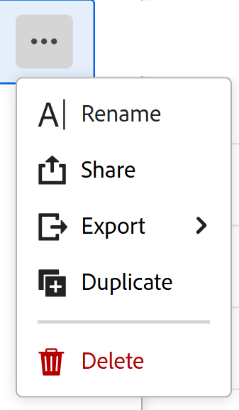

# 보기 공유

<!--The highlighted information on this page refers to functionality not yet generally available. It is available only in the Preview environment for all customers. After the monthly releases to Production, the same features are also available in the Production environment for customers who enabled fast releases.    

For information about fast releases, see [Enable or disable fast releases for your organization](/help/quicksilver/administration-and-setup/set-up-workfront/configure-system-defaults/enable-fast-release-process.md). -->

{{planning-important-intro}}

보기를 다른 사용자와 공유하여 Adobe Workfront Planning에서 레코드 작업 시 공동 작업을 보장할 수 있습니다.

>[!IMPORTANT]
>
>* 작업 영역에 권한을 부여해도 다른 사용자에게 레코드 유형 페이지의 보기에 대한 권한이 부여되지 않습니다. 다른 사용자와 공유하려면 레코드 유형 페이지에서 개별 보기에 대한 권한을 부여해야 합니다.
>
>* 보기에 권한을 부여해도 레코드 보기에 대한 권한은 변경되지 않습니다. 기록 권한은 작업 영역을 공유하여 부여됩니다.
>
>* 보기를 공유할 때 다른 사용자에게 보기의 모든 요소에 액세스할 수 있는 권한을 부여합니다. 예를 들어, 보기에 대한 관리 권한을 부여하면 그룹화, 필터, 정렬 또는 막대 모양을 수정할 수 있습니다.

<!--
This article describes how you can share a view with others. For information about requesting, granting, or denying permissions to a view, see [Request permissions to a view or a workspace](/help/quicksilver/planning/access/request-permissions.md). -->

## 액세스 요구 사항

+++ 를 확장하여 액세스 요구 사항을 확인합니다.

<!--at GA, check that the Workfront plans article linked below has Planning info-->

<table style="table-layout:auto"> 
<col> 
</col> 
<col> 
</col> 
<tbody> 
    <tr> 
<tr> 
<td> 
   
 제품
 </td> 
   <td> 
   <ul><li>
 Adobe Workfront
</li> 
   <li>
 Adobe Workfront 계획
</li></ul></td> 
  </tr>   
<tr> 
   <td role="rowheader">
Adobe Workfront 플랜*
</td> 
   <td> 

다음 Workfront 플랜 중 하나:
 
<ul><li>선택</li> 
<li>Prime</li> 
<li>Ultimate</li></ul> 

Workfront Planning은 기존 Workfront 플랜에 사용할 수 없습니다.
 
   </td> 
<tr> 
   <td role="rowheader">
Adobe Workfront 계획 패키지*
</td> 
   <td> 

임의 
 

각 Workfront Planning 계획에 포함된 사항에 대한 자세한 내용은 Workfront 계정 관리자에게 문의하십시오. 
 
   </td> 
 <tr> 
   <td role="rowheader">
Adobe Workfront 플랫폼
</td> 
   <td> 

Workfront Planning에 액세스하려면 조직의 Workfront 인스턴스가 Adobe 통합 경험에 온보딩되어야 합니다.
 

사용자가 권한 요청에서 보기에 대한 권한을 요청하고 부여할 수 있으려면 조직이 Adobe 통합 경험에 온보딩되어야 합니다. 

Workfront Planning 보기에 대한 권한을 얻으려면 Adobe Admin Console에 사용자를 추가해야 합니다.

자세한 내용은 <a href="/help/quicksilver/workfront-basics/navigate-workfront/workfront-navigation/adobe-unified-experience.md">Workfront용 Adobe 통합 환경</a>을 참조하십시오. 
 
   </td> 
   </tr> 
  </tr> 
  <tr> 
   <td role="rowheader">
Adobe Workfront 라이센스*
</td> 
   <td>
 표준

   
기존 Workfront 라이선스에는 Workfront Planning을 사용할 수 없습니다.
 
  </td> 
  </tr> 
  <tr> 
   <td role="rowheader">
액세스 수준 구성
</td> 
   <td> 
Adobe Workfront Planning에 대한 액세스 수준 제어가 없습니다.
   
</td> 
  </tr> 
<tr> 
   <td role="rowheader">
개체 권한
</td> 
   <td>  
보기에 대한 권한 관리
  
   
작업 영역에 대한 관리 권한이 있는 사용자만 보기를 공개적으로 공유할 수 있습니다.
</td> 
  </tr>

</tbody> 
</table>

*Workfront 액세스 요구 사항에 대한 자세한 내용은 Workfront 설명서의 [액세스 요구 사항](/help/quicksilver/administration-and-setup/add-users/access-levels-and-object-permissions/access-level-requirements-in-documentation.md)을 참조하십시오.

+++

## 보기 공유 시 고려 사항

* 다음과 같은 방법으로 보기를 공유할 수 있습니다.

   * 내부적으로 Workfront 사용자, 그룹, 팀, 회사 및 작업 역할 사용
   * 공개적으로, Workfront 외부의 사용자 포함
   * 링크를 복사한 다음 보기에 공유
   * Excel 또는 CSV 파일로 내보내기. 테이블 뷰만 파일로 내보낼 수 있습니다. 자세한 내용은 [테이블 보기 관리](/help/quicksilver/planning/views/manage-the-table-view.md)를 참조하십시오.

* Workfront Planning에서 개체 공유에 대한 일반적인 내용은 [Adobe Workfront Planning의 공유 권한 개요](/help/quicksilver/planning/access/sharing-permissions-overview.md)를 참조하십시오.
* 내부 Workfront 사용자에게 보기에 대한 보기 또는 관리 권한을 부여할 수 있습니다.

* 관리 권한이 있는 사용자는 보기 설정을 수정, 공유, 복제 또는 삭제할 수 있습니다.

* 공개 링크를 사용하여 조직 외부의 사용자와 보기를 공유할 수 있습니다.

* 보기를 공개적으로 공유할 때는 회사 외부의 모든 사용자가 제한된 시간 동안 만료 날짜로 표시된 링크에 액세스할 수 있습니다. 공유 보기를 보는 데 로그인이 필요하지 않습니다.

* 보기에 대한 액세스 권한이 있는 조직 외부의 사람은 다른 보기를 만들거나 공유 보기를 편집하거나 보기에서 레코드 정보를 추가, 삭제 또는 편집할 수 없습니다.

## 내부적으로 보기에 대한 권한 공유

생성한 보기 또는 관리 권한이 있는 보기를 Workfront Planning의 사용자, 그룹, 팀, 회사 및 작업 역할과 공유할 수 있습니다.

>[!NOTE]
>
>시스템 관리자는 자신이 만들지 않은 보기를 보거나 공유할 수 없습니다. 공유된 보기에만 액세스하거나 공유할 수 있습니다.
>
>시스템 관리자는 보기에 대한 관리 권한만 가질 수 있습니다.

{{step1-to-planning}}

1. 보기를 공유할 작업 영역을 연 다음 레코드 유형 카드를 클릭합니다.

   그러면 레코드 유형 페이지가 열립니다.

1. 보기 탭에서 다음 중 하나를 수행합니다.

   * 공유하려는 보기의 탭 이름을 마우스로 가리킨 다음 보기 이름 오른쪽에 있는 **자세히** 메뉴 를 클릭한 다음 **공유**&#x200B;를 클릭합니다.

     

   * **공유** > **현재 보기 공유**&#x200B;를 클릭합니다.

     

   **보기 공유** 상자가 열리고 기본적으로 **내부 공유** 탭을 선택해야 합니다.

1. (선택 사항) **액세스 권한이 있는 사용자** 영역에서 다음 선택 사항 중에서 선택합니다.

   * **초대된 사람만 액세스할 수 있습니다**: 보기를 공유할 사용자, 그룹, 팀, 회사 또는 작업 역할을 지정해야 합니다. 기본 옵션입니다.

   >[!NOTE]
   >
   >팀, 그룹, 회사 및 작업 역할 외에도 Adobe Admin Console에 추가된 사용자와만 공유할 수 있습니다. Workfront 전용 사용자는 추가할 수 없습니다. 자세한 내용은 [Adobe Admin Console에서 사용자 관리](/help/quicksilver/administration-and-setup/add-users/create-and-manage-users/admin-console.md)를 참조하십시오.

   * **작업 영역의 모든 사용자가 볼 수 있습니다**: 작업 영역에 대한 보기 이상의 권한이 있는 모든 사용자가 보기에 액세스할 수 있습니다.

1. **이 보기에 대한 액세스 권한 부여** 필드에서 사용자, 그룹, 팀, 회사 또는 작업 역할의 이름을 입력한 다음 목록에 표시될 때 클릭합니다.

   

1. 드롭다운 메뉴에서 다음 권한 수준 중 하나를 선택합니다.
   * 보기
   * 관리

     권한 수준 및 사용자가 각 수준에 대해 수행할 수 있는 작업에 대한 자세한 내용은 [Adobe Workfront Planning의 권한 공유 개요](/help/quicksilver/planning/access/sharing-permissions-overview.md)를 참조하십시오.

     시스템 관리자는 항상 공유 보기에 대한 관리 권한을 받습니다.

1. **저장**&#x200B;을 클릭합니다.

   보기가 현재 다른 사용자와 공유되고 있음을 나타내기 위해 사람 아이콘 (으)로 업데이트됩니다.

   보기를 공유한 사용자는 인앱 및 이메일 알림을 모두 수신합니다.

   >[!TIP]
   >
   >사람 또는 전역 아이콘이 없는 보기는 사용자가 만든 보기이며 다른 사용자와 공유되지 않습니다. 공유되지 않은 보기는 사용자에게만 표시됩니다.

1. 복사한 링크를 다른 사용자와 공유합니다. 링크를 받은 사용자는 활성 사용자여야 하며 레코드 유형 페이지에 액세스하여 선택한 보기에 표시할 수 있도록 Workfront에 로그인해야 합니다.

## 공개적으로 보기에 권한 공유

만든 보기 또는 관리 권한이 있는 보기를 Workfront 라이선스가 없고 조직 외부에 있을 수 있는 사람과 공유할 수 있습니다.

>[!IMPORTANT]
>
>작업 영역에 대한 관리 권한이 있는 사용자만 작업 영역 보기를 공개적으로 공유할 수 있습니다.

Workfront Planning에서 보기를 공개적으로 공유하려면 다음을 수행합니다.

{{step1-to-planning}}

1. 보기를 공유할 작업 영역을 연 다음 레코드 유형 카드를 클릭합니다.

   그러면 레코드 유형 페이지가 열립니다.

1. 보기 탭에서 다음 중 하나를 수행합니다.

   * 공유하려는 보기의 탭 이름을 마우스로 가리킨 다음 보기 이름 오른쪽에 있는 **자세히** 메뉴 를 클릭한 다음 **공유**&#x200B;를 클릭합니다.

   
   * **공유** > **현재 보기 공유**&#x200B;를 클릭합니다.

   **보기 공유** 상자가 열립니다.

1. **공개 공유**&#x200B;를 클릭합니다.

   

1. **공개 링크 만들기** 설정을 사용하도록 설정합니다.

   링크를 사용할 수 있습니다. 공개 링크입니다. 링크를 공유하면 조직 외부의 직원을 포함하여 모든 사용자가 레코드 유형 페이지에 액세스하고 페이지의 레코드와 필드를 볼 수 있습니다.

1. **링크 복사** 아이콘 를 클릭하여 링크를 클립보드에 복사합니다.

1. 수동으로 날짜를 입력하거나 **링크 만료 날짜** 필드의 달력을 사용하여 공개 링크에 대한 만료 날짜를 선택하십시오. 선택한 날짜 이후에는 레코드 페이지 보기에 액세스할 수 없습니다.

1. **저장**&#x200B;을 클릭합니다.

   보기가 공개적으로 공유되었음을 나타내기 위해 전역 아이콘 로 업데이트됩니다.

   >[!TIP]
   >
   >사람 또는 전역 아이콘이 없는 보기는 사용자가 만든 보기이며 다른 사용자와 공유되지 않습니다. 공유되지 않은 보기는 사용자에게만 표시됩니다.

1. (선택 사항) 복사한 링크를 이메일, 채팅 메시지, 문서 또는 Workfront 댓글에 붙여넣어 다른 사용자와 공유할 수 있습니다.

## 보기에 링크 복사

보기에 대한 링크를 클립보드에 복사하여 다른 애플리케이션에 포함하거나 다른 사용자와 공유할 수 있습니다.

공개 공유 보기에 링크를 복사하려면 이 문서의 [보기에 대한 공개 권한 공유](#share-permissions-to-a-view-publicly) 섹션을 참조하십시오.

이 섹션에서는 내부적으로 보기를 공유하는 방법에 대해 설명합니다.

>[!IMPORTANT]
>
>먼저, 보기에 대한 링크를 공유하기 전에 해당 보기를 사용자와 공유해야 사용자가 볼 수 있습니다.

{{step1-to-planning}}

1. 링크를 복사하고 공유할 보기의 작업 영역을 연 다음 레코드 유형 카드를 클릭합니다.

   그러면 레코드 유형 페이지가 열립니다.

1. 보기의 탭에서 다음 중 하나를 수행합니다.

   * 공유할 보기의 탭 위로 마우스를 가져간 후 보기 이름의 오른쪽에 있는 **자세히** 메뉴 를 클릭한 다음 **보기 공유** 상자에서 **공유** > **링크 복사**&#x200B;를 클릭합니다.
   * **보기 공유** 상자에서 **공유** > **보기 링크 복사** > **링크 복사**&#x200B;를 클릭합니다.

   보기에 대한 링크가 클립보드에 복사되며 화면 하단에 확인 메시지가 표시됩니다.

   이제 다른 응용 프로그램에 링크를 붙여넣거나 다른 응용 프로그램에 링크를 보낼 수 있습니다.

## 권한 요청에서 보기에 대한 권한 부여

권한이 없는 보기에 대한 링크에 액세스하는 사용자는 보기에 대한 권한을 요청할 수 있습니다. 보기에 대한 관리 권한이 있는 모든 사용자는 권한 요청을 받으며 권한을 부여하거나 거부할 수 있습니다.

1. (조건부) 사용자가 보기 관리자인 경우 다른 사용자로부터 다음 영역의 보기에 액세스하라는 요청을 받을 수 있습니다.

   * 인앱 알림
     
   * 이메일 알림
     
1. (조건부) Workfront의 알림 영역에서 인앱 알림을 클릭합니다
또는
전자 메일 알림에서 **모든 알림 보기**&#x200B;를 클릭한 다음 목록에서 알림을 클릭합니다.

   **액세스 요청 보류 중** 상자가 표시됩니다.

   
1. (선택 사항) 권한을 승인하려는 사용자의 경우 드롭다운 메뉴에서 사용자 이름 오른쪽에 있는 다음 옵션 중 하나를 선택합니다.
   * **보기**
   * **관리**
1. 권한을 승인하거나 거부할 사용자를 선택한 다음 **모두 승인** 또는 **모두 거부**&#x200B;를 클릭합니다.
1. **보류 중인 액세스 요청**&#x200B;의 왼쪽에 있는 왼쪽 화살표를 클릭한 다음 **저장**&#x200B;을 클릭합니다.

   요청을 승인하면 사용자가 보기의 공유 상자에 추가됩니다. 권한을 요청하는 사용자는 요청이 승인되었다는 이메일 확인을 받게 됩니다. <!--will they also get an in-app notification??-->

## 보기에 대한 권한 제거

{{step1-to-planning}}

1. 공유를 중지할 보기를 가진 작업 영역을 연 다음 레코드 유형 카드를 클릭합니다. 그러면 레코드 유형 페이지가 열립니다.
1. 보기 탭에서 다음 중 하나를 수행합니다.

   * 공유하려는 보기의 탭 이름을 마우스로 가리킨 다음 보기 이름 오른쪽에 있는 **자세히** 메뉴 를 클릭한 다음 **공유**&#x200B;를 클릭합니다.

   * **공유** > **현재 보기 공유**&#x200B;를 클릭합니다.

   **보기 공유** 상자가 열립니다.
1. 보기의 내부 공유를 제거하려면 다음 작업을 수행하십시오.

   1. **내부 공유** 탭을 선택했는지 확인하십시오.
   1. 제거할 사용자, 그룹, 팀, 회사 또는 작업 역할을 찾고 보기를 공유하는 엔터티 이름 오른쪽에 있는 권한 드롭다운 메뉴를 확장한 다음 **제거**&#x200B;를 클릭합니다.

1. 보기의 공개 공유를 제거하려면 다음 작업을 수행하십시오.

   1. **공개 공유** 탭을 클릭합니다.
   1. **공개 링크 만들기** 옵션을 선택 취소합니다.

1. **저장**&#x200B;을 클릭합니다.

   사용자는 더 이상 보기에 액세스할 수 없습니다. 보기에 액세스하지 못하도록 제거된 사용자에게 더 이상 이 액세스 권한이 없다는 알림이 없습니다.
