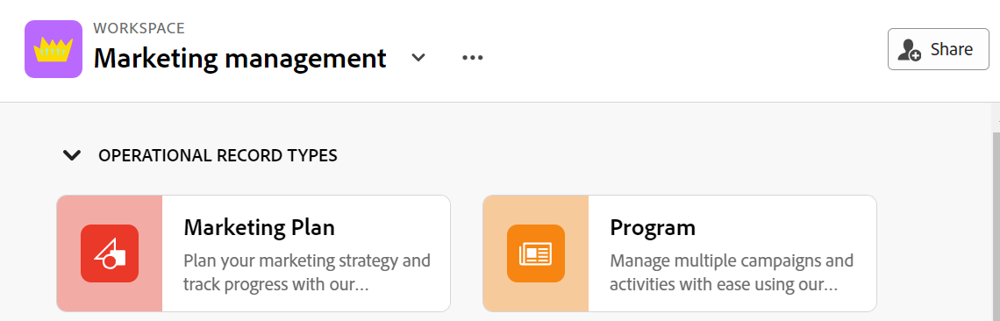

<!--update the metadata and description when we turn this article live; also, update title after Bob adds Planning as a product ??-->

# 작업 공간 공유

{{planning-important-intro}}

Adobe Workfront Planning에서 작업할 때 공동 작업을 보장하기 위해 다른 사용자와 작업 영역을 공유할 수 있습니다.

>[!NOTE]
>
>작업 영역에 권한을 부여해도 다른 사용자에게 레코드 유형 페이지의 보기에 대한 권한이 부여되지 않습니다. 다른 사용자와 공유하려면 레코드 유형 페이지에서 개별 보기에 대한 권한을 부여해야 합니다. 자세한 내용은 [보기 공유](/help/quicksilver/planning/access/share-views.md)를 참조하십시오.

## 액세스 요구 사항

이 문서의 단계를 수행하려면 다음 액세스 권한이 있어야 합니다.

<table style="table-layout:auto">
 <col>
 </col>
 <col>
 </col>
 <tbody>
    <tr>
<tr>
<td>
   
 제품
 </td>
   <td>
   
 Adobe Workfront
 </td>
  </tr>  
 <td role="rowheader">
Adobe Workfront 계약
</td>
   <td>

Workfront Planning의 조기 액세스 단계에 조직을 등록해야 합니다. 

   </td>
  </tr>
  <tr>
   <td role="rowheader">
Adobe Workfront 플랜
</td>
   <td>

임의

   </td>
  </tr>
  <tr>
   <td role="rowheader">
Adobe Workfront 라이센스*
</td>
   <td>
   
새로운 기능: 표준

   또는
   
현재: 플랜 
 
  </td>
  </tr>

<tr>
   <td role="rowheader">
액세스 수준 구성
</td>
   <td> Adobe Workfront Planning에 대한 액세스 제어가 없습니다.
  
</td>
  </tr>

<tr>
   <td role="rowheader">
권한
</td>
   <td> 
작업 공간에 대한 권한 관리
  
</td>
  </tr>

<tr>
   <td role="rowheader">
레이아웃 템플릿
</td>
   <td> 
Workfront 관리자를 포함한 모든 사용자에게 메인 메뉴의 계획 영역을 포함하는 레이아웃 템플릿을 할당해야 합니다. 
 
자세한 내용은 <a href="/help/quicksilver/planning/access/access-overview.md">액세스 개요</a>를 참조하십시오. 
 
</td>
  </tr>
 </tbody>
</table>

*자세한 내용은 [Workfront 설명서의 액세스 요구 사항](/help/quicksilver/administration-and-setup/add-users/access-levels-and-object-permissions/access-level-requirements-in-documentation.md)을 참조하십시오.

## 작업 공간에 대한 권한 공유

다음 사용자는 다른 사용자와 작업 영역을 공유할 수 있습니다.

* 시스템 관리자는 작성하지 않은 작업 영역을 포함하여 모든 작업 영역을 공유할 수 있습니다.
* 다른 모든 사용자는 관리 권한이 있는 작업 영역만 공유할 수 있습니다.

다른 사용자와 작업 공간을 공유하려면 다음을 수행하십시오.

{{step1-to-planning}}

1. 공유할 작업 영역을 연 다음 화면 오른쪽 상단의 **공유**&#x200B;를 클릭합니다.

   

1. **작업 공간 액세스 권한 부여** 필드에서 사용자 또는 그룹의 이름을 입력한 다음 목록에 표시될 때 클릭합니다.

   

1. 드롭다운 메뉴에서 다음 권한 수준 중 하나를 선택합니다.
   * 보기
   * 참여
   * 관리

     권한 수준 및 사용자가 각 수준에 대해 수행할 수 있는 작업에 대한 자세한 내용은 [Adobe Workfront Planning의 권한 공유 개요](/help/quicksilver/planning/access/sharing-permissions-overview.md)를 참조하십시오.
1. 작업 영역에 대한 링크를 클립보드에 복사하려면 **링크 복사**&#x200B;를 클릭하십시오.
1. 복사한 링크를 다른 사용자와 공유합니다. 링크를 받은 사용자가 활성 사용자여야 하며 작업 영역에 액세스할 수 있도록 Workfront에 로그인해야 합니다.
1. **저장**&#x200B;을 클릭합니다.

## 작업 공간에 대한 권한 제거

{{step1-to-planning}}

1. 권한을 제거할 작업 영역을 연 다음 화면 오른쪽 상단의 **공유**&#x200B;를 클릭합니다.
1. 사용자 또는 그룹 이름 오른쪽에 있는 드롭다운 메뉴를 클릭한 다음 **제거**&#x200B;를 클릭합니다.
1. **저장**&#x200B;을 클릭합니다.

   제거된 그룹에 속한 사용자나 사용자는 더 이상 작업공간이나 해당 객체에 액세스할 수 없습니다.