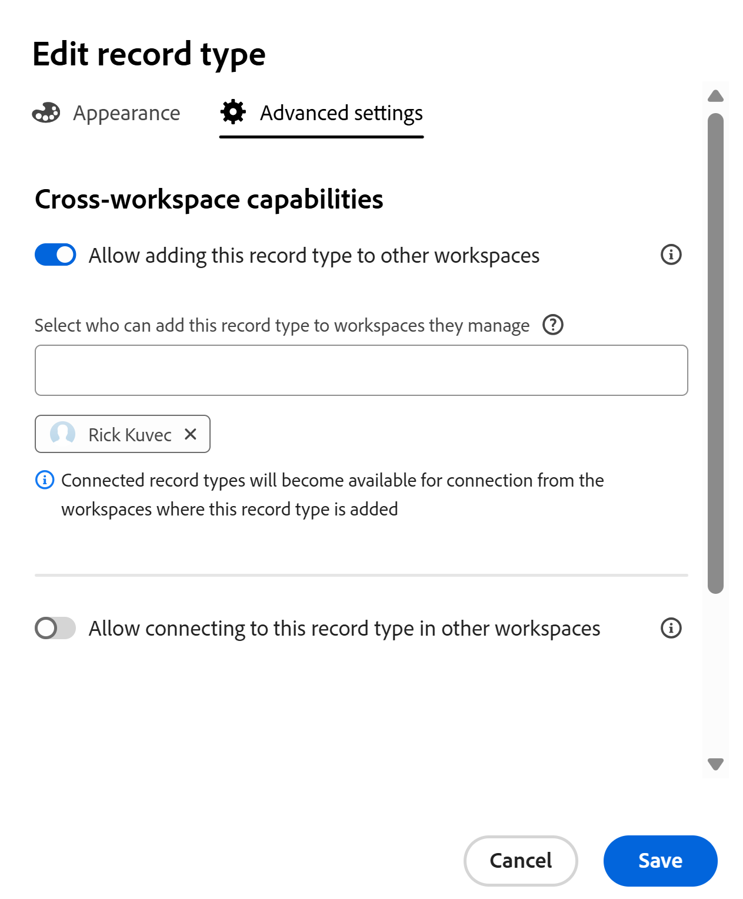

<!-- add these to the metadata, when making this public: 

feature: Workfront Planning
role: User, Admin
author: Alina
recommendations: noDisplay, noCatalog

-->

<!--*******************REPLACE THE "ADVANCED SETTINGS" SECTION IN THE "EDIT RECORD TYPES" ARTICLE WITH A LINK TO THIS ARTICLE INSTEAD AND REMOVE THE STEPS FROM THE "EDIT RECORD TYPES" ARTICLE ON HOW TO ALLOW CROSS-WORKSPACE SETTINGS FOR RECORD TYPES*************-->

<!--this article is linked to the UI - do not delete or change the URL-->

<!--THIS MIGHT ALREADY BE ADDED TO THE "OVERVIEW" ARTICLE, BUT CHECK: add more info here about permissions, how users gain permissions from the original record type, per Lilit: users who add this to another space gain View permissions on that space when they add records to this added record type.

-->

# 레코드 유형에 대한 작업 영역 간 기능 구성

{{planning-important-intro}}

<!--this is linked to the UI in the info icon when you enable a record to be either global or connectable-->

이 페이지의 정보는 아직 일반적으로 사용할 수 없는 기능을 참조합니다. 모든 고객을 위한 미리보기 환경에서만 사용할 수 있습니다. 월별 프로덕션 릴리스 이후 빠른 릴리스를 활성화한 고객을 위해 프로덕션 환경에서도 동일한 기능을 사용할 수 있습니다. 

빠른 릴리스에 대한 자세한 내용은 [조직의 빠른 릴리스 사용 또는 사용 안 함](/help/quicksilver/administration-and-setup/set-up-workfront/configure-system-defaults/enable-fast-release-process.md)을 참조하세요. 

Adobe Workfront Planning에서 여러 작업 영역에서 작동하도록 레코드 유형을 구성할 수 있습니다.

레코드 유형을 다음 중 하나로 지정할 수 있습니다.

* **글로벌 레코드 종류**: 사용자가 관리할 수 있는 다른 작업 영역에 글로벌 레코드 종류를 추가할 수 있습니다.
* **연결 가능한 레코드 종류**: 사용자는 다른 작업 영역에서 이 레코드 종류에 연결할 수 있습니다.

작업 영역 관리자가 레코드 유형을 다른 작업 영역에 추가하거나 다른 작업 영역에서 연결하기 전에 먼저 레코드 유형의 작업 영역 간 기능을 정의해야 합니다.

레코드 유형을 만들거나 편집할 때 레코드 유형의 작업 영역 간 기능을 정의합니다.

자세한 내용은 다음 문서 중 하나를 참조하십시오.

* [레코드 유형 만들기](/help/quicksilver/planning/architecture/create-record-types.md)
* [레코드 유형 편집](/help/quicksilver/planning/architecture/edit-record-types.md)

## 액세스 요구 사항

+++ 을 확장하여 이 문서의 기능에 대한 액세스 요구 사항을 봅니다.

<table style="table-layout:auto"> 
<col> 
</col> 
<col> 
</col> 
<tbody> 
    <tr> 
<tr> 
</tr>   
<tr> 
   <td role="rowheader">
Adobe Workfront 패키지
</td> 
   <td> 

연결 가능한 레코드 유형을 구성하려면: 

<ul> 
<li>
모든 Workfront 패키지 및 모든 Planning 패키지
</li>

또는

<li>
워크플로우 및 계획 Prime 및 Ultimate 패키지
</li></ul>

글로벌 레코드 유형을 구성하려면 다음을 수행합니다.

<ul> 
<li>
모든 Workfront 패키지 및 Planning Plus 패키지
</li>

또는

<li>
워크플로우 및 계획 Prime 및 Ultimate 패키지
</li></ul>

각 Workfront Planning 패키지에 포함된 내용에 대한 자세한 내용은 Workfront 계정 담당자에게 문의하십시오. 
 
   </td> 
  <tr> 
   <td role="rowheader">
Adobe Workfront 라이선스
</td> 
   <td>
표준

   </td> 
  </tr> 
  <tr> 
   <td role="rowheader">
개체 권한
</td> 
   <td>   
작업 공간에 대한 권한 관리
  
   
시스템 관리자는 만들지 않은 작업 영역을 포함하여 모든 작업 영역에 대한 권한을 가집니다
  </td> 
  </tr>  
</tbody> 
</table>

Workfront 액세스 요구 사항에 대한 자세한 내용은 Workfront 설명서의 [액세스 요구 사항](/help/quicksilver/administration-and-setup/add-users/access-levels-and-object-permissions/access-level-requirements-in-documentation.md)을 참조하십시오.

+++   

<!--Old:

<table style="table-layout:auto"> 
<col> 
</col> 
<col> 
</col> 
<tbody> 
    <tr> 
<tr> 

  </tr>   
<tr> 
   <td role="rowheader">
Adobe Workfront package
</td> 
   <td> 
<ul><li>
Any Workfront package
</li>

And

<li>
Any Planning package to create connectable record types
</li>
<li>
A Planning Plus package to create global record types
</li>
</ul>
Or:
<ul><li>
A Workflow Prime or Ultimate package
 </li>
And
<li>
A Planning Prime or Ultimate package
</li></ul>

For more information about what is included in each Workfront Planning package, contact your Workfront account manager. 
 
   </td> 
  <tr> 
   <td role="rowheader">
Adobe Workfront license
</td> 
   <td>
Standard

   </td> 
  </tr> 
  <tr> 
   <td role="rowheader">
Object permissions
</td> 
   <td>   
Manage permissions to a workspace and to the record type</a> 
  
   
System Administrators have permissions to all workspaces, including the ones they did not create
  </td> 
  </tr>  
</tbody> 
</table> -- >

## Configure global record types

<!--this is a UI term; don't change the title of this section-->

작업 영역 관리자는 레코드 유형을 글로벌 레코드 유형으로 구성할 수 있습니다. 글로벌 레코드 유형은 다른 작업 공간에 추가할 수 있습니다.

작업 영역 관리자는 전역 레코드 유형을 자신이 관리하는 작업 영역에 추가할 수 있습니다. 레코드 유형의 원본 필드도 보조 작업 영역에 추가됩니다.

사용자는 Contribute 권한이 있고 원래 작업 영역을 포함하여 글로벌 레코드 유형이 추가된 작업 영역에서 글로벌 레코드 유형에 레코드를 추가할 수 있습니다. 보기 권한만 있는 작업 공간에서 레코드를 볼 수 있습니다.

자세한 내용은 [작업 영역 간 레코드 형식 개요](/help/quicksilver/planning/architecture/cross-workspace-record-types-overview.md)를 참조하십시오.

레코드 유형을 글로벌로 구성하려면 다음을 수행합니다.

{{step1-to-planning}}

1. 레코드 유형을 전역으로 구성할 작업 영역을 클릭합니다.

   작업 영역 페이지가 열리고 레코드 유형이 표시됩니다.
1. 다음 중 하나를 수행하십시오.

   * 레코드 종류 카드 위에 마우스를 올려 놓고 레코드 종류 카드의 오른쪽 상단에 있는 **자세히** 메뉴 를 클릭합니다. <!--add new screen shot without Share for now-->

     

   * 레코드 유형 카드를 클릭하여 레코드 유형 페이지를 연 다음 레코드 유형 이름 오른쪽에 있는 **기타** 메뉴 를 클릭합니다.
1. **편집** 또는 **설정**&#x200B;을 클릭합니다.

   >[!TIP]
   >
   >레코드 유형이 다른 작업 공간에 추가되면 해당 작업 공간에 글로벌 레코드 유형으로 표시됩니다. 이 경우 편집 및 설정 옵션이 흐리게 표시됩니다.

1. (조건부) **편집**&#x200B;을 클릭한 경우 **레코드 종류 편집** 상자에서 **작업 영역 간 설정** 탭을 클릭합니다

   또는 **설정**&#x200B;을 클릭한 경우 왼쪽 패널의 **작업 영역 간 설정** 섹션을 클릭합니다.
1. **다른 작업 영역에 이 레코드 형식을 추가할 수 있도록 허용** 설정을 사용합니다.

   

   >[!TIP]
   >
   >글로벌 레코드 유형을 다른 작업 공간에 추가한 후에는 이 설정을 더 이상 비활성화할 수 없습니다.

1. **이 레코드 형식을 자신이 관리하는 작업 영역에 추가할 수 있는 사용자 선택** 필드에서 이 레코드 형식을 자신이 관리하는 작업 영역에 추가하도록 허용할 엔터티를 추가합니다.

   필드에 이름이 자동으로 추가됩니다.

   이 레코드 유형을 자신이 관리하는 작업 공간에 추가하도록 허용할 개별 사용자, 그룹, 팀, 작업 역할 또는 회사를 추가할 수 있습니다.

   레코드 유형을 저장한 후 이 필드를 편집할 수 있습니다.

1. (선택 사항) **이 레코드 종류를 관리할 작업 영역에 추가할 수 있는 사용자를 선택하십시오** 필드에서 이름을 제거합니다.

   >[!TIP]
   >
   >이 설정을 활성화할 수 있는 엔터티(사용자, 팀, 그룹, 역할 또는 회사)를 하나 이상 지정해야 합니다.

1. (조건부) **레코드 종류 편집** 상자에서 **저장**&#x200B;을 클릭하거나 페이지 헤더의 **설정** 왼쪽에 있는 뒤로 화살표를 클릭하여 변경 내용을 저장합니다.

   다음과 같은 상황이 발생합니다.

   * 이제 지정한 사용자가 레코드 종류 및 해당 필드를 다른 작업 영역에 추가할 수 있습니다.

   >[!NOTE]
   >
   >레코드 유형의 모양 및 설정과 원본 필드는 원본 작업 공간에서만 편집할 수 있습니다.

   * 레코드 유형 카드에 **글로벌 레코드 유형** 아이콘 이 표시되어 다른 작업 영역에 레코드 유형을 추가할 수 있음을 나타냅니다.
   * 시스템 생성 **Workspace** 필드가 레코드 종류 및 해당 레코드의 세부 정보에 대한 테이블 보기에 추가됩니다.

     Workspace 필드에는 각 레코드가 생성되는 작업 영역이 표시됩니다.

     이 필드는 읽기 전용이므로 삭제할 수 없습니다.
1. (선택 사항) 다른 작업 영역으로 이동하여 기존 레코드 유형을 사용하여 레코드 유형을 만듭니다. 위의 단계에서 활성화한 레코드 유형을 선택합니다.

   자세한 내용은 [다른 작업 영역에서 기존 레코드 형식 추가](/help/quicksilver/planning/architecture/add-existing-record-types-from-another-workspace.md)를 참조하십시오.

   보조 작업 영역의 글로벌 레코드 유형에서 추가된 레코드 유형은 **글로벌 레코드 유형** 아이콘 도 표시합니다.
1. (선택 사항) 글로벌 레코드 유형을 만든 원래 작업 영역으로 돌아가서 <!--ensure this stays accurate--> 위의 1-4단계를 수행하여 레코드 유형을 편집합니다
1. (선택 사항) **이 레코드 형식이 사용되는 작업 영역 섹션**&#x200B;에서 전역 레코드가 추가된 작업 영역 목록을 검토하십시오. 작업공간 이름 옆에는 작업공간 소유자도 나열됩니다.

   

## 연결 가능한 레코드 유형 구성

<!--this is a UI term; don't change the title of this section-->

레코드 유형을 작성하거나 편집할 때 다른 작업 영역에서 연결할 레코드 유형을 구성할 수 있습니다.

레코드 종류를 연결 가능한 것으로 구성하려면 다음을 수행하십시오.

{{step1-to-planning}}

1. 연결 가능한 레코드 유형으로 구성할 작업 영역을 클릭합니다.

   작업 영역 페이지가 열리고 레코드 유형이 표시됩니다.
1. 다음 중 하나를 수행하십시오.

   * 레코드 종류 카드 위에 마우스를 올려 놓고 레코드 종류 카드의 오른쪽 상단에 있는 **자세히** 메뉴 를 클릭합니다.

      <!--add new screen shot without Share for now-->

   * 레코드 유형 카드를 클릭하여 레코드 유형 페이지를 연 다음 레코드 유형 이름 오른쪽에 있는 **기타** 메뉴 를 클릭합니다.
1. **편집** 또는 **설정**&#x200B;을 클릭합니다.

1. (조건부) **편집**&#x200B;을 클릭한 경우 **레코드 종류 편집** 상자에서 **작업 영역 간 설정** 탭을 클릭합니다

   또는 **설정**&#x200B;을 클릭한 경우 왼쪽 패널의 **작업 영역 간 설정** 섹션을 클릭합니다.

1. **다른 작업 영역에서 이 레코드 형식에 연결 허용** 설정을 사용합니다. <!-- check the setting name, I sent this to Lilit to say FROM instead of IN-->

   <!-- add new screen shot with new tab name-->

   

   활성화되면 레코드 유형에 액세스하고 다른 작업 공간에서 연결할 수 있습니다.

1. 레코드 종류에 액세스할 수 있는 작업 공간을 선택합니다. 다음 옵션 중에서 선택합니다.

   <!--check names of the setting: System wide?? OR All workspaces??-->

   * **모든 작업 영역**: 사용자는 관리 권한이 있는 모든 작업 영역에서 이 레코드 형식에 연결할 수 있습니다.
   * **특정 작업 영역**: 드롭다운 메뉴에서 작업 영역 관리자가 이 레코드 종류에 연결할 수 있는 작업 영역의 이름을 추가합니다.
1. (조건부) **레코드 종류 편집** 상자에서 **저장**&#x200B;을 클릭하거나 페이지 헤더의 **설정** 왼쪽에 있는 뒤로 화살표를 클릭하여 변경 내용을 저장합니다.

   다음과 같은 상황이 발생합니다.

   * 이제 지정한 작업 영역에서 레코드 유형 및 해당 필드에 연결할 수 있습니다.
   * 레코드 유형 카드에 연결 가능한 레코드 유형 아이콘 이 표시되어 구성에 지정한 모든 작업 영역에서 레코드 유형을 연결할 수 있음을 나타냅니다.

1. (선택 사항) 다른 작업 영역으로 이동하여 위의 단계에서 작업 영역 간 연결을 활성화한 레코드 유형에 연결을 추가합니다.

   자세한 내용은 [레코드 종류 연결](/help/quicksilver/planning/architecture/connect-record-types.md)을 참조하세요.

