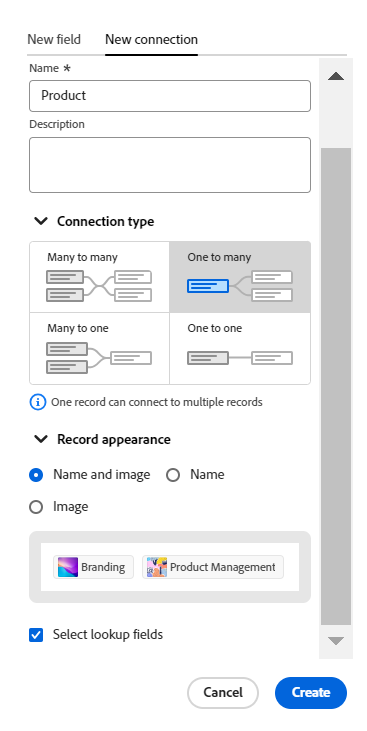

# 연결된 레코드 유형 개요

<!--see the commented out markers below for the Planning connection field, might not display in green; also add Preview tags for the article-->

개별 레코드 유형을 연결하여 서로 관련되거나 다른 응용 프로그램의 오브젝트와 관련됨을 나타낼 수 있습니다.

이 문서에서는 레코드 유형 연결에 대한 개요를 살펴보고 레코드와 개체 유형 간에 설정할 수 있는 연결 유형에 대해 설명합니다.

레코드 종류를 연결하는 방법에 대한 자세한 내용은 [레코드 종류 연결](/help/quicksilver/planning/architecture/connect-record-types.md)을 참조하세요.

## 레코드 유형 연결에 대한 고려 사항

Workfront Planning에서 연결하는 단계는 두 가지가 있습니다.

1. 먼저 다른 응용 프로그램에서 두 레코드 형식 또는 레코드 형식과 개체 형식 간에 연결을 설정해야 합니다. 레코드 종류를 연결하는 방법에 대한 자세한 내용은 [레코드 종류 연결](/help/quicksilver/planning/architecture/connect-record-types.md)을 참조하세요.
1. 두 번째, 두 레코드 유형이 연결된 후 한 유형의 개별 레코드와 다른 유형의 레코드를 연결할 수 있습니다. 레코드 연결에 대한 자세한 내용은 [레코드 연결](/help/quicksilver/planning/records/connect-records.md)을 참조하십시오.

레코드 유형 연결에 대해 다음 사항을 고려하십시오.

* Adobe Workfront Planning에서 다음 엔티티를 연결할 수 있습니다.

   * 두 가지 레코드 유형.

     기본적으로 동일한 작업 영역에서 두 개의 레코드 유형을 연결할 수 있습니다. 다른 작업 영역의 레코드 유형과 연결할 레코드 유형을 설정할 수도 있습니다. 자세한 내용은 [레코드 종류 편집](/help/quicksilver/planning/architecture/edit-record-types.md)을 참조하세요.
   * 다른 응용 프로그램의 레코드 형식과 개체 형식입니다.

* 다음 응용 프로그램에서 Workfront Planning 레코드 유형과 다음 객체 유형을 연결할 수 있습니다.

   * Adobe Workfront:

      * 프로젝트
      * 포트폴리오
      * 프로그램
      * 회사
      * 그룹

   * Adobe Experience Manager Assets:

      * 이미지
      * 폴더

     >[!IMPORTANT]
     >
     >Adobe Experience Manager Assets 라이선스가 있어야 하며 Workfront Planning 레코드를 Adobe Experience Manager Assets에 연결하려면 조직의 Workfront 인스턴스가 Adobe 비즈니스 플랫폼 또는 Adobe Admin Console에 온보딩되어야 합니다.
     >
     >Adobe Admin Console 온보딩에 대한 질문이 있는 경우 [통합 경험 Adobe FAQ](/help/quicksilver/workfront-basics/navigate-workfront/workfront-navigation/unified-experience-faq.md)를 참조하십시오.

* 연결된 레코드 유형에 대한 레코드를 만든 후 연결된 레코드 필드를 통해 서로 연결할 수 있습니다.  자세한 내용은 [레코드 연결](/help/quicksilver/planning/records/connect-records.md)을 참조하세요.

* 레코드 유형을 다른 레코드 유형이나 다른 응용 프로그램의 개체 유형과 연결한 후에는 다음과 같은 시나리오가 있습니다.

   * **두 Planning 레코드 형식을 연결할 때**: 연결 중인 레코드 형식에 연결된 레코드 필드가 만들어집니다. 연결하는 레코드 종류에 유사한 연결된 레코드 필드가 만들어집니다.

     예를 들어 &quot;Campaign&quot; 레코드 유형을 &quot;Product&quot; 레코드 유형과 연결하는 경우 이름을 &quot;Linked Product&quot;로 지정한 연결된 레코드 필드(연결 필드)가 캠페인 레코드 유형에 만들어집니다. 제품 레코드 유형에 자동으로 &quot;캠페인&quot;이라는 연결된 레코드 유형이 만들어집니다.

   * **다른 응용 프로그램의 개체 형식과 레코드 형식을 연결하는 경우**:

      * 연결하는 레코드 종류에 연결된 레코드 필드가 만들어집니다. 연결된 레코드 필드는 다른 응용 프로그램의 개체 유형에 자동으로 만들어지지 않습니다.
      * Workfront 오브젝트에서 Planning 레코드 필드에 액세스할 수 없습니다.
      * 계획 레코드는 Workfront 오브젝트의 계획 탭에서 볼 수 있습니다. 자세한 내용은 [Adobe Workfront 개체의 계획 섹션에서 레코드 관리](/help/quicksilver/planning/records/manage-records-in-planning-section.md)를 참조하십시오.
     <!--* Planning records are visible from a Workfront object's custom form when you add the Planning connection field type to the form. For information, see [Create a custom form](/help/quicksilver/administration-and-setup/customize-workfront/create-manage-custom-forms/form-designer/design-a-form/design-a-form.md). -->
      * Workfront 관리자가 Workfront과 Adobe Experience Manager Assets 간의 통합을 통해 메타데이터 매핑을 구성할 때 Experience Manager 에셋에서 계획 레코드 필드에 액세스할 수 있습니다. 자세한 내용은 [Adobe Workfront과 Experience Manager Assets 간의 에셋 메타데이터 매핑 구성](https://experienceleague.adobe.com/docs/experience-manager-cloud-service/content/assets/integrations/configure-asset-metadata-mapping.html?lang=en)을 참조하십시오.

   * **연결된 레코드 또는 개체에서 조회 필드를 추가할 때**: 연결된 레코드 필드를 만들 수 있을 뿐만 아니라 연결된 레코드 또는 개체 형식의 필드에 연결할 수도 있습니다. 이 필드를 조회 필드라고 합니다. 연결하려는 레코드의 정보가 있는 연결된(또는 조회 필드) 필드는 연결하려는 레코드에 표시됩니다.

     다른 레코드 유형이나 다른 응용 프로그램 객체의 필드를 Workfront Planning 레코드 유형에 연결할 수 있습니다.

     연결된 필드는 읽기 전용이며 연결된 레코드의 정보를 자동으로 표시합니다.

     수식, 필터 또는 그룹화에서 다른 레코드 또는 개체 형식의 조회 필드를 참조할 수 있습니다.

     예를 들어 &quot;캠페인&quot; 레코드 유형을 Workfront 프로젝트와 연결하고 프로젝트의 계획된 완료 일자 필드를 Workfront 계획 레코드로 가져오도록 선택하면 캠페인에 대해 연결된 필드(프로젝트의 계획된 완료 일자)가 자동으로 생성됩니다. 연결된 이 필드는 수동으로 편집할 수 없습니다. 계획된 완료 일자(프로젝트 시작) 필드에는 연결된 프로젝트의 계획된 완료 일자가 표시됩니다.

     >[!IMPORTANT]
     >
     >작업 영역에 대한 보기 이상의 권한이 있는 모든 사용자는 링크된 객체 유형의 응용 프로그램에서 자신의 권한 또는 액세스 수준이나 다른 작업 영역에서 본인의 권한에 관계없이 조회 필드에서 정보를 볼 수 있습니다.

     연결된 레코드 필드 앞에는 관계 아이콘 이(가) 있습니다.

     연결된 필드 앞에는 필드 유형을 식별하는 아이콘이 표시됩니다. 예를 들어 연결된(또는 조회) 필드 앞에는 필드가 숫자, 단락 또는 날짜임을 나타내는 아이콘이 표시됩니다.

## 연결 유형

두 레코드 유형 간에 또는 다른 응용 프로그램의 레코드와 개체 유형 간에 연결을 설정한 후 연결된 레코드 필드에 레코드를 추가할 수 있습니다.

연결된 레코드 필드에 추가할 수 있는 레코드 수에 따라 레코드 유형을 연결할 때 선택할 수 있는 연결 유형은 다음과 같습니다.

* [다대다](#many-to-many-connection-type)
* [일대다](#one-to-many-connection-type)
* [다대일](#many-to-one-connection-type)
* [일대일](#many-to-one-connection-type)

>[!WARNING]
>
>다음 연결 시 이러한 옵션을 사용할 수 없습니다.
>
>* 다른 작업 공간의 두 개 레코드
>
>* 레코드 유형 및 Experience Manager 에셋

### 다대다 연결 유형

레코드 유형 간에 다대다 연결을 만들면 두 레코드 유형의 연결 필드에서 여러 레코드를 선택할 수 있습니다.

예를 들어 캠페인과 프로젝트 간에 다대다 연결을 만드는 경우 각 캠페인에 대해 여러 프로젝트를 선택하고 각 프로젝트에 대해 여러 캠페인을 선택할 수 있습니다.

다대다 관계 유형의 실제 사례는 영화와 배우의 관계이다. 각 영화에는 여러 명의 배우가 출연할 수 있으며, 각 배우는 여러 영화에서 연기할 수 있다.

이 연결 유형을 선택하면 저장한 후 연결 유형을 변경할 수 없습니다.

### 일대다 연결 유형

레코드 유형 간에 일대다 연결을 만들 때 현재 레코드 유형의 연결 필드에서 여러 레코드를 선택할 수 있지만 연결하는 레코드 유형의 해당 연결 필드에서는 하나의 레코드만 선택할 수 있습니다. 두 번째 레코드 유형에서 자동으로 생성된 연결된 레코드 필드는 다대일 관계 유형으로 자동 설정됩니다.

예를 들어 캠페인과 프로젝트 간에 일대다 연결을 만드는 경우 각 캠페인에 대해 여러 프로젝트를 선택할 수 있지만 각 프로젝트는 하나의 캠페인에만 연결할 수 있습니다.

일대다 관계 유형의 실제 예는 라이브러리와 책 간의 관계입니다. 라이브러리에는 인벤토리에 많은 책이 있지만 특정 시간에 한 개의 특정 책만 한 라이브러리에 있을 수 있습니다.

이 연결 유형을 선택하면 나중에 다대다 연결 유형으로만 변경할 수 있습니다.

### 다대일 연결 유형

레코드 유형 간에 다대일 연결을 만들면 현재 레코드 유형의 각 레코드를 연결된 레코드 유형의 레코드와 연결할 수 있습니다. 두 번째 레코드 유형에서 자동으로 생성된 연결된 레코드 필드는 일대다 관계 유형으로 자동 설정됩니다.

예를 들어, 캠페인을 프로젝트와 연결하고 이 연결 유형을 선택하는 경우 캠페인에 프로젝트를 하나만 추가할 수 있습니다. 그러나 하나의 프로젝트에 여러 캠페인을 추가할 수 있습니다.

다대일 관계 유형의 실제 예는 많은 영화와 한 배우의 관계입니다. 한 배우는 많은 영화에 출연할 수 있지만 각 영화는 한 번만 특정 배우를 캐스팅할 수 있습니다.

이 연결 유형을 선택하면 나중에 다대다 연결 유형으로만 변경할 수 있습니다.

### 일대일 연결 유형

레코드 종류 간에 일대일 연결을 만들 때 두 레코드 종류 모두에서 각 레코드를 다른 레코드 종류의 레코드로만 연결할 수 있습니다.

예를 들어, 캠페인을 프로젝트와 연결하고 이 연결 유형을 선택하는 경우 하나의 캠페인과 하나의 프로젝트를 연결할 수 있습니다. 하나의 프로젝트는 하나의 캠페인에만 연결할 수 있습니다.

일대일 관계의 실제 예는 개인과 해당 국가의 고유 식별자(예: 사회 보장 번호, 여권 ID, 로컬 ID) 사이에 존재하는 것입니다. 각 개인에는 한 국가에 대한 고유 식별자가 하나만 있으며 각 고유 식별자는 한 개인에게만 연결할 수 있습니다.

이 연결 유형을 선택하면 나중에 다른 연결 유형으로 변경할 수 있습니다.
