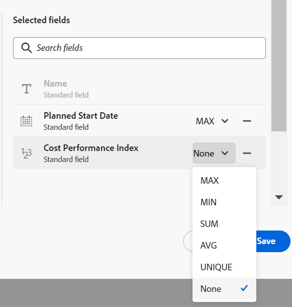

<!-----
title: Connect record types
description: A way to indicate how individual record types relate to one another is to connect them. Also, you can connect Adobe Workfront Planning record types with object types from other applications to enhance your users' experience and keep their focus in one application.
hidefromtoc: yes
hide: yes
feature: Work management
role: User
author: Alina
--->

<!--update the metadata with real information when making this avilable in TOC and in the left nav-->
<!--************ THIS MIGHT NO LONGER BE A 'RELATIONSHIP' TYPE FIELD, BECAUSE THEY WILL SHOW IT IN THE CONNECTION TAB*****************************-->

# 레코드 유형 연결

{{planning-important-intro}}

<!--
You can use Adobe Workfront Planning to design fully-customizable workspaces that contain record types needed in your organization. A way to indicate how individual record types relate to one another is to connect them. Also, you can connect Workfront Planning record types with object types from other applications to enhance your users' experience and keep their focus in one application. -->

레코드 유형을 서로 연결하거나 다른 응용 프로그램의 개체 유형을 사용하여 레코드 유형을 연결할 수 있습니다.

이 문서에서는 두 개의 Workfront Planning 레코드 유형(Workfront Planning 레코드 유형)을 다른 응용 프로그램의 오브젝트와 연결하는 방법에 대해 설명합니다.

레코드나 개체 유형 간에 연결을 설정한 후 개별 레코드를 서로 연결하고 Workfront Planning 레코드에 연결된 레코드나 개체 유형의 필드를 표시할 수 있습니다.

연결 유형에 대한 일반적인 정보는 [연결된 레코드 유형 개요](/help/quicksilver/planning/architecture/connect-record-types-overview.md)를 참조하십시오.

Workfront Planning 레코드를 다른 응용 프로그램의 개체에 연결하는 방법에 대한 자세한 내용은 [레코드 연결](/help/quicksilver/planning/records/connect-records.md)을 참조하십시오.

레코드 종류 및 레코드에 연결하는 예제는 [레코드 종류 및 레코드에 연결하는 예제](/help/quicksilver/planning/architecture/example-connect-record-types-and-records.md)를 참조하십시오.

<!--ensure this last linked article is right; the title and the link should have changed-->

## 액세스 요구 사항

+++ 를 확장하여 Workfront Planning에 대한 액세스 요구 사항을 봅니다.

<table style="table-layout:auto">
 <col>
 </col>
 <col>
 </col>
 <tbody>
    <tr>
<tr>
<td>
   
 제품
 </td>
   <td>
   
 Adobe Workfront
 
Adobe Workfront Planning 레코드 유형을 Experience Manager Assets에 연결하려면 Adobe Experience Manager Assets 라이선스가 있어야 하며, 조직의 Workfront 인스턴스가 Adobe 통합 경험에 온보딩되어야 합니다. 자세한 내용은 <a href="/help/quicksilver/workfront-basics/navigate-workfront/workfront-navigation/adobe-unified-experience.md">Workfront용 통합 경험 Adobe</a>를 참조하십시오.
 </td>
  </tr>  
 <td role="rowheader">
Adobe Workfront 계약
</td>
   <td>

Workfront Planning의 조기 액세스 단계에 조직을 등록해야 합니다. 

   </td>
  </tr>
  <tr>
   <td role="rowheader">
Adobe Workfront 플랜
</td>
   <td>

임의

   </td>
  </tr>
  <tr>
   <td role="rowheader">
Adobe Workfront 라이센스*
</td>
   <td>
   
새로운 기능: 표준
 
   
현재: 플랜

  </td>
  </tr>

<tr>
   <td role="rowheader">
액세스 수준 구성
</td>
   <td> 
Adobe Workfront Planning에 대한 액세스 수준 제어가 없습니다.
  
</td>
  </tr>
<tr>
   <td role="rowheader">
레이아웃 템플릿
</td>
   <td> 
Workfront 또는 그룹 관리자는 레이아웃 템플릿에 계획 영역을 추가해야 합니다. 자세한 내용은 <a href="/help/quicksilver/planning/access/access-overview.md">액세스 개요</a>를 참조하십시오. 
  
</td>
  </tr>
<tr>
   <td role="rowheader">
권한
</td>
   <td> 
작업 영역</a>에 대한 권한 관리 
  
   
시스템 관리자에게는 작성하지 않은 작업 영역을 포함하여 모든 작업 영역에 대한 권한이 있습니다.
</td>
  </tr>
 </tbody>
</table>

*자세한 내용은 [Workfront 설명서의 액세스 요구 사항](/help/quicksilver/administration-and-setup/add-users/access-levels-and-object-permissions/access-level-requirements-in-documentation.md)을 참조하십시오.

+++

<!--Maybe enable this at GA - but planing is not supposed to have Access controls in the Workfront Access Level: 
>[!NOTE]
>
>If you don't have access, ask your Workfront administrator if they set additional restrictions in your access level. For information on how a Workfront administrator can change your access level, see [Create or modify custom access levels](/help/quicksilver/administration-and-setup/add-users/configure-and-grant-access/create-modify-access-levels.md). -->

<!-- Notes for the table: for the "Workfront access" row: 
For more information, see <a href="../../administration-and-setup/add-users/access-levels-and-object-permissions/wf-licenses.md" class="MCXref xref">Adobe Workfront licenses overview</a>.
-->

## 레코드 유형 연결

<!--when changes here, also update the article for "Connect records"-->

{{step1-to-planning}}

1. 연결할 레코드 유형이 있는 작업 영역을 클릭합니다.

   또는

   작업 영역에서 기존 작업 영역 이름의 오른쪽에 있는 아래쪽 방향 화살표를 확장하고 작업 영역을 검색한 다음 목록에 표시될 때 선택합니다.
1. 레코드 유형의 카드를 클릭하여 레코드 유형 페이지를 엽니다.
1. 테이블 보기의 오른쪽 위 모서리에 있는 **+** 아이콘을 클릭한 다음 **새 연결** 탭을 클릭합니다.

   

1. **레코드 종류** 필드에서 레코드 종류를 검색하거나 다음 중 하나를 선택하십시오.

   * 선택한 작업 영역의 다른 레코드 유형

     <!--replace screen shot below-->

     

     >[!TIP]
     >
     > 
     >선택한 작업 영역에 다른 레코드 유형이 없는 경우 작업 영역 섹션이 표시되지 않습니다.

     <!--remove the first sentence in the tip above at GA-->

      * 다른 작업 영역에서 연결하도록 구성된 다른 작업 영역의 레코드 유형입니다. 자세한 내용은 [레코드 종류 편집](/help/quicksilver/planning/architecture/edit-record-types.md)을 참조하세요.

     >[!TIP]
     >
     >다른 작업 영역에서 연결하도록 구성된 레코드 유형이 없는 경우 작업 영역 섹션이 표시되지 않습니다.

   * **Workfront 개체 유형** 섹션의 **프로젝트, Portfolio, 프로그램, 회사** 또는 **그룹**.

     <!--replace screen shot below-->

     

   * **응용 프로그램 Adobe** 섹션의 **Experience Manager Assets**.

     

1. 다음 정보를 업데이트합니다.

   * **이름**: 연결된 필드의 이름으로, 원래 레코드 형식의 테이블 보기나 레코드 페이지에 표시됩니다. 이렇게 하면 원본 레코드 유형의 테이블 보기 또는 원본 레코드에 대한 연결된 레코드 필드에 연결된 레코드 열이 만들어집니다. 기본적으로 필드의 이름은 연결하는 레코드 또는 개체의 이름입니다.

   >[!TIP]
   >
   >동일한 레코드나 개체 유형에 여러 연결을 가질 수 있습니다. 연결된 필드 이름을 편집하지 않으면 Workfront은 연결된 레코드 이름 뒤에 숫자를 추가하여 동일한 이름으로 연결된 레코드 유형의 수를 나타냅니다.

   * **설명**: 연결된 레코드 필드에 대한 추가 정보입니다. 필드의 설명은 테이블에서 필드의 열 위로 마우스를 가져가면 표시됩니다.
   * **여러 레코드 허용**: 연결된 레코드 유형 필드가 원본 레코드에 표시될 때 사용자가 여러 레코드를 추가할 수 있도록 허용하려면 이 옵션을 선택하십시오. 이 옵션은 기본적으로 선택되어 있습니다. <!--This option is available only when connecting records from two different workspaces or a record and an AEM asset object type.-->
   <!--* **Connection type**: This option is available only when connecting records from the same workspace or a record and a Workfront object type. Choose from the following connection types:
        * One to one
        * One to many
        * Many to one
        * Many to many
        
        For information about connection types, see [Connected record types overview](/help/quicksilver/planning/architecture/connect-record-types-overview.md). -->
   * **조회 필드 선택**: 선택한 레코드 종류에서 필드를 추가하려면 이 옵션을 선택하십시오. 조회 필드는 연결 중인 레코드 또는 개체 유형과 관련된 필드입니다. 이 레코드들을 연결하면 연결하려는 레코드나 오브젝트의 정보가 원하는 레코드에 표시됩니다. 이 옵션은 기본적으로 선택되어 있습니다.

     >[!TIP]
     >
     > 다음 필드 유형을 조회 필드로 추가할 수 없습니다.
     >
     >    * 사용자
     >    * 제작자
     >    * 마지막 수정자
     >    * Workfront 자동 완성 필드(프로젝트 소유자 또는 프로젝트 스폰서와 같은 필드 포함)

1. (조건부 및 선택 사항) Workfront 개체에 연결하도록 선택한 경우 **이러한 기준과 일치하는 개체만 연결** 섹션에서 **사용자 지정 양식**&#x200B;을 선택합니다. 선택한 사용자 정의 양식이 첨부된 객체만 선택한 레코드 유형에 연결할 수 있습니다. 두 개 이상의 양식을 선택할 수 있습니다.

   >[!NOTE]
   >
   > 이 목록에 표시되기 전에 선택한 개체에 대해 Workfront에서 사용자 정의 양식을 만들어야 합니다.

1. (조건부) Experience Manager Assets에 연결하도록 선택한 경우 **다음 저장소에서 Experience Manager 연결** 섹션의 **저장소 연결** 드롭다운 메뉴에서 저장소를 선택합니다. 필수 필드입니다. Experience Manager Assets에서 액세스할 수 있는 저장소만 이 필드에 표시됩니다.

   >[!NOTE]
   >
   >Workfront 관리자는 Workfront의 메타데이터 매핑을 통해 Workfront Planning 필드를 Experience Manager Assets 필드에 매핑할 수 있습니다. 자세한 내용은 [Adobe Workfront과 Experience Manager Assets 간의 에셋 메타데이터 매핑 구성](https://experienceleague.adobe.com/docs/experience-manager-cloud-service/content/assets/integrations/configure-asset-metadata-mapping.html?lang=en)을 참조하십시오.

1. (조건부) Experience Manager Assets 또는 Workfront Planning 레코드 유형에 연결하도록 선택한 경우 연결된 레코드 또는 에셋의 제목을 연결된 필드에 표시하지 않으려면 **레코드 모양** 영역에서 **제목** 전환을 선택 취소합니다. 선택을 취소하면 연결된 필드에 레코드의 썸네일만 표시됩니다. 썸네일 이미지가 없는 레코드는 이미지 아이콘을 대신 표시합니다. 기본적으로 토글이 선택됩니다. 연결된 레코드가 표시되는 방법의 예는 **레코드 모양** 영역에 표시됩니다.

   >[!TIP]
   >
   >    여러 레코드를 연결할 수 있도록 허용하는 경우 축소판만 표시하면 레코드 보기와 같이 더 작은 영역에 공간이 절약될 수 있습니다.
   >
   >레코드의 제목은 레코드의 기본 필드입니다. 자세한 내용은 [기본 필드 개요](/help/quicksilver/planning/fields/primary-field-overview.md)를 참조하세요.

1. Click **Create**.

1. (조건부) **조회 필드 선택** 설정을 선택한 경우 **조회 필드 추가** 상자가 열립니다.

   **+** 아이콘을 클릭하여 **선택하지 않은 필드** 영역에서 필드를 추가합니다.

   또는

   **선택한 필드** 영역에서 필드를 제거하려면 **-** 아이콘을 클릭하십시오.

   

   레코드나 개체를 연결하면 연결된 필드의 값이 자동으로 채워집니다.

   >[!IMPORTANT]
   >
   >    작업 영역에 대한 보기 이상의 권한이 있는 모든 사용자는 연결된 객체 유형의 응용 프로그램에서 자신의 권한 또는 액세스 수준에 관계없이 연결된 필드에서 정보를 볼 수 있습니다.

1. (선택 사항) 연결된 레코드 또는 개체 형식에서 필드 추가를 건너뛰려면 **건너뛰기**&#x200B;를 클릭합니다. 연결된 레코드의 **이름** 또는 **제목**&#x200B;은(는) 연결하는 레코드 종류의 테이블 보기에서 볼 수 있는 유일한 필드입니다.

1. (선택 사항 및 조건부) 숫자, 통화, 백분율 또는 날짜 유형 필드를 연결하도록 선택하는 경우 여러 값을 요약할 집계 값도 선택합니다. 사용자가 연결된 레코드 필드에서 둘 이상의 연결된 레코드를 선택하면 연결된 필드의 값이 선택한 집계기에 따라 쉼표로 구분되거나 요약된 값으로 표시됩니다.

   조회 필드에 요약되지 않은 값이 여러 개 있는 경우 보기에서 정렬 또는 그룹화에 필드를 사용할 때 다음 사항을 고려하십시오.

   * 정렬은 첫 번째 값으로 수행됩니다

   * 레코드는 필드 값의 고유한 조합별로 그룹화됩니다

   * 타임라인 보기는 첫 번째 날짜 값을 기반으로 빌드됩니다.

   >[!IMPORTANT]
   >
   >    조회 날짜 필드를 추가할 때 타임라인 및 달력 보기의 시작 및 종료 날짜로 필드를 추가할 수 있게 하려면 집계 값을 선택해야 합니다. 예를 들어 조회 날짜 필드에 대한 MAX 또는 최소 집계를 선택할 수 있습니다.

   

   >[!NOTE]
   >
   > 기록 유형을 Experience Manager Assets에 연결할 때 집계자를 사용할 수 없습니다.

   다음 중에서 선택합니다.

   * **없음**: 여러 레코드에서 쉼표로 구분된 값을 표시합니다. 이것이 기본 선택입니다.
   * **MAX**: 연결된 레코드 필드에서 선택한 여러 레코드에서 나온 모든 값 중 가장 높은 값을 표시합니다.
   * **MIN**: 연결된 레코드 필드에서 선택한 여러 레코드에서 가져온 모든 값의 가장 낮은 값을 표시합니다.
   * **SUM**: 연결된 레코드 필드에서 선택한 여러 레코드에서 얻은 모든 값의 합계를 표시합니다.
   * **AVG**: 연결된 레코드 필드에서 선택한 여러 레코드에서 얻은 모든 값의 평균을 표시합니다.
   * **UNIQUE**: 조회 필드 값에서 중복을 제거하고 고유 값만 표시합니다. 다음 필드 유형에는 사용할 수 없습니다.
      * 단락
      * 확인란
      * 사용자

   >[!NOTE]
   >
   >예를 들어 캠페인 레코드(원본 레코드)에서 제품 레코드(연결된 레코드)를 연결하고 이름을 &quot;제품 필드&quot;로 지정할 수 있습니다. 캠페인 레코드에서 제품 레코드의 예산 필드를 연결하고 &quot;제품 예산&quot;이라고 할 수도 있습니다. &quot;제품 필드&quot;에서 여러 레코드를 선택할 수 있는 경우, 예산이 $100,000인 제품 1과 예산이 $110,000인 제품 2, 예산이 $100,000인 제품 3을 선택할 수 있습니다. 선택한 집계에 따라 최초 레코드의 연결된 필드에서 다음 예산 정보를 볼 수 있습니다.
   >
   >* **없음**: $100,000, $110,000, $100,000
   >* **MAX**: $110,000
   >* **분**: $100,000
   >* **합계**: $310,000
   >* **평균**: $103,000.33
   >* **고유**: $100,000
   >

1. (선택 사항) 필드를 검색하려면 **search** 아이콘 을(를) 사용하십시오.

1. 변경 내용을 저장하려면 **필드 추가**&#x200B;를 클릭하세요.

   다음 항목이 추가됩니다.

   * 연결하는 레코드 유형의 연결된 레코드 필드. 연결된 레코드 필드는 수동으로 추가한 후 연결된 레코드 유형의 개별 레코드를 표시합니다. 레코드 추가에 대한 자세한 내용은 [레코드 연결](/help/quicksilver/planning/records/connect-records.md)을 참조하세요. 연결된 레코드 필드의 이름은 7단계에서 선택한 이름입니다. <!--accurate-->

   * 연결된 레코드 필드에 레코드나 개체를 수동으로 추가한 후 연결된 레코드나 개체 유형에 대한 정보를 표시하는 연결된(또는 조회) 필드(또는 필드)입니다. 연결을 만들 때 **조회 필드 선택** 설정을 선택한 경우에만 조회 필드가 만들어집니다. 조회 필드는 다음 패턴에 따라 자동으로 이름이 지정됩니다.

     `<Name of the original field on the linked record> (from <Name of your linked field>)`

     예를 들어 캠페인 레코드 종류를 프로그램 레코드 종류 및 프로그램 연결 레코드 필드의 이름을 &quot;프로그램 정보&quot;로 연결한 다음, Campaign의 테이블 보기에서 프로그램 예산 필드도 표시하도록 선택하면 연결된 필드의 이름이 캠페인의 테이블 보기에서 자동으로 `Budget (from Program information)`(으)로 지정됩니다.

   * 레코드 종류를 서로 연결하면 연결된 레코드 종류에도 연결된 레코드 필드가 추가됩니다. 연결된 레코드 유형의 연결된 레코드 필드 이름은 연결된 레코드 유형의 이름입니다.

     예를 들어 &quot;캠페인&quot; 레코드 유형에서 &quot;제품&quot; 레코드 유형을 연결하고 캠페인의 연결된 필드 이름을 &quot;연결된 제품&quot;으로 지정하면 제품 레코드 유형에 대해 &quot;캠페인&quot; 연결된 레코드 필드가 만들어집니다.

     >[!TIP]
     >
     > 다른 응용 프로그램에서 연결하려는 레코드 유형으로 연결되는 객체에 대해 연결된 레코드 필드가 만들어지지 않습니다. Workfront Planning

1. (선택 사항 및 조건부) 원래 레코드 유형 또는 연결된 레코드 유형 테이블 보기에서 연결된 레코드 필드의 머리글에 있는 아래쪽 방향 화살표를 클릭한 다음 다음 중 하나를 클릭합니다.

   * **필드 편집**: 필드의 **이름** 및 **설명** 정보를 업데이트할 수 있습니다.
   * **조회 필드 편집**: 연결된 레코드의 필드를 추가하거나 제거합니다.

   

   조회 필드를 추가하거나 제거하려면 위의 10-14단계에 나와 있는 지침을 따르십시오. <!--ensure these step numbers stay accurate-->

   >[!NOTE]
   >
   > 다른 응용 프로그램에서 개체 유형으로 연결하는 레코드 유형에 속하는 조회 필드는 추가할 수 없습니다.
   >
   > 예를 들어 캠페인에서 연결 중인 Workfront 프로젝트에는 &quot;캠페인 상태&quot;의 조회 필드를 추가할 수 없습니다.

1. (선택 사항) 연결된 레코드 필드의 머리글 또는 연결 중인 레코드 종류의 조회 필드 머리글에서 아래쪽을 가리키는 화살표를 클릭한 다음 **삭제**&#x200B;를 클릭합니다.

   레코드 필드 또는 조회 필드가 삭제됩니다. 레코드 필드를 삭제하면 연결된 레코드와 연결된 모든 조회 필드도 삭제됩니다.
