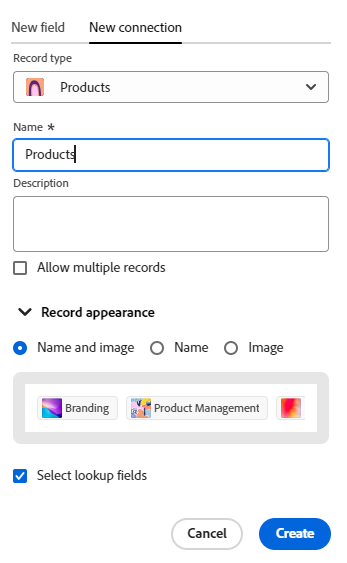

# 레코드 유형 연결

이 페이지에서 강조 표시된 정보는 아직 일반적으로 사용할 수 없는 기능을 참조합니다. 모든 고객을 위한 미리보기 환경에서만 사용할 수 있습니다. 월별 프로덕션 릴리스 이후 빠른 릴리스를 활성화한 고객을 위해 프로덕션 환경에서도 동일한 기능을 사용할 수 있습니다. 

빠른 릴리스에 대한 자세한 내용은 [조직의 빠른 릴리스 사용 또는 사용 안 함](/help/quicksilver/administration-and-setup/set-up-workfront/configure-system-defaults/enable-fast-release-process.md)을 참조하세요. 

{{planning-important-intro}}

<!--
You can use Adobe Workfront Planning to design fully-customizable workspaces that contain record types needed in your organization. A way to indicate how individual record types relate to one another is to connect them. Also, you can connect Workfront Planning record types with object types from other applications to enhance your users' experience and keep their focus in one application. -->

레코드 유형을 서로 연결하거나 다른 응용 프로그램의 개체 유형과 레코드 유형을 연결할 수 있습니다.

서로 영향을 주는 여러 유형의 작업 오브젝트가 있는 경우 레코드 유형 연결이 유용합니다. 예를 들어, 캠페인으로 작업하고 각 캠페인은 여러 브랜드를 지원할 수 있습니다. 이 관계를 나타내기 위해 캠페인을 브랜드에 연결할 수 있습니다. 또한 각 캠페인에 대한 작업은 Workfront의 여러 프로젝트에서 계획할 수 있습니다. 이를 나타내기 위해 캠페인을 관련 프로젝트에 연결할 수 있습니다. 레코드 유형을 연결한 다음 개별 레코드를 연결하면 Workfront Planning에서 이 관계를 달성합니다.

이 문서에서는 두 개의 Workfront Planning 레코드 유형 또는 Workfront Planning 레코드 유형을 다른 응용 프로그램의 객체와 연결하는 방법에 대해 설명합니다.

레코드나 개체 유형 간에 연결을 설정한 후 개별 레코드를 서로 연결하고 Workfront Planning 레코드에 연결된 레코드나 개체 유형의 필드를 표시할 수 있습니다.

연결 유형에 대한 일반적인 정보는 [연결된 레코드 유형 개요](/help/quicksilver/planning/architecture/connect-record-types-overview.md)를 참조하십시오.

다른 응용 프로그램의 개체를 사용하여 레코드나 레코드를 연결하는 방법에 대한 자세한 내용은 [레코드 연결](/help/quicksilver/planning/records/connect-records.md)을 참조하십시오.

레코드 종류 및 레코드에 연결하는 예제는 [레코드 종류 및 레코드에 연결하는 예제](/help/quicksilver/planning/architecture/example-connect-record-types-and-records.md)를 참조하십시오.

<!--ensure this last linked article is right; the title and the link should have changed-->

## 액세스 요구 사항

+++ 를 확장하여 액세스 요구 사항을 확인합니다. 

<table style="table-layout:auto"> 
<col> 
</col> 
<col> 
</col> 
<tbody> 
    <tr> 
<tr> 
<td> 
   
 제품
 </td> 
   <td> 
   <ul><li>
 Adobe Workfront
</li> 
   <li>
 Adobe Workfront 계획
</li>
   <li>
 Adobe Experience Manager Assets, AEM 에셋을 Planning 레코드 유형과 연결하려는 경우

   
Adobe Experience Manager Assets 라이선스가 있어야 하며 AEM Assets과 Workfront 간의 통합이 있어야 합니다.
    자세한 내용은 <a href="/help/quicksilver/documents/adobe-workfront-for-experience-manager-assets-essentials/workfront-for-aem-asset-essentials.md">Experience Manager Assets 및 Assets Essentials용 Adobe Workfront: 기사 색인</a>을 참조하십시오. 

   </li>
   </ul></td> 
  </tr>   
<tr> 
   <td role="rowheader">
Adobe Workfront 플랜*
</td> 
   <td> 

다음 Workfront 플랜 중 하나:
 
<ul><li>선택</li> 
<li>Prime</li> 
<li>Ultimate</li></ul> 

Workfront Planning은 기존 Workfront 플랜에 사용할 수 없습니다.
 
   </td> 
<tr> 
   <td role="rowheader">
Adobe Workfront 계획 패키지*
</td> 
   <td> 

임의 
 

각 Workfront Planning 계획에 포함된 사항에 대한 자세한 내용은 Workfront 계정 관리자에게 문의하십시오. 
 
   </td> 
 <tr> 
   <td role="rowheader">
Adobe Workfront 플랫폼
</td> 
   <td> 

Workfront Planning에 액세스하려면 조직의 Workfront 인스턴스가 Adobe 통합 경험에 온보딩되어야 합니다.
 

자세한 내용은 <a href="/help/quicksilver/workfront-basics/navigate-workfront/workfront-navigation/adobe-unified-experience.md">Workfront용 Adobe 통합 환경</a>을 참조하십시오. 
 
   </td> 
   </tr> 
  </tr> 
  <tr> 
   <td role="rowheader">
Adobe Workfront 라이센스*
</td> 
   <td> 
표준
 
   
기존 Workfront 라이선스에는 Workfront Planning을 사용할 수 없습니다.
 
  </td> 
  </tr> 
  <tr> 
   <td role="rowheader">
액세스 수준 구성
</td> 
   <td> 
Adobe Workfront Planning에 대한 액세스 수준 제어가 없습니다.
   
</td> 
  </tr> 
<tr> 
   <td role="rowheader">
개체 권한
</td> 
   <td>   
작업 영역</a>에 대한 권한 관리 
  
   
시스템 관리자에게는 작성하지 않은 작업 영역을 포함하여 모든 작업 영역에 대한 권한이 있습니다.
</td> 
  </tr>

</tbody> 
</table>

*Workfront 액세스 요구 사항에 대한 자세한 내용은 Workfront 설명서의 [액세스 요구 사항](/help/quicksilver/administration-and-setup/add-users/access-levels-and-object-permissions/access-level-requirements-in-documentation.md)을 참조하십시오.

+++

## 레코드 유형 연결

<!--when changes here, also update the article for "Connect records"-->

{{step1-to-planning}}

1. 연결할 레코드 유형이 있는 작업 영역을 클릭합니다.

   또는

   작업 영역에서 기존 작업 영역 이름의 오른쪽에 있는 아래쪽 방향 화살표를 확장하고 작업 영역을 검색한 다음 목록에 표시될 때 선택합니다.
1. 레코드 유형의 카드를 클릭하여 레코드 유형 페이지를 엽니다.
1. 테이블 보기의 오른쪽 위 모서리에 있는 **+** 아이콘을 클릭한 다음 **새 연결** 탭을 클릭합니다.

   

1. **레코드 종류** 필드에서 레코드 종류를 검색하거나 다음 중 하나를 선택하십시오.

   * 현재 작업 공간의 다른 레코드 유형

     

     >[!TIP]
     >
     > 
     >선택한 작업 영역에 다른 레코드 유형이 없는 경우 작업 영역 섹션이 표시되지 않습니다.

   * 다른 작업 영역에서 연결하도록 구성된 다른 작업 영역의 레코드 유형입니다.

     >[!TIP]
     >
     >다른 작업 영역에서 레코드 형식에 액세스할 수 있도록 하려면 **레코드 형식 편집** 상자의 **고급 설정** 탭에 있는 레코드 형식에 대해 **다른 작업 영역에서 이 레코드 형식에 연결 허용** 설정을 사용해야 합니다. 다른 작업공간에서 연결하도록 구성된 레코드 유형이 없는 경우 작업공간 섹션이 표시되지 않습니다.
     > 

     자세한 내용은 [레코드 종류 편집](/help/quicksilver/planning/architecture/edit-record-types.md)을 참조하세요.

     

   * **Workfront 개체 유형** 섹션의 **프로젝트, Portfolio, 프로그램, 회사** 또는 **그룹**.

     

   * **Experience Manager Assets 응용 프로그램** 섹션의 **Adobe**.

     

     선택한 레코드 또는 개체 유형에 대한 새 연결 탭이 열립니다.

1. **이름** 필드가 원래 레코드 형식의 테이블 보기나 레코드 페이지에 나타나므로 연결된 새 필드의 이름으로 업데이트하십시오. 이렇게 하면 원본 레코드 종류의 표 보기에서 연결된 레코드 열(또는 필드)이 만들어집니다. 기본적으로 필드의 이름은 연결하는 레코드 또는 개체의 이름입니다.

   >[!TIP]
   >
   >동일한 레코드나 개체 유형에 여러 연결을 가질 수 있습니다. 연결된 필드 이름을 편집하지 않으면 Workfront은 연결된 레코드 이름 뒤에 숫자를 추가하여 동일한 이름으로 연결된 레코드 유형의 수를 나타냅니다.

1. 연결된 레코드 필드에 대한 정보를 추가하여 **설명** 필드를 업데이트합니다. 필드의 설명은 테이블에서 필드의 열 위로 마우스를 가져가면 표시됩니다.
1. (조건부) 다른 두 작업 영역의 레코드 종류 또는 레코드와 Adobe Experience Manager 자산 개체를 연결할 때 **여러 레코드 허용**&#x200B;을 선택합니다. 이 옵션을 선택하면 원본 레코드에 연결된 레코드 유형 필드가 표시될 때 사용자가 여러 레코드를 추가할 수 있음을 나타냅니다. 이 옵션은 기본적으로 선택되어 있습니다.

   

1. (조건부) 동일한 작업 공간의 레코드 유형 또는 Planning 레코드 유형과 Workfront 객체 유형을 연결하는 경우 사용 중인 환경에 따라 다음 중 하나를 수행합니다.

   * 프로덕션 환경에서 다음 **연결 유형** 옵션 중 하나를 선택하여 사용자가 연결할 수 있는 레코드 수를 나타냅니다.

      * 다대다
      * 일대다
      * 다대일
      * 일대일

     

   

   * 미리보기 환경에서 다음을 수행합니다.
      1. 다음 중 하나를 선택합니다.

         * **다중 선택**: 현재 레코드 종류의 한 레코드를 연결 레코드 종류의 여러 레코드와 연결할 수 있도록 하려면 이 옵션을 선택하십시오.
         * **단일 선택**: 현재 레코드 종류의 레코드 한 개를 연결 레코드 종류의 레코드 한 개와 연결할 수 있도록 하려면 이 옵션을 선택하십시오.

      2. **연결된 레코드 형식에 해당 필드 만들기**&#x200B;를 사용하도록 설정합니다. 활성화하면 현재 레코드 유형에 추가된 연결 필드 외에 연결된 레코드 유형에도 연결 필드가 만들어집니다. 이 기능은 기본적으로 비활성화되어 있습니다.

         >[!TIP]
         >
         >하나의 레코드 종류에는 500개의 연결 제한이 있습니다. 특히 분류학적 레코드 유형의 경우 이 제한에 도달하지 않도록 이 설정을 해제하는 것이 좋습니다.

      3. (조건부) **연결된 레코드 종류에 해당 필드 만들기**&#x200B;를 사용하도록 설정한 경우 사용자가 연결할 수 있는 레코드 수를 나타내려면 다음 옵션 중에서 선택하십시오.

         * 다대다
         * 일대다
         * 다대일
         * 일대일

     

     연결 유형에 대한 자세한 내용은 [연결된 레코드 유형 개요](/help/quicksilver/planning/architecture/connect-record-types-overview.md)를 참조하십시오.

     >[!NOTE]
     >
     >연결 유형에 대해 일대다 또는 일대일을 선택한 다음 다른 곳에 이미 연결되어 있는 레코드나 개체를 나중에 연결하려는 경우 해당 레코드나 개체를 다시 연결하면 원래 연결에서 제거된다는 경고가 표시됩니다. 제거를 허용하거나 다른 레코드를 선택할 수 있습니다.

1. (조건부 및 선택 사항) Workfront 개체에 연결하도록 선택하면 **이러한 기준과 일치하는 개체만 연결** 섹션에서 **사용자 지정 양식**&#x200B;을 선택합니다. 선택한 사용자 정의 양식이 첨부된 객체만 선택한 레코드 유형에 연결할 수 있습니다. 두 개 이상의 양식을 선택할 수 있습니다.

   >[!NOTE]
   >
   > 이 목록에 표시되기 전에 선택한 개체에 대해 Workfront에서 사용자 정의 양식을 만들어야 합니다.

1. (조건부) Experience Manager Assets에 연결하도록 선택하면 **다음 저장소에서 에셋 연결** 섹션의 **Experience Manager 저장소** 드롭다운 메뉴에서 저장소를 선택합니다. 필수 필드입니다. Experience Manager Assets에서 액세스할 수 있는 저장소만 이 필드에 표시됩니다.

   >[!NOTE]
   >
   >Workfront 관리자는 Workfront의 메타데이터 매핑을 통해 Workfront Planning 필드를 Experience Manager Assets 필드에 매핑할 수 있습니다. 자세한 내용은 [Adobe Workfront과 Experience Manager Assets 간의 에셋 메타데이터 매핑 구성](https://experienceleague.adobe.com/en/docs/experience-manager-cloud-service/content/assets/integrations/configure-asset-metadata-mapping)을 참조하십시오.

1. (조건부) Experience Manager Assets 또는 Workfront Planning 레코드 유형에 연결하도록 선택한 경우 **레코드 모양** 영역에서 다음 옵션 중 하나를 선택합니다.

   * **이름 및 이미지**: 연결된 레코드의 이름과 축소판 그림 또는 아이콘이 모두 연결된 레코드 필드에 표시됩니다. 기본 옵션입니다.
   * **이름**: 연결된 레코드의 이름만 연결된 레코드 필드에 표시됩니다.
   * **이미지**: 연결된 레코드의 축소판이나 아이콘만 연결된 레코드 필드에 표시됩니다.

   썸네일 이미지가 없는 레코드에는 레코드 유형 아이콘이 대신 표시됩니다. 연결된 레코드가 표시되는 방법의 예는 **레코드 모양** 영역에 표시됩니다.

   >[!NOTE]
   >
   >* 여러 레코드를 연결할 수 있도록 허용하는 경우 축소판만 표시하면 레코드 보기와 같이 더 작은 영역에 공간이 절약될 수 있습니다.
   >
   >* 레코드의 이름은 레코드의 기본 필드입니다. 자세한 내용은 [기본 필드 개요](/help/quicksilver/planning/fields/primary-field-overview.md)를 참조하세요.
   >
   >* Workfront 개체 유형을 선택할 때는 레코드 모양을 선택할 수 없습니다.
   >
   >* 레코드 표시 영역에서 선택하는 내용은 모든 보기 및 세부 정보 페이지를 포함하여 시스템의 모든 위치에서 연결에 레코드가 표시되는 방식을 결정합니다.

1. 연결 중인 레코드 형식에서 필드를 추가하려면 **조회 필드 선택**&#x200B;을 선택하십시오. 조회 필드는 연결 중인 레코드 또는 개체 유형과 관련된 필드입니다. 이 레코드들을 연결하면 연결하려는 레코드의 레코드나 개체에 있는 정보가 표시됩니다. 이 옵션은 기본적으로 선택되어 있습니다.

   >[!TIP]
   >
   >* Workfront 자동 완성 필드(프로젝트 소유자 또는 프로젝트 스폰서와 같은 필드 포함)를 조회 필드로 추가할 수 없습니다.
   >
   >* Workfront 개체의 날짜 필드 정보는 Workfront에 표시되는 방식에 관계없이 Workfront Planning에서 24시간 형식으로 표시됩니다.
   >
   >   예를 들어 프로젝트의 계획된 시작 일자가 Workfront에서 오후 3:00(으)로 표시되는 경우 가져온 조회 필드에서는 Workfront Planning에서 15:00(으)로 표시됩니다.

1. Click **Create**.

1. (조건부) **조회 필드 선택** 설정을 선택한 경우 **조회 필드 추가** 상자가 열립니다.

   **+** 아이콘을 클릭하여 **선택하지 않은 필드** 영역에서 필드를 추가합니다.

   또는

   **선택한 필드** 영역에서 필드를 제거하려면 **-** 아이콘을 클릭하십시오.

   

   레코드나 개체를 연결하면 연결된 필드의 값이 자동으로 채워집니다.

   >[!IMPORTANT]
   >
   >    작업 영역에 대한 보기 이상의 권한이 있는 모든 사용자는 연결된 객체 유형의 응용 프로그램에서 자신의 권한 또는 액세스 수준에 관계없이 연결된 필드에서 정보를 볼 수 있습니다.

1. (선택 사항) 연결된 레코드 또는 개체 형식에서 필드 추가를 건너뛰려면 **건너뛰기**&#x200B;를 클릭합니다. 연결된 레코드의 이름 또는 기본 필드는 사용자가 연결하는 레코드 유형의 테이블 보기에 표시되는 유일한 필드입니다.

1. 추가하는 조회 필드에 대한 집계자를 선택합니다.

   >[!NOTE]
   >
   >다음 필드 유형에 대해 집계자를 추가할 수 없습니다.
   >
   >    * 단락
   >    * 확인란

   사용자가 연결된 레코드 필드에서 둘 이상의 연결된 레코드를 선택하면 연결된 필드의 값이 선택한 집계기에 따라 쉼표로 구분되거나 요약된 값으로 표시됩니다.

   조회 필드에 요약되지 않은 값이 여러 개 있는 경우 보기에서 정렬 또는 그룹화에 필드를 사용할 때 다음 사항을 고려하십시오.

   * 정렬은 첫 번째 값으로 수행됩니다

   * 레코드는 필드 값의 고유한 조합별로 그룹화됩니다

   * 타임라인 보기는 연결된 레코드 종류의 첫 번째 날짜 값을 기반으로 작성되며, 보기에 표시됩니다

   >[!IMPORTANT]
   >
   > 조회 날짜 필드를 추가할 때 타임라인 및 달력 보기의 시작 및 종료 날짜로 필드를 추가할 수 있게 하려면 집계 값을 선택해야 합니다. 예를 들어 조회 날짜 필드에 대한 MAX 또는 최소 집계를 선택할 수 있습니다.

   연결된 숫자 필드에 대한 

   >[!NOTE]
   >
   > 기록 유형을 Experience Manager Assets에 연결할 때 집계자를 사용할 수 없습니다.

   다음 중에서 선택합니다.

   * **없음**: 여러 레코드에서 쉼표로 구분된 값을 표시합니다. 이것이 기본 선택입니다.
   * **MAX**: 연결된 레코드 필드에서 선택한 여러 레코드에서 나온 모든 값 중 가장 높은 값을 표시합니다.
   * **MIN**: 연결된 레코드 필드에서 선택한 여러 레코드에서 가져온 모든 값의 가장 낮은 값을 표시합니다.
   * **SUM**: 연결된 레코드 필드에서 선택한 여러 레코드에서 얻은 모든 값의 합계를 표시합니다.
   * **AVG**: 연결된 레코드 필드에서 선택한 여러 레코드에서 얻은 모든 값의 평균을 표시합니다.
   * **UNIQUE**: 조회 필드 값에서 중복을 제거하고 고유 값만 표시합니다. 다음 필드 유형에는 사용할 수 없습니다.
      * 단락
      * 확인란
      * 사람

   >[!NOTE]
   >
   >예를 들어 캠페인 레코드(원본 레코드)에서 제품 레코드(연결된 레코드)를 연결하고 이름을 &quot;제품 필드&quot;로 지정할 수 있습니다. 캠페인 레코드에서 제품 레코드의 예산 필드를 연결하고 &quot;제품 예산&quot;이라고 할 수도 있습니다. &quot;제품 필드&quot;에서 여러 레코드를 선택할 수 있는 경우, 예산이 $100,000인 제품 1과 예산이 $110,000인 제품 2, 예산이 $100,000인 제품 3을 선택할 수 있습니다. 선택한 집계에 따라 최초 레코드의 연결된 필드에서 다음 예산 정보를 볼 수 있습니다.
   >
   >* **없음**: $100,000, $110,000, $100,000
   >* **MAX**: $110,000
   >* **분**: $100,000
   >* **합계**: $310,000
   >* **평균**: $103,000.33
   >* **고유**: $100,000
   >

1. (선택 사항) 필드를 검색하려면 **search** 아이콘 을(를) 사용하십시오.

1. 변경 내용을 저장하려면 **필드 추가**&#x200B;를 클릭하세요.

   다음 항목이 추가됩니다.

   * 연결하는 레코드 유형의 연결된 레코드 필드. 연결된 레코드 필드는 수동으로 추가한 후 연결된 레코드 유형의 개별 레코드를 표시합니다. 레코드 추가에 대한 자세한 내용은 [레코드 연결](/help/quicksilver/planning/records/connect-records.md)을 참조하세요. 연결된 레코드 필드의 이름은 6단계에서 선택한 이름입니다. <!--accurate-->

   * 연결된 레코드 필드에 레코드나 개체를 수동으로 추가한 후 연결된 레코드나 개체 유형에 대한 정보를 표시하는 연결된(또는 조회) 필드(또는 필드)입니다. 연결을 만들 때 **조회 필드 선택** 설정을 선택한 경우에만 조회 필드가 만들어집니다. 조회 필드는 다음 패턴에 따라 자동으로 이름이 지정됩니다.

     `<Name of the original field on the linked record> (from <Name of your linked field>)`

     예를 들어 캠페인 레코드 유형을 프로그램 레코드 유형과 연결하고 프로그램 연결 레코드 필드의 이름을 &quot;프로그램 정보&quot;로 지정한 다음, Campaign의 테이블 보기에서 프로그램 예산 필드도 표시하도록 선택한 경우, 연결된 필드의 이름이 캠페인의 테이블 보기에서 자동으로 `Budget (from Program information)`(으)로 지정됩니다.

   * 레코드 종류를 서로 연결하면 연결된 레코드 종류에도 연결된 레코드 필드가 추가됩니다. <!--only when you enable the Create corresponding field on linked record type setting.--> 연결된 레코드 종류의 연결된 레코드 필드 이름이 연결된 레코드 종류의 이름입니다.

     예를 들어 &quot;캠페인&quot; 레코드 유형에서 &quot;제품&quot; 레코드 유형을 연결하고 캠페인의 연결된 필드를 &quot;연결된 제품&quot;으로 지정한 경우 제품 레코드 유형에 대해 &quot;캠페인&quot; 연결된 레코드 필드가 만들어집니다.

     >[!TIP]
     >
     > 다른 응용 프로그램에서 연결하려는 레코드 유형으로 연결되는 객체에 대해 연결된 레코드 필드가 만들어지지 않습니다. Workfront Planning <!--We recommend not creating links on taxonomical record types, as there is a 500 connection field limit for every record type.-->

   <!--see the span preview text in the TIP above; it might not show up in green-->

1. (선택 사항 및 조건부) 원래 레코드 유형 또는 연결된 레코드 유형 테이블 보기에서 연결된 레코드 필드의 머리글에 있는 아래쪽 방향 화살표를 클릭한 다음 다음 중 하나를 클릭합니다.

   * **필드 편집**: 필드의 **이름** 및 **설명** 정보를 업데이트합니다.
   * **조회 필드 편집**: 연결된 레코드의 필드를 추가하거나 제거합니다.

   

   조회 필드를 추가하거나 제거하려면 위의 16-17단계에 있는 지침을 따르십시오. <!--ensure these step numbers stay accurate-->

   >[!NOTE]
   >
   > 다른 응용 프로그램에서 개체 유형으로 연결하는 레코드 유형에 속하는 조회 필드는 추가할 수 없습니다.
   >
   > 예를 들어 캠페인에서 연결 중인 Workfront 프로젝트에는 &quot;캠페인 상태&quot;의 조회 필드를 추가할 수 없습니다.

1. (선택 사항) 연결된 레코드 필드의 머리글 또는 연결 중인 레코드 종류의 조회 필드 머리글에서 아래쪽을 가리키는 화살표를 클릭한 다음 **삭제**&#x200B;를 클릭합니다.

   레코드 필드 또는 조회 필드가 삭제됩니다. 레코드 필드를 삭제하면 연결된 레코드와 연결된 모든 조회 필드도 삭제됩니다.
