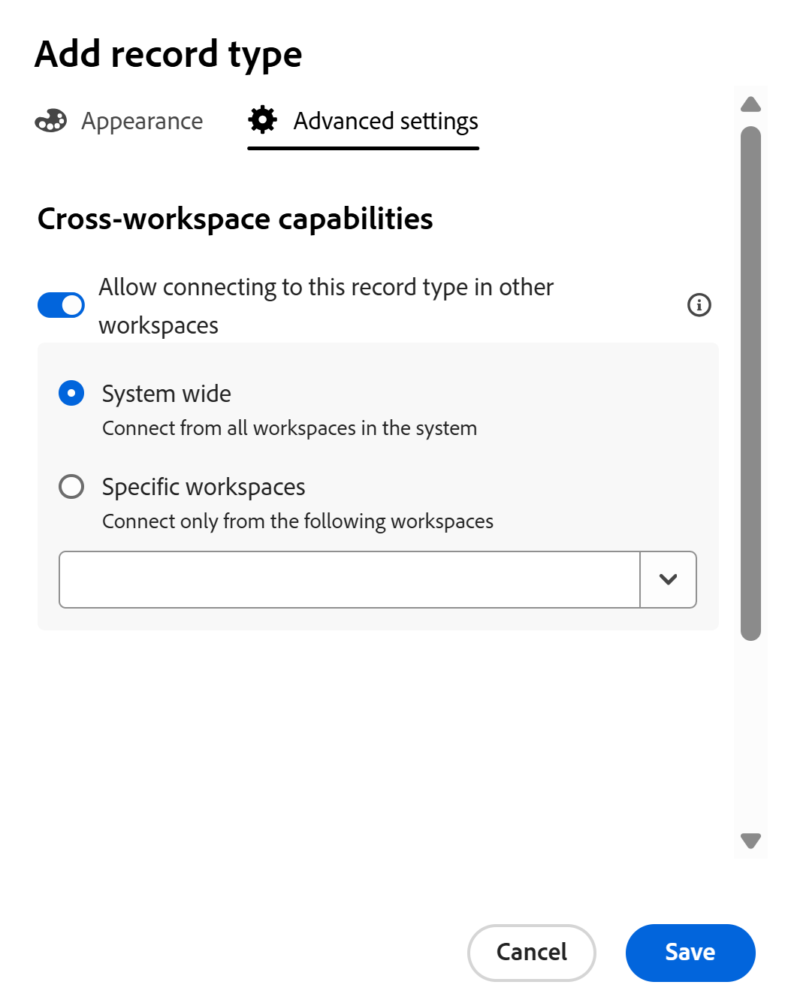

<!--this is linked to the UI in an empty workspace screen-->

# 레코드 유형 만들기

이 페이지의 정보는 아직 일반적으로 사용할 수 없는 기능을 참조합니다. 모든 고객을 위한 미리보기 환경에서만 사용할 수 있습니다. 월별 프로덕션 릴리스 이후 빠른 릴리스를 활성화한 고객을 위해 프로덕션 환경에서도 동일한 기능을 사용할 수 있습니다. 

빠른 릴리스에 대한 자세한 내용은 [조직의 빠른 릴리스 사용 또는 사용 안 함](/help/quicksilver/administration-and-setup/set-up-workfront/configure-system-defaults/enable-fast-release-process.md)을 참조하세요. 

{{planning-important-intro}}

레코드 유형은 Adobe Workfront Planning의 객체 유형입니다. Workfront Planning에서 조직의 라이프사이클에 필요한 작업 관련 항목을 설명하는 사용자 정의 레코드 유형을 생성할 수 있습니다.

레코드 형식에 대한 자세한 내용은 [레코드 형식 개요](/help/quicksilver/planning/architecture/overview-of-record-types.md)를 참조하십시오.

## 액세스 요구 사항

+++ 를 확장하여 액세스 요구 사항을 확인합니다.

이 문서의 단계를 수행하려면 다음 액세스 권한이 있어야 합니다.

<table style="table-layout:auto"> 
<col> 
</col> 
<col> 
</col> 
<tbody> 
    <tr> 
<tr> 
<td> 
   
 제품
 </td> 
   <td> 
   <ul><li>
 Adobe Workfront
</li> 
   <li>
 Adobe Workfront 계획
</li></ul></td> 
  </tr>   
<tr> 
   <td role="rowheader">
Adobe Workfront 플랜*
</td> 
   <td> 

다음 Workfront 플랜 중 하나:
 
<ul><li>선택</li> 
<li>Prime</li> 
<li>Ultimate</li></ul> 

Workfront Planning은 기존 Workfront 플랜에 사용할 수 없습니다.
 
   </td> 
<tr> 
   <td role="rowheader">
Adobe Workfront 계획 패키지*
</td> 
   <td> 

임의 
 

각 Workfront Planning 계획에 포함된 사항에 대한 자세한 내용은 Workfront 계정 관리자에게 문의하십시오. 
 
   </td> 
 <tr> 
   <td role="rowheader">
Adobe Workfront 플랫폼
</td> 
   <td> 

Workfront Planning의 모든 기능에 액세스할 수 있으려면 조직의 Workfront 인스턴스가 Adobe 통합 경험에 온보딩되어야 합니다.
 

자세한 내용은 <a href="/help/quicksilver/workfront-basics/navigate-workfront/workfront-navigation/adobe-unified-experience.md">Workfront용 Adobe 통합 환경</a>을 참조하십시오. 
 
   </td> 
   </tr> 
  </tr> 
  <tr> 
   <td role="rowheader">
Adobe Workfront 라이센스*
</td> 
   <td>
 표준

   
기존 Workfront 라이선스에는 Workfront Planning을 사용할 수 없습니다.
 
  </td> 
  </tr> 
  <tr> 
   <td role="rowheader">
액세스 수준 구성
</td> 
   <td> 
Adobe Workfront Planning에 대한 액세스 수준 제어가 없습니다.
   
</td> 
  </tr> 
<tr> 
   <td role="rowheader">
개체 권한
</td> 
   <td>   
작업 영역</a>에 대한 권한 관리 
  
   
시스템 관리자는 만들지 않은 작업 영역을 포함하여 모든 작업 영역에 대한 권한을 가집니다
  </td> 
  </tr> 
<tr> 
   <td role="rowheader">
레이아웃 템플릿
</td> 
   <td> 
프로덕션 환경에서는 시스템 관리자를 포함한 모든 사용자를 Planning이 포함된 레이아웃 템플릿에 할당해야 합니다.

미리보기 환경에서 표준 사용자 및 시스템 관리자는 기본적으로 Planning을 활성화합니다.
 </td> 
  </tr> 
</tbody> 
</table>

*Workfront 액세스 요구 사항에 대한 자세한 내용은 Workfront 설명서의 [액세스 요구 사항](/help/quicksilver/administration-and-setup/add-users/access-levels-and-object-permissions/access-level-requirements-in-documentation.md)을 참조하십시오.

+++

## 레코드 유형 만들기에 대한 고려 사항

* 다음과 같은 방법으로 작업 영역에서 레코드 유형을 만들 수 있습니다.

   * 자동:
      * 템플릿을 사용하여 작업 공간을 만드는 경우.

        자세한 내용은 [작업 영역 만들기](/help/quicksilver/planning/architecture/create-workspaces.md)를 참조하십시오.

      * CSV 또는 Excel 파일을 사용하여 가져올 때.

     >[!TIP]
     >
     >CSV 또는 Excel 파일에서 레코드 유형을 가져올 때 레코드와 필드도 가져올 수 있습니다.

   * 수동:

      * 처음부터.

        이 문서에서는 처음부터 레코드 유형을 만드는 방법을 설명합니다.

* 한 섹션 내에서 또는 작업 영역의 한 섹션에서 다른 섹션으로 레코드 유형을 이동할 수 있습니다. 한 작업 영역에서 다른 작업 영역으로 레코드 유형을 이동할 수 없습니다.

## 작업 공간 템플릿을 사용하여 레코드 유형 만들기

Workfront Planning 템플릿을 사용하여 작업 공간을 만들 때 레코드 유형을 자동으로 만들 수 있습니다. 각 템플릿에는 샘플 레코드 유형이 포함되어 있습니다.

템플릿에서 작업 공간을 만들 때 레코드 유형은 다음 섹션으로 그룹화됩니다.

* 운영 레코드 유형
* 분류

운영 레코드 유형 및 분류 섹션에서 레코드 유형을 수동으로 추가할 수 있습니다.

작업 영역 만들기에 대한 자세한 내용은 [작업 영역 만들기](/help/quicksilver/planning/architecture/create-workspaces.md)를 참조하십시오.

각 템플릿에 포함된 레코드 종류에 대한 자세한 내용은 [작업 영역 템플릿 목록](/help/quicksilver/planning/architecture/workspace-templates.md)을 참조하세요.

## 처음부터 레코드 유형 만들기

{{step1-to-planning}}

1. 레코드 유형을 만들 작업 영역을 클릭합니다.

   또는

   작업 영역에서 기존 작업 영역 이름의 오른쪽에 있는 아래쪽 방향 화살표를 확장하고 작업 영역을 검색한 다음 목록에 표시될 때 선택합니다.
1. (선택 사항) 작업 영역에 새 섹션을 추가하려면 **섹션 추가**&#x200B;를 클릭합니다.
1. **레코드 종류 추가**&#x200B;를 클릭한 다음 **수동으로 추가**&#x200B;를 클릭합니다.

   레코드 유형 추가 상자가 열립니다.
   <!--1. (Conditional) When creating record types by importing an Excel or CSV file is enabled, click **From scratch**. Otherwise, the **Add record type** box opens. -->

   

1. **모양** 탭에서 다음 정보를 업데이트합니다.

   * &quot;제목 없는 레코드 유형&quot;을 이후 레코드 유형의 이름으로 바꿉니다. <!--did they bring back the field label here and did they rename it to "Name"-->
   * **설명**: 레코드 형식에 대한 정보를 더 추가합니다.
   * 레코드 유형과 연관된 아이콘의 색과 모양을 선택합니다. 다음을 수행합니다.
      * 색상을 선택하여 새 레코드 유형을 식별합니다. 레코드 유형 아이콘의 색상입니다. 기본적으로 회색이 선택되어 있습니다.
      * 목록에서 아이콘을 선택하거나 아이콘 이름을 입력하여 아이콘이 나타내는 내용을 설명한 다음 표시될 때 선택합니다. 레코드 유형의 아이콘입니다. 기본적으로 파일 아이콘이 선택되어 있습니다.

1. (선택 사항 및 조건부) 시스템 관리자인 경우 **고급 설정**&#x200B;을 클릭하고 **연결 범위** 섹션에서 다음 정보를 업데이트하십시오. <!--the info here is duplicated in the Edit record types article-->

   * **다른 작업 영역에서 연결** 설정을 사용하도록 설정합니다. 활성화되면 기록 유형에 액세스하고 다른 작업 공간에서 연결할 수 있습니다.
   * 레코드 종류에 액세스할 수 있는 작업 공간을 선택합니다. 다음 옵션 중에서 선택합니다.

      * **시스템 전체**: 사용자는 관리 권한이 있는 모든 작업 영역에서 이 레코드 형식에 연결할 수 있습니다.
      * **특정 작업 영역**: 작업 영역 관리자가 이 레코드 형식에 연결할 수 있는 작업 영역의 이름을 추가합니다.

   

1. Click **Create**.

   레코드 유형 카드가 선택한 섹션 및 작업 영역에 추가됩니다.
레코드 유형의 설명이 카드에 표시됩니다.

   

1. (선택 사항) 레코드 종류 카드 위에 마우스를 놓고 오른쪽 상단의 **자세히** 아이콘 를 클릭한 다음 **편집**&#x200B;을 클릭하여 레코드 종류에 대한 정보를 수정합니다.
1. (선택 사항) 레코드 유형 카드를 클릭하여 레코드 유형 페이지를 엽니다.

   

   레코드 유형 페이지는 기본적으로 테이블 뷰에 표시됩니다. 표의 열은 새 레코드 종류와 관련된 필드입니다. 각 행은 추가해야 하는 고유한 레코드입니다.

   기본적으로 다음 필드는 작업 레코드 유형의 테이블 보기 열에 표시됩니다.

   * 이름
   * 설명
   * 시작 일자
   * 종료 일자
   * 상태

1. (선택 사항) 페이지 헤더에서 레코드 유형 이름을 업데이트합니다

   또는

   레코드 종류 이름의 오른쪽에 있는 **자세히** 아이콘 를 클릭하고 **편집**&#x200B;을 클릭하여 이름을 바꾸거나 레코드 종류 정보를 변경합니다. 자세한 내용은 [레코드 종류 편집](/help/quicksilver/planning/architecture/edit-record-types.md)을 참조하세요.

1. (선택 사항) **+ 새 레코드**&#x200B;을(를) 클릭하여 선택한 레코드 종류의 레코드를 추가합니다. 자세한 내용은 [레코드 만들기](/help/quicksilver/planning/records/create-records.md)를 참조하세요.
1. (선택 사항) 레코드 종류에 필드를 더 추가하려면 표의 오른쪽 상단에 있는 **+** 아이콘을 클릭합니다.

   필드 만들기에 대한 자세한 내용은 [필드 만들기](/help/quicksilver/planning/fields/create-fields.md)를 참조하십시오.

1. (선택 사항) 헤더에서 레코드 유형 이름의 왼쪽에 있는 왼쪽 화살표를 클릭하여 선택한 작업 영역으로 돌아갑니다.

1. (선택 사항) 작업 공간에서 레코드 유형 카드를 클릭하여 원하는 위치에 레코드 유형을 끌어다 놓거나 다른 섹션으로 이동합니다.

   변경 사항은 자동으로 저장됩니다.

   레코드 추가, 레코드 유형 삭제 또는 편집, 레코드 유형 페이지의 보기 업데이트에 대한 자세한 내용은 다음 문서를 참조하십시오.

   * [레코드 만들기](/help/quicksilver/planning/records/create-records.md)
   * [레코드 유형 삭제](/help/quicksilver/planning/architecture/delete-record-types.md)
   * [레코드 유형 편집](/help/quicksilver/planning/architecture/edit-record-types.md)
   * [레코드 보기 관리](/help/quicksilver/planning/views/manage-record-views.md)

## CSV 또는 Excel 파일에서 정보를 가져와서 레코드 유형 만들기

CSV 또는 Excel 파일에서 정보를 가져올 때 다음을 가져올 수 있습니다.

* 레코드 유형
* 레코드
* 레코드 필드

자세한 내용은 [CSV 또는 Excel 파일에서 정보를 가져와서 레코드 형식 만들기](/help/quicksilver/planning/architecture/import-file-to-create-record-types.md)를 참조하십시오.

