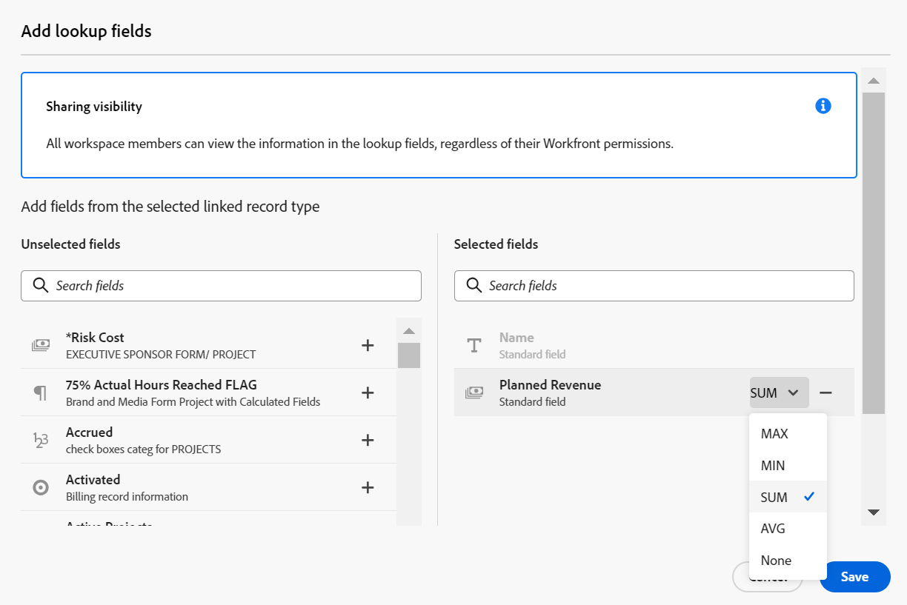

# 레코드 종류 및 레코드 연결의 예

{{planning-important-intro}}

이 문서에서는 다음 내용의 예를 설명합니다.

* 두 Workfront Planning 레코드 유형과 두 레코드 간의 연결을 만드는 방법.

* Workfront Planning 레코드 유형과 Workfront 프로젝트 객체 유형 간의 연결뿐만 아니라 레코드와 프로젝트 간의 연결을 만드는 방법.

자세한 내용은 다음 문서를 참조하십시오.

* [레코드 유형 연결](/help/quicksilver/planning/architecture/connect-record-types.md)
* [기록 연결](/help/quicksilver/planning/records/connect-records.md)

## 두 개의 Workfront Planning 레코드 유형 및 레코드 연결(예)

예를 들어 원래 레코드 유형으로 Campaign이라는 레코드 유형이 있습니다.

Product라는 다른 레코드 유형이 있으며 Budget이라는 통화 필드가 있습니다.

레코드 유형 제품의 예산 필드 값을 표시할 수 있는 Campaign의 레코드 유형에 필드를 만들려고 합니다.

방법은 다음과 같습니다.

1. 작업 영역에서 Campaign 레코드 유형에 대한 표 보기를 엽니다.
1. 테이블 보기의 오른쪽 위 모서리에 있는 **+** 아이콘을 클릭하여 새 필드를 추가한 다음 **새 연결**&#x200B;을 클릭하고 선택한 작업 영역 섹션에서 **제품**&#x200B;을 클릭합니다.
1. 예를 들어 다음 정보를 추가합니다.

   * **레코드 종류**: 제품 <!--did they change the casing here?-->
   * **이름**: 새 필드에 이름을 지정하십시오. 예: &quot;제품 정보&quot; 연결된 레코드 필드의 이름입니다.
   * **설명**: 새 필드에 대한 설명을 추가합니다. 예를 들어 &quot;내 캠페인과 연결하려는 제품입니다.&quot; 열 헤더의 필드 위로 마우스를 가져가면 필드에 대한 설명이 표시됩니다.
   * **연결 유형**: 다음 옵션 중에서 선택하십시오.
      * **많음에서 많음**: 사용자는 하나의 캠페인을 여러 제품에 연결할 수 있으며 하나의 제품을 여러 캠페인에 연결할 수 있습니다.
      * **일대다**: 사용자는 하나의 캠페인을 여러 제품에 연결할 수 있으며 하나의 제품을 하나의 캠페인에 연결할 수 있습니다.
      * **다대일**: 사용자는 하나의 캠페인을 하나의 제품에 연결할 수 있으며 하나의 제품을 여러 캠페인에 연결할 수 있습니다.
      * **일대일**: 사용자는 하나의 캠페인을 하나의 제품에 연결할 수 있으며, 하나의 제품을 하나의 캠페인에 연결할 수 있습니다.

     >[!NOTE]
     >
     >**연결 유형** 옵션은 다른 작업 영역의 레코드를 연결하거나 Experience Manager 자산을 연결할 때 사용할 수 없습니다. 자세한 내용은 [연결된 레코드 종류 개요](/help/quicksilver/planning/architecture/connect-record-types-overview.md)를 참조하세요.

   * **모양 기록**: 다음 옵션 중에서 선택하십시오.
      * **이름 및 이미지**: 연결된 레코드의 이름과 축소판 또는 아이콘을 표시합니다. 이 옵션은 기본적으로 선택되어 있습니다.
      * **이름**: 연결된 레코드의 이름만 표시합니다.
      * **이미지**: 연결된 레코드의 축소판이나 아이콘만 표시합니다.
   * **조회 필드 선택**: 이 옵션을 선택한 상태로 두면 다음에 **조회 필드 추가** 상자가 열려 제품 필드를 캠페인 레코드 유형과 연결할 수 있습니다. **건너뛰기**&#x200B;를 클릭하여 이 단계를 건너뛰고 나중에 제품 필드를 추가할 수 있습니다.

     

1. (조건부) 이전 단계에서 **조회 필드 선택**&#x200B;을 선택한 경우 **제품** 레코드 유형과 연결된 필드 목록에서 **예산** 필드에 대한 **+** 아이콘을 클릭한 다음 **필드 추가**&#x200B;를 클릭합니다. 이렇게 하면 연결된 필드의 이름인 **Budget(제품 정보에서)**&#x200B;이라는 필드가 만들어집니다. 제품 예산에 대한 모든 정보가 캠페인 레코드에 대한 이 필드에 표시됩니다.

   

   >[!TIP]
   >
   >    선택한 모든 제품의 예산을 하나의 총 숫자로 보려면 필드 이름의 오른쪽에 있는 드롭다운 메뉴에서 **SUM**&#x200B;을(를) 선택하십시오. 사용자가 **제품 정보** 연결된 레코드 필드에서 여러 제품을 선택하면 **제품 정보의 예산** 필드에 모든 예산 값이 추가되고 합계가 표시됩니다. <!-- check the shot below - added a bug with a couple of UI changes here-->
   >
   > **SUM** 대신 **없음**&#x200B;을 선택하면 선택한 제품의 개별 예산이 쉼표로 구분되어 표시됩니다.

   이렇게 하면 다음 필드가 생성됩니다.

   * 캠페인 레코드 테이블 보기 및 캠페인의 캠페인 레코드 페이지에서 다음을 수행합니다.

      * **제품 정보**(연결된 레코드 필드): 추가할 때 제품 이름이 표시됩니다.
      * **예산(제품 정보에서)**(연결된 필드): 제품 정보 필드에서 선택한 제품의 예산이 표시됩니다.

   * 제품 레코드 테이블 보기 및 제품의 제품 레코드 페이지에서 다음을 수행합니다.

      * **Campaign**: 제품 레코드 형식이 캠페인 레코드 형식에서 연결되어 있음을 나타냅니다.

     

   >[!TIP]
   >
   >    연결된 레코드 필드 앞에는 관계 아이콘 이(가) 있습니다.

1. **Campaign** 레코드 형식 테이블 보기에서 Campaign 레코드 형식 페이지의 테이블에 새 행을 추가하여 캠페인을 만듭니다.

1. 새 캠페인의 **제품 정보** 열 내부를 두 번 클릭합니다.

   

1. 다음 중 하나를 수행하십시오.

   * 목록에서 연결된 제품 이름을 클릭하여 선택한 레코드에 추가합니다. 제품이 자동으로 추가됩니다.
   * 제품 이름을 입력하고 목록에 표시되면 클릭합니다. 제품이 자동으로 추가됩니다.
   * 모든 제품을 표시하려면 **모두 보기**&#x200B;를 클릭하세요.

1. (조건부) 이전 단계에서 **모두 보기**&#x200B;를 클릭한 경우 **개체 연결** 상자가 표시됩니다.

   

1. 검색 상자에 제품 이름을 입력한 다음 목록에 표시될 때 선택합니다

   또는

   캠페인 레코드와 연결할 제품 레코드를 선택한 다음 **개체 연결**&#x200B;을 클릭합니다.

   >[!TIP]
   >
   >    캠페인의 레코드 페이지를 열고 연결된 레코드 필드를 찾은 다음 필드에서 **+** 아이콘을 클릭하여 연결된 제품 레코드 유형의 제품을 추가할 수 있습니다.

   Campaign 레코드 유형 테이블에는 다음 열이 채워집니다.
   * **제품 정보** 필드가 선택한 제품으로 캠페인 레코드에 대해 채워집니다.
   * **예산(제품 정보에서)** 필드는 선택한 각 제품에 대한 예산 값 또는 선택한 제품의 총 예산으로 채워집니다(집계자에 대해 SUM을 선택한 경우).

   

   >[!TIP]
   >
   >여러 값에 대해 집계자를 선택하지 않으면 선택한 제품의 모든 값이 쉼표로 구분되어 표시됩니다.

1. **Product** 테이블 보기에서 **Campaign** 필드를 채우려면 제품 레코드 유형 테이블 보기부터 캠페인 정보를 선택하여 5-7단계를 반복합니다. 이렇게 하면 Campaign 레코드 유형 페이지의 표에 있는 제품 정보 필드도 업데이트됩니다. <!--ensure the step numbers remain correct-->

## Workfront Planning 레코드 유형을 Workfront 프로젝트 객체 유형과 연결하고 레코드를 개별 프로젝트와 연결합니다

>[!IMPORTANT]
>
>    작업 영역에 대한 보기 이상의 권한이 있는 모든 사용자는 Workfront의 권한 또는 액세스 수준에 관계없이 연결된 필드에서 정보를 볼 수 있습니다.

예를 들어 원래 레코드 유형으로 Campaign이라는 레코드 유형이 있습니다.

또한 Workfront에 &quot;계획된 수익&quot;이라는 필드가 있는 프로젝트가 있습니다.

Workfront Planning의 캠페인에 연결된 Workfront 프로젝트의 계획된 수익 필드 값을 표시할 수 있는 캠페인 레코드 유형에 연결 필드를 만들려고 합니다.

방법은 다음과 같습니다.

1. Campaign 기록 유형을 Workspace 프로젝트와 연결하려는 Workfront으로 이동합니다.
1. 선택한 작업 영역에서 Campaign 레코드 유형에 대한 표 보기를 엽니다.
1. 테이블 보기의 오른쪽 위 모서리에 있는 **+** 아이콘을 클릭하여 새 필드를 추가한 다음 **새 연결**&#x200B;을 클릭하고 **Workfront 개체 유형** 섹션에서 **프로젝트**&#x200B;를 클릭합니다.
1. 예를 들어 다음 정보를 추가합니다.

   * **레코드 종류**: 프로젝트(Workfront 하위 섹션)
   * **이름**: 새 필드에 &quot;프로젝트 정보&quot;와 같은 이름을 지정하십시오.
   * **설명**: 새 필드에 대한 설명을 추가합니다. 예를 들어 &quot;내 캠페인과 연결하려는 프로젝트입니다.&quot; 열 머리글의 필드 이름을 마우스로 가리키면 테이블 보기에 설명이 표시됩니다.
   * **연결 유형**: 다음 옵션 중에서 선택하십시오.
      * **많음에서 많음**: 사용자는 하나의 캠페인을 여러 제품에 연결할 수 있으며 하나의 제품을 여러 캠페인에 연결할 수 있습니다.
      * **일대다**: 사용자는 하나의 캠페인을 여러 제품에 연결할 수 있으며 하나의 제품을 하나의 캠페인에 연결할 수 있습니다.
      * **다대일**: 사용자는 하나의 캠페인을 하나의 제품에 연결할 수 있으며 하나의 제품을 여러 캠페인에 연결할 수 있습니다.
      * **일대일**: 사용자는 하나의 캠페인을 하나의 제품에 연결할 수 있으며, 하나의 제품을 하나의 캠페인에 연결할 수 있습니다.
   * **이 조건에 맞는 개체만 연결**: **사용자 지정 양식** 드롭다운 메뉴에서 사용자 지정 양식을 선택하십시오. 지정된 양식과 연결된 프로젝트만 캠페인에 연결할 수 있습니다. 여러 양식을 선택할 수 있습니다.
   * **조회 필드 선택**: 이 옵션을 선택한 상태로 두면 프로젝트 필드를 Campaign 레코드 유형과 연결할 수 있도록 **조회 필드 추가** 상자가 다음에 열립니다. **건너뛰기**&#x200B;를 클릭하여 이 단계를 건너뛰고 나중에 프로젝트 필드를 추가할 수 있습니다.

   

1. (조건부) 이전 단계에서 **조회 필드 선택**&#x200B;을(를) 선택한 경우 **프로젝트** 개체 유형과 연결된 필드 목록에서 **계획된 수익** 필드에 대한 **+** 아이콘을 클릭한 다음 **필드 추가**&#x200B;를 클릭합니다. 이렇게 하면 연결된 필드의 이름인 **계획된 수익(프로젝트 정보)**&#x200B;이라는 필드가 만들어집니다. 프로젝트 계획 수익 필드의 모든 정보는 캠페인 레코드에 대해 이 필드에 자동으로 표시됩니다.

   >[!TIP]
   >
   >    선택한 모든 프로젝트의 계획된 수익을 하나의 총 횟수로 보려면 필드 이름의 오른쪽에 있는 드롭다운 메뉴에서 **SUM**&#x200B;을(를) 선택하십시오. 사용자가 **프로젝트 정보** 연결된 개체 필드에서 여러 프로젝트를 선택하면 **제품 정보의 계획된 수익** 필드에 모든 값이 추가되고 합계가 표시됩니다. <!-- check the shot below - added a bug with a couple of UI changes here-->
   >
   > **SUM** 대신 **없음**&#x200B;을 선택하면 쉼표로 구분된 개별 계획된 수익이 표시됩니다.

   

   이렇게 하면 다음 필드가 생성됩니다.

   * 캠페인 레코드 테이블 보기 및 캠페인 레코드 페이지에서 다음을 수행합니다.

      * **프로젝트 정보**(연결된 개체 필드): 프로젝트의 이름을 표시합니다.
      * **계획된 수익(프로젝트 정보)**(연결된 필드): 프로젝트 정보 필드에 선택한 프로젝트의 계획된 수익이 표시됩니다.

   >[!TIP]
   >
   >    연결된 개체 필드 앞에는 관계 아이콘 이(가) 있습니다.

1. **Campaign** 레코드 형식 테이블 보기에서 테이블에 새 행을 추가하여 캠페인을 만듭니다.

1. 새 캠페인의 프로젝트 정보** 열 내부를 두 번 클릭합니다.

   

1. 다음 중 하나를 수행하십시오.

   * 목록에서 프로젝트 이름을 클릭하여 선택한 레코드에 추가합니다. 프로젝트가 자동으로 추가됩니다.
   * 프로젝트의 이름을 입력하고 목록에 표시되면 클릭합니다. 프로젝트가 자동으로 추가됩니다.
   * 모든 프로젝트를 표시하려면 **모두 보기**&#x200B;를 클릭하세요.

1. (조건부) 이전 단계에서 **모두 보기**&#x200B;를 클릭한 경우 **개체 연결** 상자가 표시됩니다.

   

1. 검색 상자에 프로젝트 이름을 입력한 다음 목록에 표시될 때 선택합니다

   또는

   Campaign 레코드와 연결할 프로젝트 레코드를 선택한 다음 **개체 연결**&#x200B;을 클릭합니다.

   >[!TIP]
   >
   >    캠페인의 페이지를 열고 연결된 프로젝트 필드를 찾은 다음 필드에서 **+** 아이콘을 클릭하여 연결된 제품 레코드 형식에서 프로젝트를 추가할 수 있습니다.

   이렇게 하면 선택한 작업 영역에 다음 항목이 추가됩니다.

   * Campaign 레코드 유형 테이블에서:
      * **프로젝트 정보** 필드가 선택한 프로젝트로 캠페인 레코드에 대해 채워집니다.
      * **제품 정보에서 계획된 수익** 필드가 선택한 각 제품에 대한 예산 값으로 채워집니다. 읽기 전용 필드입니다.

   

   >[!TIP]
   >
   >여러 값에 대해 집계를 선택하지 않고 객체 연결 필드에서 여러 객체를 선택한 경우 모든 값이 쉼표로 구분되어 표시됩니다.

1. 연결된 레코드 필드에서 프로젝트 이름을 클릭합니다.

   프로젝트에 대해 최소 보기 권한이 있는 경우 Workfront에서 프로젝트가 열립니다.
1. (선택 사항) 권한이 있는 경우 Workfront에서 프로젝트에 대한 정보를 업데이트합니다.

1. (선택 사항) Campaign 테이블 보기에서 **프로젝트 정보** 필드 머리글 위로 마우스를 가져간 다음 아래쪽을 가리키는 화살표를 클릭하고 **조회 필드 편집**&#x200B;을 클릭합니다.
1. **선택하지 않은 필드** 섹션에서 프로젝트의 Workfront Planning 레코드에 추가할 프로젝트 필드에 대한 **+** 아이콘을 클릭합니다.
1. **선택한 필드** 섹션의 Workfront 프로젝트 계획 레코드에서 제거할 프로젝트 필드의 **-** 아이콘을 클릭합니다.
1. **저장**&#x200B;을 클릭합니다.

   연결된 추가 필드가 Campaign 레코드 유형에 추가됩니다.
