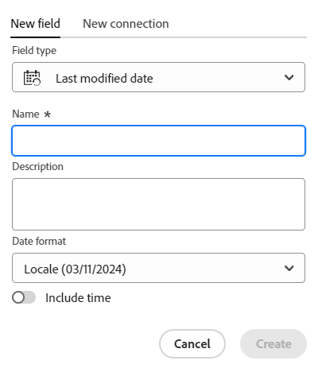

<!--Should the structure of this article be like this other one: https://experienceleague.adobe.com/docs/workfront/using/administration-and-setup/customize/custom-forms/custom-form-builder/use-the-custom-form-builder/add-a-custom-field-to-a-custom-form.html?lang=en ??-->

<!--will they add a way to create fields elsewhere than in a table?! - how will that change the structure of this article? -->

<!--Do we need this for FORMULAS: when we release permissions to RECORDS and we release referring lookup fields in a formula field, update considerations to say that lookup fields from linked records depends on the permissions to the record; if they have no permissions to view a linked record, they won't be able to use that records's lookup fields in a formula - not sure is needed??-->

# 필드 만들기

이 페이지에서 강조 표시된 정보는 아직 일반적으로 사용할 수 없는 기능을 참조합니다. 모든 고객을 위한 미리보기 환경에서만 사용할 수 있습니다. 월별 프로덕션 릴리스 이후 빠른 릴리스를 활성화한 고객을 위해 프로덕션 환경에서도 동일한 기능을 사용할 수 있습니다. 

빠른 릴리스에 대한 자세한 내용은 [조직의 빠른 릴리스 사용 또는 사용 안 함](/help/quicksilver/administration-and-setup/set-up-workfront/configure-system-defaults/enable-fast-release-process.md)을 참조하세요. 

{{planning-important-intro}}

Adobe Workfront Planning에서 레코드 유형에 대한 사용자 정의 필드를 만들 수 있습니다. 그런 다음 필드를 Workfront Planning 레코드와 연결하여 레코드 정보를 개선할 수 있습니다.

레코드 유형과 연결할 필드를 만들려면 먼저 레코드 유형을 만들어야 합니다. 자세한 내용은 [레코드 종류 만들기](/help/quicksilver/planning/architecture/create-record-types.md)를 참조하세요.

Workfront Planning에서 다음과 같은 방법으로 필드를 생성할 수 있습니다.

* 처음부터
* 레코드 유형 연결
* 레코드 유형 만들기
* 템플릿으로 작업 공간 만들기
* Excel 또는 CSV 파일을 사용하여 레코드 형식을 가져와서
* 기존 Workfront 필드의 복사본을 가져와서

Workfront Planning 필드에 대한 자세한 내용은 [필드 개요](/help/quicksilver/planning/fields/fields-overview.md)를 참조하십시오.

## 액세스 요구 사항

+++ 를 확장하여 Workfront Planning에 대한 액세스 요구 사항을 봅니다.

이 문서의 단계를 수행하려면 다음 액세스 권한이 있어야 합니다.

<table style="table-layout:auto"> 
<col> 
</col> 
<col> 
</col> 
<tbody> 
    <tr> 
<tr> 
<td> 
   
 제품
 </td> 
   <td> 
   <ul><li>
 Adobe Workfront
</li> 
   <li>
 Adobe Workfront 계획
</li></ul></td> 
  </tr>   
<tr> 
   <td role="rowheader">
Adobe Workfront 플랜*
</td> 
   <td> 

다음 Workfront 플랜 중 하나:
 
<ul><li>선택</li> 
<li>Prime</li> 
<li>Ultimate</li></ul> 

Workfront Planning은 기존 Workfront 플랜에 사용할 수 없습니다.
 
   </td> 
<tr> 
   <td role="rowheader">
Adobe Workfront 계획 패키지*
</td> 
   <td> 

임의 
 

각 Workfront Planning 계획에 포함된 사항에 대한 자세한 내용은 Workfront 계정 관리자에게 문의하십시오. 
 
   </td> 
 <tr> 
   <td role="rowheader">
Adobe Workfront 플랫폼
</td> 
   <td> 

Workfront Planning의 모든 기능에 액세스할 수 있으려면 조직의 Workfront 인스턴스가 통합 경험 Adobe에 온보딩되어야 합니다.
 

자세한 내용은 <a href="/help/quicksilver/workfront-basics/navigate-workfront/workfront-navigation/adobe-unified-experience.md">Workfront용 통합 경험 Adobe</a>를 참조하십시오. 
 
   </td> 
   </tr> 
  </tr> 
  <tr> 
   <td role="rowheader">
Adobe Workfront 라이센스*
</td> 
   <td>
 표준 

   
기존 Workfront 라이선스에는 Workfront Planning을 사용할 수 없습니다.
 
  </td> 
  </tr> 
  <tr> 
   <td role="rowheader">
액세스 수준 구성
</td> 
   <td> 
Adobe Workfront Planning에 대한 액세스 수준 제어가 없습니다.
   
</td> 
  </tr> 
<tr> 
   <td role="rowheader">
개체 권한
</td> 
   <td>   
작업 영역</a>에 대한 권한 관리 
  
   
시스템 관리자에게는 작성하지 않은 작업 영역을 포함하여 모든 작업 영역에 대한 권한이 있습니다.
 </td> 
  </tr> 
<tr> 
   <td role="rowheader">
레이아웃 템플릿
</td> 
   <td> 
Workfront 관리자를 포함한 모든 사용자에게 메인 메뉴의 계획 영역을 포함하는 레이아웃 템플릿을 할당해야 합니다. 
 </td> 
  </tr> 
</tbody> 
</table>

*Workfront 액세스 요구 사항에 대한 자세한 내용은 Workfront 설명서의 [액세스 요구 사항](/help/quicksilver/administration-and-setup/add-users/access-levels-and-object-permissions/access-level-requirements-in-documentation.md)을 참조하십시오.

+++

<!--
OLD:

<table style="table-layout:auto">
 <col>
 </col>
 <col>
 </col>
 <tbody>
    <tr>
<tr>
<td>
   
 Product
 </td>
   <td>
   
 Adobe Workfront
 </td>
  </tr>  
 <td role="rowheader">
Adobe Workfront agreement
</td>
   <td>

Your organization must be enrolled in the early access stage for Workfront Planning 

   </td>
  </tr>
  <tr>
   <td role="rowheader">
Adobe Workfront plan
</td>
   <td>

Any

   </td>
  </tr>
  <tr>
   <td role="rowheader">
Adobe Workfront license*
</td>
   <td>
   
New: Standard
 
   
Current: Plan

  </td>
  </tr>
  
  <tr>
   <td role="rowheader">
Access level configurations
</td>
   <td> 
There are no access level control for Workfront Planning
  
</td>
  </tr>

  <tr>
   <td role="rowheader">
Permissions
</td>
   <td> 
Manage permissions to a workspace</a> 
  
   
System Administrators have permissions to all workspaces, including the ones they did not create.

</td>
  </tr>
<tr>
   <td role="rowheader">
Layout template
</td>
   <td> 
Your Workfront or group administrator must add the Planning area in your layout template. For information, see <a href="/help/quicksilver/planning/access/access-overview.md">Access overview</a>. 
  
</td>
  </tr>

 </tbody>
</table>

*For information, see [Access requirements in Workfront documentation](/help/quicksilver/administration-and-setup/add-users/access-levels-and-object-permissions/access-level-requirements-in-documentation.md). 

-->

## 처음부터 필드 만들기 {#create-fields-from-scratch}

<!--in a table (not sure if this can be done elsewhere?!-->

<!--the first 3 steps are the same as in Import fields from Workfron-->

{{step1-to-planning}}

1. 필드를 만들 레코드가 있는 작업 영역을 클릭합니다.

   작업공간이 열리고 레코드 유형이 표시됩니다.

1. 기록 유형의 카드를 클릭합니다.

   레코드 유형과 연관된 모든 기존 레코드는 테이블 뷰의 행에 표시됩니다.

   >[!TIP]
   >
   >    레코드가 표시되지 않으면 아직 레코드가 없거나 화면에 표시되는 내용을 제한하는 필터가 적용될 수 있습니다.

   레코드 유형과 연관된 모든 기존 필드가 테이블 뷰의 열에 표시됩니다.

   >[!TIP]
   >
   >    일부 필드가 숨겨져 있을 수 있습니다. 필드를 클릭하고 테이블 보기에서 열로 보려는 필드의 토글을 활성화합니다.

1. 테이블 보기의 오른쪽 위 모서리에 있는 **+** 아이콘을 클릭합니다

   또는

   열 머리글 위로 마우스를 가져간 후 필드 이름 뒤에 있는 아래쪽 화살표를 클릭한 다음 **왼쪽 삽입** 또는 **오른쪽 삽입**&#x200B;을 클릭하여 새 필드를 추가합니다.
1. **새 필드** 탭에서 **필드 형식** 상자에서 필드 형식을 검색하거나 다음 필드 형식 중에서 선택하십시오.

   **새 필드** 탭에서 **필드 형식** 상자 <!--using any related keyword-->에서 필드 형식을 검색하거나 아래 나열된 필드 형식에서 선택하십시오.

   * [한 줄 텍스트](#single-line-text)
   * [단락](#paragraph)
   * [다중 선택](#multi-select)
   * [단일 선택](#single-select)
   * [일자](#date)
   * [숫자](#number)
   * [백분율](#percentage)
   * [통화](#currency)
   * [확인란](#checkbox)
   * [공식](#formula)
   * [사용자](#people)
   * [제작자](#created-by)
   * [제작 일자](#created-date)
   * [마지막 수정자](#last-modified-by)
   * [마지막 수정일](#last-modified-date)

   >[!IMPORTANT]
   >
   >    필드를 저장한 후에는 필드의 필드 유형을 변경할 수 없습니다.

   <!--Add this to the IMPORTANT above and make it a NOTE - should do directly to Prod:
    * You can use any keyword that might be related to any of the field type names. For example, a search for "Budget" will display the Number or Currency field type.-->

1. 아래 섹션에 설명된 대로 각 필드를 계속 추가합니다.

### 한 줄 텍스트 {#single-line-text}

한 줄 텍스트 필드는 제한된 영숫자 정보를 캡처합니다. 예를 들어 소유자, 관련자, 팀 또는 조직 단위 정보를 한 줄 텍스트 필드에 캡처할 수 있습니다. 한 줄 텍스트 필드의 내용은 최대 1,000자까지 사용할 수 있습니다. <!-- used to be 250 but just tested with 1000 and it allowed this as a maximum. -->

1. 이 문서의 [처음부터 필드 만들기](#create-fields-from-scratch) 섹션에 설명된 대로 필드 만들기를 시작한 다음 **한 줄 텍스트** 필드 형식을 선택합니다.

   

1. **새 필드** 탭에 다음 정보를 추가하십시오.
   * **이름**: 테이블 또는 레코드의 세부 정보 페이지에 표시되는 필드 형식의 이름입니다. <!--ensure they updated this; and update the screen shot: it used to be "Label"-->
   * **설명**: 필드에 대한 추가 정보입니다. 필드의 설명은 테이블의 필드 열 머리글을 가리키면 표시되고, 레코드의 세부 정보 페이지에서 필드 이름 옆에 있는 정보 아이콘을 클릭하면 됩니다.
1. Click **Create**.

   새 한 줄 필드가 레코드 유형에 열로 추가되고 해당 값을 레코드와 연결할 수 있습니다.

### 단락 {#paragraph}

단락 필드는 설명 필드와 마찬가지로 레코드에 대한 추가 영숫자 정보를 캡처합니다.

>[!TIP]
>
>* 하나의 레코드 유형에 최대 20개의 단락 필드를 사용할 수 있습니다.
>
>* 단락 필드의 컨텐츠는 최대 10,000자까지 사용할 수 있습니다.
>* 서식 있는 텍스트 서식을 사용하면 단락 필드가 표 보기 또는 레코드의 세부 정보 페이지에 표시될 때 단락 필드의 내용을 향상시킬 수 있습니다. 자세한 내용은 [레코드 편집](/help/quicksilver/planning/records/edit-records.md)을 참조하세요.
>

1. 이 문서의 [처음부터 필드 만들기](#create-fields-from-scratch) 섹션에 설명된 대로 필드 만들기를 시작한 다음 **단락** 필드 형식을 선택합니다.

   

1. **새 필드** 탭에 다음 정보를 추가하십시오.
   * **이름**: 테이블 또는 레코드의 세부 정보 페이지에 표시되는 필드 형식의 이름입니다. <!--ensure they updated this; and update the screen shot: it used to be "Label"-->
   * **설명**: 필드에 대한 추가 정보입니다. 필드의 설명은 테이블의 필드 열을 가리키면 표시되고, 레코드의 세부 정보 페이지에서 필드 이름 옆에 있는 정보 아이콘을 클릭하면 됩니다.
1. Click **Create**.

   새 단락 필드가 레코드 종류에 열로 추가되고 해당 값을 레코드와 연결할 수 있습니다.

### 다중 선택 {#multi-select}

다중 선택 필드를 사용하여 드롭다운 메뉴에서 두 개 이상의 옵션을 선택하여 모든 형식의 추가 정보를 캡처할 수 있습니다.

1. 이 문서의 [처음부터 필드 만들기](#create-fields-from-scratch) 섹션에 설명된 대로 필드 만들기를 시작한 다음 **다중 선택** 필드 형식을 선택합니다.

   

1. **새 필드** 탭에 다음 정보를 추가하십시오.
   * **이름**: 테이블 또는 레코드의 세부 정보 페이지에 표시되는 필드 형식의 이름입니다. <!--ensure they updated this; and update the screen shot: it used to be "Label"-->
   * **설명**: 필드에 대한 추가 정보입니다. 필드의 설명은 테이블의 필드 열을 가리키면 표시되고, 레코드의 세부 정보 페이지에서 필드 이름 옆에 있는 정보 아이콘을 클릭하면 됩니다.
   * **선택 항목**: 이 필드를 업데이트할 때 사용자가 선택할 수 있는 옵션입니다. 각 선택 항목의 이름에 숫자와 문자를 모두 사용할 수 있습니다.
1. 선택 항목을 추가하려면 **선택 항목 추가**&#x200B;를 클릭하십시오. 다중 선택 필드에 추가할 수 있는 선택 항목 수에는 제한이 없습니다.
1. (선택 사항) 원하는 순서로 각 선택 사항을 수동으로 끌어다 놓거나
   선택 항목을 알파벳순으로 자동으로 나열하려면 선택 항목 정렬 A-Z **옵션을 선택합니다. <!--Add this if they added this functionality: You cannot edit this option after you save the field.-->**
1. (선택 사항) 선택 사항을 제거하려면 그 오른쪽에 있는 **x** 아이콘을 클릭합니다.
1. 선택 항목의 왼쪽에 있는 색상 견본을 클릭하여 색상 선택기를 확장하고 각 옵션의 색상을 사용자 지정합니다.
1. Click **Create**.

   새 다중 선택 필드가 레코드 유형에 열로 추가되고 해당 값을 레코드와 연결할 수 있습니다.

### 단일 선택 {#single-select}

필드를 한 번 선택하면 드롭다운 메뉴에서 옵션 하나를 선택하여 원하는 형식으로 추가 정보를 캡처할 수 있습니다.

1. 이 문서의 [처음부터 필드 만들기](#create-fields-from-scratch) 섹션에 설명된 대로 필드 만들기를 시작한 다음 **Single-select** 필드 형식을 선택합니다.

   

1. **새 필드** 탭에 다음 정보를 추가하십시오.
   * **이름**: 테이블 또는 레코드의 세부 정보 페이지에 표시되는 필드 형식의 이름입니다. <!--ensure they updated this; and update the screen shot: it used to be "Label"-->
   * **설명**: 필드에 대한 추가 정보입니다. 필드의 설명은 테이블의 필드 열을 가리키면 표시되고, 레코드의 세부 정보 페이지에서 필드 이름 옆에 있는 정보 아이콘을 클릭하면 됩니다.
   * **선택 항목**: 필드가 저장된 후 드롭다운 메뉴에서 선택할 수 있는 옵션입니다. 각 선택 항목의 이름에 숫자와 문자를 모두 사용할 수 있습니다.

1. 선택 항목을 추가하려면 **선택 항목 추가**&#x200B;를 클릭하십시오. 단일 선택 필드에 추가할 수 있는 선택 항목 수에는 제한이 없습니다.
1. (선택 사항) 각 선택 사항을 원하는 순서로 수동으로 끌어다 놓거나, 선택 사항을 알파벳 순서로 자동으로 나열하려면 **선택 사항 정렬 A-Z** 옵션을 선택합니다. <!--Add this if they added this functionality: You cannot edit this option after you save the field.-->
1. (선택 사항) 선택 사항을 제거하려면 그 오른쪽에 있는 **x** 아이콘을 클릭합니다.
1. 선택 항목의 왼쪽에 있는 색상 견본을 클릭하여 색상 선택기를 확장하고 각 옵션의 색상을 사용자 지정합니다.
1. Click **Create**.

   새 단일 선택 필드가 레코드 유형에 열로 추가되고 해당 값을 레코드와 연결할 수 있습니다.

### 일자 {#date}

날짜 필드를 사용하여 날짜 및 시간 형식으로 추가 정보를 캡처할 수 있습니다.

1. 이 문서의 [처음부터 필드 만들기](#create-fields-from-scratch) 섹션에 설명된 대로 필드 만들기를 시작한 다음 **날짜** 필드 형식을 선택합니다.

   

1. **새 필드** 탭에 다음 정보를 추가하십시오.
   * **이름**: 테이블 또는 레코드 페이지에 표시되는 필드 형식의 이름입니다. <!--ensure they updated this; and update the screen shot: it used to be "Label"-->
   * **설명**: 필드에 대한 추가 정보입니다. 필드의 설명은 테이블의 필드 열을 가리키면 표시되고, 레코드의 세부 정보 페이지에서 필드 이름 옆에 있는 정보 아이콘을 클릭하면 됩니다.
   * **날짜 형식**: 이 필드에 표시할 날짜 형식의 형식입니다. <!--update this casing - submitted bug for it-->

     다음 형식 중에서 선택합니다.
      * **로케일**: 브라우저의 로케일과 일치합니다.
      * **표준**: 2023년 5월 16일
      * **길이**: 2023년 5월 16일
      * **유럽어**: 2023/16/05
      * **ISO**: 2023-05-16
      * **시간 포함**: 타임스탬프를 포함하려면 이 옵션을 선택하십시오. 이 옵션은 기본적으로 선택되지 않습니다. 필드를 보호한 후 시간을 포함할 수 없습니다.

     다음 옵션 중에서 선택합니다.

      * **24시간**: 예: 18:00
      * **12시간**: 예: 오후 6:00

1. Click **Create**.

   새 날짜 필드는 레코드 유형에 열로 추가되고 해당 값은 레코드와 연결될 수 있습니다.

### 숫자 {#number}

숫자 필드 유형은 숫자 형식으로 정보를 캡처합니다.

1. 이 문서의 [처음부터 필드 만들기](#create-fields-from-scratch) 섹션에 설명된 대로 필드 만들기를 시작한 다음 **숫자** 필드 형식을 선택합니다.

   
1. **새 필드** 탭에 다음 정보를 추가하십시오.

   * **이름**: 테이블 또는 레코드 페이지에 표시되는 필드 형식의 이름입니다.
   * **설명**: 필드에 대한 추가 정보입니다. 필드의 설명은 테이블의 필드 열을 가리키면 표시되고, 레코드의 세부 정보 페이지에서 필드 이름 옆에 있는 정보 아이콘을 클릭하면 됩니다.
   * **전체 자릿수**: 필드에 기록할 소수 자릿수입니다. 최대 6개의 소수 자리를 표시할 수 있습니다.
   * **음수 허용**: 이 필드에 음수를 허용하려면 이 옵션을 선택하십시오. 이 옵션은 기본적으로 선택되지 않습니다.

   >[!NOTE]
   >
   >    음수 허용을 선택하고 음수 값이 필드가 첨부된 레코드에 저장되는 경우 향후 설정을 더 이상 선택 해제할 수 없습니다.

1. Click **Create**.

   새 숫자 필드는 레코드 종류에 열로 추가되며 해당 값을 레코드와 연결할 수 있습니다.

### 백분율 {#percentage}

백분율 필드 유형은 숫자 형식 다음에 백분율 기호가 있는 정보를 캡처합니다.

1. 이 문서의 [처음부터 필드 만들기](#create-fields-from-scratch) 섹션에 설명된 대로 필드 만들기를 시작한 다음 **백분율** 필드 형식을 선택합니다. <!--change screen shot for preview-->

   

1. **새 필드** 탭에 다음 정보를 추가하십시오.
   * **이름**: 테이블 또는 레코드 페이지에 표시되는 필드 형식의 이름입니다.
   * **설명**: 필드에 대한 추가 정보입니다. 필드의 설명은 테이블의 필드 열을 가리키면 표시되고, 레코드의 세부 정보 페이지에서 필드 이름 옆에 있는 정보 아이콘을 클릭하면 됩니다.
   * **전체 자릿수**: 필드에 기록할 소수 자릿수입니다. 최대 6개의 소수 자리를 표시할 수 있습니다.
   * **음수 허용**: 이 필드에 음수 백분율 값을 허용하려면 이 옵션을 선택하십시오. 이 옵션은 기본적으로 선택되지 않습니다.

     >[!NOTE]
     >
     >음수 허용을 선택하고 음수 값이 필드가 첨부된 레코드에 저장되는 경우 향후 설정을 더 이상 선택 해제할 수 없습니다.

   

   * **다음으로 표시**: 드롭다운 메뉴에서 백분율 값을 테이블 보기에 표시할 방법을 선택합니다. 다음 옵션 중에서 선택합니다.
      * **숫자**: 백분율 값이 숫자와 백분율 기호로 표시됩니다.
      * **막대**: 백분율 값이 백분율 숫자 옆에 막대로 표시됩니다. 막대의 채우기 색상은 백분율 값을 나타냅니다. 이것이 기본 선택입니다.
      * **원**: 백분율 값이 백분율 숫자 옆에 원의 윤곽선으로 표시됩니다. 원 윤곽선의 채우기 색상은 백분율 값을 나타냅니다.

   >[!NOTE]
   >
   >* 다음으로 표시 필드에서 선택한 사항은 테이블 뷰에 표시되는 백분율 값에만 적용됩니다. 필드의 퍼센트 값은 숫자로 표시되고 그 뒤에 Workfront Planning의 다른 모든 곳에서 퍼센트 기호가 표시됩니다. 이는 다른 레코드의 테이블 보기에서 조회 필드로 표시되는 경우 백분율 유형 필드에도 적용됩니다.
   >* 나중에 필드를 편집할 때 선택 항목으로 표시를 변경할 수 있습니다.
   

1. Click **Create**.

   새 백분율 필드가 레코드 유형에 열로 추가되고 해당 값을 레코드와 연결할 수 있습니다.

### 통화 {#currency}

통화 필드 유형은 앞에 통화 기호가 있는 숫자 형식으로 정보를 캡처합니다.

1. 이 문서의 [처음부터 필드 만들기](#create-fields-from-scratch) 섹션에 설명된 대로 필드 만들기를 시작한 다음 **통화** 필드 형식을 선택합니다.

   

1. **새 필드** 탭에 다음 정보를 추가하십시오.
   * **이름**: 테이블 또는 레코드 페이지에 표시되는 필드 형식의 이름입니다. <!--ensure they updated this; and update the screen shot: it used to be "Label"-->
   * **설명**: 필드에 대한 추가 정보입니다. 필드의 설명은 테이블의 필드 열을 가리키면 표시되고, 레코드의 세부 정보 페이지에서 필드 이름 옆에 있는 정보 아이콘을 클릭하면 됩니다.
   * **통화**: 이 필드에 표시할 통화 유형입니다. ISO(International Organization of Standardization)에 따른 통화 목록입니다.
   * **전체 자릿수**: 필드에 기록할 소수 자릿수입니다. 최대 6개의 소수를 표시할 수 있습니다.
   * **음수 허용**: 이 필드에 음수 통화 값을 허용하려면 이 옵션을 선택하십시오. 이 옵션은 기본적으로 선택되지 않습니다.

   >[!NOTE]
   >
   >    음수 허용을 선택하고 음수 값이 필드가 첨부된 레코드에 저장되는 경우 향후 설정을 더 이상 선택 해제할 수 없습니다.

1. Click **Create**.

   새 통화 필드가 레코드 유형에 열로 추가되고 해당 값을 레코드와 연결할 수 있습니다.

### 확인란

확인란 필드 유형을 사용하여 레코드에 단일 확인란 옵션을 추가할 수 있습니다. 이 필드를 사용하여 특정 레코드에 대한 특정 속성이나 상태를 표시할 수 있습니다. 예를 들어 각 레코드의 완료, 승인 또는 기타 모든 이진 속성을 추적하기 위한 플래그로 사용할 수 있습니다.

1. 이 문서의 [처음부터 필드 만들기](#create-fields-from-scratch) 섹션에 설명된 대로 필드 만들기를 시작한 다음 **확인란** 필드 형식을 선택합니다.

   

1. **새 필드** 탭에 다음 정보를 추가하십시오.
   * **이름**: 테이블 또는 레코드 페이지에 표시되는 필드 형식의 이름입니다. <!--ensure they updated this; and update the screen shot: it used to be "Label"-->
   * **설명**: 필드에 대한 추가 정보입니다. 필드의 설명은 테이블의 필드 열을 가리키면 표시되고, 레코드의 세부 정보 페이지에서 필드 이름 옆에 있는 정보 아이콘을 클릭하면 됩니다.
1. Click **Create**.

   새 확인란 필드가 레코드 유형에 열로 추가되고 해당 값을 레코드와 연결할 수 있습니다.

### 공식

공식 필드는 레코드 유형의 다른 필드에 있는 기존 값과 기존 값을 계산하는 방법을 나타내는 함수를 사용하여 새 값을 생성합니다.

자세한 내용은 [수식 필드 개요](/help/quicksilver/planning/fields/formula-fields.md)를 참조하세요.

1. 이 문서의 [처음부터 필드 만들기](#create-fields-from-scratch) 섹션에 설명된 대로 필드 만들기를 시작한 다음 **수식** 필드 형식을 선택합니다.

   

1. **새 필드** 탭에 다음 정보를 추가하십시오.

   * **이름**: 새 필드의 이름을 입력하십시오.
   * **설명**: 새 필드에 대한 정보를 추가합니다. 필드의 설명은 테이블의 필드 열을 가리키면 표시되고, 레코드의 세부 정보 페이지에서 필드 이름 옆에 있는 정보 아이콘을 클릭하면 됩니다.
   * **수식**: 식에 액세스하기 위해 문자를 하나 이상 입력한 다음 목록에 표시되면 선택합니다.

1. 선택한 표현식을 클릭하여 정의를 표시하고 형식을 확인합니다.

   

   지원되는 식에 대한 자세한 내용은 [수식 필드 개요](/help/quicksilver/planning/fields/formula-fields.md)를 참조하세요.

   >[!TIP]
   >
   >수식 필드를 편집하거나 만들 때 자신이나 공유 필드에 대한 순환 참조를 발생시킬 수 있는 경고 메시지가 표시됩니다. 자체 또는 해당 계산에서 참조되는 항목을 참조하는 공식 필드는 저장할 수 없습니다.  

1. 필드 이름이 수식에서 참조되도록 Workfront Planning에 표시되는 대로 필드 이름을 추가합니다.

   >[!NOTE]
   >
   >* 수식에 다중 선택 유형 필드를 추가할 수 없습니다.
   >
   >* 현재 레코드 유형에서 최대 4개의 필드(및 개체)가 떨어진 필드를 참조할 수 있습니다. 예를 들어, 활동 레코드 유형(1)에 대한 공식 필드를 생성하고 활동이 Workfront 프로젝트(3)에 연결된 캠페인 레코드 유형(2)에 연결된 경우, 활동 레코드 유형에 대해 생성 중인 공식에서 프로젝트의 예산 필드(4)를 참조할 수 있습니다.
   >
   >
   >

1. **형식** 필드에서 수식 유형 필드에 표시되는 결과의 형식을 식별하려면 다음 선택 항목 중에서 선택합니다.

   * **텍스트**: 수식 필드의 결과가 일반 텍스트로 표시됩니다.
   * **숫자**: 수식 필드의 결과가 숫자로 표시됩니다.
   * **백분율**: 수식 필드의 결과는 숫자와 백분율 기호로 표시됩니다.
   * **통화**: 수식 필드의 결과는 앞에 또는 뒤에 통화 기호가 있는 숫자로 표시됩니다.
   * **태그**: 수식 필드의 결과가 개체 이름이 있는 태그로 표시됩니다.

     >[!TIP]
     >
     >배열을 표시하는 필드에는 태그를 사용하는 것이 좋습니다. 이 경우 각 배열 멤버는 별도의 태그로 표시됩니다.

     

   * **날짜**: 수식 필드의 결과가 날짜로 표시됩니다.

     결과의 표시 형식 미리 보기가 **형식** 필드 아래에 표시됩니다.

     >[!WARNING]
     >
     >공식의 결과가 선택한 형식과 일치하지 않으면 필드에 오류 메시지가 표시됩니다.

1. Click **Create**.

   새 수식 필드가 레코드 종류에 열로 추가되고 해당 값은 레코드와 연결될 수 있습니다.

### 사용자

사람 필드 형식을 사용하여 <!--, job role, or team--> 사용자를 레코드에 추가할 수 있습니다. 이는 자동 완성 필드이며 Workfront 인스턴스에 이미 존재하는 사용자 <!--, roles, or teams-->만 추가할 수 있습니다.

1. 이 문서의 [처음부터 필드 만들기](#create-fields-from-scratch) 섹션에 설명된 대로 필드 만들기를 시작한 다음 **사람** 필드 형식을 선택합니다.

   

1. **새 필드** 탭에 다음 정보를 추가하십시오.
   * **이름**: 테이블 또는 레코드 페이지에 표시되는 필드 형식의 이름입니다.
   * **설명**: 필드에 대한 추가 정보입니다. 필드의 설명은 테이블의 필드 열을 가리키면 표시되고, 레코드의 세부 정보 페이지에서 필드 이름 옆에 있는 정보 아이콘을 클릭하면 됩니다.
   * **여러 값 허용**: 사용자가 이 필드에 두 명 이상의 사용자를 추가할 수 있도록 하려면 이 옵션을 선택하십시오. 이 옵션은 기본적으로 선택되지 않습니다.

   >[!NOTE]
   >
   >    여러 값 허용을 선택하고 필드가 첨부된 레코드에 여러 사용자가 저장되는 경우 이 필드를 편집할 때 나중에 설정을 선택 해제할 수 없습니다.

1. Click **Create**.

   새 사람 유형 필드가 레코드 유형에 열로 추가되고 해당 값이 레코드와 연결될 수 있습니다.

### 제작자

작성자 필드 유형을 사용하여 레코드를 만든 사용자를 레코드에 추가할 수 있습니다. 이 필드는 읽기 전용이며 레코드를 만들 때 로그인한 사용자의 이름으로 자동으로 채워집니다.

1. 이 문서의 [처음부터 필드 만들기](#create-fields-from-scratch) 섹션에 설명된 대로 필드 만들기를 시작한 다음 **작성자** 필드 형식을 선택합니다.

   

1. **새 필드** 탭에 다음 정보를 추가하십시오.

   * **이름**: 테이블 또는 레코드 페이지에 표시되는 필드 형식의 이름입니다. <!--this might change and they might prepopulate it with "Created by"-->
   * **설명**: 필드에 대한 추가 정보입니다. 필드의 설명은 테이블의 필드 열을 가리키면 표시되고, 레코드의 세부 정보 페이지에서 필드 이름 옆에 있는 정보 아이콘을 클릭하면 됩니다.

1. Click **Create**.

   새 작성자 유형 필드가 레코드 유형에 열로 추가되고 해당 값은 각 레코드를 만든 사용자의 이름으로 미리 채워집니다.

### 제작 일자

만든 날짜 필드 유형을 사용하여 레코드를 만든 날짜를 레코드에 추가할 수 있습니다. 이 필드는 읽기 전용이며 레코드를 만들 때 자동으로 날짜(및 시간 선택 사항)로 채워집니다.

1. 이 문서의 [처음부터 필드 만들기](#create-fields-from-scratch) 섹션에 설명된 대로 필드 만들기를 시작한 다음 **만든 날짜** 필드 형식을 선택합니다.

   

   <!--check the image above - added bug fix for UI text changes-->

1. **새 필드** 탭에 다음 정보를 추가하십시오.

   * **이름**: 테이블 또는 레코드 페이지에 표시되는 필드 형식의 이름입니다. <!--this might change and they might prepopulate it with "Created date"-->
   * **설명**: 필드에 대한 추가 정보입니다. 필드의 설명은 테이블의 필드 열을 가리키면 표시되고, 레코드의 세부 정보 페이지에서 필드 이름 옆에 있는 정보 아이콘을 클릭하면 됩니다.
   * **날짜 형식**: 다음 형식 중에서 선택하십시오.

      * **로케일**: 브라우저의 로케일과 일치합니다.
      * **표준**: 2023년 5월 16일
      * **길이**: 2023년 5월 16일
      * **유럽어**: 2023/16/05
      * **ISO**: 2023-05-16
   * **시간 필드 포함**: 타임스탬프를 포함하려면 이 옵션을 선택하십시오. 이 옵션은 기본적으로 선택되지 않습니다. <!--submitted a UI text change for this - check the UI-->

     다음 옵션 중에서 선택합니다.

      * **24시간**: 예: 18:00
      * **12시간**: 예: 오후 6:00

1. Click **Create**.

   새로 만든 날짜 유형 필드가 레코드 유형에 열로 추가되고 해당 값은 레코드가 생성된 날짜(또는 날짜 및 시간)로 미리 채워집니다.

### 마지막 수정자

마지막 수정자 필드 유형을 사용하여 레코드를 마지막으로 수정한 사용자를 레코드에 추가할 수 있습니다. 이 필드는 읽기 전용이며 레코드를 마지막으로 업데이트할 때 로그인한 사용자의 이름으로 자동으로 채워집니다.

1. 이 문서의 [처음부터 필드 만들기](#create-fields-from-scratch) 섹션에 설명된 대로 필드 만들기를 시작한 다음 **마지막으로 수정한 사람** 필드 형식을 선택합니다.

   

1. **새 필드** 탭에 다음 정보를 추가하십시오.

   * **이름**: 테이블 또는 레코드 페이지에 표시되는 필드 형식의 이름입니다. <!--this might change and they might prepopulate it with "Created by"-->
   * **설명**: 필드에 대한 추가 정보입니다. 필드의 설명은 테이블의 필드 열을 가리키면 표시되고, 레코드의 세부 정보 페이지에서 필드 이름 옆에 있는 정보 아이콘을 클릭하면 됩니다.

1. Click **Create**.

   새 마지막 수정 기준 유형 필드가 레코드 유형에 열로 추가되고 해당 값은 각 레코드를 마지막으로 수정한 사용자의 이름으로 미리 채워집니다.

### 마지막 수정일

마지막으로 수정한 날짜 필드 유형을 사용하여 레코드를 마지막으로 수정한 날짜를 레코드에 추가할 수 있습니다. 이 필드는 읽기 전용이며 레코드를 마지막으로 수정한 날짜(및 시간 선택 사항)로 자동으로 채워집니다.

1. 이 문서의 [처음부터 필드 만들기](#create-fields-from-scratch) 섹션에 설명된 대로 필드 만들기를 시작한 다음 **만든 날짜** 필드 형식을 선택합니다.

   

   <!--check the image above - added bug fix for UI text changes-->

1. **새 필드** 탭에 다음 정보를 추가하십시오.

   * **이름**: 테이블 또는 레코드 페이지에 표시되는 필드 형식의 이름입니다. <!--this might change and they might prepopulate it with "Created date"-->
   * **설명**: 필드에 대한 추가 정보입니다. 필드의 설명은 테이블의 필드 열을 가리키면 표시되고, 레코드의 세부 정보 페이지에서 필드 이름 옆에 있는 정보 아이콘을 클릭하면 됩니다.
   * **날짜 형식**: 다음 형식 중에서 선택하십시오.

      * **로케일**: 브라우저의 로케일과 일치합니다.
      * **표준**: 2023년 5월 16일
      * **길이**: 2023년 5월 16일
      * **유럽어**: 2023/16/05
      * **ISO**: 2023-05-16

   * **시간 필드 포함**: 타임스탬프를 포함하려면 이 옵션을 선택하십시오. 이 옵션은 기본적으로 선택되지 않습니다. <!--submitted a UI text change for this - check the UI-->

     다음 옵션 중에서 선택합니다.

      * **24시간**: 예: 18:00
      * **12시간**: 예: 오후 6:00

1. Click **Create**.

   새 마지막 수정 날짜 유형 필드가 레코드 유형에 열로 추가되고 해당 값은 레코드가 마지막으로 수정된 날짜(또는 날짜 및 시간)로 미리 채워집니다.

## 레코드 유형을 연결하여 필드 만들기

두 레코드 형식 또는 다른 응용 프로그램의 레코드 형식과 개체 형식 간에 새 연결을 추가할 때 연결된 레코드 필드를 만들 수 있습니다.

Workfront Planning 레코드 종류 연결에 대한 자세한 내용은 [레코드 종류 연결](/help/quicksilver/planning/architecture/connect-record-types.md)을 참조하십시오.

<!--## Create fields by importing record types using an Excel or CSV file

For more information, see [Create record types](/help/quicksilver/planning/architecture/create-record-types.md).-->

## 레코드 유형을 만들어 필드 만들기

레코드 유형을 만들 때 새 레코드 유형과 연관된 여러 필드도 기본적으로 만들어집니다. 자세한 내용은 [레코드 종류 만들기](/help/quicksilver/planning/architecture/create-record-types.md)를 참조하세요.

## 템플릿으로 작업 공간을 만들어 필드 만들기

템플릿에서 작업 영역을 만들 때 Adobe Workfront Planning은 레코드 유형에 대한 필드를 만듭니다.

자세한 내용은 [작업 영역 만들기](/help/quicksilver/planning/architecture/create-workspaces.md)를 참조하십시오.

## CSV 또는 Excel 파일에서 레코드 유형을 가져올 때 필드 만들기

CSV 또는 Excel 파일을 사용하여 레코드 유형을 가져올 때 필드를 가져올 수 있습니다.

자세한 내용은 [레코드 종류 만들기](/help/quicksilver/planning/architecture/create-record-types.md)를 참조하세요.

## Workfront에서 필드를 가져와 필드 만들기

기존 Workfront 필드의 복사본을 가져올 수 있습니다. Workfront에서 필드를 가져오면 Workfront Planning 레코드 유형에 대한 각 필드의 사본이 만들어집니다.

필드를 복사한 후 필드는 서로 독립적이며 정보를 교환하지 않습니다.

자세한 내용은 [Workfront에서 필드 가져오기](/help/quicksilver/planning/fields/import-fields-from-workfront.md)를 참조하십시오.

