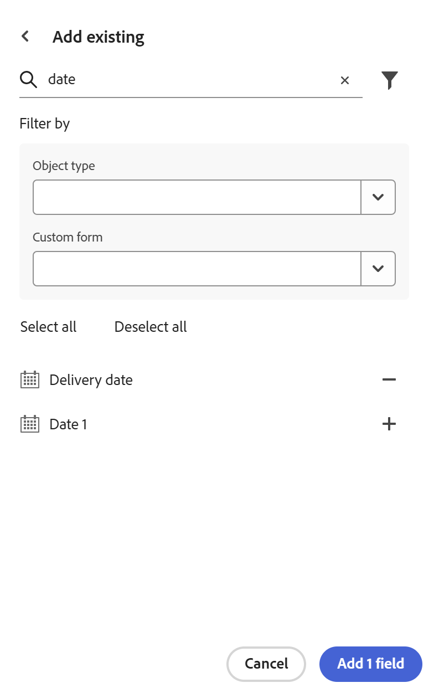

<!--add to TOC-->

# Adobe Systems Workfront에서 필드 가져오기

<!--The highlighted information on this page refers to functionality not yet generally available. It is available only in the Preview environment for all customers. After the monthly releases to Production, the same features are also available in the Production environment for customers who enabled fast releases.    

For information about fast releases, see [Enable or disable fast releases for your organization](/help/quicksilver/administration-and-setup/set-up-workfront/configure-system-defaults/enable-fast-release-process.md).   -->

{{planning-important-intro}}

기존 Workfront 필드의 복사본을 가져올 수 있습니다. Workfront에서 필드를 가져오면 Workfront Planning 레코드 유형에 대한 각 필드의 복사본이 생성됩니다.

## 액세스 요구 사항

+++ 액세스 요구 사항을 보려면 확장합니다.

<table style="table-layout:auto"> 
<col> 
</col> 
<col> 
</col> 
<tbody> 
    <tr> 
<tr> 
<td> 
   
 제품
 </td> 
   <td> 
   <ul><li>
 Adobe Workfront
</li> 
   <li>
 Adobe Workfront Planning
</li></ul></td> 
  </tr>   
<tr> 
   <td role="rowheader">
Adobe Systems Workfront 플랜*
</td> 
   <td> 

다음 Workfront 플랜 중 하나:
 
<ul><li>선택</li> 
<li>Prime</li> 
<li>Ultimate</li></ul> 

Workfront Planning은 기존 Workfront 플랜에 사용할 수 없습니다
 
   </td> 
<tr> 
   <td role="rowheader">
Adobe Systems Workfront 계획 패키지*
</td> 
   <td> 

어떤 
 

각 Workfront Planning 플랜에 포함된 항목에 대한 자세한 내용은 Workfront 계정 관리자 관리자에게 문의하십시오. 
 
   </td> 
 <tr> 
   <td role="rowheader">
Adobe Systems Workfront 플랫폼
</td> 
   <td> 

Workfront Planning에 액세스하려면 조직의 Workfront 인스턴스가 Adobe Systems 통합 환경에 온보딩되어 있어야 합니다.
 

자세한 내용은 Adobe Systems Unified Experience for Workfront<a href="/help/quicksilver/workfront-basics/navigate-workfront/workfront-navigation/adobe-unified-experience.md">를 참조하십시오</a>. 
 
   </td> 
   </tr> 
  </tr> 
  <tr> 
   <td role="rowheader">
Adobe Systems Workfront 라이선스*
</td> 
   <td>
 표준 

   
Workfront Planning은 기존 Workfront 라이선스에 사용할 수 없습니다
 
  </td> 
  </tr> 
  <tr> 
   <td role="rowheader">
액세스 수준 구성
</td> 
   <td> 
Adobe Systems Workfront Planning에 대한 액세스 수준 컨트롤은 없습니다
   
</td> 
  </tr> 
<tr> 
   <td role="rowheader">
개체 사용 권한
</td> 
   <td>   
작업 영역 및 레코드 종류에 대한 사용 권한 관리 </a> 
  
   
시스템 관리자는 자신이 생성하지 않은 작업 영역을 포함하여 모든 작업 공간에 대한 권한을 갖습니다.
 </td> 
  </tr> 
</tbody> 
</table>

*Workfront 액세스 요구 사항에 대한 자세한 내용은 Workfront 설명서[의 액세스 요구 사항을 참조하십시오](/help/quicksilver/administration-and-setup/add-users/access-levels-and-object-permissions/access-level-requirements-in-documentation.md).

+++

## Workfront에서 필드 가져오기에 대한 고려 사항

* 기본 또는 사용자 지정 Workfront 필드를 Workfront Planning의 레코드 유형으로 가져올 수 있습니다.
* Workfront 필드를 가져오면 동일한 필드의 복사본이 생성되고 Workfront Planning에서 필드 이름이 유지됩니다. Workfront Planning에 복사된 후 필드는 원래 Workfront 필드와 독립적이며 정보를 공유하지 않습니다.
<!--check this: * You do not need permissions or access to Workfront objects to be able to add their fields to Workfront Planning. -->
* 다음 Workfront 개체에서 기본 또는 사용자 지정 필드를 추가할 수 있습니다.
   * 포트폴리오
   * 프로그램
   * 프로젝트
   * 작업
   * 문제
   * 문서
   * 회사
   * 그룹
   * 사용자
   * 작업 역할
   * 할당
   * 시간
   * 청구 기록
     <!--Available only to Preview, but might not come to Prod:* Rate card - visible in Production but asking PM if it should be hidden-->
   * 경비
   * 반복
     <!--* Non-labor resource - - visible in Production but asking PM if it should be hidden-->
     <!--* Non-labour resource category - - visible in Production but asking PM if it should be hidden-->
* Workfront 필드는 Workfront Planning에서 가져온 후 해당 필드 유형을 유지하지 않을 수 있습니다.

  아래 표에는 Workfront 필드 유형과 해당 Workfront Planning 필드 유형이 나와 있습니다.

  | Workfront 필드 유형 | Workfront Planning 필드 유형 |
  |------------------------------------------|-------------------------------|
  | 텍스트 서식이 지정된 단일 행 텍스트 | 한 줄 텍스트 |
  | 숫자 형식의 한 줄 텍스트 | 숫자 |
  | 통화 형식의 단일 행 텍스트 | 통화 |
  | 단락 | 단락 |
  | 서식 포함 텍스트 | 단락 |
  | 단일 선택 드롭다운 | 단일 선택 |
  | 다중 선택 드롭다운 | 다중 선택 |
  | 사용자 자동 완성 필터가 지원되지 않습니다. | 사용자 |
  | 계산* | 공식 |
  | 일자 | 일자 |
  | 확인란 그룹 | 다중 선택 |
  | 라디오 버튼 | 다중 선택 |

  *계산된 필드는 나중에 사용할 수 있습니다.
다른 모든 Workfront 필드 유형은 Workfront Planning에서 지원되지 않습니다.

## Workfront에서 필드 가져오기

<!--the first 3 steps are the same as in Create fields-->

{{step1-to-planning}}

1. 필드를 만들려는 레코드 종류가 있는 작업 영역 을 클릭합니다.

   작업 영역 영역이 열리고 레코드 종류가 표시됩니다.

1. 레코드 종류의 카드 클릭

   레코드 종류와 연관된 모든 기존 레코드가 테이블 뷰의 행에 표시됩니다.

   >[!TIP]
   >
   >    일부 필드는 숨김 일 수 있습니다. 필드를&#x200B;**클릭하고**&#x200B;테이블 보기에서 열로 보려는 필드에 대한 토글을 활성화합니다.

1. 테이블 보기의 **오른쪽 상단 모서리에 있는 +** 아이콘을 클릭합니다

   또는

   열의 머리글 위에 마우스를 올려 놓고 필드 이름 뒤에 있는 아래쪽 화살표를 클릭한 다음 왼쪽&#x200B;**에 삽입 또는**&#x200B;오른쪽&#x200B;**에 삽입을 클릭하여**&#x200B;새 필드를 추가합니다.
1. 새로 만들기 필드&#x200B;**탭의 오른쪽 아래 모서리에서 기존** 항목 추가를 **클릭합니다**.<!--check UI - did they change this??-->

   

1. 시작 검색 영역에 기존 Workfront 필드의 이름을 입력한 다음 목록에 표시되면 +**를 클릭합니다**.
1. (선택 사항) 다른 필드를 입력한 다음 목록에 표시되면 +**를 클릭합니다**.
1. (선택 사항) **필터** 아이콘  클릭하고 다음 필드 중 하나 또는 둘 다를 업데이트합니다.

   * 개체 유형: 필드를 가져올 Workfront 개체 유형을 선택합니다.
   * 사용자 지정 양식: Workfront에서 하나 이상의 사용자 지정 양식을 선택합니다. 개체 유형을 먼저 선택하지 않고 사용자 지정 양식을 선택할 수 있습니다.
1. +**를 클릭한 다음**&#x200B;필드&#x200B;**추가를 클릭합니다**.
필드가 테이블 보기와 레코드의 세부 정보 페이지에 추가됩니다.

   >[!IMPORTANT]
   >
   >    모든 레코드 종류에 대해 500개의 필드로 제한됩니다. 가져온 필드와 함께 기존 필드가 이 제한에 기여합니다.

   추가된 필드는 Workfront 필드의 복사본이며 더 이상 Workfront의 원래 필드에 연결되지 않습니다.
