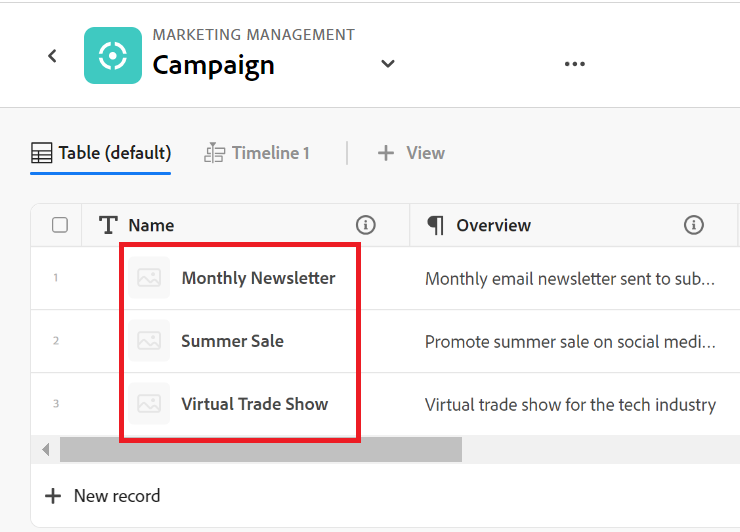

# Adobe Workfront Planning 개요

<!--this article is linked to the WF Planning landing page - do not change URL or move it; send the team a new URL after we add the redirects for this page-->

<!--update the metadata with real information when making this available in TOC and in the left nav-->

<!-- remove the references to closed beta from the entire article-->

<!--update the video in the IMPORTANT below, when we have something better, especially after Open Beta - remove it-->

>[!IMPORTANT]
>
>이 문서의 정보는 Adobe Workfront의 새 서비스인 Adobe Workfront Planning을 참조합니다.
>
>현재 Workfront Planning은 제한된 수의 고객에게 개방되어 있는 초기 액세스 단계에 있습니다.
>
>이러한 기능을 사용하려면 Workfront 고객이어야 합니다.
>
>이 단계에 속해 있다면 계정 담당자가 귀하에게 알려 주었을 것입니다.
>
>Workfront Planning을 문서화하는 모든 섹션 및 문서의 전체 목록은 다음을 참조하십시오. [Adobe Workfront Planning: 문서 색인](/help/quicksilver/planning/planning-information.md).

<!--[View a video demonstration of Adobe Workfront Planning capabilities.](https://video.tv.adobe.com/v/3424253/){target=_blank}-->

## Adobe Workfront Planning 소개

Adobe Workfront Planning은 Adobe Workfront의 새로운 제품입니다. Workfront Planning의 목적은 조직의 운영 세부 정보에 대한 포괄적인 가시성을 확보하고 작업 관리 수명 주기의 각 단계에서 중요한 비즈니스 질문에 답변하는 것입니다.

팀 및 리더쉽은 다음과 같은 질문에 대한 명확한 답변을 필요로 합니다.

* 4분기에 EMEA에서 얼마나 많은 캠페인을 실행하고 있습니까?
* 동시 캠페인 간에 대상이 겹치나요?
* 지금 의식 프로그램들은 얼마나 잘 되고 있습니까?
* 특정 캠페인의 에셋 모습은 무엇입니까? 그 중 어떤 것이 여전히 승인을 받아야 하는가?

이러한 질문에 답변하기 위해서는 리더십은 계획에서 실행, 전달에서 결과 측정에 이르기까지 모든 작업 단계를 총체적으로 파악할 수 있는 솔루션이 필요합니다. 현재 조직에는 프로세스의 일부 부분을 처리할 수 있는 도구가 있지만, 대부분의 조직에서는 모든 작업 단계에 대한 연결이 좋지 않으며, 결과를 안정적으로 제공할 수 없습니다.

다음은 몇 가지 주요 기능입니다.

* 모든 단계에 걸쳐 작업을 관리하고 작업 과정에 참여하는 모든 이해 당사자를 위한 문제를 해결합니다.
* 조직에서 사용하는 개체 유형(또는 레코드 유형) 결정부터 이러한 개체가 서로 연결되는 방법을 구성하는 등 워크플로를 완전히 사용자 지정합니다.
* 다른 시스템의 오브젝트 유형에 연결하여 모든 프로세스에 대해 일관된 프레임워크를 만듭니다.

## 현재 사용 가능한 Adobe Workfront Planning 기능

다음 표는 Workfront Planning에서 사용할 수 있는 주요 기능과 해당 기능의 사용 가능 시간표를 보여 줍니다. 목록에 모든 기능이 포함되지 않습니다.

새로운 기능과 출시된 시기에 대한 자세한 내용은 [Adobe Workfront Planning 릴리스 활동](/help/quicksilver/planning/general/release-activity.md).

| 기능 | 현재 사용 가능 | 곧 사용 가능 | 연구 중 |
|----------------------------------------------------|:-----------------------------:|:--------------------------------:|:----------------:|
| 작업 공간 만들기 | ✓ 덧신 |                                  |                  |
| 레코드 유형 만들기 | ✓ 덧신 |                                  |                  |
| 레코드 사용자 정의 필드 만들기 | ✓ 덧신 |                                  |                  |
| Excel 또는 CSV 파일을 사용하여 레코드 유형 및 필드 가져오기* | ✓ 덧신 |                                  |                  |
| 레코드 연결 | ✓ 덧신 |                                  |                  |
| 테이블에서 레코드 보기 | ✓ 덧신 |                                  |                  |
| 타임라인에서 레코드 보기 | ✓ 덧신 |                                  |                  |
| 달력에서 레코드 보기 | ✓ 덧신 |                                  |                  |
| 레코드 필터링 | ✓ 덧신 |                                  |                  |
| 타임라인 보기에서 레코드 그룹화 | ✓ 덧신 |                                  |                  |
| 표 보기에서 레코드 그룹화 | ✓ 덧신 |                                 |                  |
| 테이블 보기에서 레코드 정렬 | ✓ 덧신 |                                 |                  |
| 타임라인 보기에서 레코드 정렬 |                               | ✓ 덧신 |                  |
| 표 보기에서 그룹화 정렬 |                               | ✓ 덧신 |                  |
| 타임라인 보기에서 그룹화 정렬 |                               | ✓ 덧신 |                  |
| 작업 공간 연결 |                               | ✓ 덧신 |                  |
| 표 보기에서 레코드 검색 | ✓ 덧신 |   |
| 타임라인 보기에서 레코드 검색 | ✓ 덧신 |   |
| Workfront Planning 레코드를 Workfront 프로젝트, 프로그램, 포트폴리오, 회사, 그룹에 연결 | ✓ 덧신 |                                 |                  |
| Workfront Planning 레코드를 Adobe Experience Manager 에셋에 연결 | ✓ 덧신 |                                  |                 |
| 자세한 정보가 포함된 페이지 기록 | ✓ 덧신 |                                  |                  |
| 레코드 페이지의 레이아웃을 업데이트합니다. | ✓ 덧신 |                                 |                  |
| 작업 공간 공유 | ✓ 덧신 | |  |
| 보기 공유 | ✓ 덧신 | |  |
| 중복 보기 | ✓ 덧신 | |  |
| 요청 제출 |                               |                                  | ✓ 덧신 |
| 크리에이티브 개요 |                               |                                  | ✓ 덧신 |
| 레코드의 색상 및 아이콘 사용자 지정 | ✓ 덧신 |                                  |                 |
| 레코드에 주석 추가 | ✓ 덧신 |                                  |                 |
| 인앱 알림 수신 | ✓ 덧신 |                                  |                 |
| 이메일 알림 수신 | ✓ 덧신 |                                  |                 |
| 레코드에 썸네일 추가 | ✓ 덧신 |                                  |                 |
| 레코드의 변경 내용 보기 | ✓ 덧신 |                                  |                 |
| 단락 필드에 대한 서식 있는 텍스트 서식 | ✓ 덧신 |                                  |                 |
| Adobe Workfront Fusion용 Adobe Workfront Planning 모듈 | ✓ 덧신 |                                  |                 |
| 한 필드에서 다른 필드로 정보 복사 및 붙여넣기 | ✓ 덧신 |                                  |                 |
| Workfront 객체에서 Planning 레코드에 액세스 | ✓ 덧신 |                                  |                 |

## Workfront 인스턴스의 사용자에 대해 Adobe Workfront Planning 활성화

해당 기능에 액세스하려면 먼저 조직이 Adobe Workfront Planning 프로그램에 등록해야 합니다. 자격이 되는 경우 계정 담당자가 이 프로그램 등록에 대한 정보를 제공해야 합니다.

액세스 권한을 부여하고 다른 사용자가 Workfront Planning을 사용할 수 있도록 하는 방법에 대한 자세한 내용은 다음을 참조하십시오. [액세스 개요](/help/quicksilver/planning/access/access-overview.md).

## Adobe Workfront Planning 용어

Workfront Planning은 Workfront의 일부이지만 독점 개념 및 용어와 함께 제공됩니다. 조직에 대한 Workfront Planning 설정을 시작하기 전에 새 개념을 숙지하십시오.

Workfront Planning의 프레임워크는 완전히 사용자 정의할 수 있습니다. 조직의 정확한 요구 사항에 맞게 모든 레코드 종류, 해당 속성 및 이와 연결된 모든 필드를 만들 수 있습니다.

다음은 주요 Workfront Planning 개체 및 개념입니다.

* **작업 영역**: 특정 조직의 운영 라이프사이클을 정의하는 레코드 유형의 컬렉션입니다. 작업 공간은 조직 단위의 작업 프레임입니다.

  하나의 Workfront 인스턴스에는 최대 1,000개의 작업 공간이 있을 수 있습니다.

  

  자세한 내용은 [작업 공간 만들기](/help/quicksilver/planning/architecture/create-workspaces.md).

* **레코드 유형**: 오브젝트 유형 또는 Workfront Planning.

  객체 유형이 사전 정의된 Workfront과 달리 Workfront Planning에서는 고유한 객체 유형을 만들 수 있습니다.

  예를 들어 Workfront에서 프로그램, Portfolio, 프로젝트, 작업 또는 문제의 객체 유형이 이미 생성되었습니다.

  Workfront Planning에서 조직의 워크플로에 맞는 모든 레코드 유형을 만들 수 있습니다. 나중에 레코드 종류 간에 어떤 관계가 있는지 정의하거나 양식 종속성을 정의할 수 있습니다.

  자세한 내용은 [레코드 유형 개요](/help/quicksilver/planning/architecture/overview-of-record-types.md).

* **기록**: 레코드 유형의 인스턴스입니다.

  

  작업 영역에 레코드 유형을 추가한 후 레코드 유형의 페이지에 해당 유형의 레코드를 추가할 수 있습니다.

  예를 들어 &quot;Campaign&quot;은 레코드 유형이고 &quot;EMEA에 대한 여름 캠페인&quot;은 캠페인 레코드 유형의 레코드입니다

  자세한 내용은 [레코드 만들기](/help/quicksilver/planning/records/create-records.md).

* **작업 공간 템플릿**: 사전 정의된 템플릿을 사용하여 작업 공간을 만들 수 있습니다. 템플릿에 있는 미리 정의된 레코드 종류 및 필드를 사용하거나 사용자 고유의 레코드 종류를 추가할 수 있습니다.

  

  Adobe Workfront Planning에는 판매, 마케팅 및 제품 관리 작업 영역 템플릿이 포함되어 있습니다.

  자세한 내용은 [작업 공간 만들기](/help/quicksilver/planning/architecture/create-workspaces.md).

* **필드**: 필드는 레코드 유형에 추가할 수 있는 속성입니다. 필드에는 레코드 유형에 대한 정보가 포함됩니다. <!--check the shot below, "Connection" needs to be in lowercase-->

  

  레코드 필드에 대한 고려 사항:

   * 레코드 유형에 추가하는 필드는 해당 유형의 모든 레코드와 자동으로 연결되고 해당 레코드에 대한 데이터를 캡처하는 데 사용할 수 있습니다.

   * 레코드 유형 페이지에 적용된 테이블 보기에서 필드가 열로 표시됩니다. 레코드의 페이지에도 표시됩니다.

   * 필드는 레코드 유형에 고유하며 한 레코드 유형에서 다른 레코드 유형으로 전송되지 않습니다.

   * 필드는 완전히 사용자 지정할 수 있으며 Workfront Planning에서만 액세스할 수 있습니다. Workfront에서 Workfront Planning 필드에 액세스할 수 없습니다.

  자세한 내용은 [필드 만들기](/help/quicksilver/planning/fields/create-fields.md).

  새 레코드 유형은 기본적으로 다음과 같은 사전 정의된 필드와 연결되어 있습니다.

   * 이름
   * 설명
   * 시작 일자
   * 종료 일자
   * 상태

  다음 유형의 사용자 정의 필드를 만들 수 있습니다.

   * 한 줄 텍스트
   * 단락
   * 다중 선택
   * 단일 선택
   * 일자
   * 숫자
   * 백분율
   * 통화
   * 확인란
   * 공식
   * 사용자
   * 제작자
   * 제작 일자
   * 마지막 수정자
   * 마지막 수정일

* **연결된 레코드 유형**, **연결된 레코드**, 및 **연결된 레코드 필드** 또는 **연결된 레코드 유형**, **연결된 레코드**, 및 **연결된 필드**: Workfront Planning에서 다음 엔티티 간에 연결을 만들 수 있습니다.

   * 두 가지 레코드 유형.
   * 기록 유형 및 Workfront 프로젝트, 프로그램, 포트폴리오, 회사 또는 그룹 객체 유형.
   * 레코드 유형 및 Adobe Experience Manager 에셋 또는 폴더입니다.

     레코드 종류를 Experience Manager 개체와 연결하려면 Adobe Experience Manager 라이선스가 있어야 합니다.

     

  레코드 종류 간에 연결을 설정한 후 해당 형식의 개별 레코드를 서로 연결할 수 있습니다. 레코드 간의 연결은 연결된 레코드 필드로 표시됩니다.

* **연결된 필드** (또는 조회 필드): 두 레코드 유형 간에 연결을 설정하고 개별 레코드를 함께 연결하면 연결 중인 레코드에서 연결된 레코드의 필드를 참조할 수 있습니다.

  예를 들어 캠페인 레코드 유형을 Workfront 프로젝트 오브젝트 유형과 연결하는 경우 캠페인 레코드에 연결된 프로젝트의 프로젝트 소유자 필드를 표시할 수 있습니다.

  

  레코드 유형, 레코드 연결 및 연결된 필드 만들기에 대한 자세한 내용은 다음 문서를 참조하십시오.

   * [레코드 유형 연결](/help/quicksilver/planning/architecture/connect-record-types.md)
   * [기록 연결](/help/quicksilver/planning/records/connect-records.md)

<!--not yet:* Fields are reusable across Record Types.  -->

* **보기**: 레코드는 다양한 유형의 보기에서 해당 레코드 유형 페이지 아래에 표시됩니다.

  

  보기에는 필드 목록(열), 레코드 목록(행), 레코드 순서(정렬), 적용 또는 적용 가능한 필터 및 그룹화와 같은 특정 보기 유형의 개인화된 설정이 포함됩니다.

  다음은 레코드 유형 페이지에 적용할 수 있는 보기 유형입니다.

   * **표 보기**: 레코드와 해당 필드를 표 형식으로 표시합니다. 표의 행은 개별 레코드이고 열은 레코드 필드입니다. 기본 보기입니다.

     

   * **타임라인 보기**: 시간 표시 막대에 날짜 유형 필드가 두 개 이상 있는 레코드를 표시합니다.

     

   * **달력 보기**: 날짜 유형 필드가 두 개 이상 있는 레코드를 달력 형식으로 표시합니다.
     

자세한 내용은 [레코드 보기 관리](/help/quicksilver/planning/views/manage-record-views.md).

## Adobe Workfront Planning 개체 제한 사항

다음 표는 Workfront Planning에서 생성할 수 있는 객체 수에 대한 제한을 보여 줍니다. 다음 단계의 개발로 넘어감에 따라 제한 사항이 변경될 수 있습니다.

<!--consider making the table view a stand-alone article when we go to GA-->

| Adobe Workfront Planning 개체 | 제한 |
|-------------------------------------------------------------------------------|:---------------------------------------------------------------------------------------------------------------:|
| 하나의 Workfront 인스턴스에 대한 작업 공간 수 | 1,000 |
| 하나의 작업 영역에 대한 섹션 수 | 50 |
| 하나의 작업 영역에 대한 레코드 유형 수 | 1,000(모든 섹션의 레코드 유형과 작업 영역 템플릿을 사용할 때 생성된 레코드 유형 포함) |
| 하나의 레코드 유형에 대한 레코드 수 | 50,000 |
| 하나의 레코드 유형 또는 분류법에 대한 필드 수 | 500 |
| 텍스트 필드의 문자 수 | 1,000자 |
| 레코드 종류 표에 붙여 넣을 수 있는 파일 크기 | 1MB |
| 레코드 유형 테이블에 대한 API를 통해 가져올 수 있는 파일의 크기입니다. | 1.5MB |
| API 요청을 수행할 수 있는 속도입니다 | 분당 요청 200개 |
| 가져올 수 있는 Excel 파일의 CSV 크기* | 5MB |
| 한 사용자가 하나의 레코드 유형에 대해 만들 수 있는 보기 수 | 10 |

<!--add to the table above: Maximum number of views created by one use 100 -->

>[!IMPORTANT]
>
>*이 기능은 일시적으로 비활성화되었으며 나중에 사용할 수 있습니다.

## Adobe Workfront Planning 찾기

조직에서 Workfront Planning에 대한 액세스 권한을 받았으며 시스템 또는 그룹 관리자가 Main Menu에 Planning 영역을 추가했는지 확인합니다. 자세한 내용은 [액세스 개요](/help/quicksilver/planning/access/access-overview.md).

Workfront Planning을 찾으려면 다음을 수행합니다.

1. Adobe Workfront에 로그인.

1. 다음을 클릭합니다. **메인 메뉴**  오른쪽 상단에서 를 클릭하거나 **메인 메뉴**  사용 가능한 경우 왼쪽 상단 모서리에 있습니다.

1. 클릭 **계획 수립** .

   Workfront Planning 랜딩 페이지가 열립니다.

   

   1. (조건부 및 선택 사항) Workfront 관리자인 경우 다음 탭 중 하나를 클릭합니다.
   * **내 작업 공간**: 사용자가 만든 작업 공간을 표시합니다.
   * **기타 작업 공간**: 사용자와 공유된 작업 공간을 포함하여 시스템의 다른 모든 작업 공간을 표시합니다.

   다른 모든 사용자의 경우, 사용자가 만들었거나 사용자와 공유되는 모든 작업 공간은 **작업 공간** 영역입니다.

1. (선택 사항 및 권장) 다음 작업 중 일부를 계속하여 작업 구조를 빌드합니다.

   1. 처음부터 작업공간을 작성하거나 템플릿을 사용합니다. 자세한 내용은 [작업 공간 만들기](/help/quicksilver/planning/architecture/create-workspaces.md).

   1. 새 작업 영역에 섹션을 추가합니다. 자세한 내용은 [작업 영역 편집](/help/quicksilver/planning/architecture/edit-workspaces.md).
   1. 새 작업 영역에서 기존 섹션의 이름을 바꿉니다.
   1. 새 작업 영역에 레코드 유형을 추가합니다. 자세한 내용은 [레코드 유형 만들기](/help/quicksilver/planning/architecture/create-record-types.md).

   1. 레코드 유형의 이름을 클릭하여 레코드 유형의 페이지를 엽니다. 레코드 유형 페이지는 기본적으로 테이블 뷰에 열립니다.

      타임라인 또는 달력 보기를 만들 수도 있습니다. 자세한 내용은 [레코드 보기 관리](/help/quicksilver/planning/views/manage-record-views.md).

   1. 테이블 보기에서 행을 추가하여 레코드 추가를 시작합니다

      또는

      열을 추가하여 레코드 필드 추가를 시작합니다.

      자세한 내용은 다음 문서를 참조하십시오.

      * [레코드 만들기](/help/quicksilver/planning/records/create-records.md)
      * [필드 만들기](/help/quicksilver/planning/fields/create-fields.md).

## Adobe Workfront Planning 릴리스 활동

Workfront Planning에 대한 새로운 기능을 정기적으로 릴리스하고 있습니다.

릴리스된 기능의 최신 목록은 을 참조하십시오. [Adobe Workfront Planning 릴리스 활동](/help/quicksilver/planning/general/release-activity.md)

