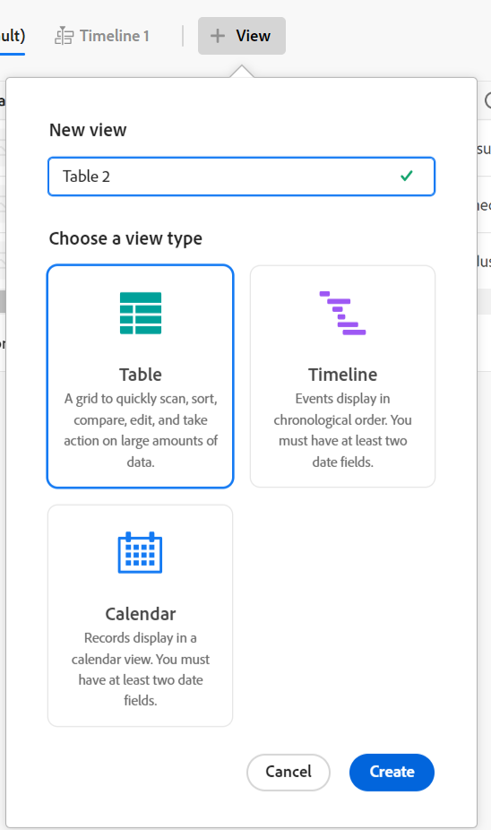

# Adobe Workfront Planning 개요

<!--this article is linked to the WF Planning landing page - do not change URL or move it; send the team a new URL after we add the redirects for this page-->

<!--do not use the snippet for IMPORTANT as it links to this article-->

이 페이지에서 강조 표시된 정보는 아직 일반적으로 사용할 수 없는 기능을 참조합니다. 모든 고객을 위한 미리보기 환경에서만 사용할 수 있습니다. 월별 프로덕션 릴리스 이후 빠른 릴리스를 활성화한 고객을 위해 프로덕션 환경에서도 동일한 기능을 사용할 수 있습니다. 

빠른 릴리스에 대한 자세한 내용은 [조직의 빠른 릴리스 사용 또는 사용 안 함](/help/quicksilver/administration-and-setup/set-up-workfront/configure-system-defaults/enable-fast-release-process.md)을 참조하세요. 

>[!IMPORTANT]
>
>이 문서의 정보는 Adobe Workfront의 추가 기능인 Adobe Workfront Planning을 참조합니다.
>
>Workfront Planning의 모든 기능에 대한 전체 액세스 권한을 얻으려면 다음이 있어야 합니다.
>
>* 새로운 Workfront 패키지 및 라이선스. 기존 Workfront 패키지 또는 라이선스에는 Workfront Planning을 사용할 수 없습니다.
>* Workfront Planning 패키지
>* 조직의 Workfront 인스턴스는 Adobe 통합 경험에 온보딩되어야 합니다.
>
> Workfront Planning에 액세스하기 위한 전체 요구 사항 목록은 [Adobe Planning 액세스 개요](/help/quicksilver/planning/access/access-overview.md)를 참조하십시오.
> 

이 문서에는 Workfront Planning에 대한 일반적인 정보가 포함되어 있습니다.

Workfront Planning에 대한 설명서가 포함된 전체 문서 목록은 [Adobe Workfront Planning: 문서 색인](/help/quicksilver/planning/planning-information.md)을 참조하십시오.

## Adobe Workfront Planning 소개

Adobe Workfront Planning은 Adobe Workfront의 추가 기능입니다. Workfront Planning의 목적은 조직의 운영 세부 정보에 대한 포괄적인 가시성을 확보하고 작업 관리 수명 주기의 각 단계에서 중요한 비즈니스 질문에 답변하는 것입니다.

Workfront Planning은 다음과 같은 질문에 답변할 수 있습니다.

* 4분기에 EMEA에서 얼마나 많은 캠페인을 실행하고 있습니까?
* 동시 캠페인 간에 대상이 겹치나요?
* 지금 의식 프로그램들은 얼마나 잘 되고 있습니까?
* 특정 캠페인의 에셋 모습은 무엇입니까? 그 중 어떤 것이 여전히 승인을 받아야 하는가?

이러한 질문에 답변하기 위해서는 리더십은 계획에서 실행, 전달에서 결과 측정에 이르기까지 모든 작업 단계를 총체적으로 파악할 수 있는 솔루션이 필요합니다. 현재 조직에는 프로세스의 일부 부분을 처리할 수 있는 도구가 있지만, 대부분의 조직에서는 모든 작업 단계에 대한 연결이 좋지 않으며, 결과를 안정적으로 제공할 수 없습니다.

다음은 몇 가지 주요 기능입니다.

* 모든 단계에 걸쳐 작업을 관리하고 작업 과정에 참여하는 모든 이해 당사자를 위한 문제를 해결합니다.
* 조직에서 사용하는 개체 유형(또는 레코드 유형) 결정부터 이러한 개체가 서로 연결되는 방법을 구성하는 등 워크플로를 완전히 사용자 지정합니다.
* 다른 시스템의 오브젝트 유형에 연결하여 모든 프로세스에 대해 일관된 프레임워크를 만듭니다.

<!--
## Currently available Workfront Planning features
(*****for GA just make a list of what features ARE included in Planning and eliminate the last 2 columns; also update the title of this section*****)

(*****at GA: update the link below to the new place for release notes *****)

For information about new features and when they are released, see [Adobe Workfront Planning release activity for 2024](/help/quicksilver/planning/general/release-activity.md). 

The following features are currently available in Workfront Planning:

* Create workspaces             
* Create record types             
* Create record custom fields             
(************ * Import record types and fields using an Excel or CSV file*****)
          
* Display records in a table view            
* Display records in a timeline view            
* Display records in a calendar view            
* Filter, sort, and group records in a table view
* Filter, group, and color code records in the timeline view
* Filter records in the calendar view 
* Search for records in the table and timeline views             
* Connect records that belong to the same workspace  
* Connect records that belong to different workspaces   
* Connect Workfront Planning records to Workfront projects, programs, portfolios, companies, groups             
* Connect Workfront Planning records to Adobe Experience Manager assets          
    You must have an Adobe Experience Manager Assets license and an integration between AEM Assets and Workfront.
    For information, see [Adobe Workfront for Experience Manager Assets and Assets Essentials: article index](/help/quicksilver/documents/adobe-workfront-for-experience-manager-assets-essentials/workfront-for-aem-asset-essentials.md). 
* View record information in the Details tab
* View record connections in the Connections tab
* Customize the layout of a record's page             
* Share workspaces             
* Share views             
* Share views publicly with any external resource, even people who are not Workfront users         
* Duplicate views             
* Submit requests to create records            
* Export record details to Word and PDF.
* Add comments to records             
* Receive in-app notifications             
* Receive email notifications             
* Add thumbnails and cover pages to records             
* View the history of changes on a record             
* Rich Text formatting for Paragraph fields             
* Access Planning records from Workfront objects             
* Connect and disconnect Planning records from Workfront objects 
* Create Planning records by submitting a request form            
* Workfront Planning public API             
* Adobe Workfront Planning modules for Adobe Workfront Fusion             
* Workfront Planning AI Assistant
* Reporting on Workfront Planning information
    You can report on Planning information using the Canvas Dashboard. For information, see [Canvas Dashboards overview](/help/quicksilver/reports-and-dashboards/canvas-dashboards/canvas-dashboards-overview.md). 

-->

<!--OLD: 

|       Feature                                      |     Available now  |     Coming soon   |     In research  |
|----------------------------------------------------|:-----------------------------:|:--------------------------------:|:----------------:|
|     Create workspaces                              |   ✓                           |                                  |                  |
|     Create record types                |   ✓                           |                                  |                  |
|     Create record custom fields                    |   ✓                           |                                  |                  |
|     Import record types and fields using an Excel  or CSV file                              |                              |           ✓                       |                  |
|     Link records                                   |   ✓                           |                                  |                  |
|     View records in a table                        |   ✓                           |                                  |                  |
|     View records in a timeline                     |   ✓                           |                                  |                  |
|     View records in a calendar                     |   ✓                           |                                  |                  |
|     Filter records                                 |   ✓                           |                                  |                  |
|     Group records in the timeline view             |   ✓                           |                                  |                  |
|     Group records in the table view                | ✓                              |                                 |                  |
|     Sort records in the table view                                 |  ✓                             |                                 |                  |
|     Sort records in the timeline view                                 |                               |   ✓                              |                  |
|     Sort groupings in the table view                                 |                               |   ✓                              |                  |
|     Sort groupings in the timeline view                                 |                               |   ✓                              |                  |
|   Search for records in the table view    | ✓    |   |
|   Search for records in the timeline view    | ✓    |   |
|     Connect Workfront Planning records to Workfront projects, programs, portfolios, companies, groups  |   ✓                            |                                 |                  |
|     Connect Workfront Planning records to Adobe Experience Manager assets                                  |      ✓                         |                                  |                 |
|     Connect Planning records from different workspaces                                  |      ✓                         |                                  |                 | 
|     Record page with detailed information                            |   ✓                           |                                  |                  |
|     Update the layout of the record's page              |    ✓                           |                                 |                  |
|  Share workspaces | ✓| |  |
|  Share views |✓ | |  |
|  Share views publicly with external resources |✓ | |  |
|  Duplicate views |✓ | |  |
|     Submit requests                                |                               |          ✓                        |                 |
|     Export record details to Word                                 |    ✓                           |                                  |                 |
|     Export record details to PDF                                 |                               |                                  |       ✓          |
|     Customize the color and icon of a record                                 |      ✓                         |                                  |                 |
|     Add comments to records                                 | ✓                              |                                  |                 |
|     Receive in-app notifications                                 | ✓                              |                                  |                 |
|     Receive email notifications                                 | ✓                              |                                  |                 |
|     Add thumbnails to records                                 | ✓                              |                                  |                 |
|     View history of changes on a record                                 | ✓                              |                                  |                 |
|     Rich Text formatting for Paragraph fields                                 |      ✓                         |                                  |                 | 
|     Adobe Workfront Planning modules for Adobe Workfront Fusion                                 |      ✓                         |                                  |                 | 
|     Copy and paste information from one field to another                                  |      ✓                         |                                  |                 | 
|     Access Planning records from Workfront objects                                  |      ✓                         |                                  |                 |
|     Connect Planning records from Workfront objects                                  |      ✓                         |                                  |                 |
|     Workfront Planning public API                                 |      ✓                         |                                  |                 |
|     Workfront Planning AI Assistant*                                 |      ✓                         |                                  |                 |
|     Reporting on Workfront Planning information (Canvas Dashboard)                              |                               |       ✓                           |                 |
-->

## Workfront 인스턴스의 사용자에 대해 Workfront Planning 활성화

조직이 Workfront Planning 패키지를 구입한 후 Workfront 관리자는 사용자가 Workfront Planning에 액세스하려면 먼저 다음 사항이 준비되었는지 확인해야 합니다.

* 사용하는 환경에 따라 다음 사용자에게 메인 메뉴에 Planning이 포함된 레이아웃 템플릿을 할당합니다.

   * 프로덕션 환경에서 시스템 관리자를 포함하여 모든 라이선스 유형의 모든 사용자에게 템플릿을 할당합니다.

   * 미리 보기 환경에서 Light 및 Contribute 사용자에게 템플릿을 할당합니다. 표준 사용자 및 시스템 관리자에게는 기본적으로 Planning이 활성화되어 있습니다. 

  자세한 내용은 [레이아웃 템플릿을 사용하여 기본 메뉴 사용자 지정](/help/quicksilver/administration-and-setup/customize-workfront/use-layout-templates/customize-main-menu.md) 및 [레이아웃 템플릿에 사용자 할당](/help/quicksilver/administration-and-setup/customize-workfront/use-layout-templates/assign-users-to-layout-template.md)을 참조하십시오.

* 사용자에게 Workfront Planning에서 개체를 보거나 만들 수 있는 Workfront 라이선스 및 Workfront Planning 권한을 할당합니다. 액세스 권한을 부여하고 다른 사용자가 Workfront Planning을 사용할 수 있도록 하는 방법에 대한 자세한 내용은 [Adobe Planning 액세스 개요](/help/quicksilver/planning/access/access-overview.md)를 참조하십시오.

## Workfront Planning 용어

Workfront Planning은 Workfront의 일부이지만 독점 개념 및 용어와 함께 제공됩니다. 조직에 대한 Workfront Planning 설정을 시작하기 전에 이러한 개념을 숙지하십시오.

Workfront Planning의 프레임워크는 완전히 사용자 정의할 수 있습니다. 조직의 정확한 요구 사항에 맞게 모든 레코드 종류, 해당 속성 및 이와 연결된 모든 필드를 만들 수 있습니다.

만들 수 있는 Workfront Planning 개체 수에 대한 제한이 있습니다. 자세한 내용은 [Adobe Workfront Planning 개체 제한 개요](/help/quicksilver/planning/general/limitations-overview.md)를 참조하십시오.

다음은 주요 Workfront Planning 개체 및 개념입니다.

* **Workspace**: 특정 조직의 작업 주기를 정의하는 레코드 형식의 컬렉션입니다. 작업 공간은 조직 단위의 작업 프레임입니다.

  

  자세한 내용은 [작업 영역 만들기](/help/quicksilver/planning/architecture/create-workspaces.md)를 참조하십시오.

* **레코드 형식**: Workfront Planning의 개체 형식 이름입니다.

  레코드 종류가 작업 공간을 채웁니다.

  객체 유형이 사전 정의된 Workfront과 달리 Workfront Planning에서는 고유한 객체 유형을 만들 수 있습니다.

  예를 들어 Workfront에서 프로그램, Portfolio, 프로젝트, 작업 또는 문제의 객체 유형이 이미 생성되었습니다.

  Workfront Planning에서 조직의 워크플로에 맞는 모든 레코드 유형을 만들 수 있습니다. 나중에 레코드 종류 간에 어떤 관계가 있는지 정의하거나 양식 종속성을 정의할 수 있습니다.

  자세한 내용은 [레코드 종류 개요](/help/quicksilver/planning/architecture/overview-of-record-types.md)를 참조하세요.

* **레코드**: 레코드 형식의 인스턴스입니다.

  

  작업 영역에 레코드 유형을 추가한 후 레코드 유형의 페이지에 해당 유형의 레코드를 추가할 수 있습니다.

  예를 들어 &quot;Campaign&quot;은 레코드 유형이고 &quot;EMEA에 대한 여름 캠페인&quot;은 캠페인 레코드 유형의 레코드입니다.

  자세한 내용은 [레코드 만들기](/help/quicksilver/planning/records/create-records.md)를 참조하세요.

* **Workspace 템플릿**: 미리 정의된 템플릿을 사용하여 작업 영역을 만들 수 있습니다. 템플릿에 있는 미리 정의된 레코드 종류 및 필드를 사용하거나 사용자 고유의 레코드 종류를 추가할 수 있습니다.

  

  Adobe Workfront Planning에는 다음 템플릿이 포함되어 있습니다.

   * 기본: 마케팅 관리
   * 고급: 마케팅 관리
   * 엔터프라이즈: 마케팅 관리
   * 영업 관리
   * 제품 관리

  자세한 내용은 [작업 영역 템플릿 목록](/help/quicksilver/planning/architecture/workspace-templates.md)을 참조하세요.

* **필드**: 필드는 레코드 형식에 추가할 수 있는 특성입니다. 필드에는 레코드 유형에 대한 정보가 포함됩니다. <!--check the shot below, "Connection" needs to be in lowercase-->

  

  레코드 필드에 대한 고려 사항:

   * 레코드 유형에 추가하는 필드는 해당 유형의 모든 레코드와 자동으로 연결되고 해당 레코드에 대한 데이터를 캡처하는 데 사용할 수 있습니다.

   * 레코드 유형 페이지에 적용된 테이블 보기에서 필드가 열로 표시됩니다. 레코드의 페이지에도 표시됩니다.

   * 필드는 레코드 유형에 고유하며 한 레코드 유형에서 다른 레코드 유형으로 전송되지 않습니다.

   * 필드는 완전히 사용자 지정할 수 있으며 Workfront Planning에서만 액세스할 수 있습니다. Workfront에서 Workfront Planning 필드에 액세스할 수 없습니다.

  자세한 내용은 [필드 만들기](/help/quicksilver/planning/fields/create-fields.md)를 참조하십시오.

  새 레코드 유형은 기본적으로 다음과 같은 사전 정의된 필드와 연결되어 있습니다.

   * 이름
   * 설명
   * 시작 일자
   * 종료 일자
   * 상태

  다음 유형의 사용자 정의 필드를 만들 수 있습니다.

   * 한 줄 텍스트
   * 단락
   * 다중 선택
   * 단일 선택
   * 일자
   * 숫자
   * 백분율
   * 통화
   * 확인란
   * 공식
   * 사용자
   * 제작자
   * 제작 일자
   * 마지막 수정자
   * 마지막 수정일

* **연결된 레코드 종류**, **연결된 레코드** 및 **연결된 필드**: Workfront Planning에서 다음 엔터티 간에 연결을 만들 수 있습니다.

   * 두 가지 Workfront Planning 레코드 유형.
   * 기록 유형 및 Workfront 프로젝트, 프로그램, 포트폴리오, 회사 또는 그룹 객체 유형.
   * 레코드 유형 및 Adobe Experience Manager 에셋 또는 폴더입니다.

     레코드 유형을 Experience Manager 개체에 연결하려면 Adobe Experience Manager 라이선스가 있어야 합니다.

     

  레코드 종류 간에 연결을 설정한 후에는 개별 레코드나 해당 형식의 개체를 서로 연결할 수 있습니다. 레코드 간의 연결은 연결된 레코드 필드 또는 연결로 표시됩니다.

  서로 영향을 주는 여러 유형의 작업 오브젝트가 있는 경우 레코드 유형 연결이 유용합니다. 예를 들어, 캠페인으로 작업하고 각 캠페인은 여러 브랜드를 지원할 수 있습니다. 이 관계를 나타내기 위해 캠페인을 브랜드에 연결할 수 있습니다. 또한 각 캠페인에 대한 작업은 Workfront의 여러 프로젝트에서 계획할 수 있습니다. 이를 나타내기 위해 캠페인을 관련 프로젝트에 연결할 수 있습니다. 레코드 유형을 연결한 다음 개별 레코드를 연결하면 Workfront Planning에서 이 관계를 달성합니다.

* **조회 필드**(또는 연결된 필드): 두 레코드 종류 간에 연결을 설정하고 개별 레코드를 함께 연결하면 연결 중인 레코드에서 연결된 레코드의 필드를 참조할 수 있습니다.

  예를 들어 캠페인 레코드 유형을 Workfront 프로젝트 오브젝트 유형과 연결하는 경우, 캠페인 레코드에 연결된 프로젝트의 예산 필드를 표시할 수 있습니다.

  

  >[!TIP]
  >
  > 연결된 레코드 또는 개체 형식에서 다음 필드 형식을 조회 필드로 추가할 수 없습니다.
  >
  >* 사용자
  >* 제작자
  >* 마지막 수정자
  >* Workfront 자동 완성 필드(프로젝트 소유자 또는 프로젝트 스폰서와 같은 필드 포함)

  레코드 종류, 레코드 연결 및 연결된 필드 만들기에 대한 자세한 내용은 다음 문서를 참조하십시오.

   * [레코드 유형 연결](/help/quicksilver/planning/architecture/connect-record-types.md)
   * [기록 연결](/help/quicksilver/planning/records/connect-records.md)

<!--not yet:* Fields are reusable across Record Types.  -->

* **보기**: 레코드가 각 레코드 형식 페이지 아래에 다른 형식의 보기로 표시됩니다.

  

  보기에는 필드 목록(열), 레코드 목록(행), 레코드 순서(정렬), 적용 또는 적용 가능한 필터 및 그룹화와 같은 특정 보기 유형의 개인화된 설정이 포함됩니다.

  다음은 레코드 유형 페이지에 적용할 수 있는 보기 유형입니다.

   * **테이블 보기**: 연결된 필드와 조회 필드를 포함한 레코드와 해당 필드를 테이블 형식으로 표시합니다. 표의 행은 개별 레코드이고 열은 레코드 필드입니다. 테이블 뷰가 기본 뷰입니다.

     

   * **타임라인 보기**: 날짜 형식 필드가 두 개 이상 있는 레코드를 시간 순서대로 표시합니다. 최대 5개의 연결된 레코드 유형과 해당 레코드를 타임라인 보기에 표시할 수 있습니다.

     

   * **일정 보기**: 날짜 유형 필드가 두 개 이상 있는 레코드를 일정 형식으로 표시합니다.

     

자세한 내용은 [레코드 보기 관리](/help/quicksilver/planning/views/manage-record-views.md)를 참조하십시오.

## Adobe Workfront Planning 찾기

Adobe Planning을 찾으려면 조직에서 Workfront Planning에 대한 액세스 권한을 받았는지, 시스템 또는 그룹 관리자가 [기본 메뉴]에 [계획] 영역을 추가했는지 확인하십시오. 자세한 내용은 [Adobe Planning 액세스 개요](/help/quicksilver/planning/access/access-overview.md)를 참조하십시오.

Workfront Planning을 찾으려면 다음을 수행합니다.

1. Workfront에 로그인.

{{step1-click-main-menu}}

1. **계획** 을 클릭합니다.

   Workfront Planning 기본 페이지가 열립니다.

   

   >[!TIP]
   >
   >    Workfront 관리자는 레이아웃 템플릿의 랜딩 페이지 선택 옵션에 계획 영역을 추가할 수 있으므로 Workfront에 로그인하는 즉시 Planning을 열 수 있습니다. 자세한 내용은 [레이아웃 템플릿을 사용하여 랜딩 페이지 사용자 지정](/help/quicksilver/administration-and-setup/customize-workfront/use-layout-templates/customize-landing-page.md)을 참조하세요.

1. (조건부 및 선택 사항) Workfront 관리자인 경우 다음 탭 중 하나를 클릭합니다.
   * **내가 있는 작업 영역**: 사용자가 만든 작업 영역이나 사용자와 공유되는 작업 영역을 표시합니다.
   * **다른 작업 영역**: 시스템의 다른 작업 영역을 모두 표시합니다.

   다른 모든 사용자의 경우 생성했거나 공유한 두 작업 영역이 모두 **작업 영역** 영역에 표시됩니다.

1. (선택 사항 및 권장) 다음 작업 중 일부를 계속하여 작업 구조를 빌드합니다.

   1. 처음부터 작업공간을 작성하거나 템플릿을 사용합니다. 자세한 내용은 [작업 영역 만들기](/help/quicksilver/planning/architecture/create-workspaces.md)를 참조하십시오.

   1. 새 작업 영역에 섹션을 추가합니다. 자세한 내용은 [작업 영역 편집](/help/quicksilver/planning/architecture/edit-workspaces.md)을 참조하십시오.
   1. 새 작업 영역에서 기존 섹션의 이름을 바꿉니다.
   1. 새 작업 영역에 레코드 유형을 추가합니다. 자세한 내용은 [레코드 종류 만들기](/help/quicksilver/planning/architecture/create-record-types.md)를 참조하세요.

   1. 레코드 유형의 이름을 클릭하여 레코드 유형의 페이지를 엽니다. 레코드 유형 페이지는 기본적으로 테이블 뷰에 열립니다.

      타임라인 또는 달력 보기를 만들 수도 있습니다. 자세한 내용은 [레코드 보기 관리](/help/quicksilver/planning/views/manage-record-views.md)를 참조하십시오.

   1. 테이블 보기에서 행을 추가하여 레코드 추가를 시작합니다

      또는

      열을 추가하여 레코드 필드 추가를 시작합니다.

      자세한 내용은 다음 문서를 참조하십시오.

      * [레코드 만들기](/help/quicksilver/planning/records/create-records.md)
      * [필드 만들기](/help/quicksilver/planning/fields/create-fields.md).

## Workfront Planning 릴리스 활동

<!--update this with the new release activity page - the article index for all Planning releases-->

Workfront Planning에 대한 새로운 기능을 정기적으로 릴리스하고 있습니다.

릴리스된 기능의 최신 목록을 보려면 [Adobe Workfront Planning 릴리스 활동: 문서 색인](/help/quicksilver/product-announcements/product-releases/planning-release-activity/planning-release-activity-article-index.md)을 참조하십시오.

## Workfront Planning을 위한 추가 리소스

* [Adobe Workfront Planning: 문서 색인](/help/quicksilver/planning/planning-information.md): 관심 영역별로 그룹화된 Workfront Planning에 대한 설명서가 포함된 모든 문서의 색인입니다.
* [Adobe Workfront Planning AI Assistant 개요](/help/quicksilver/planning/general/planning-ai-assistant-overview.md): Workfront Planning AI Assistant를 사용하여 명령을 사용하여 레코드를 검색하거나, 레코드를 생성, 업데이트 및 삭제할 수 있으며, 이를 통해 Assistant가 작업을 수행하도록 할 수 있습니다.
  <!--
    >[!NOTE]
    >
    >    The Workfront AI Assistant has been temporarily removed and it will be available at a later date.-->

* [Workfront Fusion용 Adobe Workfront 계획 모듈](https://experienceleague.adobe.com/ko/docs/workfront-fusion/using/references/apps-and-their-modules/adobe-connectors/workfront-planning-modules): Adobe Workfront 계획 모듈을 사용하면 Workfront Planning에서 이벤트가 발생할 때 시나리오를 트리거할 수 있습니다. 레코드를 생성, 읽기, 업데이트 및 삭제하거나 Adobe Workfront Planning 계정에 대한 사용자 정의 API 호출을 수행할 수도 있습니다.

* [Adobe Workfront Planning API 기본 사항](/help/quicksilver/planning/general/planning-api-basics.md): Adobe Workfront Planning API의 목표는 HTTP를 통해 작동하는 REST 풀 아키텍처를 도입하여 Planning과의 통합 구축을 간소화하는 것입니다.

* **Workfront Planning 보고 기능**: 이제 Workfront 캔버스 대시보드를 사용하여 Workfront의 보고서에서 Workfront Planning 정보를 볼 수 있습니다. 자세한 내용은 [캔버스 대시보드 시작](/help/quicksilver/reports-and-dashboards/canvas-dashboards/manage-canvas-dashboards/get-started-canvas-dashboards.md)을 참조하세요.

