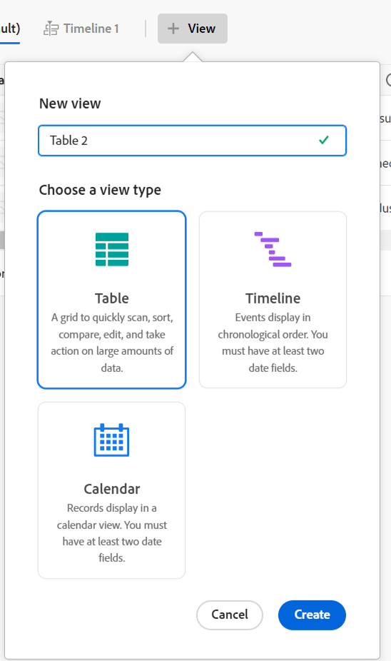
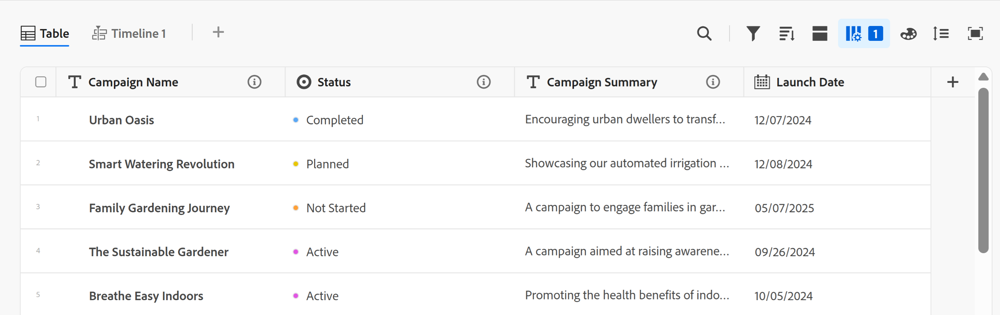
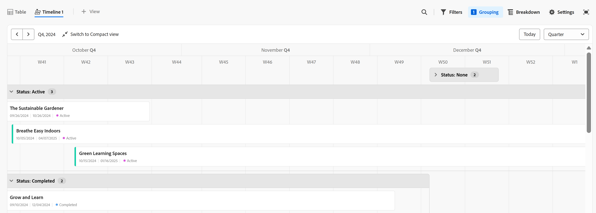

# Workfront Planning 용어 개요

<!--do not use the snippet for IMPORTANT as it links to this article-->

<!--
The highlighted information on this page refers to functionality not yet generally available. It is available only in the Preview environment for all customers. After the release to Preview, the same features are also available monthly in the Production environment for customers who enabled fast releases.    

For information about fast releases, see [Enable or disable fast releases for your organization](/help/quicksilver/administration-and-setup/set-up-workfront/configure-system-defaults/enable-fast-release-process.md). 
-->

>[!IMPORTANT]
>
>이 문서의 정보는 Adobe Workfront Planning을 참조합니다. Workfront Planning은 독립 실행형 제품이거나 Adobe Workfront의 추가 구매 기능입니다.
>
>
>이 문서에는 고객이 Workfront 또는 Workfront 패키지를 구매할 때 Planning에 대한 일반적인 정보가 포함되어 있습니다.
>
>Workfront Planning에 대한 설명서가 포함된 전체 문서 목록은 [Adobe Workfront Planning에 대한 일반 정보 및 문서 색인](/help/quicksilver/planning/planning-information.md)을 참조하십시오.
>
>독립 실행형 제품으로서의 Workfront Planning에 대한 자세한 내용은 [독립 실행형 제품으로서의 Adobe Workfront Planning 시작](/help/quicksilver/planning/planning-sta/planning-sta-overview.md)을 참조하십시오.

Workfront Planning은 Workfront의 일부이지만 독점 개념 및 용어와 함께 제공됩니다. 조직에 대한 Workfront Planning 설정을 시작하기 전에 이러한 개념을 숙지하십시오.

Workfront Planning의 프레임워크는 완전히 사용자 정의할 수 있습니다. 조직의 정확한 요구 사항에 맞게 모든 레코드 종류, 해당 속성 및 이와 연결된 모든 필드를 만들 수 있습니다.

만들 수 있는 Workfront Planning 개체 수에 대한 제한이 있습니다. 자세한 내용은 [Adobe Workfront Planning 개체 제한 개요](/help/quicksilver/planning/general/limitations-overview.md)를 참조하십시오.

다음은 주요 Workfront Planning 개체 및 개념입니다.

* [작업 영역](#workspaces)
* [레코드 유형](#record-types)
* [레코드](#records)
* [Workspace 템플릿](#workspace-templates)
* [필드](#fields)
* [연결된 레코드 유형, 레코드 및 필드](#connected-record-types-records-and-fields)
* [조회 필드](#lookup-fields)
* [계층](#hierarchies)
* [보기 횟수](#views)
* [자동화](#automations)
* [요청 양식](#request-forms)

## 작업 영역

작업 공간은 조직 단위의 프레임워크를 나타냅니다. 특정 조직의 운영 라이프사이클을 정의하는 레코드 유형의 컬렉션입니다.

자세한 내용은 [작업 영역 만들기](/help/quicksilver/planning/architecture/create-workspaces.md)를 참조하십시오.

## 레코드 유형

레코드 유형은 Workfront Planning의 객체 유형입니다.

레코드 종류가 작업 공간을 채웁니다.

객체 유형이 사전 정의된 Workfront과 달리 Workfront Planning에서는 고유한 객체 유형을 만들 수 있습니다.

예를 들어 Workfront에서 프로그램, Portfolio, 프로젝트, 작업 또는 문제의 객체 유형이 이미 생성되었습니다.

Workfront Planning에서 조직의 워크플로에 맞는 모든 레코드 유형을 만들 수 있습니다. 나중에 레코드 종류 간에 어떤 관계가 있는지 정의하거나 양식 종속성을 정의할 수 있습니다.

자세한 내용은 [레코드 종류 개요](/help/quicksilver/planning/architecture/overview-of-record-types.md)를 참조하세요.

## 레코드

레코드는 레코드 유형의 인스턴스입니다.

작업 영역에 레코드 유형을 추가한 후 레코드 유형의 페이지에 해당 유형의 레코드를 추가할 수 있습니다.

예를 들어 &quot;Campaign&quot;은 레코드 유형이고 &quot;EMEA에 대한 여름 캠페인&quot;은 캠페인 레코드 유형의 레코드입니다.

자세한 내용은 [레코드 만들기](/help/quicksilver/planning/records/create-records.md)를 참조하세요.

## Workspace 템플릿

미리 정의된 템플릿을 사용하여 작업 공간을 만들 수 있습니다. 템플릿에 있는 미리 정의된 레코드 종류 및 필드를 사용하거나 사용자 고유의 레코드 종류를 추가할 수 있습니다.

Adobe Workfront Planning에는 다음 템플릿이 포함되어 있습니다.

* 운영 이니셔티브 스튜디오
* Communications Planning Studio
* 기본: 마케팅 관리
* 고급: 마케팅 관리
* 엔터프라이즈: 마케팅 관리
* 영업 관리
* 제품 관리

시스템 관리자는 모범 사례의 다중 공간 템플릿을 사용하는 경우 6개의 작업 공간을 설치할 수도 있습니다. 다중 공간 템플릿에는 6개의 서로 다르지만 연결된 작업 공간을 동시에 생성하는 다음 템플릿이 포함되어 있습니다.

* &#x200B;1. 글로벌 분류 및 분류
* &#x200B;2. Fréscopa 글로벌 마케팅
* 3.Fréscopa 소셜 마케팅
* 4.Fréscopa 미디어 및 홍보
* 5.Fréscopa 글로벌 이벤트
* 6.Fréscopa 경영진 리더십

자세한 내용은 다음 문서를 참조하십시오.

* [작업 영역 템플릿 목록](/help/quicksilver/planning/architecture/workspace-templates.md).
* [작업 공간 만들기](/help/quicksilver/planning/architecture/create-workspaces.md).

## 필드

필드는 레코드 유형에 추가할 수 있는 속성입니다. 필드에는 레코드 유형에 대한 정보가 포함됩니다.

레코드 필드에 대한 고려 사항:

* 레코드 유형에 추가하는 필드는 해당 유형의 모든 레코드와 자동으로 연결되고 해당 레코드에 대한 데이터를 캡처하는 데 사용할 수 있습니다.

* 레코드 유형 페이지에 적용된 테이블 보기에서 필드가 열로 표시됩니다. 레코드의 페이지에도 표시됩니다.

* 필드는 레코드 유형에 고유하며 한 레코드 유형에서 다른 레코드 유형으로 전송되지 않습니다.

* 필드는 완전히 사용자 지정할 수 있으며 Workfront Planning에서만 액세스할 수 있습니다. Workfront에서 Workfront Planning 필드에 액세스할 수 없습니다.

자세한 내용은 [필드 만들기](/help/quicksilver/planning/fields/create-fields.md)를 참조하십시오.

새 레코드 유형은 기본적으로 다음과 같은 사전 정의된 필드와 연결되어 있습니다.

* 이름
* 설명
* 시작 일자
* 종료 일자
* 상태

다음 유형의 사용자 정의 필드를 만들 수 있습니다.

* 한 줄 텍스트
* 단락
* 다중 선택
* 단일 선택
* 일자
* 숫자
* 백분율
* 통화
* 확인란
* 공식
* 사람
* 생성한 사람
* 생성 일자
* 마지막 수정자
* 마지막 수정일
* 승인자:
* 승인 일자
* 레코드 ID

<!--update the screen shot above-->

## 연결된 레코드 유형, 레코드 및 필드

Workfront Planning에서 다음 엔티티 간에 연결을 생성할 수 있습니다.

* 두 가지 Workfront Planning 레코드 유형.
* 기록 유형 및 Workfront 프로젝트, 프로그램, 포트폴리오, 회사 또는 그룹 객체 유형.
* 레코드 유형 및 Adobe Experience Manager 에셋 또는 폴더입니다.

  레코드 유형을 Experience Manager 개체에 연결하려면 Adobe Experience Manager 라이선스가 있어야 합니다.

  

* 레코드 종류 및 Adobe GenStudio for Performance Marketing 브랜드.

  기록 유형을 Adobe GenStudio for Performance Marketing 브랜드에 연결하려면 GenStudio 라이선스가 있어야 합니다.

  

레코드 유형 또는 레코드와 개체 유형 간에 연결을 설정한 후 해당 유형의 개별 레코드나 개체를 서로 연결할 수 있습니다. 레코드 간의 연결은 연결된 레코드 필드 또는 연결로 표시됩니다.

서로 영향을 주는 여러 유형의 작업 오브젝트가 있는 경우 레코드 유형 연결이 유용합니다. 예를 들어, 캠페인으로 작업하고 각 캠페인은 여러 브랜드를 지원할 수 있습니다. 이 관계를 나타내기 위해 캠페인을 브랜드에 연결할 수 있습니다. 또한 각 캠페인에 대한 작업은 Workfront의 여러 프로젝트에서 계획할 수 있습니다. 이를 나타내기 위해 캠페인을 관련 프로젝트에 연결할 수 있습니다. 레코드 유형을 연결한 다음 개별 레코드를 연결하면 Workfront Planning에서 이 관계를 달성합니다.

## 조회 필드

두 레코드 종류 간에 연결을 설정하고 개별 레코드를 함께 연결하면 연결 중인 레코드에서 연결된 레코드의 필드를 참조할 수 있습니다.

예를 들어 캠페인 레코드 유형을 Workfront 프로젝트 오브젝트 유형과 연결하는 경우, 캠페인 레코드에 연결된 프로젝트의 예산 필드를 표시할 수 있습니다.

>[!TIP]
>
>* 연결된 레코드 또는 개체 형식에서 다음 필드 형식을 조회 필드로 추가할 수 없습니다.
>
>   * 생성한 사람
>   * 마지막 수정자
>   * Workfront 자동 완성 필드(프로젝트 소유자 또는 프로젝트 스폰서와 같은 필드 포함)
>

레코드 종류, 레코드 연결 및 연결된 필드 만들기에 대한 자세한 내용은 다음 문서를 참조하십시오.

* [레코드 유형 연결](/help/quicksilver/planning/architecture/connect-record-types.md)
* [기록 연결](/help/quicksilver/planning/records/connect-records.md)

<!--
not yet:* Fields are reusable across Record Types.
-->

## 계층

레코드 유형이 작업 영역 내에서 연결되면 이러한 연결을 구성하는 계층을 만들 수 있습니다. 계층은 레코드 및 객체 유형을 상위-하위 관계로 구성하며 최대 4개의 객체 유형을 포함할 수 있습니다.

두 레코드 유형 간의 연결이 아직 없는 경우 계층 구조를 설정할 때 만들 수 있습니다. 계층이 정의되면 작업 공간 내에서 관련 레코드 유형 간에 구조화된 경로를 설정합니다.

계층은 헤더에 표시되는 각 레코드에 대한 이동 경로를 생성합니다. 이렇게 하면 사용자는 워크플로의 모든 단계에서 계층 구조에서 자신의 위치를 알 수 있습니다.

계층 및 이동 경로에 대한 일반적인 정보는 [계층 및 이동 경로 개요](/help/quicksilver/planning/architecture/hierarchy-and-breadcrumb-overview.md)를 참조하십시오.

## 보기 횟수

레코드는 각 레코드 유형 페이지에 다양한 유형의 보기로 표시됩니다.

보기에는 필드 목록(열), 레코드 목록(행), 레코드 순서(정렬), 적용 또는 적용 가능한 필터 및 그룹화와 같은 특정 보기 유형의 개인화된 설정이 포함됩니다.

다음은 레코드 유형 페이지에 적용할 수 있는 보기 유형입니다.

* **테이블 보기**: 연결된 필드와 조회 필드를 포함한 레코드와 해당 필드를 테이블 형식으로 표시합니다. 표의 행은 개별 레코드이고 열은 레코드 필드입니다. 테이블 뷰가 기본 뷰입니다.

  

* **타임라인 보기**: 날짜 형식 필드가 두 개 이상 있는 레코드를 시간 순서대로 표시합니다. 최대 5개의 연결된 레코드 유형과 해당 레코드를 타임라인 보기에 표시할 수 있습니다.

  

* **일정 보기**: 날짜 유형 필드가 두 개 이상 있는 레코드를 일정 형식으로 표시합니다.
  

<!--
add List view here when it's possible to display Planning RTs in it??
-->

추가 보기:

* **목록 보기**: Workfront Planning의 다음 영역에서 목록 보기에 개체를 표시할 수 있습니다.

  * 프로젝트 연결 페이지.
  * 요청 양식 목록

  

자세한 내용은 [레코드 보기 관리](/help/quicksilver/planning/views/manage-record-views.md)를 참조하십시오.

## 자동화

활성화되면 Planning 레코드에서 트리거될 때 Adobe Workfront Planning에서 레코드를 생성하도록 Workfront Planning에서 자동화를 구성할 수 있습니다. 생성된 레코드는 자동화를 트리거하는 레코드에 자동으로 연결됩니다.

Workfront Planning의 레코드 유형 페이지에서 자동화를 구성하고 활성화할 수 있습니다.

예를 들어 Workfront Planning 캠페인을 가져와 캠페인에 연결할 브랜드를 만드는 자동화를 만들 수 있습니다.

기존 자동화를 사용하여 개체를 만드는 방법에 대한 자세한 내용은 [Adobe Workfront Planning 레코드 자동화를 사용하여 개체 만들기](/help/quicksilver/planning/records/create-wf-objects-using-planning-automations.md)를 참조하십시오.

## 요청 양식

요청 양식을 만들어 Adobe Workfront Planning에서 레코드 유형과 연결할 수 있습니다. 그런 다음 다른 사용자와 양식을 공유하고 해당 유형의 레코드를 만들도록 요청을 제출할 수 있습니다.

자세한 내용은 [Adobe Workfront Planning에서 요청 양식 만들기 및 관리](/help/quicksilver/planning/requests/create-request-form.md)를 참조하십시오.