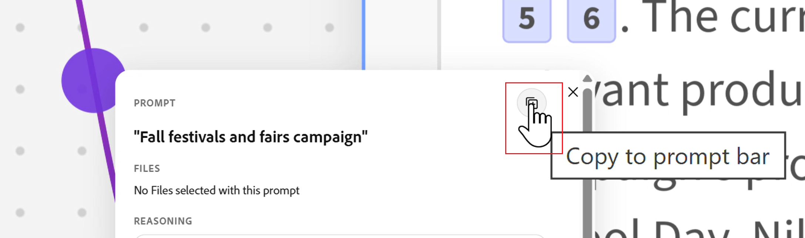

# Ideation 공간에 브리프 만들기

<!-- add to TOC and miniTOC-->

이 페이지의 정보는 아직 일반적으로 사용할 수 없는 기능을 참조합니다. **관념화 공간 Beta** 프로그램의 일부로서만 사용할 수 있습니다. 

자세한 내용은 [Adobe Workfront Planning의 Ideation 공간 시작](/help/quicksilver/planning/ideation/get-started-with-planning-ideation.md)을 참조하십시오.

{{planning-important-intro}}

Adobe Workfront Planning의 새로운 기능인 Ideation Space를 사용하여 브리핑을 Planning 레코드로 변환할 수 있습니다. 내보낸 브리프는 새 레코드를 만들거나 기존 레코드를 업데이트합니다.

이 문서에서는 Ideation 공간에서 브레인스토밍하고 전략하여 브리프를 만드는 방법에 대해 설명합니다. 레코드를 만들거나 업데이트하려면 완료된 관념화 설명을 파일이나 Workfront Planning으로 내보냅니다.

## 액세스 요구 사항

+++ 을 확장하여 이 문서의 기능에 대한 액세스 요구 사항을 봅니다. 

<!--
are there additional license restrictions or packages to be purchased to have access to Ideation space?? If yes, update the table below
-->

<table style="table-layout:auto"> 
<col> 
</col> 
<col> 
</col> 
<tbody> 
    <tr> 
<tr> 
</tr>   
<tr> 
   <td role="rowheader">
Adobe Workfront 패키지
</td> 
   <td> 
<ul> 
<li>
Planning 패키지가 있는 모든 Workfront 또는 워크플로우
</li>
또는
<li>
독립 실행형 제품으로 구입할 경우 모든 Planning 패키지
</li></ul>
   </td>

<tr> 
   <td role="rowheader">
추가 제품
</td> 
   <td><ul>
   <li>
Adobe GenStudio for Performance Marketing
</li>
   <!--
   <li>
Adobe Customer Journey Analytics
</li>
   -->
   </ul>
   </td> 
  </tr> 
  <tr> 
   <td role="rowheader">
Adobe Workflow 라이선스
</td> 
   <td>
표준

   </td> 
  </tr> 
<tr> 
   <td role="rowheader">
Adobe Planning 라이선스
</td> 
   <td>
표준

   </td> 
  </tr> 
<tr> 
   <td role="rowheader">
액세스 수준 구성
</td> 
   <td> 
   <ul>
   <li>
워크플로우와 Planning 패키지가 모두 있는 경우 액세스 레벨에 워크플로우와 Planning 라이선스 유형을 모두 추가해야 합니다.
   </li>
   <li>
액세스 수준의 관념화 공간 사용 안 함 설정을 선택 해제해야 합니다.
</li>
</td> 
  </tr>  
   <tr> 
   <td role="rowheader">
개체 권한
</td> 
   <td> 
레코드를 추가할 작업 영역 및 레코드 유형에 대한 또는 그 이상의 사용 권한을 부여합니다. 

      
시스템 관리자는 만들지 않은 작업 영역을 포함하여 모든 작업 영역에 대한 권한을 가집니다

      
Workfront 개체에 대한 권한을 보고 Brief에 추가 <!--not sure if this is available-->

      
브리프를 만들 수 있는 편집 공간 권한

   </td> 
  </tr>  
   <tr> 
   <td role="rowheader">
Adobe GenStudio for Performance Marketing 사용자 역할
</td> 
   <td>
<ul><li>캠페인, 제품 및 가상 사용자에 액세스할 수 있는 모든 GenStudio 사용자 역할</li>
   <li>GenStudio System Manager를 사용하여 활성화 액세스 <!--and Events--></li></ul>
   자세한 내용은 <a href="https://experienceleague.adobe.com/en/docs/genstudio-for-performance-marketing/user-guide/intro/user-roles">사용자 역할 및 권한</a>을 참조하세요. 
   

  </td> 
  </tr> 
</tbody> 
</table>

Workfront 액세스 요구 사항에 대한 자세한 내용은 Workfront 설명서의 [액세스 요구 사항](/help/quicksilver/administration-and-setup/add-users/access-levels-and-object-permissions/access-level-requirements-in-documentation.md)을 참조하십시오.

+++  

## 관념화 공간 개요 만들기

1. Workfront Planning에서 시작하여 Ideation 공간을 사용하여 레코드를 만들거나 편집합니다.

   자세한 내용은 [Ideation Space Brief에서 계획 레코드 만들기](/help/quicksilver/planning/ideation/create-records-in-ideation-space-for-planning.md)를 참조하십시오.
1. **Ideation 공간**&#x200B;이 열리면 만들려는 간략한 정보를 설명하는 프롬프트를 사용하십시오.

   예를 들어, &quot;미국의 부모와 교사를 위해 K-12 학생들이 8월 한 달 동안 참여할 수 있는 학교 후진 캠페인 만들기&quot;를 입력합니다.  개요를 최대한 작성하려면 어떤 유형의 캠페인, 타임라인, 관련자 및 기타 세부 정보에 사용 가능한 한 많은 정보를 표시하십시오.

1. **식별 시작**&#x200B;을 클릭합니다.

   관념화 공간 에이전트가 열리면 다음 단계를 수행합니다.

   1. **데이터 수집 및 합성**: 연결된 소스에서 관련 정보를 가져옵니다. 예:

      * 기존 레코드 종류 또는 시작한 기존 레코드 종류.
      * 관념화 공간에 업로드했을 수 있는 최근 문서입니다.
      * 프롬프트 기준과 일치하는 웹 정보.

        >[!TIP]
        >
        >AI가 웹에서 정보를 찾을 수 있으려면 웹 검색 설정을 켜야 합니다.\
        >자세한 내용은 이 문서의 [관념화 공간 구성](#configure-the-ideation-space) 섹션을 참조하십시오.
        >
   1. **대상 정의**: 이전 패턴을 기반으로 대상 대상 매개 변수를 식별하거나 권장합니다
   1. **전략 구성**: 캠페인에 대한 전략 설명을 구성합니다.
   1. **메시지 및 개념 관점**: 초기 메시지 옵션 및 창의적인 개념 방향을 생성합니다.
   1. **Brief 생성 및 계획 전달**: Workfront Planning 작업 영역으로 다시 이동하는 구조화된 Brief를 생성합니다.

      관념화 에이전트가 모든 정보를 수집하는 프로세스를 마치면 다음과 같은 일이 발생합니다.

      * 5개의 카드가 만들어지고 관련성 있고 비슷한 정보별로 구성됩니다.

        카드의 제목은 쉽게 인식할 수 있도록 요청된 레코드를 만들 때 다양한 단계를 사용하여 지정됩니다.

        예를 들어 다음과 같은 이름을 지정할 수 있습니다.

        * 플랜
        * 타임라인
        * 세그먼트
        * 역학
        * 메시지

      카드 제목은 해당 관념의 각 카드에 대해 사용자 정의됩니다.

      * 카드들은 이것이 하나의 관념의 결과임을 나타내는 같은 틀 안에 놓여진다.

      * 개요 가 만들어지고 관념화 공간의 왼쪽 아래 모서리에 미리보기 이미지에 표시됩니다. <!--add screen shot??-->

      이 지침서에는 탐구하고 있는 아이디어와 관련하여 시스템에서 고려하는 제안 필드가 포함되어 있습니다.

1. (선택 사항) Ideation 공간을 탐색하는 데 도움이 되는 키보드 단축키 목록을 보려면 오른쪽 상단의 **도움말** 아이콘 을 클릭합니다.

1. (선택 사항) 모든 카드의 맨 아래에 있는 **소스**&#x200B;를 클릭하여 정보가 수집된 위치를 이해합니다.

   Workfront Planning 또는 웹에서 정보를 가져올 수 있습니다.
1. (선택 사항) 카드의 썸네일 위 또는 썸네일 아래 아이콘을 사용하여 피드백을 제공합니다.<!--is this still available??-->
1. 카드를 클릭하거나 모든 카드가 들어 있는 프레임을 클릭한 다음 **브리핑에 추가**&#x200B;를 클릭하여 해당 정보를 설명에 추가합니다.

   Workfront은 각 정보를 저장할 가능성이 가장 높은 필드와 일치시킵니다.

   예를 들어 타임라인은 날짜 유형 필드에 추가되고 설명은 단락 유형 필드에 추가됩니다.
   1. (조건부) 카드를 클릭한 다음 **AI에게 묻기...**&#x200B;를 클릭하여 다음 단계에 대한 아이디어를 얻은 후 정보를 개요에 추가합니다. 답변은 각 카드의 정보 컨텍스트에 있습니다.
   1. Ideation 스페이스의 왼쪽 위 모서리에 있는 **문서 추가** 아이콘 을 클릭하여 스페이스에 문서를 업로드하십시오. 새 문서나 이전에 이미 추가한 문서를 스페이스에 추가할 수 있습니다.

      >[!TIP]
      >
      >문서에 액세스하여 이를 스페이스에 업로드하려면 문서 설정을 켜야 합니다.
      >자세한 내용은 이 문서의 [관념화 공간 구성](#configure-the-ideation-space) 섹션을 참조하십시오.
      > 
   1. **WF 분류 카드 추가** 아이콘  <!--send this tooltip to be revised-->를 클릭하고 연결된 레코드 유형을 선택한 다음 각 유형의 레코드를 선택하여 해당 레코드의 정보를 선택한 레코드 유형에 추가합니다.

      스페이스에 추가하기 위해 선택한 레코드에 대한 카드가 만들어집니다. 레코드 유형은 레코드 카드의 왼쪽 상단 모서리에 표시됩니다.
   1. (선택 사항) **자세히** 메뉴 를 클릭하고 **Workfront에서 보기**&#x200B;를 클릭합니다.

      레코드의 세부 사항 페이지가 Workfront Planning의 다른 브라우저 탭에서 열립니다.
   1. (선택 사항) 관념화 프레임 또는 카드를 선택하고 삭제 아이콘을 클릭한 다음, 삭제를 클릭하여 확인합니다. 카드가 관념화 공간에서 제거됩니다.

      저장된 문서나 레코드에 해당하는 카드를 삭제하면 해당 항목이 Ideation 공간에서 제거되지만 해당 응용 프로그램에는 남아 있습니다.

1. (선택 사항) 언제든지 오른쪽 아래 모서리에 있는 **무엇이든 묻기** 상자를 사용하여 아이디어를 구체화합니다.

   예를 들어 업데이트된 컨텍스트를 사용하여 특정 카드를 AI가 다시 실행하도록 하려면 `regenerate`을(를) 입력합니다. 관념화 공간은 추론 단계(검색, 합성, 인용)를 재실행하고 영향을 받는 카드를 업데이트합니다.

1. (선택 사항) **무엇이든 묻기** 상자에서 새 질문을 하여 새 아이디어를 시작합니다.

   공간이 추론 단계를 다시 실행한 후 새 카드 세트가 생성됩니다.

1. (선택 사항) 관념화 카드 집합에서 보라색 커넥터 중 하나를 클릭한 다음 **프롬프트 표시줄에 복사** 아이콘을 클릭하여 관념화 추론을 다시 실행합니다.

   

1. (선택 사항) 작업을 취소하거나 취소하려면 페이지 상단에 있는 **실행 취소** 또는 **다시 실행** 아이콘 을 클릭합니다.
1. 축소하여 전체 그림을 보십시오. 원래 캠페인 목표, 인용이 있는 모든 AI 생성 개념 카드, 추가 문서, 가져온 실제 Workfront Planning 레코드(제품, 가상 사용자 등). 왼쪽 아래 모서리에 있는 **Brief** 요약 카드는 모두 가져옵니다.

1. 왼쪽 하단의 간략한 미리 보기 이미지를 클릭하고 간략한 내용을 검토한 후 다음 옵션 중 하나를 클릭합니다.

   * **파일로 내보내기**. 개요를 다음 파일 형식으로 내보낼 수 있습니다.

     * PDF
     * 단어
     * PowerPoint(템플릿 포함 또는 제외)
   * **Workfront 계획으로 내보내기**. 내보내기는 Workfront Planning의 레코드에 있는 모든 기존 필드 데이터를 덮어씁니다.

   이렇게 하면 추가 정보가 포함된 레코드 생성이 완료되고 원래 선택한 레코드 유형에 추가됩니다.

   Brief를 사용하여 Planning 레코드를 업데이트하는 방법에 대한 자세한 내용은 [Ideation Space Brief에서 Planning 레코드 만들기](/help/quicksilver/planning/ideation/create-records-in-ideation-space-for-planning.md) 문서의 &quot;ConsiderationsConsiderations: Ideation Space를 사용하여 레코드를 만드는 방법에 대한 고려 사항&quot; 섹션을 참조하십시오.

## 관념화 공간 구성

Ideation 공간에는 공간을 탐색하는 데 도움이 될 뿐만 아니라 화면에 표시되는 내용을 구성하는 컨트롤이 있습니다.

1. AI가 정보를 가져오는 위치를 제어하려면 **설정** 아이콘 을 클릭하고 다음 **Source 유형** 중에서 선택하십시오.

   * **문서** — 선택한 스페이스에 업로드된 문서
   * **웹 검색** — 외부 웹 조사
   * **CJA** — Adobe Customer Journey Analytics

1. **저장**&#x200B;을 클릭합니다.

1. **도움말** 아이콘 을 클릭하여 관념화 공간을 탐색하거나 다른 확대/축소 값을 선택하는 데 사용할 수 있는 키보드 단축키를 검토합니다.

   다음 확대/축소 수준 중에서 선택합니다.

   * 100%로 확대/축소
   * 200%로 확대/축소
   * 크기에 맞게 확대/축소

   또는 다음 단축키 중 하나를 사용하여 페이지를 탐색합니다.

   | 작업 | 단축키 |
   |---|---|
   | 확대/축소 | Ctrl/⌘ + / − |
   | 선택 영역에 맞게 확대/축소 | — |
   | 커서로 확대/축소 | Ctrl/⌘ + 스크롤 |
   | 캔버스 패닝 | 스페이스바를 누른 채 드래그 |
   | 점 격자 표시/숨기기 | G |

1. 검색 아이콘을 클릭하여 관념화 공간에 있는 항목을 검색한 다음, 목록에 표시될 때 아이콘을 클릭하여 해당 항목으로 이동합니다.

