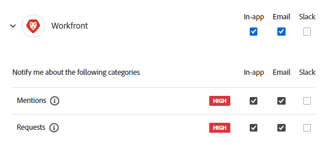

# Adobe Workfront Planning 알림 환경 설정 관리

<!--The highlighted information on this page refers to functionality not yet generally available. It is available only in the Preview environment for all customers. After the monthly releases to Production, the same features are also available in the Production environment for customers who enabled fast releases.    

For information about fast releases, see [Enable or disable fast releases for your organization](/help/quicksilver/administration-and-setup/set-up-workfront/configure-system-defaults/enable-fast-release-process.md). -->

{{planning-important-intro}}

Workfront Planning에서 다음 작업이 발생하면 인앱 또는 이메일 알림을 받을 수 있습니다.

* 누군가가 기록 페이지의 댓글에 귀하 또는 귀하의 팀을 추가합니다.
* 누군가 보기 또는 작업 영역에 액세스할 수 있는 권한을 요청합니다.
* 누군가가 <!--I could not test this but Isk confirmed--> 보기 또는 작업 영역에 액세스할 수 있는 권한을 부여했습니다.
* Workfront Planning 요청을 제출합니다.
* 누군가가 귀하가 제출한 Workfront Planning 요청을 승인하거나 거부합니다.
* 상태가 제출한 Workfront Planning 요청으로 변경됩니다.

## 액세스 요구 사항

+++ 액세스 요구 사항을 보려면 확장합니다.

<table style="table-layout:auto"> 
<col> 
</col> 
<col> 
</col> 
<tbody> 
    <tr> 
<tr> 
<td> 
   
 제품
 </td> 
   <td> 
   <ul><li>
 Adobe Workfront
</li> 
   <li>
 Adobe Workfront 계획
</li></ul></td> 
  </tr>   
<tr> 
   <td role="rowheader">
Adobe Systems Workfront 플랜*
</td> 
   <td> 

다음 Workfront 플랜 중 하나:
 
<ul><li>선택</li> 
<li>Prime</li> 
<li>Ultimate</li></ul> 

Workfront Planning은 기존 Workfront 플랜에 사용할 수 없습니다.
 
   </td> 
<tr> 
   <td role="rowheader">
Adobe Workfront 계획 패키지*
</td> 
   <td> 

임의 
 

각 Workfront Planning 계획에 포함된 사항에 대한 자세한 내용은 Workfront 계정 관리자에게 문의하십시오. 
 
   </td> 
 <tr> 
   <td role="rowheader">
Adobe Systems Workfront 플랫폼
</td> 
   <td> 

조직의 Workfront 인스턴스는 Adobe 통합 경험에 온보딩되어야 합니다.
 

조직의 사용자는 조직이 Workfront 통합 경험에 온보딩될 때만 Adobe Planning에서 알림을 받습니다. 

자세한 내용은 <a href="/help/quicksilver/workfront-basics/navigate-workfront/workfront-navigation/adobe-unified-experience.md">Workfront용 Adobe 통합 환경</a>을 참조하십시오. 
 
   </td> 
   </tr> 
  </tr> 
  <tr> 
   <td role="rowheader">
Adobe Workfront 라이센스*
</td> 
   <td>

표준, 라이트 또는 기여자
   
기존 Workfront 라이선스에는 Workfront Planning을 사용할 수 없습니다.
 
  </td> 
  </tr> 
  <tr> 
   <td role="rowheader">
액세스 수준 구성
</td> 
   <td> 
Adobe Systems Workfront Planning에 대한 액세스 수준 컨트롤은 없습니다
   
</td> 
  </tr> 
<tr> 
   <td role="rowheader">
개체 권한
</td> 
   <td>   
작업 영역 </a>에 대한 이상의 권한 보기 
  
   
시스템 관리자는 만들지 않은 작업 영역을 포함하여 모든 작업 영역에 대한 권한을 가집니다
 </td> 
  </tr> 
<tr>
   <td role="rowheader">
레이아웃 템플릿
</td>
   <td> Light 또는 Contributor 라이센스가 있는 사용자에게는 Planning이 포함된 레이아웃 템플릿 정보가 지정되어야 합니다.
   
표준 사용자 및 시스템 관리자는 기본적으로 계획 영역을 사용하도록 설정되어 있습니다.

</li></ul>

</td>
  </tr>

</tbody> 
</table>

*Workfront 액세스 요구 사항에 대한 자세한 내용은 Workfront 설명서[의 액세스 요구 사항을 참조하십시오](/help/quicksilver/administration-and-setup/add-users/access-levels-and-object-permissions/access-level-requirements-in-documentation.md).

+++

Workfront Planning 알림에 대한 자세한 내용은 다음 문서도 참조하십시오.

* 레코드 댓글에 대한 자세한 내용은 레코드 댓글[ 관리를 참조하십시오](/help/quicksilver/planning/records/manage-record-comments.md).
* Workfront Planning의 인앱 알림에 대한 자세한 내용은 [Adobe Workfront Planning의 인앱 알림 관리](/help/quicksilver/planning/notifications/manage-planning-in-app-notifications.md)를 참조하십시오.
* Workfront Planning의 전자 메일 알림에 대한 자세한 내용은 [Adobe Workfront Planning의 전자 메일 알림 관리](/help/quicksilver/planning/notifications/manage-planning-email-notifications.md)를 참조하십시오.

## 알림 환경 설정 관리

1. Adobe Experience Cloud 자격 증명으로 Workfront에 로그인합니다.
1. **화면 오른쪽 상단의 Experience Cloud**&#x200B;에서 계정 메뉴계정 메뉴 아이콘을 클릭한 다음 환경 설정&#x200B;**클릭합니다**.
1. **알림** 섹션에서 **Workfront**&#x200B;을(를) 클릭합니다.
1. 수신할 알림을 선택합니다.
또는
수신을 중지할 알림을 선택 취소합니다.

   
1. Workfront에 대해 다음 알림을 사용할 수 있습니다.

   * **언급**: 다른 사용자가 귀하 또는 귀하의 팀에 Workfront Planning 댓글에 태그를 지정하면 알림을 받습니다
   * **요청**: 누군가 다음 중 하나를 수행하면 알림 수신됩니다.

      * Workfront Planning 개체에 대한 권한 요청 또는 부여
      * Workfront Planning 요청
      * 변경 사항을 제출한 Workfront Planning 요청 상태
      * Workfront Planning 요청 승인 요청, 승인 또는 거부

   알림 관리에 대한 자세한 내용은 계정 기본 설정 및 알림을[ 참조하십시오](https://experienceleague.adobe.com/ko/docs/core-services/interface/features/account-preferences).

<!--OLD: notifications are not available to non-IMS customers: 

When someone adds you to a comment in the record page, you may receive an in-app as well as an email notification about the comment. 

The following scenarios exist:   

* Adobe Unified Experience customers receive both an in-app notification and an email notification. They can manage their in-app and email notification preferences in the Preferences area of their Adobe Experience Cloud profile for the Workfront product. 

    For more information, see [Account preferences and notifications](https://experienceleague.adobe.com/ko/docs/core-services/interface/features/account-preferences).

* Customers who are not on the Adobe Unified Experience receive only an email notification. They cannot manage their email notifications preferences and will always receive an email when someone adds them to a comment on a record in Workfront Planning.   

-->
