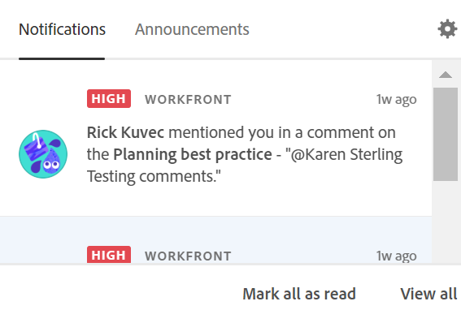

# Adobe Workfront Planning 인앱 알림 관리

{{planning-important-intro}}

누군가가 기록 댓글에서 귀하를 태그하면 해당 태그에 대한 인앱 알림을 받을 수 있습니다.

>[!IMPORTANT]
>
>Workfront Planning에서 알림을 받으려면 귀사가 Adobe 통합 경험 고객이어야 합니다.
>
>자세한 내용은 [Workfront용 통합 경험 Adobe](/help/quicksilver/workfront-basics/navigate-workfront/workfront-navigation/adobe-unified-experience.md)를 참조하십시오.

레코드 댓글에 다른 사용자를 태그 지정하는 방법에 대한 자세한 내용은 [레코드 댓글 관리](/help/quicksilver/planning/records/manage-record-comments.md)를 참조하십시오.

## 액세스 요구 사항

이 문서의 단계를 수행하려면 다음 액세스 권한이 있어야 합니다.

<table style="table-layout:auto">
 <col>
 </col>
 <col>
 </col>
 <tbody>
    <tr>
<tr>
<td>
   
 제품
 </td>
   <td>
   
 Adobe Workfront
 
   
Workfront Planning에서 알림을 받으려면 조직의 Workfront 인스턴스가 통합 경험 Adobe에 온보딩되어 있어야 합니다. 자세한 내용은 <a href="/help/quicksilver/workfront-basics/navigate-workfront/workfront-navigation/adobe-unified-experience.md">Workfront용 통합 경험 Adobe</a>를 참조하십시오.
</td>
  </tr>  
 <td role="rowheader">
Adobe Workfront 계약
</td>
   <td>

Workfront Planning의 조기 액세스 단계에 조직을 등록해야 합니다. 

   </td>
  </tr>
  <tr>
   <td role="rowheader">
Adobe Workfront 플랜
</td>
   <td>

임의

   </td>
  </tr>
  <tr>
   <td role="rowheader">
Adobe Workfront 라이선스
</td>
   <td>
   
임의
 
  </td>
  </tr>

<tr>
   <td role="rowheader">
액세스 수준 구성
</td>
   <td> 
Workfront Planning에는 액세스 수준 제어가 없습니다. 
  
</td>
  </tr>
<tr>
   <td role="rowheader">
권한
</td>
   <td> 
작업 영역 </a>에 대한 이상의 권한 보기 
  
   
시스템 관리자는 만들지 않은 작업 영역을 포함하여 모든 작업 영역에 대한 권한을 가집니다

</td>
  </tr>

<tr>
   <td role="rowheader">
레이아웃 템플릿
</td>
   <td> 
Workfront 또는 그룹 관리자는 레이아웃 템플릿에 계획 영역을 추가해야 합니다. 자세한 내용은 <a href="/help/quicksilver/planning/access/access-overview.md">액세스 개요</a>를 참조하십시오. 
  
</td>
  </tr>
 </tbody>
</table>

## 인앱 알림 관리

1. (조건부) 다른 사용자가 레코드에 있는 댓글에 귀하를 태그 지정한 후 Adobe Experience Cloud의 인앱 **알림** 아이콘 (으)로 이동합니다.

   

1. 알림을 클릭합니다.

   Workfront Planning에서 레코드 세부 사항 페이지가 열립니다. 레코드를 업데이트하거나 댓글에 답글을 달 수 있습니다.

1. (선택 사항) 모든 알림을 읽었음을 나타내려면 **모두 읽음으로 표시**&#x200B;를 클릭합니다.
1. (선택 사항) Adobe Experience Cloud의 **알림** 페이지로 이동하려면 **모두 보기**&#x200B;를 클릭합니다.
