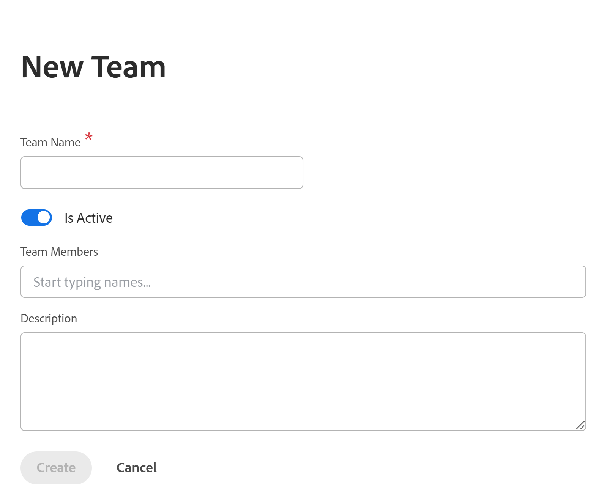

# Adobe Workfront Planning에서 팀을 독립 실행형 제품으로 관리

>[!IMPORTANT]
>
>이 문서의 정보는 독립 실행형 제품으로 구입한 경우 Adobe Workfront Planning에 적용됩니다. 귀사에서 Adobe Workfront Planning 전용 패키지를 구매했지만 Workfront Workflow 패키지를 구매하지 않은 경우 이 문서를 참조하십시오.
>
>Workfront 패키지와 함께 구입한 경우 Adobe Workfront Planning에 대한 자세한 내용은 [Adobe Workfront Planning 시작](/help/quicksilver/planning/general/planning-overview.md)을 참조하십시오.
>

Adobe Workfront에서 관리하는 것과 유사한 방식으로 Adobe Workfront Planning에서 팀을 독립형 제품으로 관리할 수 있지만 몇 가지 제한 사항이 있습니다.

## 액세스 요구 사항

+++ 을 확장하여 이 문서의 기능에 대한 액세스 요구 사항을 봅니다. 

<table style="table-layout:auto"> 
<col> 
</col> 
<col> 
</col> 
<tbody> 
    <tr> 
<tr> 
</tr>   
<tr> 
   <td role="rowheader">
Adobe Workfront Planning 패키지
</td> 
   <td> 

모든 Workfront Planning을 독립형 패키지로

</td> </tr>
  <tr> 
   <td role="rowheader">
Adobe Workfront 라이선스
</td> 
   <td>
계획 수립 관리자

   </td> 
  </tr>

</tbody> 
</table>

독립 실행형 패키지로 Workfront에 필요한 액세스에 대한 자세한 내용은 [독립 실행형 제품으로 Adobe Workfront Planning에 필요한 액세스](/help/quicksilver/planning/planning-sta/access-needed-for-planning-sta.md)를 참조하십시오.
+++    

## Adobe Workfront Planning에서 팀 관리

1. Planning 관리자로 Adobe CX Enterprise 홈에서 Workfront에 로그인합니다.
1. **기본 메뉴** > **설정** > 팀 > **새 팀**&#x200B;을 클릭합니다.

   

1. 다음 정보를 업데이트합니다.

   * 팀 이름
   * 활성 상태: 팀이 활성 상태임을 나타내려면 이 설정을 켭니다. 사용자는 권한 및 다른 사용자에게 할당할 수 있습니다.
   * 팀원: 팀에 팀원을 추가합니다. 사용자를 팀원으로 추가하려면 먼저 Adobe Admin Console 및 Workfront Planning에서 사용자를 만들어야 합니다.
   * 설명: 팀에 대한 설명을 포함합니다.
1. 팀을 만들려면 **만들기**&#x200B;를 클릭하세요.
1. (선택 사항) 기존 팀을 편집하려면 다음 중 하나를 수행합니다.

   * 목록의 팀 이름을 마우스로 가리킨 다음 **추가** 메뉴  > **팀 편집**&#x200B;을 클릭합니다
   * 목록에서 팀을 선택한 다음 페이지 하단의 파란색 도구 모음에서 **팀 편집**&#x200B;을 클릭합니다
1. (선택 사항) 팀을 삭제하려면 다음 중 하나를 수행합니다.

   * 목록의 팀 이름을 마우스로 가리킨 다음 **추가** 메뉴  > **팀 삭제**&#x200B;를 클릭합니다
   * 목록에서 팀을 선택한 다음 페이지 하단의 파란색 도구 모음에서 **팀 삭제**&#x200B;를 클릭합니다
1. 확인하려면 **예, 삭제**&#x200B;를 클릭하세요.

