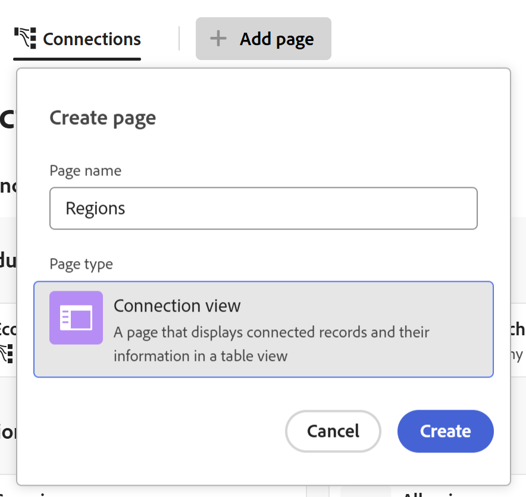

# 레코드에 연결된 레코드 페이지 추가

이 페이지에서 강조 표시된 정보는 아직 일반적으로 사용할 수 없는 기능을 참조합니다. 모든 고객을 위한 미리보기 환경에서만 사용할 수 있습니다. 월별 프로덕션 릴리스 이후 빠른 릴리스를 활성화한 고객을 위해 프로덕션 환경에서도 동일한 기능을 사용할 수 있습니다. 

빠른 릴리스에 대한 자세한 내용은 [조직의 빠른 릴리스 사용 또는 사용 안 함](/help/quicksilver/administration-and-setup/set-up-workfront/configure-system-defaults/enable-fast-release-process.md)을 참조하세요. 

연결된 레코드 페이지에 대한 탭을 Adobe Workfront Planning의 레코드에 추가하여 연결된 레코드 또는 개체에서 정보를 볼 수 있습니다. 이렇게 하면 테이블 보기의 연결된 레코드가 탭에 추가됩니다.

레코드에 연결된 레코드 페이지를 추가할 때는 다음 사항을 고려하십시오.

* 레코드 또는 개체 유형을 해당 테이블 보기에서 레코드 유형에 연결한 후 연결된 레코드 페이지를 레코드에 추가할 수 있습니다.

* 레코드의 미리 보기 영역 또는 레코드 페이지에서 연결된 레코드 페이지를 추가할 수 있습니다.

* 특정 레코드 형식에 대해 연결된 레코드 페이지가 한 개만 있을 수 있습니다.

  예를 들어, 캠페인에 대해 연결된 레코드 페이지를 만들고 연결된 가상 사용자를 표시하려는 경우 가상 사용자에 대해 연결된 레코드 페이지가 하나만 있을 수 있습니다.

* 연결된 레코드 페이지에는 연결된 개체나 한 개체 또는 레코드 종류의 레코드만 표시됩니다. 페이지에 해당 유형의 모든 레코드가 표시되지 않습니다.

* 연결된 레코드 페이지에 표시하는 개체 또는 레코드 유형에 따라 다음 보기를 사용하여 표시할 수 있습니다.

   * 다음 보기에서 연결된 Planning 레코드를 표시할 수 있습니다.
      * 테이블
      * 타임라인
      * 일정
   * 목록 보기에 연결된 Workfront 프로젝트를 표시할 수 있습니다.

* 다음과 같은 연결된 레코드 또는 객체 유형에 대해 연결된 레코드 페이지를 추가할 수 있습니다.

   * Workfront Planning 레코드 유형
   * Workfront 프로젝트

     Workfront에서 액세스할 수 있는 권한이 없는 경우에도 연결된 Workfront 프로젝트를 볼 수 있습니다.

## 액세스 요구 사항

+++ 을 확장하여 이 문서의 기능에 대한 액세스 요구 사항을 봅니다. 

<table style="table-layout:auto"> 
<col> 
</col> 
<col> 
</col> 
<tbody> 
    <tr> 
<tr> 
</tr>   
<tr> 
   <td role="rowheader">
Adobe Workfront 패키지
</td> 
   <td> 

모든 Workfront 및 모든 Planning 패키지

모든 워크플로우 및 모든 Planning 패키지

각 Workfront Planning 패키지에 포함된 내용에 대한 자세한 내용은 Workfront 계정 담당자에게 문의하십시오. 
 
   </td> 
<tr>
<td> 
   
 추가 제품
 </td> 
   <td> 
   
 Adobe Workfront 외에 다음 응용 프로그램의 개체에 대해 연결된 레코드 페이지를 추가하려면 다음 항목이 있어야 합니다.

   <ul><li>
AEM 에셋을 Planning 레코드 유형과 연결하기 위한 AEM Assets 및 Workfront 간의 통합 및 Adobe Experience Manager Assets 라이선스.

   
자세한 내용은 <a href="/help/quicksilver/documents/adobe-workfront-for-experience-manager-assets-essentials/workfront-for-aem-asset-essentials.md">Experience Manager Assets 및 Assets Essentials용 Adobe Workfront: 기사 색인</a>을 참조하십시오. 
</li>
   <li>
 레코드 유형을 GenStudio 브랜드와 연결하는 Adobe GenStudio for Performance Marketing 라이선스

   
자세한 내용은 <a href="https://experienceleague.adobe.com/en/docs/genstudio-for-performance-marketing/user-guide/get-started">Adobe GenStudio for Performance Marketing 시작</a>을 참조하세요.
</li></ul>
   </td> 
  </tr>

<tr> 
   <td role="rowheader">
Adobe Workfront 라이선스
</td> 
   <td>
표준

   </td> 
  </tr> 
  <tr>
   <td role="rowheader">
개체 권한
</td>
   <td>
   
작업 공간 및 레코드 유형에 대한 또는 그 이상의 권한 기여 
  
   
시스템 관리자는 만들지 않은 작업 영역을 포함하여 모든 작업 영역에 대한 권한을 가집니다
 
  </td>
  </tr>   
</tbody> 
</table>

Workfront 액세스 요구 사항에 대한 자세한 내용은 Workfront 설명서의 [액세스 요구 사항](/help/quicksilver/administration-and-setup/add-users/access-levels-and-object-permissions/access-level-requirements-in-documentation.md)을 참조하십시오.

+++   

## 레코드에 연결된 레코드 페이지 추가

연결된 레코드 페이지를 레코드에 추가하기 전에 먼저 레코드 유형을 다른 레코드 유형 또는 Workfront 프로젝트와 연결해야 합니다.

1. 레코드 이름을 클릭하여 레코드 유형 페이지의 모든 보기에서 엽니다.
1. 다음 영역 중 하나에서 **페이지 추가**&#x200B;를 클릭합니다.

   * 레코드의 미리 보기 창
   * 미리 보기 페이지의 오른쪽 상단에 있는 **새 탭에서 열기** 아이콘 을 클릭한 후 레코드의 세부 정보 페이지.

   **페이지 만들기** 상자가 열립니다.

   

1. **페이지 이름**&#x200B;을(를) 추가하고 **페이지 유형**&#x200B;에 대해 **연결된 레코드 페이지**&#x200B;을(를) 클릭한 다음 **만들기**&#x200B;를 클릭합니다.
1. (선택 사항) 연결된 레코드 또는 개체 유형의 이름을 목록에서 클릭하거나 검색한 다음, 목록에 표시될 때 해당 레코드 또는 개체 유형에 대한 페이지를 만들려면 해당 레코드 또는 개체 유형을 클릭합니다.

   >[!TIP]
   >
   >레코드 종류당 연결된 레코드 페이지를 하나씩 만들 수 있습니다. 연결된 레코드 형식에 이미 페이지가 있으면 더 이상 옵션으로 표시되지 않습니다.
   >

1. (선택 사항 및 조건부) 페이지를 표시하기 위해 빌드하고 있는 레코드 또는 개체 형식의 연결된 필드가 두 개 이상인 경우 **참조 필드 선택** 목록에서 연결된 레코드 페이지에 표시할 레코드 또는 개체의 필드를 클릭합니다.

   

   다음 페이지 중 하나가 연결된 레코드 페이지에 추가됩니다.

   * 레코드 유형의 표 보기
   * 프로젝트 오브젝트 유형의 목록 보기

   현재 레코드에 연결된 레코드 또는 프로젝트가 테이블 또는 목록 뷰에 표시됩니다.

   >[!TIP]
   >
   >연결된 레코드를 연결된 레코드 페이지에 표시하려면 먼저 레코드의 테이블 또는 세부 정보 영역에 연결된 레코드를 추가해야 합니다. 그렇지 않으면 테이블이나 목록이 비어 있습니다.

   연결된 레코드의 처음 5개 필드는 기본적으로 표시됩니다. 기본적으로 표시되는 조회 필드가 없습니다.

   

1. (조건부) 연결된 레코드 페이지에 표시할 레코드 유형에 따라 다음 중 하나를 수행합니다.

   * 계획 레코드 관리
자세한 내용은 이 문서의 [Planning 레코드에 대한 연결된 레코드 관리](#manage-the-connected-records-page-for-planning-records) 섹션을 참조하십시오.
   * Workfront 프로젝트 관리
자세한 내용은 이 문서의 [Workfront 프로젝트에 대해 연결된 레코드 관리](#manage-the-connected-records-page-for-workfront-projects) 섹션을 참조하십시오.

1. (선택 사항) **연결된 레코드 페이지** 탭의 이름을 두 번 클릭합니다

   또는

   탭 이름 위로 마우스를 가져간 다음 **자세히** 를 클릭한 다음 **이름 바꾸기**&#x200B;를 클릭하여 새 연결된 레코드 페이지 탭으로 이름을 바꿉니다.

1. (선택 사항) 연결된 레코드 페이지 탭의 이름을 마우스로 가리키고 **자세히** 를 클릭한 다음 **삭제**&#x200B;를 클릭하여 탭으로 제거합니다.

### Planning 레코드에 대해 연결된 레코드 페이지 관리

Planning 레코드에 대한 연결된 레코드 페이지 관리는 사용하는 환경에 따라 다릅니다.

#### 프로덕션 환경에서 Planning 레코드에 대해 연결된 레코드 페이지 관리

프로덕션 환경에서 연결된 Planning 레코드에 대한 연결된 레코드 페이지를 만들 때 다음을 수행합니다. <!--or AEM Assets--> <!--AEM is not available yet?? see note below-->

1. 레코드 유형 페이지로 이동하여 레코드 이름을 클릭합니다. 그러면 레코드의 미리보기 페이지가 열립니다.
1. Planning 레코드를 표시하는 연결된 레코드 페이지의 탭을 누릅니다.
선택한 레코드에 연결된 레코드가 테이블 뷰에 표시됩니다.
1. 기존 레코드를 연결하려면 테이블 보기 아래쪽에 있는 **연결**&#x200B;을 클릭하고 연결 상자에서 선택한 다음 상자 바깥쪽을 클릭하여 닫습니다. 레코드는 자동으로 표에 추가되고 선택한 레코드에 연결됩니다. 레코드를 추가하려면 먼저 해당 레코드가 있어야 합니다.

   자세한 내용은 [레코드 연결](/help/quicksilver/planning/records/connect-records.md)을 참조하세요.

1. 테이블 보기에서 인라인으로 연결된 레코드의 모든 정보를 편집합니다.
1. 연결된 레코드의 이름을 마우스로 가리킨 다음 **추가** 메뉴 를 클릭합니다

   또는

   레코드 중 하나를 선택한 다음 목록 하단의 파란색 막대에서 다음 옵션 중 하나를 클릭합니다.

   * 새 탭에서 레코드 페이지를 열려면 **보기**
   * 레코드 페이지에 대한 링크를 복사하려면 **링크 복사**
   * **축소판 편집**: **레코드 축소판** 상자를 열고 레코드의 축소판 이미지를 편집합니다.
   * **복제**&#x200B;하여 연결된 레코드를 복제합니다. 복제된 레코드는 현재 레코드에도 연결됩니다.
   * **위 또는 아래에 레코드를 삽입**&#x200B;하여 연결된 레코드 형식에 새 레코드를 추가합니다. 여기에 추가된 새 레코드도 현재 레코드와 연결됩니다. 이 옵션은 테이블에서 레코드를 선택할 때 파란색 막대에서 사용할 수 없습니다.
   * 레코드를 삭제하려면 **삭제**&#x200B;하십시오. 연결된 레코드를 삭제하면 레코드 종류 및 레코드가 연결된 모든 위치에서 해당 레코드가 삭제됩니다. 삭제된 레코드는 해당 레코드 종류의 **최근에 삭제된** 저장소로 이동합니다.

     표 보기에서 레코드를 편집하는 방법에 대한 자세한 내용은 [레코드 편집](/help/quicksilver/planning/records/edit-records.md)을 참조하십시오.

     >[!TIP]
     >
     >둘 이상의 레코드 또는 개체를 선택하여 삭제할 수 있습니다.
     >

1. 연결된 레코드 페이지의 표에 있는 모든 레코드를 인라인 편집합니다.
1. 연결된 레코드 페이지의 도구 모음에서 다음 보기 요소를 사용하여 테이블 보기를 관리합니다.

   * **필터**
   * **정렬**
   * **그룹화**
   * 필드를 표시하거나 숨기거나 다시 정렬하는 **필드**
   * **행 높이**
   * **검색**

   자세한 내용은 [테이블 보기 관리](/help/quicksilver/planning/views/manage-the-table-view.md)를 참조하십시오.

   >[!NOTE]
   >
   >연결된 레코드 탭의 표 보기에서 필드를 만들거나 편집하거나 삭제할 수 없습니다.
   >

#### 미리보기 환경에서 Planning 레코드에 대해 연결된 레코드 페이지 관리

미리 보기 환경에서 연결된 Planning 레코드에 대해 연결된 레코드 페이지를 만들 때 다음을 수행합니다. <!--or AEM Assets--> <!--AEM is not available yet?? see note below-->

1. 레코드 유형 페이지로 이동하여 레코드 이름을 클릭합니다. 그러면 레코드의 미리보기 페이지가 열립니다.
1. Planning 레코드를 표시하는 연결된 레코드 페이지의 탭을 누릅니다.
선택한 레코드에 연결된 레코드가 테이블 뷰에 표시됩니다.
1. 연결된 레코드 페이지의 오른쪽 위 모서리에서 **레코드 연결**&#x200B;을 클릭하여 기존 레코드를 연결하고 연결 상자에서 선택한 다음 상자 바깥쪽을 클릭하여 닫습니다. 레코드는 자동으로 표에 추가되고 선택한 레코드에 연결됩니다. 레코드를 추가하려면 먼저 해당 레코드가 있어야 합니다.

   자세한 내용은 [레코드 연결](/help/quicksilver/planning/records/connect-records.md)을 참조하세요.

1. 새 레코드를 추가하려면 표 하단의 **새 행**&#x200B;을 클릭합니다. 새 레코드는 선택한 레코드에 자동으로 연결됩니다.
1. 테이블 보기에서 인라인으로 연결된 레코드의 모든 정보를 편집합니다.
1. 연결된 레코드의 이름을 마우스로 가리킨 다음 **추가** 메뉴 를 클릭합니다

   또는

   레코드 중 하나를 선택한 다음 목록 하단의 파란색 막대에서 다음 옵션 중 하나를 클릭합니다.

   * 새 탭에서 레코드 페이지를 열려면 **보기**
   * 레코드 페이지에 대한 링크를 복사하려면 **링크 복사**
   * **축소판 편집**: **레코드 축소판** 상자를 열고 레코드의 축소판 이미지를 편집합니다.
   * **복제**&#x200B;하여 연결된 레코드를 복제합니다. 복제된 레코드는 현재 레코드에도 연결됩니다.
   * **위 또는 아래에 레코드를 삽입**&#x200B;하여 연결된 레코드 형식에 새 레코드를 추가합니다. 여기에 추가된 새 레코드도 현재 레코드와 연결됩니다. 이 옵션은 테이블에서 레코드를 선택할 때 파란색 막대에서 사용할 수 없습니다.
   * 레코드를 삭제하려면 **삭제**&#x200B;하십시오. 연결된 레코드를 삭제하면 레코드 종류 및 레코드가 연결된 모든 위치에서 해당 레코드가 삭제됩니다. 삭제된 레코드는 해당 레코드 종류의 **최근에 삭제된** 저장소로 이동합니다.

     표 보기에서 레코드를 편집하는 방법에 대한 자세한 내용은 [레코드 편집](/help/quicksilver/planning/records/edit-records.md)을 참조하십시오.

     >[!TIP]
     >
     >둘 이상의 레코드 또는 개체를 선택하여 삭제할 수 있습니다.

1. 연결된 레코드 페이지의 표에 있는 모든 레코드를 인라인 편집합니다.
1. 연결된 레코드 페이지의 도구 모음에서 다음 보기 요소를 사용하여 테이블 보기를 관리합니다.

   * **필터**
   * **정렬**
   * **그룹화**
   * 필드를 표시하거나 숨기거나 다시 정렬하는 **필드**
   * **행 높이**
   * **검색**

   자세한 내용은 [테이블 보기 관리](/help/quicksilver/planning/views/manage-the-table-view.md)를 참조하십시오.

   >[!NOTE]
   >
   >연결된 레코드 탭의 표 보기에서 필드를 만들거나 편집하거나 삭제할 수 없습니다.
   >

1. 보기 드롭다운 메뉴를 클릭하고 **새 보기**&#x200B;를 클릭하여 페이지에 대한 새 보기를 추가한 후 다음을 수행합니다.

   1. **보기 이름**&#x200B;을(를) 추가합니다.
   1. **보기 유형** 영역에서 다음 보기 유형 중 하나를 선택합니다.

      * 표
자세한 내용은 [테이블 보기 관리](/help/quicksilver/planning/views/manage-the-table-view.md)를 참조하세요.
      * 타임라인
자세한 내용은 [타임라인 보기 관리](/help/quicksilver/planning/views/manage-the-timeline-view.md)를 참조하십시오.
      * 캘린더
자세한 내용은 [일정 보기 관리](/help/quicksilver/planning/views/manage-the-calendar-view.md)를 참조하세요.

        자세한 내용은 이 문서의 [연결된 레코드 페이지에서 다중 보기 관리](#manage-multiple-views-from-the-connected-records-page) 섹션을 참조하십시오.

   1. **만들기**&#x200B;를 클릭합니다.
새 보기가 보기 드롭다운 메뉴에 추가됩니다.

   1. (선택 사항) 만든 보기의 이름 위에 마우스를 놓고 **자세히** 메뉴 를 클릭한 후 다음 옵션 중 하나를 클릭합니다.

      * 보기의 새 이름을 추가하려면 **이름 바꾸기**&#x200B;하세요.
      * **공유**

        자세한 내용은 [보기 공유](/help/quicksilver/planning/access/share-views.md)를 참조하세요.

        >[!NOTE]
        >
        >Workfront에서 만든 시스템 보기는 공유할 수 없습니다.

      * **삭제**
자세한 내용은 [레코드 보기 삭제](/help/quicksilver/planning/views/delete-record-views.md)를 참조하십시오.

        

### Workfront 프로젝트에 대해 연결된 레코드 페이지 관리

연결된 Workfront 프로젝트에 대해 연결된 레코드 페이지를 만들 때 다음 작업을 수행하십시오.

1. 레코드 유형 페이지로 이동하여 레코드 이름을 클릭합니다. 그러면 레코드의 미리보기 페이지가 열립니다.
1. Workfront 프로젝트를 표시하는 연결된 레코드 페이지의 탭을 클릭합니다.
선택한 레코드에 연결된 프로젝트가 목록 보기에 표시됩니다.
1. 연결된 레코드 페이지의 오른쪽 상단에서 **레코드 연결**&#x200B;을 클릭하여 기존 프로젝트를 연결합니다.

   자세한 내용은 [레코드 연결](/help/quicksilver/planning/records/connect-records.md)을 참조하세요.
1. 테이블에서 프로젝트 정보를 인라인 편집합니다.
1. 템플릿 없이 프로젝트를 만들려면 **새 행**&#x200B;을 클릭하세요. 새 프로젝트는 현재 레코드에 자동으로 연결됩니다.

   자세한 내용은 [레코드에 연결할 때 Workfront Planning에서 Workfront 개체 만들기](/help/quicksilver/planning/records/create-workfront-objects-from-workfront-planning.md)를 참조하십시오.

1. 목록의 프로젝트 이름 위에 마우스를 놓고 **자세히** 메뉴 [추가 메뉴](assets/more-menu.png)를 클릭합니다.

   또는

   프로젝트를 하나 이상 선택하고 목록 하단의 파란색 막대를 확인한 후 다음 중 하나를 클릭합니다.

   * 프로젝트를 삭제하려면 **삭제**&#x200B;하십시오. 프로젝트를 삭제하면 레코드에서 연결이 끊기고 Workfront의 휴지통으로 이동합니다. Workfront 관리자는 삭제된 프로젝트를 삭제된 후 최대 30일까지 복구할 수 있습니다.
   * 레코드에서 프로젝트의 연결을 끊으려면 **연결을 끊습니다**. 프로젝트의 연결을 해제하면 현재 레코드에서 해당 프로젝트와 해당 조회 필드의 모든 값이 제거됩니다.

     >[!TIP]
     >
     >연결을 끊거나 삭제할 프로젝트를 두 개 이상 선택할 수 있습니다.
     >

1. 보기 드롭다운 메뉴를 클릭하고 **새 보기**&#x200B;를 클릭하여 페이지에 대한 새 보기를 추가한 후 다음을 수행합니다.

   1. **보기 이름**&#x200B;을(를) 추가합니다.
   1. **보기 형식** 영역에서 **목록**&#x200B;을(를) 선택하십시오.
   1. **만들기**&#x200B;를 클릭합니다.
새 목록 보기가 보기 드롭다운 메뉴에 추가됩니다.

      자세한 내용은 이 문서의 [연결된 레코드 페이지에서 다중 보기 관리](#manage-multiple-views-from-the-connected-records-page) 섹션을 참조하십시오.

   1. (선택 사항) 만든 보기의 이름 위에 마우스를 놓고 **자세히** 메뉴 를 클릭한 후 다음 옵션 중 하나를 클릭합니다.
      * 보기의 새 이름을 추가하려면 **이름 바꾸기**&#x200B;하세요.
      * **공유**

        자세한 내용은 [보기 공유](/help/quicksilver/planning/access/share-views.md)를 참조하세요.

        >[!NOTE]
        >
        >Workfront에서 만든 시스템 보기는 공유할 수 없습니다.

      * **삭제**
자세한 내용은 [레코드 보기 삭제](/help/quicksilver/planning/views/delete-record-views.md)를 참조하십시오.

        

   1. **필터** 아이콘 을 클릭하고 필터를 사용하여 특정 프로젝트를 표시합니다.

      >[!TIP]
      >
      >사용자 유형 필드(예: **소유자** 또는 **스폰서**)의 경우 와일드카드를 사용하여 로그인한 사용자가 이러한 역할에 할당된 프로젝트를 표시할 수 있습니다.
      >
      >
      >

   1. 목록에서 열을 숨기거나 표시하려면 **열** 아이콘 을 클릭하십시오.
   1. 테이블 보기의 오른쪽 위 모서리에 있는 **+** 아이콘을 클릭하여 기존 필드를 테이블에 추가합니다. 필드를 추가하려면 먼저 해당 필드가 있어야 합니다.

      **열 관리자** 상자가 열립니다. 다음을 수행합니다.

      1. **사용 가능** 열에서 기존 개체 필드를 검색한 다음 필드 이름 오른쪽의 **+**&#x200B;을(를) 클릭하여 **선택됨** 열에 추가합니다.

         선택한 필드가 연결된 레코드 페이지의 표 보기에 추가됩니다.
      1. 테이블 보기에서 제거하려면 **선택됨** 열의 필드 오른쪽에 있는 **-**&#x200B;을(를) 클릭합니다.
      1. **저장**&#x200B;을 클릭하여 연결된 레코드 페이지 테이블 보기를 저장합니다.

## 연결된 레코드 페이지에서 여러 보기 관리

레코드의 연결된 레코드 페이지에서 여러 보기 유형을 추가하고 관리할 수 있습니다.

레코드 유형의 연결된 레코드 페이지에서 만드는 보기는 해당 레코드 유형 페이지가 표시되는 Workfront Planning의 모든 위치에서 사용할 수 있습니다. Workfront Planning의 다른 모든 위치에서 동일한 레코드 유형에 대해 생성된 보기는 해당 레코드 유형의 연결된 모든 레코드 페이지에서도 액세스할 수 있습니다.

연결된 레코드 페이지에서 여러 보기를 관리하려면 다음을 수행하십시오.

1. 레코드의 연결된 레코드 페이지에서 보기 이름 오른쪽에 있는 드롭다운 메뉴를 클릭한 다음 **새 보기**&#x200B;를 클릭하여 보기를 추가하고 다음 옵션 중에서 선택합니다.

   * **테이블**. 자세한 내용은 [테이블 보기 관리](/help/quicksilver/planning/views/manage-the-table-view.md)를 참조하십시오.
   * **타임라인**. 자세한 내용은 [타임라인 보기 관리](/help/quicksilver/planning/views/manage-the-timeline-view.md)를 참조하십시오.
   * **일정**. 자세한 내용은 [일정 보기 관리](/help/quicksilver/planning/views/manage-the-calendar-view.md)를 참조하세요.

1. (선택 사항) 연결된 레코드 페이지에서 보기 이름을 마우스로 가리킨 다음 **자세히** 메뉴 를 클릭하고 다음 중 하나를 클릭합니다.

   * **이름 바꾸기**
   * **공유**. 자세한 내용은 [보기 공유](/help/quicksilver/planning/access/share-views.md)를 참조하세요.

   >[!TIP]
   >
   >연결된 레코드 페이지에서 보기를 공유하면 보기가 표시되는 Workfront Planning의 모든 영역에서 사용자가 액세스할 수 있습니다.
   >또한 Workfront Planning의 다른 영역에서 보기를 공유하는 경우 연결된 레코드 페이지에서 동일한 사용자도 이 보기를 사용할 수 있습니다.

   * **내보내기**
   * **복제**. 자세한 내용은 [중복 레코드 보기](/help/quicksilver/planning/views/duplicate-record-views.md)를 참조하십시오.

     >[!TIP]
     >
     >연결된 레코드 페이지에서 보기를 복제하면 동일한 레코드 유형을 볼 때 Workfront Planning의 다른 모든 영역에서 사용할 수 있습니다.

<!--No longer possible: 1. (Optional and conditional) When you create a connected records page for the following Workfront object types:
         * Portfolios
         * Programs
         * Groups
         * Companies
      Do any of the following in the table view of the connected records page: 
      * Click the name of a object. This opens the object's page in a new tab. 
      * Click **Connect** at the bottom of the table view to connect existing objects, select them from the connection box, then click outside the box to close it. The objects are automatically added to the table. The objects must exist before you can add them.
      For more information, see [Connect records](/help/quicksilver/planning/records/connect-records.md).
      * Select one of the objects in the table view, then click one of the following options in the blue bar at the bottom of the list: 
      * **View** to open the record page in a new tab
      * **Copy link** to copy a link to the record page
      * **Disconnect** to disconnect the object from the record you are viewing. 
      TIP      
      You can select more than one record or object to disconnect them.
      -->