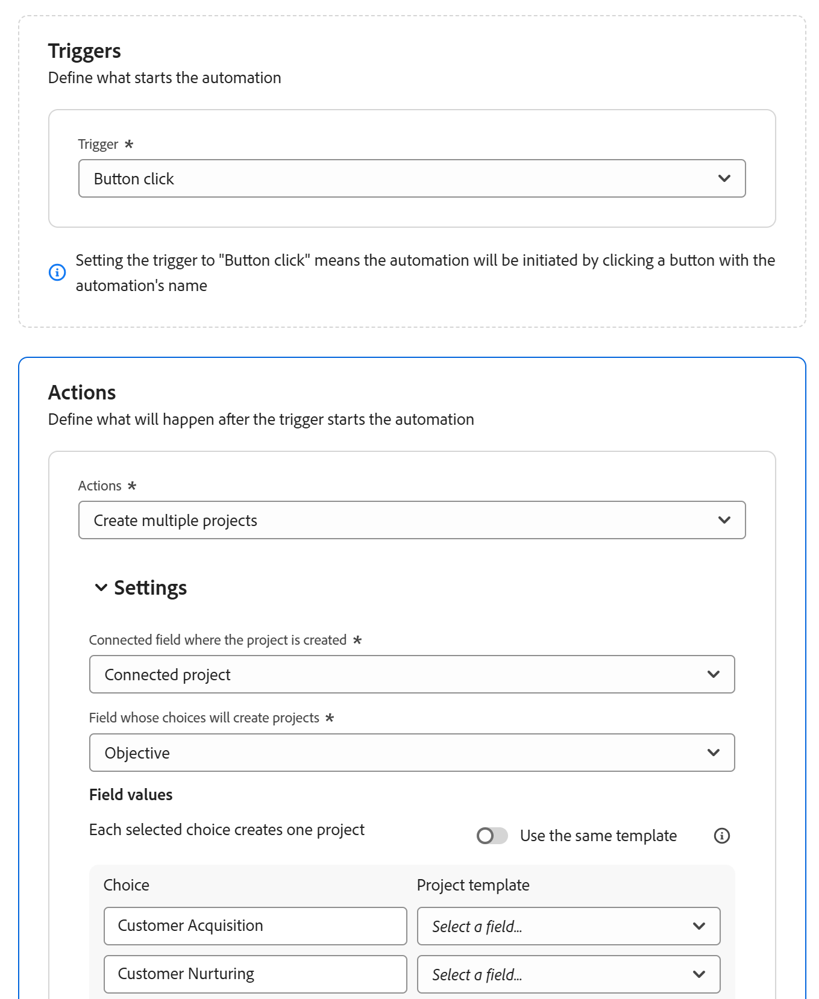

# Adobe Systems Workfront Planning 자동화 구성

<!--add screen shots when UI is finalized AND redo all the steps - some things got changed and moved around-->

<!--you might need to add something about notifications and emails?!-->
<!--add a new section to this article to mention a new way to create objects: help/quicksilver/planning/records/create-records.md-->
<!-- add a new section to this article to mention a new way to create WF objects from Planning: help/quicksilver/planning/records/create-workfront-objects-from-workfront-planning.md-->

<!-- if they give access to use the automation to people with LESS than Manage permissions to a workspace, split this article in two: the Configure section should be for admins and the "Use a Workfront Planning automation to create an object" should be for all other users-->

<!--The highlighted information on this page refers to functionality not yet generally available. It is available only in the Preview environment for all customers. After the monthly releases to Production, the same features are also available in the Production environment for customers who enabled fast releases.    

For information about fast releases, see [Enable or disable fast releases for your organization](/help/quicksilver/administration-and-setup/set-up-workfront/configure-system-defaults/enable-fast-release-process.md). -->

Adobe Systems Workfront Planning에서 자동화를 구성하여 활성화될 때 Workfront에서 개체를 생성하거나 Planning 레코드에서 트리거될 때 Workfront Planning의 레코드를 만들 수 있습니다. 생성된 개체 또는 레코드는 자동화를 트리거하는 레코드에 자동으로 연결됩니다.

Workfront Planning의 레코드 유형 페이지에서 자동화를 구성하고 활성화할 수 있습니다.

예를 들어, Workfront Planning 캠페인을 가져와 Workfront에서 프로젝트를 생성하여 해당 캠페인의 진행 상황을 추적하는 자동화를 만들 수 있습니다.

이 문서에서는 자동화를 편집, 비활성화, 삭제 및 트리거하여 개체 및 레코드를 만드는 방법을 포함하여 자동화를 관리 하는 방법을 설명합니다.

기존 자동화를 사용하여 레코드 또는 개체를 만드는 방법에 대한 자세한 내용은 Adobe Systems Workfront Planning 레코드 자동화를 사용하여 개체 만들기 를 참조하십시오[&#128279;](/help/quicksilver/planning/records/create-wf-objects-using-planning-automations.md).

## 액세스 요구 사항

+++ 액세스 요구 사항을 보려면 확장합니다.

<table style="table-layout:auto"> 
<col> 
</col> 
<col> 
</col> 
<tbody> 
    <tr> 
<tr> 
<td> 
   
 제품
 </td> 
   <td> 
   <ul><li>
 Adobe Workfront
</li> 
   <li>
 Adobe Workfront Planning
</li></ul></td> 
  </tr>   
<tr> 
   <td role="rowheader">
Adobe Systems Workfront 플랜*
</td> 
   <td> 

다음 Workfront 플랜 중 하나:
 
<ul><li>선택</li> 
<li>Prime</li> 
<li>Ultimate</li></ul> 

Workfront Planning은 기존 Workfront 플랜에 사용할 수 없습니다
 
   </td> 
<tr> 
   <td role="rowheader">
Adobe Systems Workfront 계획 패키지*
</td> 
   <td> 

어떤 
 

각 Workfront Planning 플랜에 포함된 항목에 대한 자세한 내용은 Workfront 계정 관리자 관리자에게 문의하십시오. 
 
   </td> 
 <tr> 
   <td role="rowheader">
Adobe Systems Workfront 플랫폼
</td> 
   <td> 

Workfront Planning에 액세스하려면 조직의 Workfront 인스턴스가 Adobe Systems 통합 환경에 온보딩되어 있어야 합니다.
 

자세한 내용은 Adobe Systems Unified Experience for Workfront<a href="/help/quicksilver/workfront-basics/navigate-workfront/workfront-navigation/adobe-unified-experience.md">를 참조하십시오</a>. 
 
   </td> 
   </tr> 
  </tr> 
  <tr> 
   <td role="rowheader">
Adobe Systems Workfront 라이선스*
</td> 
   <td> 표준
   
Workfront Planning은 기존 Workfront 라이선스에 사용할 수 없습니다
 
  </td> 
  </tr> 
  <tr> 
   <td role="rowheader">
액세스 수준 구성
</td> 
   <td> 
Adobe Systems Workfront Planning에 대한 액세스 수준 컨트롤은 없습니다
 
   
생성하려는 개체 유형(프로젝트, 포트폴리오, 프로그램)에 대한 Workfront에서 개체 만들기 액세스 권한이 있는 편집 권한. 
  
</td> 
  </tr> 
<tr> 
   <td role="rowheader">
개체 사용 권한
</td> 
   <td> 
작업 영역 및 자동화를 만들려는 레코드 종류에 대한 사용 권한을 관리합니다. 

   
시스템 관리자는 만들지 않은 작업 영역을 포함하여 모든 작업 영역에 대한 관리 권한을 가집니다

   </td> 
  </tr> 
</tbody> 
</table>

*Workfront 액세스 요구 사항에 대한 자세한 내용은 Workfront 설명서의 [액세스 요구 사항](/help/quicksilver/administration-and-setup/add-users/access-levels-and-object-permissions/access-level-requirements-in-documentation.md)을 참조하십시오.

+++

## Workfront Planning에서 자동화 구성

Workfront Planning에서 레코드 유형에 대한 자동화를 구성해야 개체를 만들 수 있습니다.

{{step1-to-planning}}

1. 레코드 종류 카드 을 클릭한 다음, 레코드 이름을 클릭하십시오.

   레코드 종류 페이지 가 열립니다.
1. **레코드 유형 이름 오른쪽에 있는 More(더보기**) 메뉴 클릭한 다음 Manage automations(자동화 관리)를&#x200B;**클릭합니다**.

   선택한 레코드 종류에 대해 사용 가능한 자동화 목록이 열립니다.

1. 화면 오른쪽 상단 모서리에 있는 새로 만들기 자동화&#x200B;**를 클릭합니다**. **새로 만들기 자동화** 상자가 열립니다.
1. 다음 필드를 업데이트합니다.

   * **제목 없는 자동화**&#x200B;를 자동화 버튼 버튼에 표시하려는 텍스트로 바꾸기. 사용자는 자동화를 사용하여 Workfront 객체 또는 Planning 레코드를 생성할 때 이 버튼 버튼을 클릭합니다.
   * **설명**: 자동화의 목적을 식별하는 설명을 추가합니다.
1. 저장&#x200B;**클릭합니다**.
자동화 세부 정보 페이지 가 열립니다.

1. 자동화의 세부 정보 페이지 에서 트리거 섹션의 **다음 필드를 업데이트합니다.**

   * **트리거**: 자동화를 트리거할 작업을 선택합니다. 예를 들어 **단추 클릭**&#x200B;을 선택합니다. <!--update this step with a list of all possible triggers; right now only Button click is available-->

1. **작업** 섹션에서 다음 필드를 업데이트합니다. <!--submitted bugs for these fields - see if they need changing here-->
   * **작업**: 자동화를 트리거할 때 Workfront에서 수행할 작업을 선택합니다. 필수 필드입니다.
다음 작업 중 하나를 선택합니다.

      * 여러 프로젝트 만들기
      * 단일 프로젝트 만들기
      * 프로젝트 만들기
      * 레코드 만들기
      * 프로그램 만들기
      * 포트폴리오 만들기
      * 그룹 만들기

     >[!TIP]
     >
     >자동화를 저장한 후에는 이 필드에서 선택한 작업을 더 이상 변경할 수 없습니다.

1. (조건부) 선택한 작업에 따라 다음 필드를 업데이트합니다.

   * **단일 프로젝트** 만들기: <!--replace to the left: Create a single project-->
      * **프로젝트가 만들어지**&#x200B;는 연결된 필드: 새 프로젝트가 표시될 연결된 필드입니다. 필수 필드입니다.
      * **프로젝트 템플릿**: Workfront에서 프로젝트를 만드는 데 사용할 프로젝트 템플릿을 선택하십시오.

   * 여러 프로젝트 만들기:
      * **프로젝트가 만들어지**&#x200B;는 연결된 필드: 새 프로젝트가 표시될 연결된 필드입니다. 필수 필드입니다.
      * **선택 항목에 따라 레코드**&#x200B;가 만들어지는 필드: 선택한 레코드 종류에서 다중 또는 단일 선택 필드를 선택합니다. Workfront는 자동화를 트리거하는 레코드에서 현재 선택된 각 필드 선택 항목에 대한 프로젝트를 만듭니다.

     >[!TIP]
     >
     >자동화를 실행 중인 레코드의 다중 또는 단일 선택 필드에서 현재 선택된 옵션에 대해서만 프로젝트가 생성되며 해당 필드에 대해 가능한 모든 선택 항목에 대해서는 생성되지 않습니다.
     >

      * **동일한 템플릿** 사용: 각각의 새 프로젝트에 동일한 템플릿을 사용하려면 이 옵션을 선택합니다. 이 옵션이 선택 취소되어 있으면 각 필드 선택 항목에 대해 프로젝트 템플릿&#x200B;**을 선택합니다**.
      * **프로젝트 템플릿**: 동일한 템플릿&#x200B;**사용 옵션을 선택한**&#x200B;경우 Workfront에서 프로젝트를 만드는 데 사용할 프로젝트 템플릿을 선택합니다.

   * **포트폴리오** 만들기:
      * **포트폴리오가 만들어지**&#x200B;는 연결된 필드: 새 포트폴리오가 표시되는 연결된 필드입니다. 필수 필드입니다.
      * **새 포트폴리오**&#x200B;에 첨부할 사용자 지정 양식: 새 포트폴리오에 첨부할 사용자 지정 양식을 선택합니다. 포트폴리오 사용자 지정 양식을 선택하려면 먼저 만들어야 합니다.
   * **프로그램** 만들기:
      * **프로그램이 생성**&#x200B;되는 연결된 필드: 새 프로그램이 표시될 연결된 필드입니다. 필수 필드입니다.
      * **프로그램 포트폴리오**: 새 프로그램을 추가할 포트폴리오를 선택합니다. 필수 필드입니다.
      * **새 프로그램에** 첨부할 사용자 지정 양식: 새 프로그램에 첨부할 사용자 지정 양식을 선택합니다. 프로그램 사용자 지정 양식을 선택해야 합니다.
   * **그룹** 만들기:
      * **그룹이 생성**&#x200B;되는 연결된 필드: 새 그룹이 표시될 연결된 필드입니다. 필수 필드입니다.
      * **새 그룹** 그룹에 첨부할 사용자 지정 양식: 새 프로그램에 첨부할 사용자 지정 양식을 선택합니다. 프로그램 사용자 지정 양식을 선택해야 합니다.
   * **레코드** 만들기:
      * **레코드 종류**: 만들려는 레코드 종류를 선택합니다.

        설정&#x200B;**하위 섹션이**&#x200B;표시됩니다. 설정&#x200B;**하위 섹션에서 다음 필드를**&#x200B;업데이트합니다.

         * **현재 레코드가 표시될** 연결된 레코드 종류의 필드: 현재 레코드가 표시될 작업에 대해 선택한 레코드 종류의 연결된 필드입니다.

        예를 들어, 제품 레코드를 연결할 캠페인에 대한 자동화를 만드는 경우 자동화를 사용하여 제품을 만든 후 캠페인이 표시되는 제품 레코드 유형의 연결된 필드입니다.

        필수 필드입니다.

        <!--submitted a change in functionality and UI text for this - revise??-->
**필드 매핑** 영역에서 다음 정보를 업데이트하십시오.

         * **전송 원본**: 연결된 레코드 형식의 필드에 매핑하려면 자동화를 만드는 레코드 형식에서 필드를 선택하십시오.
         * **전송 대상**: 새로 만든 레코드에서 자동화를 실행 중인 레코드의 정보로 채울 필드를 선택합니다.

        >[!TIP]
        >
        >* 원래 레코드 유형의 필드 유형은 새로 만든 레코드 유형의 필드 유형과 일치해야 합니다.
        >* 필드 없음을 선택하면 새 레코드의 이름은 제목 없는 레코드&#x200B;**가 됩니다**.

1. (선택 사항 및 조건부) 레코드를 만들도록 선택한 경우 필드&#x200B;**추가를 클릭하여**&#x200B;한 레코드의 추가 조회 필드를 다른 레코드에 매핑합니다.
1. (조건부) 원래 레코드 종류와 레코드 종류 필드에서 **선택한 레코드 종류 사이에 연결 필드가 없는 경우 연결된 필드** 추가를 클릭합니다&#x200B;**.**

   

   다음 두 필드가 만들어집니다.

   * 레코드 종류&#x200B;**필드에 표시**&#x200B;한 레코드 종류에 대해 연결된 레코드&#x200B;**라는 새 연결 필드**&#x200B;가 만들어집니다.
   * Record type(레코드 종류&#x200B;**)**&#x200B;필드에 표시된 것과 동일한 이름을 가진 새 연결 필드가 자동화를 구성하는 레코드 종류에 대해 생성됩니다.

     예를 들어 Brands라는 다른 레코드 유형을 자동으로 만들도록 Campaigns에 대한 자동화를 구성하는 경우 연결된 필드&#x200B;**추가를 클릭하면**&#x200B;다음 필드가 만들어집니다.

      * **연결된 레코드** 연결 필드는 브랜드&#x200B;**레코드 종류에 대해 작성됩니다**.
      * **캠페인** 레코드 종류에 대해 **브랜드** 연결 필드가 만들어집니다.

1. (선택 사항) 원래 레코드 종류와 작업 영역에서 선택한 Workfront 개체 사이에 연결 필드가 없는 경우 연결된 필드&#x200B;**추가를 클릭합니다**.

   

   다음이 생성됩니다.

   * 자동화를 빌드하는 레코드 종류에 대해 **Connected &lt; name of Workfront object >**(이)라는 새 연결 필드가 만들어집니다. 예를 들어 자동으로 프로젝트를 만들도록 선택하면 자동화를 빌드하고 있는 레코드 형식에 대해 **연결된 프로젝트** 필드가 만들어집니다.
   * 자동화를 구성하는 레코드 유형의 이름으로 새 레코드 유형 카드가 Workfront의 Workfront 프로젝트 계획 섹션에 추가됩니다.

1. 자동화 세부 정보 페이지의 오른쪽 상단에서 **저장**&#x200B;을 클릭합니다.

   자동화는 자동화 목록에 표시되며 레코드에서 사용할 수 있습니다.

## 기존 자동화 관리

{{step1-to-planning}}

1. 레코드 종류 카드 을 클릭한 다음, 레코드 이름을 클릭하십시오.

   레코드 종류 페이지 가 열립니다.
1. **레코드 유형 이름 오른쪽에 있는 More(더보기**) 메뉴 클릭한 다음 Manage automations(자동화 관리)를&#x200B;**클릭합니다**.

   선택한 레코드 종류에 대해 사용 가능한 자동화 목록이 열립니다.

1. (선택 사항) 자동화를 수정, 비활성화 또는 삭제하려면 다음 중 하나를 수행합니다.

   1. 자동화 목록에서 저장된 자동화의 이름 위로 마우스를 가져간 다음 더보기&#x200B;**메뉴**&#x200B;더보기 메뉴를.

   1. 편집(Edit **)을 클릭하여**&#x200B;다음 정보를 업데이트합니다.

      * **자동화 이름 오른쪽에 있는 More** 메뉴  클릭한 다음 편집&#x200B;**을 클릭하여**&#x200B;자동화 이름을 변경합니다.
      * 작업&#x200B;**필드를 제외한 자동화의 모든 필드입니다**.

        >[!TIP]
        >
        >자동화를 위해 원래 선택한 작업은 변경할 수 없습니다.

   1. 레코드의 테이블 보기에서 자동화를 제거하고 사용자가 레코드 또는 개체를 만드는 데 자동화를 사용하지 못하도록 하려면 **사용 안 함**&#x200B;을 클릭합니다.

      비활성화된 자동화를 사용하여 생성된 레코드는 원래 선택한 레코드에 연결된 상태로 유지됩니다.

      다시 사용할 수 있게 하려면 더 보기&#x200B;**메뉴**&#x200B;더 보기 메뉴를다음 활성화&#x200B;**를 클릭합니다**.
   1. 삭제&#x200B;**를 클릭하여**&#x200B;자동화를 삭제합니다. 삭제된 자동화는 복구할 수 없습니다.

      삭제된 자동화를 사용하여 생성된 레코드는 원래 선택한 레코드에 연결된 상태로 유지됩니다.
