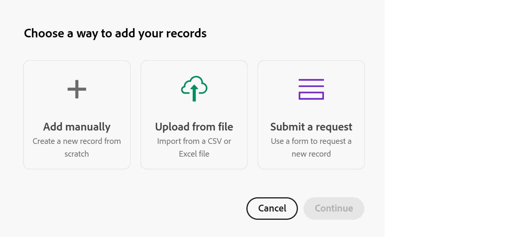

# 레코드 만들기

<!--
The highlighted information on this page refers to functionality not yet generally available. It is available only in the Preview environment for all customers. After the monthly releases to Production, the same features are also available in the Production environment for customers who enabled fast releases.    

For information about fast releases, see [Enable or disable fast releases for your organization](/help/quicksilver/administration-and-setup/set-up-workfront/configure-system-defaults/enable-fast-release-process.md). 

-->

{{planning-important-intro}}

Adobe Workfront Planning에서 레코드는 레코드 유형의 인스턴스입니다.

다음 중 하나를 수행하여 레코드를 만들 수 있습니다.

* [레코드 유형 보기에서 새 레코드 또는 레코드 요청 단추 사용](#create-records-using-the-new-record-or-request-record-button-from-any-record-type-view)
* [레코드 유형 테이블 보기에서 인라인으로 추가합니다.](#create-records-by-adding-them-inline-from-the-record-type-table-view)
* [레코드 유형 타임라인 보기에서 추가합니다.](#create-records-by-adding-them-in-the-record-type-timeline-view)
* [레코드 유형 달력 보기에 추가하십시오.](#create-records-by-adding-them-in-the-record-type-calendar-view)
* [외부 목록에서 레코드 목록 복사 및 붙여넣기](#create-records-by-copying-and-pasting-them-from-an-external-list)
* [테이블 보기에서 레코드 복제](#create-records-by-duplicating-them)
* [다른 레코드와 연결](#create-records-as-you-connect-them)
* [레코드 유형에 요청 양식 제출](#create-records-by-submitting-a-request-form-to-a-record-type)
* [CSV 또는 Excel 파일에서 정보 가져오기](#create-records-by-importing-records-from-a-csv-or-excel-file)
* [자동화 사용](#create-records-by-using-automations)

테이블 또는 타임라인 보기에서 레코드 관리에 대한 자세한 내용은 다음 문서를 참조하십시오.

* [표 보기 관리](/help/quicksilver/planning/views/manage-the-table-view.md)
* [타임라인 보기 관리](/help/quicksilver/planning/views/manage-the-timeline-view.md)

## 액세스 요구 사항

+++ 을 확장하여 이 문서의 기능에 대한 액세스 요구 사항을 봅니다. 

<table style="table-layout:auto"> 
<col> 
</col> 
<col> 
</col> 
<tbody> 
    <tr> 
<tr> 
</tr>   
<tr> 
   <td role="rowheader">
Adobe Workfront 패키지
</td> 
   <td> 

모든 Workfront 및 모든 Planning 패키지
 
모든 워크플로우 및 모든 Planning 패키지

각 Workfront Planning 패키지에 포함된 내용에 대한 자세한 내용은 Workfront 계정 담당자에게 문의하십시오. 
 
   </td> 
  <tr> 
   <td role="rowheader">
Adobe Workfront 라이선스
</td> 
   <td>
표준

   </td> 
  </tr> 
  <tr> 
   <td role="rowheader">
개체 권한
</td> 
   <td> 
레코드를 추가할 작업 영역 및 레코드 종류에 대한 또는 그 이상의 권한을 제공하십시오. 

   
레코드 페이지의 레코드 요청 버튼을 사용하여 레코드를 만들 수 있는 작업 공간 및 레코드 종류에 대한 이상의 권한을 봅니다

   
시스템 관리자는 만들지 않은 작업 영역을 포함하여 모든 작업 영역에 대한 권한을 가집니다

   
하위 개체(프로젝트)를 추가하기 위해 Workfront 개체(포트폴리오)에 대한 권한을 관리합니다.

   </td> 
  </tr>  
</tbody> 
</table>

Workfront 액세스 요구 사항에 대한 자세한 내용은 Workfront 설명서의 [액세스 요구 사항](/help/quicksilver/administration-and-setup/add-users/access-levels-and-object-permissions/access-level-requirements-in-documentation.md)을 참조하십시오.

+++   

<!--Old:
<table style="table-layout:auto"> 
<col> 
</col> 
<col> 
</col> 
<tbody> 
    <tr> 
<tr> 
<td> 
   
 Products
 </td> 
   <td> 
   <ul><li>
 Adobe Workfront
</li> 
   <li>
 Adobe Workfront Planning
</li></ul></td> 
  </tr>   
<tr> 
   <td role="rowheader">
Adobe Workfront plan*
</td> 
   <td> 

Any of the following Workfront plans:
 
<ul><li>Select</li> 
<li>Prime</li> 
<li>Ultimate</li></ul> 

Workfront Planning is not available for legacy Workfront plans
 
   </td> 
<tr> 
   <td role="rowheader">
Adobe Workfront Planning package*
</td> 
   <td> 

Any 
 

For more information about what is included in each Workfront Planning plan, contact your Workfront account manager. 
 
   </td> 
 <tr> 
   <td role="rowheader">
Adobe Workfront platform
</td> 
   <td> 

Your organization's instance of Workfront must be onboarded to the Adobe Unified Experience to be able to access Workfront Planning.
 

For more information, see <a href="/help/quicksilver/workfront-basics/navigate-workfront/workfront-navigation/adobe-unified-experience.md">Adobe Unified Experience for Workfront</a>. 
 
   </td> 
   </tr> 
  </tr> 
  <tr> 
   <td role="rowheader">
Adobe Workfront license*
</td> 
   <td> Standard
   
Workfront Planning is not available for legacy Workfront licenses
 
  </td> 
  </tr> 
  <tr> 
   <td role="rowheader">
Access level configuration
</td> 
   <td> 
There are no access level controls for Adobe Workfront Planning
 
   
Edit access in Workfront for the object types that you want to create (projects, programs, and portfolios) as you connect the records to them. 
  
</td> 
  </tr> 
<tr> 
   <td role="rowheader">
Object permissions
</td> 
   <td> 
Contribute or higher permissions to the workspace and record type where you want to add records. 

   
View or higher permissions to the workspace and record type to create records using the Request record button on the record page

   
System Administrators have permissions to all workspaces, including the ones they did not create

   
Manage permissions to Workfront objects (portfolios) to add children objects (projects).

   </td> 
  </tr> 

</tbody> 
</table> -->

## 레코드 유형 보기에서 새 레코드 또는 레코드 요청 버튼을 사용하여 레코드 만들기

작업 공간 및 레코드 유형에 대한 보기 권한이 있는 사용자는 레코드 유형 페이지의 레코드 요청 버튼을 사용해야만 레코드를 만들 수 있습니다.

작업 공간 및 레코드 유형에 대한 기여 및 관리 권한이 있는 사용자는 레코드 유형 페이지의 새 레코드 단추를 사용하여 레코드를 만들 수 있습니다.

>[!IMPORTANT]
>
>작업 영역 관리자는 보기 권한이 있는 사용자가 요청 양식을 사용하여 레코드를 추가할 수 있도록 레코드 유형에 대한 요청 양식을 만들어야 합니다. 그렇지 않으면 보기 권한 사용자가 레코드를 만들 수 없습니다.

{{step1-to-planning}}

1. 레코드를 추가할 작업 영역을 클릭합니다.

   작업공간이 열리고 레코드 유형이 카드로 표시됩니다.

1. 레코드 유형 카드를 클릭합니다. 레코드 종류 만들기에 대한 자세한 내용은 [레코드 종류 만들기](/help/quicksilver/planning/architecture/create-record-types.md)를 참조하세요.

   마지막으로 액세스한 보기에서 레코드 유형 페이지가 열립니다. 기본적으로 레코드 유형 페이지가 표 뷰에 열립니다.
선택한 유형의 모든 레코드가 뷰에 표시됩니다.

1. (조건부) 작업 공간 및 레코드 유형 권한에 따라 화면 오른쪽 상단의 다음 아이콘을 클릭합니다.

   * 작업 영역 및 레코드 종류에 대한 Contribute 이상의 권한이 있는 경우 **새 레코드**&#x200B;을(를) 클릭합니다

     또는

   * 작업 영역 및 레코드 종류에 대한 보기 권한이 있는 경우 **레코드 요청**&#x200B;을 클릭합니다.

1. (조건부) **새 레코드**&#x200B;을(를) 클릭한 경우 다음 작업을 수행하십시오.

   1. 다음 방법 중 하나를 클릭하여 레코드를 만든 다음 **계속**&#x200B;을 클릭합니다.

      * **수동으로 추가**. 레코드의 미리보기 상자가 열립니다.\
        이 문서의 레코드 유형 테이블 보기[&#x200B; 섹션에서 인라인으로 추가하여 &#x200B;](#create-records-by-adding-them-inline-from-the-record-type-table-view)레코드 만들기&lbrace;6단계부터 시작하여 에 설명된 대로 레코드에 대한 정보를 추가합니다. <!--insure this stays accurate-->
      * **파일에서 업로드**
문서 [CSV 또는 Excel 파일에서 정보를 가져와서 레코드 만들기](/help/quicksilver/planning/records/import-file-to-create-records.md)에 설명된 대로 6단계부터 레코드를 추가합니다. <!--ensure this stays accurate-->
      * **요청 제출**
레코드 유형의 요청 양식이 열립니다.

        작업 영역 관리자는 요청 양식을 사용하여 레코드를 추가할 수 있도록 요청 양식을 만들어야 합니다.

        >[!TIP]
        >
        >일부 레코드 유형에는 여러 양식이 있을 수 있습니다. 열려면 하나를 클릭하십시오.

        문서 [레코드 만들기에 대한 Adobe Workfront Planning 요청 제출](/help/quicksilver/planning/requests/submit-requests.md)에 설명된 대로 레코드를 6단계부터 추가합니다. <!--ensure this stays accurate-->

      

1. (조건부) **레코드 요청**&#x200B;을 클릭한 경우 다음을 수행하십시오.

   1. (조건부) 레코드 종류에 요청 양식이 두 개 이상 있는 경우 하나를 클릭하여 선택합니다.
   2. 문서 [레코드 만들기에 대한 Adobe Workfront Planning 요청 제출](/help/quicksilver/planning/requests/submit-requests.md)에 설명된 대로, 6단계부터 양식에 정보를 계속 추가하여 레코드를 만듭니다. <!--ensure this stays accurate-->

1. (조건부) 새 레코드를 검토합니다.

   레코드를 추가하도록 선택한 방법에 따라 다음 중 일부가 발생할 수 있습니다.

   * 승인 프로세스가 있는 요청 양식을 사용하여 추가하도록 선택하지 않은 경우 새 레코드가 레코드 유형에 추가됩니다. 레코드를 만들기 전에 모든 승인자가 승인을 받아야 합니다.
   * CSV 또는 Excel 스프레드시트를 사용하여 레코드를 추가한 경우 레코드 유형에 여러 레코드가 추가됩니다.
   * 요청 양식을 제출하여 요청을 추가한 경우 Workfront 요청 영역의 계획 탭에 새 요청이 추가됩니다.

<!-- this is not possible anymore: 

## Create records by connecting them from another application

You can import records from other applications by linking them to existing records. This creates a linked record for the other application's connected object. 

1. Create a record type, as described in the [Create record types](/help/quicksilver/planning/architecture/create-record-types.md).

1. Create records for the record type you created in the previous step. For information, see the section [Create records by manually adding them to a record type](#create-records-by-manually-adding-them-to-a-record-type) in this article. 

1. Create a connection to an object type from another application for the record type you created. For information, see [Connect record types](/help/quicksilver/planning/architecture/connect-record-types.md).

1. Add objects from another application to the records you created above using the linked record field you created in the previous step. For information, see [Connect records](/help/quicksilver/planning/records/connect-records.md). 

    The following items are created in Workfront Planning:

    * A read-only record type that refers to the other application's record type you linked to in the connected record field. 

      For example, if you connect a Planning record type to Workfront project, a read-only record type named "Workfront project" is created in the same workspace. You can access the read-only Workfront record types from the table view of the Planning records you're linking from. 
   
-->

## 레코드 유형 테이블 보기에서 인라인으로 추가하여 레코드를 만듭니다.

레코드 유형 페이지의 테이블 보기에서 레코드를 만들면 인라인으로 추가할 수 있습니다.

레코드 정보 편집에 대한 자세한 내용은 [레코드 편집](/help/quicksilver/planning/records/edit-records.md)을 참조하세요.

{{step1-to-planning}}

1. 레코드를 추가할 작업 영역을 클릭합니다.

   작업공간이 열리고 레코드 유형이 카드로 표시됩니다.

1. 레코드 유형 카드를 클릭합니다. 레코드 종류 만들기에 대한 자세한 내용은 [레코드 종류 만들기](/help/quicksilver/planning/architecture/create-record-types.md)를 참조하세요.

   마지막으로 액세스한 보기에서 레코드 유형 페이지가 열립니다. 기본적으로 레코드 유형 페이지가 표 뷰에 열립니다.
선택한 유형의 레코드가 뷰에 표시됩니다.

1. (조건부) 테이블 보기에서 다음 중 하나를 수행합니다.

   * 테이블의 마지막 행이나 그룹화의 마지막 레코드 뒤에 있는 **새 레코드**&#x200B;을(를) 클릭합니다

     >[!TIP]
     >
     >그룹화 또는 하위 그룹화의 마지막 레코드 뒤에 새 레코드를 추가하면 Workfront이 그룹화에 포함된 필드를 자동으로 채웁니다. 필요한 경우 이러한 필드를 수동으로 편집할 수 있으며 그룹화에서 레코드가 제거될 수 있습니다.

   * 표의 열 또는 행에서 키보드에서 **Shift + Enter**&#x200B;를 클릭합니다. 이렇게 하면 시작한 레코드 아래에 빈 행이 추가됩니다.
   * 레코드의 기본 필드 위에 마우스를 가져다 대고 필드 오른쪽에 있는 **자세히** 메뉴 를 클릭한 다음 **위에 레코드 삽입** 또는 **아래에 레코드 삽입**&#x200B;을 클릭합니다.

   

   Workfront은 각 새 레코드에 썸네일을 자동으로 업로드합니다. 나중에 이러한 이미지를 수정할 수 있습니다. 자세한 내용은 [레코드에 표지 이미지 추가](/help/quicksilver/planning/records/add-a-cover-image-to-a-record.md)를 참조하십시오.

   새 레코드가 표에 추가됩니다.

1. 새 레코드의 기본 필드 클릭

   또는

   레코드 이름 왼쪽의 테이블 이름 필드에 있는 **세부 정보 열기** 아이콘 을 클릭합니다.

   테이블에 미리보기 상자가 열립니다.

1. 미리 보기 상자에 표시되는 필드에 새 레코드에 대한 정보를 입력하십시오.

   >[!NOTE]
   >
   >  * 레코드에 대한 필수 필드가 없습니다. 그러나 레코드를 서로 연결할 때 레코드를 식별하는 데 도움이 되므로 레코드의 기본 필드에 대한 정보를 추가하는 것이 좋습니다. 기본 필드에 대한 자세한 내용은 [테이블 보기 관리](/help/quicksilver/planning/views/manage-the-table-view.md) 및 [기본 필드 개요](/help/quicksilver/planning/fields/primary-field-overview.md)를 참조하십시오.
   >
   >  * 다른 레코드 종류 또는 계산된 필드를 참조하는 필드는 읽기 전용 필드입니다.

1. (조건부) 테이블에서 레코드를 추가할 때 레코드의 미리 보기 상자를 열기 전에 각 행에 정보를 계속 추가한 다음 키보드에서 **Enter**&#x200B;를 클릭하여 변경 내용을 저장합니다.

   또는

   새 레코드 이름 또는 레코드 이름 왼쪽의 **세부 정보 열기** 아이콘 을 클릭하여 미리 보기 상자를 열고 세부 정보 영역에서 레코드 정보를 편집합니다.

   >[!TIP]
   >
   >이름 필드가 기본 필드인 경우 레코드의 이름 필드에서만 **세부 정보 열기** 아이콘에 액세스할 수 있습니다.

1. (선택 사항) 레코드의 미리 보기 상자에서 오른쪽 상단의 **새 탭에서 열기** 아이콘 을 클릭하여 새 탭에서 레코드의 페이지를 엽니다. 레코드 페이지에서 레코드 편집을 계속합니다. 자세한 내용은 [레코드 편집](/help/quicksilver/planning/records/edit-records.md)을 참조하세요.

   Workfront은 변경 사항을 자동으로 저장합니다.

1. (선택 사항) 레코드의 페이지를 연 경우 미리 보기 상자를 닫거나 레코드 이름 왼쪽에 있는 뒤로 화살표를 클릭합니다.

1. (선택 사항) 테이블 보기에서 새 레코드 또는 해당 정보를 추가할 때 다음 키보드 단축키를 사용하여 해당 정보 추가를 실행 취소하거나 재실행합니다.

   * 변경 내용을 실행 취소하려면 CTRL + Z(⌘ + Z, Mac)
   * Mac 변경 내용을 다시 실행하려면 CTRL + Shift + Z(⌘ + Shift + Z)

## 레코드 유형 타임라인 보기에서 레코드를 추가하여 레코드 만들기

레코드 유형 페이지의 타임라인 보기에서 타임라인을 두 번 클릭하여 레코드를 만들 수 있습니다.

타임라인 보기를 만드는 방법에 대한 자세한 내용은 [타임라인 보기 관리](/help/quicksilver/planning/views/manage-the-timeline-view.md)를 참조하십시오.

{{step1-to-planning}}

1. 레코드를 추가할 작업 영역을 클릭합니다.

   작업공간이 열리고 레코드 유형이 카드로 표시됩니다.

1. 레코드 유형 카드를 클릭합니다.

   마지막으로 액세스한 보기에서 레코드 유형 페이지가 열립니다.

1. 을 클릭하여 타임라인 보기를 열거나 먼저 타임라인 보기를 만듭니다.

   >[!NOTE]
   >
   >레코드 종류와 관련된 날짜 필드가 두 개 이상 있는 경우에만 타임라인 보기를 만들 수 있습니다.
1. 타임라인의 아무 곳이나 두 번 클릭합니다.

   **새 레코드** 상자가 열립니다. <!--might need a new screen shot for Production - might add a title etc-->

   
1. 다음 정보를 업데이트합니다.

   * **이름**: 레코드 이름을 입력하십시오. 비워 두면 Workfront은 기본적으로 이름을 **제목 없음**&#x200B;으로 지정합니다.

     >[!TIP]
     >
     >타임라인 설정에 따라 레코드 막대에 레코드 이름 을 표시하는 경우 이 이름을 비워 두면 레코드 막대에 표시되지 않습니다.

   * **레코드 날짜 필드**: 레코드 날짜를 업데이트합니다.

     날짜 필드의 이름은 타임라인 보기를 만들 때 시작 및 종료 날짜에 대해 선택한 필드에 따라 사용자 지정됩니다.

     기본적으로 날짜 값은 타임라인 보기를 표시하는 방법에 따라 미리 선택됩니다. 다음과 같은 시나리오가 있습니다.

      * **년**&#x200B;까지: 기록 시작 날짜와 종료 날짜가 한 달에 걸쳐 있습니다.
      * **분기**&#x200B;까지: 기록 시작 날짜와 종료 날짜가 한 주에 걸쳐 있습니다.
      * **개월**&#x200B;까지: 기록 시작 날짜와 종료 날짜가 3일에 걸쳐 있습니다.

1. (선택 사항) 다음 아이콘 중 하나를 클릭합니다.

   * **확장** 을 클릭하여 미리 보기 창에서 레코드 세부 정보를 엽니다.
   * 레코드를 삭제하려면 **삭제** .
   * **닫기** 을 클릭하여 새 레코드 상자를 닫습니다.

   **삭제** 아이콘을 클릭하지 않은 경우 레코드가 타임라인뿐만 아니라 테이블 및 달력 보기에 즉시 추가됩니다.

1. (선택 사항) 타임라인에서 레코드 막대의 여백 중 하나를 마우스로 가리킨 다음 막대의 끝을 다른 날짜로 끌어서 놓습니다. 이렇게 하면 레코드의 시작 및 종료 날짜가 자동으로 변경됩니다.

   자세한 내용은 [레코드 편집](/help/quicksilver/planning/records/edit-records.md)을 참조하세요.

1. (선택 사항) 타임라인에서 레코드 막대를 눌러 레코드의 세부 정보 창을 열고 정보를 업데이트하거나 삭제하거나 설명을 추가합니다.

   >[!TIP]
   >
   >기본적으로 Workfront은 레코드를 썸네일 및 표지 이미지와 연결합니다.
   >
   >축소판은 보기 설정에서 활성화된 경우에만 타임라인 보기에 표시됩니다.

## 레코드 유형 달력 보기에 추가하여 레코드 만들기

달력의 아무 곳이나 두 번 클릭하여 레코드 유형 페이지의 달력 보기에서 레코드를 만들 수 있습니다.

일정 보기를 만드는 방법에 대한 자세한 내용은 [일정 보기 관리](/help/quicksilver/planning/views/manage-the-calendar-view.md)를 참조하세요.

{{step1-to-planning}}

1. 레코드를 추가할 작업 영역을 클릭합니다.

   작업공간이 열리고 레코드 유형이 카드로 표시됩니다.

1. 레코드 유형 카드를 클릭합니다.

   마지막으로 액세스한 보기에서 레코드 유형 페이지가 열립니다.

1. 을 클릭하여 달력 보기를 열거나 달력 보기를 만듭니다.

   >[!NOTE]
   >
   >레코드 유형과 연결된 날짜 필드가 두 개 이상인 경우에만 달력 보기를 만들 수 있습니다.
1. 캘린더의 아무 곳이나 두 번 클릭합니다.

   **새 레코드** 상자가 열립니다. <!--(********might need a new screen shot for Production - might add a title etc*********ALSO CHECK IF THE SAME ONE NEEDS REPLACING FOR TIMELINE?????)-->

   

1. 다음 정보를 업데이트합니다.

   * **이름**: 레코드 이름을 입력하십시오. 비워 두면 Workfront은 기본적으로 이름을 **제목 없음**&#x200B;으로 지정합니다.

     >[!TIP]
     >
     >달력 설정에 따라 레코드 이름을 레코드 표시줄에 표시하는 경우, 이 이름을 비워 두면 레코드 표시줄에 표시되지 않습니다.

   * **레코드 날짜 필드**: 레코드 날짜를 업데이트합니다.

     날짜 필드의 이름은 달력 보기를 만들 때 시작 및 종료 날짜에 대해 선택한 필드에 따라 사용자 정의됩니다.

     기본적으로 날짜 값은 달력 보기를 표시하는 방식에 따라 미리 선택됩니다. 다음과 같은 시나리오가 있습니다.

      * **개월**&#x200B;까지: 기록 시작 날짜와 종료 날짜가 하루 걸칩니다.
      * **주**&#x200B;까지: 레코드 시작 날짜와 종료 날짜가 2일에 걸쳐 있습니다.

1. (선택 사항) 다음 아이콘 중 하나를 클릭합니다.

   * **확장** 을 클릭하여 미리 보기 창에서 레코드 세부 정보를 엽니다.
   * 레코드를 삭제하려면 **삭제** .
   * **닫기** 을 클릭하여 새 레코드 상자를 닫습니다.

   **삭제** 아이콘을 클릭하지 않은 경우 레코드는 캘린더와 테이블 및 타임라인 보기에 즉시 추가됩니다.
1. (선택 사항 및 조건부) 상단 모서리 드롭다운 메뉴에서 **월**&#x200B;을(를) 선택하고 달력에서 레코드 막대의 여백 중 하나를 마우스로 가리킨 다음 막대의 끝을 다른 날짜로 끌어서 놓습니다. 이렇게 하면 레코드의 시작 및 종료 날짜가 자동으로 변경됩니다.

   자세한 내용은 [레코드 편집](/help/quicksilver/planning/records/edit-records.md)을 참조하세요.
1. (선택 사항) 달력에서 레코드 표시줄을 클릭하여 레코드의 세부 정보 창을 열고 정보를 업데이트하거나 삭제하거나 설명을 추가합니다.

   >[!TIP]
   >
   >기본적으로 Workfront은 레코드를 썸네일 및 표지 이미지와 연결합니다.
   >
   >축소판은 보기의 설정에서 활성화된 경우에만 달력 보기에 표시됩니다.

   <!--(*********when this is available in both monthly and weekly, add more steps to show resizing the timeline and dragging and dropping the record in the calendar*******)-->

## 외부 목록에서 복사하여 붙여 넣어 레코드 만들기

1. 이 문서의 [레코드 형식에 수동으로 추가하여 레코드 만들기](#create-records-by-manually-adding-them-to-a-record-type) 섹션에 설명된 대로 테이블 보기에서 레코드 만들기를 시작합니다.

   테이블 뷰에 새 레코드 정보로 채울 열(또는 필드)이 있는지 확인합니다.

1. 테이블의 마지막 행에서 **새 &lt; 레코드 유형 이름 >**&#x200B;을(를) 클릭하여 새 레코드를 원하는 만큼 테이블에 새 행을 추가합니다.

   예를 들어 다른 응용 프로그램에서 10개의 새 레코드에 대한 정보를 붙여넣으려면 10개의 행을 테이블 보기에 추가합니다.

1. 다른 응용 프로그램에서 가져올 레코드 목록을 만듭니다.

   예를 들어 Excel 스프레드시트를 사용하여 목록을 만들 수 있습니다.

   목록에는 표 형식의 정보가 포함되어야 합니다.

   >[!TIP]
   >
   > 목록의 열에는 Workfront에 있는 기존 필드에 대한 정보가 포함되어야 합니다.
   >
   > 원하는 필드가 Workfront에서 이미 만들어져 있고 시트의 정보가 Workfront의 각 필드와 일치하는 올바른 형식으로 표시되는지 확인하십시오.

1. 다른 응용 프로그램에서 여러 행과 열을 선택한 다음 첫 번째 새 레코드부터 시작하여 레코드 유형 테이블 보기에 정보를 붙여 넣습니다.

   Workfront 계획 영역에 다음 정보를 가져옵니다.

   * 행에는 새 레코드가 포함됩니다
   * 열은 레코드의 필드에 대한 정보를 채웁니다.

## 복제하여 레코드 만들기

레코드 복제에 대한 자세한 내용은 [레코드 복제](/help/quicksilver/planning/records/copy-or-duplicate-records.md)를 참조하십시오.

## 연결할 때 레코드 만들기

다른 레코드에서 연결할 때 다음 개체 유형을 만들 수 있습니다.

* Workfront 계획 레코드
* Workfront 개체

이 섹션에서는 다른 레코드에서 연결할 때 Workfront Planning 레코드를 만드는 방법에 대해 설명합니다.

>[!NOTE]
>
>Workfront 프로젝트 및 포트폴리오를 Workfront Planning 레코드에 연결할 때 만드는 것은 다른 레코드에서 연결할 때 Planning 레코드를 만드는 것과 비슷합니다.
>
>Workfront Planning에서 Workfront 개체를 만드는 방법에 대한 자세한 내용은 [기록에 연결할 때 Workfront Planning에서 Workfront 개체 만들기](/help/quicksilver/planning/records/create-workfront-objects-from-workfront-planning.md)를 참조하십시오.

기존 레코드에서 새 레코드를 연결하여 추가하려면 먼저 다음 항목이 있어야 합니다.

* 연결된 레코드 종류. 자세한 내용은 [레코드 종류 연결](/help/quicksilver/planning/architecture/connect-record-types.md)을 참조하세요.
* 레코드.
* 이 문서의 [액세스 요구 사항](#access-requirements) 섹션에 설명된 대로 Workfront Planning 및 Workfront의 올바른 액세스 및 권한.

다른 레코드에서 연결할 때 레코드를 만들려면 다음 작업을 수행하십시오.

1. [레코드 연결](/help/quicksilver/planning/records/connect-records.md) 문서에 설명된 대로 Workfront Planning 레코드 연결을 시작합니다. 다음 영역의 레코드를 연결할 수 있습니다.

   * Workfront Planning의 다음 영역에 있는 연결 필드:

      * 테이블 보기
      * 레코드의 세부 정보 페이지 또는 미리보기 상자

   * Workfront에 있는 프로젝트, 포트폴리오 또는 프로그램의 계획 섹션에 있는 연결 필드입니다.

     자세한 내용은 [Workfront 개체에서 레코드 연결 관리](/help/quicksilver/planning/records/manage-records-in-planning-section.md)를 참조하십시오.

1. (조건부) 연결을 시도할 때 레코드를 찾을 수 없으면 **+ 추가**&#x200B;를 클릭합니다

   또는
이름을 입력한 다음 **+ 추가**&#x200B;를 클릭합니다. **+ 추가** 단추 다음에 연결 중인 레코드 형식의 이름이 옵니다. 예: 기존 캠페인에 브랜드를 추가할 때 &quot;브랜드 추가&quot; 입력한 이름도 [추가] 단추 다음에 표시됩니다.

   

   레코드가 생성되고 연결된 레코드 필드에 추가됩니다.

   >[!IMPORTANT]
   >
   >* 레코드에서 연결할 때 Workfront에서 프로젝트, 포트폴리오 및 프로그램만 만들 수 있습니다.
   >
   >* Workfront Planning의 레코드에서 그룹 또는 회사를 연결할 때 그룹 또는 회사를 만들 수 없습니다.
   > 

1. (선택 사항) 레코드를 생성한 레코드 유형의 테이블 뷰로 이동합니다. 새 레코드가 보기의 마지막 행에 표시됩니다.
1. (선택 사항) 테이블 보기에서 새 레코드에 대한 정보 추가를 시작합니다
또는
세부 정보 페이지를 열고 정보를 추가하려면 해당 이름을 클릭합니다.

## 요청 양식을 레코드 유형으로 제출하여 레코드 생성

다른 사용자가 레코드 유형에 대한 요청 양식을 만들고 링크를 공유하면 해당 레코드 유형에 대한 레코드를 만드는 요청을 제출할 수 있습니다.

자세한 내용은 [Adobe Workfront Planning에서 요청 양식 만들기 및 관리](/help/quicksilver/planning/requests/create-request-form.md)를 참조하십시오.

Workfront 사용자와 조직 외부의 사용자 모두 요청 양식에 대한 링크가 있는 경우 Planning 레코드 유형에 요청을 제출하고 레코드를 만들 수 있습니다.

자세한 내용은 [레코드를 만들도록 Adobe Workfront Planning 요청 제출](/help/quicksilver/planning/requests/submit-requests.md)을 참조하십시오.

## CSV 또는 Excel 파일에서 레코드 유형을 가져올 때 레코드 만들기

CSV 또는 Excel 파일을 사용하여 레코드 유형을 가져올 때 레코드를 가져올 수 있습니다.

자세한 내용은 [레코드 종류 만들기](/help/quicksilver/planning/architecture/create-record-types.md)를 참조하세요.

## CSV 또는 Excel 파일에서 레코드를 가져와서 레코드 만들기

CSV 또는 Excel 파일에서 정보를 가져올 때 기존 레코드 유형의 레코드를 가져올 수 있습니다.

자세한 내용은 [CSV 또는 Excel 파일에서 정보를 가져와서 레코드 만들기](/help/quicksilver/planning/records/import-file-to-create-records.md)를 참조하십시오.

## 자동화를 사용하여 레코드 만들기

활성화된 경우 Planning 레코드에서 트리거될 때 레코드를 생성하도록 Workfront Planning에서 자동화를 구성할 수 있습니다. 생성된 레코드는 자동화를 트리거하는 레코드에 자동으로 연결됩니다.

Workfront Planning의 레코드 페이지에서 자동화를 구성하고 활성화할 수 있습니다. 생성된 연결된 레코드는 자동화를 실행하는 레코드 유형의 연결된 필드에 배치됩니다.

자세한 내용은 [Adobe Workfront Planning 레코드 자동화를 사용하여 개체 만들기](/help/quicksilver/planning/records/create-wf-objects-using-planning-automations.md)를 참조하십시오.

