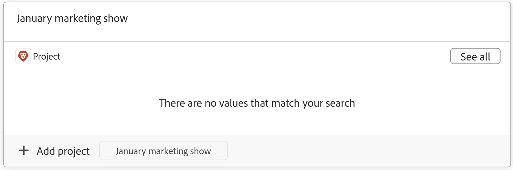

<!--update the metadata with real information when making this available in TOC and in the left nav-->

# 레코드에 연결할 때 Workfront Planning에서 Workfront 개체 만들기

<!-- remove preview and production at release time-->

<!--The information highlighted on this page refers to functionality not yet generally available. It is available only in the Preview environment for all customers. After the monthly releases to Production, the same features are also available in the Production environment for customers who enabled fast releases.    

For information about fast releases, see [Enable or disable fast releases for your organization](/help/quicksilver/administration-and-setup/set-up-workfront/configure-system-defaults/enable-fast-release-process.md). -->

{{planning-important-intro}}

Workfront Planning에서 다음과 같은 방법으로 Adobe Workfront 객체를 생성할 수 있습니다.

* Planning 레코드에서 Workfront 객체를 연결할 때

  이 문서에서는 Planning 레코드에서 연결할 때 Workfront Planning에서 Workfront 객체를 만드는 방법에 대해 설명합니다.
* 레코드 페이지에서 자동화를 사용하는 경우입니다.

  자동화를 사용하여 Workfront 개체를 만드는 방법에 대한 자세한 내용은 [Adobe Workfront Planning 레코드 자동화를 사용하여 개체 만들기](/help/quicksilver/planning/records/create-wf-objects-using-planning-automations.md)를 참조하십시오.

>[!IMPORTANT]
>
>Planning 레코드와 연결할 때 Workfront Planning에서 다음 Workfront 객체를 생성할 수 있습니다.
>
>* 프로젝트
>* 포트폴리오
>* 프로그램
>
>다음 Workfront 객체를 Planning 레코드와 연결할 수 있지만 연결 프로세스에서 생성할 수는 없습니다.
>
>* 그룹
>* 회사
>

Workfront Planning 레코드에 Workfront 객체를 연결하고 생성할 때 다음 사항을 고려하십시오.

* Workfront Planning의 다음 영역에서 연결 필드에서 Workfront 프로젝트, 포트폴리오, 프로그램, 그룹 및 회사를 연결할 수 있습니다.

   * 레코드 유형의 표 보기
   * 레코드의 세부 정보 페이지 또는 미리보기 상자
   * 레코드의 연결 탭

* Workfront Planning의 다음 영역에서 프로젝트를 생성할 수 있습니다.

   * 레코드 유형의 표 보기
   * 연결 필드의 레코드 세부 정보 영역
   * 세부 정보 영역에 있는 레코드의 연결된 레코드 페이지

* Workfront Planning의 다음 영역에서 포트폴리오와 프로그램을 만들 수 있습니다.

   * 레코드 유형의 표 보기
   * 연결 필드의 레코드 세부 정보 영역

Planning 레코드를 Workfront 개체와 연결하는 방법에 대한 자세한 내용은 [레코드 연결](/help/quicksilver/planning/records/connect-records.md)을 참조하십시오.

## 액세스 요구 사항

+++ 을 확장하여 이 문서의 기능에 대한 액세스 요구 사항을 봅니다. 

<table style="table-layout:auto"> 
<col> 
</col> 
<col> 
</col> 
<tbody> 
    <tr> 
<tr> 
</tr>   
<tr> 
   <td role="rowheader">
Adobe Workfront 패키지
</td> 
   <td> 

모든 Workfront 및 모든 Planning 패키지
 
모든 워크플로우 및 모든 Planning 패키지

각 Workfront Planning 패키지에 포함된 내용에 대한 자세한 내용은 Workfront 계정 담당자에게 문의하십시오. 
 
   </td> 
<tr> 
<td> 
   
 추가 제품
 </td> 
   <td> 
    
AEM 에셋을 Planning 레코드와 연결하려면 Adobe Workfront 외에 Adobe Experience Manager Assets 라이선스와 AEM Assets 및 Workfront 간의 통합이 있어야 합니다.

    
자세한 내용은 <a href="/help/quicksilver/documents/adobe-workfront-for-experience-manager-assets-essentials/workfront-for-aem-asset-essentials.md">Experience Manager Assets 및 Assets Essentials용 Adobe Workfront: 기사 색인</a>을 참조하십시오. 

   </td> 
  </tr>   
<tr> 
  <tr> 
   <td role="rowheader">
Adobe Workfront 라이선스
</td> 
   <td>
표준

   </td> 
  </tr> 
  <tr> 
   <td role="rowheader">
액세스 수준 구성
</td> 
   <td> 
Adobe Workfront Planning에 대한 액세스 수준 제어가 없습니다.
 
   
만들려는 객체 유형(프로젝트, 포트폴리오, 프로그램)의 Workfront에서 객체 만들기에 대한 액세스 권한을 가지고 액세스 권한을 편집합니다. 
  
</td> 
  </tr> 
<tr> 
   <td role="rowheader">
개체 권한
</td> 
   <td> 
레코드를 추가할 작업 영역 및 레코드 종류에 대한 또는 그 이상의 권한을 제공하십시오. 
  
   
시스템 관리자는 만들지 않은 작업 영역을 포함하여 모든 작업 영역에 대한 권한을 가집니다

   
하위 개체(프로젝트)를 추가하기 위해 Workfront 개체(포트폴리오)에 대한 권한을 관리합니다.

   </td> 
  </tr>   
</tbody> 
</table>

Workfront 액세스 요구 사항에 대한 자세한 내용은 Workfront 설명서의 [액세스 요구 사항](/help/quicksilver/administration-and-setup/add-users/access-levels-and-object-permissions/access-level-requirements-in-documentation.md)을 참조하십시오.

+++ 

<!--Old:

<table style="table-layout:auto"> 
<col> 
</col> 
<col> 
</col> 
<tbody> 
    <tr> 
<tr> 
<td> 
   
 Products
 </td> 
   <td> 
   <ul><li>
 Adobe Workfront
</li> 
   <li>
 Adobe Workfront Planning
</li></ul></td> 
  </tr>   
<tr> 
   <td role="rowheader">
Adobe Workfront plan*
</td> 
   <td> 

Any of the following Workfront plans:
 
<ul><li>Select</li> 
<li>Prime</li> 
<li>Ultimate</li></ul> 

Workfront Planning is not available for legacy Workfront plans
 
   </td> 
<tr> 
   <td role="rowheader">
Adobe Workfront Planning package*
</td> 
   <td> 

Any 
 

For more information about what is included in each Workfront Planning plan, contact your Workfront account manager. 
 
   </td> 
 <tr> 
   <td role="rowheader">
Adobe Workfront platform
</td> 
   <td> 

Your organization's instance of Workfront must be onboarded to the Adobe Unified Experience to be able to access Workfront Planning.
 

For more information, see <a href="/help/quicksilver/workfront-basics/navigate-workfront/workfront-navigation/adobe-unified-experience.md">Adobe Unified Experience for Workfront</a>. 
 
   </td> 
   </tr> 
  </tr> 
  <tr> 
   <td role="rowheader">
Adobe Workfront license*
</td> 
   <td> Standard
   
Workfront Planning is not available for legacy Workfront licenses
 
  </td> 
  </tr> 
  <tr> 
   <td role="rowheader">
Access level configuration
</td> 
   <td> 
There are no access level controls for Adobe Workfront Planning
 
   
Edit access with access to Create objects in Workfront for the object types that you want to create (projects, portfolios, programs). 
  
</td> 
  </tr> 
<tr> 
   <td role="rowheader">
Object permissions
</td> 
   <td> 
Manage permissions to the workspace and record type where you want to add records. 
  
   
System Administrators have permissions to all workspaces, including the ones they did not create

   
Manage permissions to Workfront objects (portfolios) to add children objects (projects).

   </td> 
  </tr> 
</tbody> 
</table> 

 *For more information about Workfront access requirements, see [Access requirements in Workfront documentation](/help/quicksilver/administration-and-setup/add-users/access-levels-and-object-permissions/access-level-requirements-in-documentation.md).  -->

## Workfront Planning의 레코드와 연결할 때 Workfront 개체를 만들기 위한 사전 요구 사항

기존 레코드에서 새 프로젝트 또는 포트폴리오를 연결하여 추가하려면 먼저 다음 사항이 있어야 합니다.

* Workfront 프로젝트, 포트폴리오 또는 프로그램에 연결된 레코드 유형입니다. 자세한 내용은 [레코드 종류 연결](/help/quicksilver/planning/architecture/connect-record-types.md)을 참조하세요.
* Workfront 개체에 연결된 레코드 유형에 대한 레코드입니다. 자세한 내용은 [레코드 만들기](/help/quicksilver/planning/records/create-records.md)를 참조하세요.
* 이 문서의 [액세스 요구 사항](#access-requirements) 섹션에 설명된 대로 Workfront Planning 및 Workfront의 올바른 액세스 및 권한.

## 프로젝트를 Workfront Planning의 레코드와 연결할 때 생성

Workfront Planning의 다음 영역에서 Workfront Planning의 레코드와 프로젝트를 연결할 때 프로젝트를 만들 수 있습니다.

* 연결 필드에 있는 레코드의 세부 정보 영역 또는 레코드 종류의 표 보기
* 레코드의 세부 정보 영역에 있는 레코드의 연결된 레코드 페이지

### 레코드의 세부 정보 영역 또는 레코드 유형의 테이블 보기에서 프로젝트 만들기

다른 레코드에서 프로젝트를 연결할 때 프로젝트를 만들려면 다음 작업을 수행하십시오.

1. [레코드 연결](/help/quicksilver/planning/records/connect-records.md) 문서에 설명된 대로 레코드의 세부 정보 페이지 또는 레코드 유형의 테이블로 이동하여 Workfront Planning 레코드와 Workfront 프로젝트 연결을 시작합니다.

1. (조건부) **프로젝트 추가**&#x200B;를 클릭합니다
또는
프로젝트 이름을 입력한 다음 찾을 수 없는 경우 **프로젝트 추가**&#x200B;를 클릭합니다. [추가] 단추 다음에 입력한 프로젝트 이름이 옵니다.

   

   **프로젝트 만들기** 상자가 열립니다.

1. (선택 사항) **프로젝트 이름**&#x200B;을(를) 업데이트합니다. 레코드에서 연결할 때 검색 항목으로 추가한 항목의 이름을 따라 기본적으로 프로젝트 이름이 지정됩니다.
1. (선택 사항) **프로젝트 템플릿**&#x200B;을(를) 선택합니다. 템플릿을 선택하지 않으면 Workfront에서 작업이 없는 빈 프로젝트를 만듭니다.
1. Click **Create**.
1. (조건부) 템플릿에서 프로젝트를 만들도록 선택한 경우 문서 [템플릿을 사용하여 프로젝트 만들기](/help/quicksilver/manage-work/projects/create-projects/create-project-from-template.md) 문서의 단계에 따라 프로젝트 추가를 완료합니다.

   새 프로젝트가 만들어지고 선택한 레코드의 연결된 필드에 추가됩니다.

1. (선택 사항) Workfront Planning에서 새 프로젝트의 이름을 클릭하여 Workfront에서 프로젝트 페이지를 열고 프로젝트를 추가로 업데이트합니다.

### 레코드의 연결된 레코드 페이지에서 프로젝트 만들기

1. 테이블 보기에서 프로젝트 오브젝트 유형을 Workfront Planning 레코드 유형과 연결합니다.

   자세한 내용은 [레코드 종류 연결](/help/quicksilver/planning/architecture/connect-record-types.md)을 참조하세요.

1. 보기에서 레코드 이름을 클릭합니다. 세부(Details) 미리보기 상자가 열립니다.

1. 프로젝트에 대해 **연결된 레코드 페이지**&#x200B;를 추가하십시오.

   자세한 내용은 문서 [레코드 페이지 레이아웃 관리](/help/quicksilver/planning/records/manage-the-record-page.md)의 &quot;레코드에 연결된 레코드 페이지 추가&quot; 섹션을 참조하십시오.

   연결된 레코드 페이지가 테이블 뷰에 표시됩니다. 연결된 프로젝트가 테이블에 표시됩니다.

   연결된 레코드 페이지의 

1. 프로젝트를 추가하려면 프로젝트 테이블에서 **새 행**&#x200B;을 클릭하세요.

   이 영역에는 빈 프로젝트만 추가할 수 있습니다. 템플릿을 사용하여 프로젝트를 추가할 수 없습니다.
1. (선택 사항) 테이블 보기에서 프로젝트 이름을 클릭하여 Workfront에서 프로젝트를 열고 추가 정보를 추가합니다.

## Workfront Planning의 레코드와 연결할 때 포트폴리오 만들기

레코드 유형의 표 보기 또는 레코드의 세부 정보 페이지에서 포트폴리오를 만들 수 있습니다.

Planning 레코드에서 포트폴리오를 연결할 때 포트폴리오를 생성하려면 다음을 수행합니다.

1. [레코드 연결](/help/quicksilver/planning/records/connect-records.md) 문서에 설명된 대로 레코드의 세부 정보 페이지 또는 레코드 유형의 테이블로 이동하여 Workfront Planning 레코드와 Workfront 포트폴리오의 연결을 시작합니다.

1. (조건부) **포트폴리오 추가** 클릭

   또는

   포트폴리오의 이름을 입력한 다음 찾을 수 없는 경우 **포트폴리오 추가**&#x200B;를 클릭합니다. 추가 단추 다음에 입력한 포트폴리오 이름이 옵니다.

   

   포트폴리오가 만들어지고 선택한 레코드의 연결 필드에 추가됩니다.

1. (선택 사항) Workfront Planning에서 새 포트폴리오의 이름을 클릭하여 Workfront에서 포트폴리오의 페이지를 열고 포트폴리오를 추가로 업데이트합니다.

## Workfront Planning의 레코드와 연결하여 프로그램을 만듭니다.

레코드 유형의 표 보기 또는 레코드의 세부 정보 페이지에서 프로그램을 만들 수 있습니다.

Planning 레코드에서 프로그램을 연결할 때 프로그램을 생성하려면 다음을 수행합니다.

1. [레코드 연결](/help/quicksilver/planning/records/connect-records.md) 문서에 설명된 대로 레코드의 세부 정보 페이지 또는 레코드 유형의 테이블로 이동하여 Workfront Planning 레코드와 Workfront 포트폴리오의 연결을 시작합니다.

1. **프로그램 추가** 클릭

   또는

   프로그램 이름을 입력한 다음 찾을 수 없는 경우 **프로그램 추가**&#x200B;를 클릭합니다. [추가] 단추 다음에 프로그램 이름을 입력합니다.

   

   **프로그램 만들기** 상자가 열립니다.

1. **프로그램 이름**&#x200B;을(를) 업데이트합니다. 필수 필드입니다.
1. 드롭다운에서 **Portfolio**&#x200B;을(를) 선택하거나 포트폴리오의 이름을 입력한 다음 목록에 표시될 때 선택하십시오. 필수 필드입니다.
1. Click **Create**.

   선택한 레코드의 연결 필드에 프로그램이 만들어지고 추가됩니다.

1. (선택 사항) Workfront Planning에서 새 프로그램 이름을 클릭하여 Workfront에서 프로그램 페이지를 열고 추가로 업데이트합니다.

