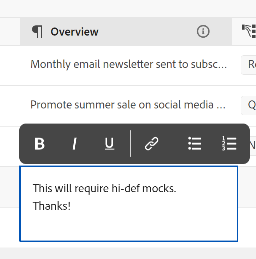

<!--update the metadata with real information when making this avilable in TOC and in the left nav-->

# 레코드 편집

{{planning-important-intro}}

레코드와 연결된 필드의 값을 편집하여 Adobe Workfront Planning에서 레코드 정보를 편집할 수 있습니다.

레코드 만들기 및 편집을 시작하려면 먼저 레코드 유형을 만들어야 합니다.

자세한 내용은 [레코드 종류 만들기](/help/quicksilver/planning/architecture/create-record-types.md)를 참조하세요.

레코드 만들기에 대한 자세한 내용은 [레코드 만들기](/help/quicksilver/planning/records/create-records.md)를 참조하세요.

&lt;!— 여기에서 세부 사항 보기의 필드가 표 보기의 필드와 동일하다고 언급하십시오. 이 문서는 레코드 관리 보기에서 연결되어 이 정보를 참조합니다—>

## 액세스 요구 사항

+++ 를 확장하여 Workfront Planning에 대한 액세스 요구 사항을 봅니다.

Workfront Planning에 액세스하려면 다음 항목이 있어야 합니다.

<table style="table-layout:auto"> 
<col> 
</col> 
<col> 
</col> 
<tbody> 
    <tr> 
<tr> 
<td> 
   
 제품
 </td> 
   <td> 
   <ul><li>
 Adobe Workfront
</li> 
   <li>
 Adobe Workfront 계획
</li></ul></td> 
  </tr>   
<tr> 
   <td role="rowheader">
Adobe Workfront 플랜*
</td> 
   <td> 

다음 Workfront 플랜 중 하나:
 
<ul><li>선택</li> 
<li>Prime</li> 
<li>Ultimate</li></ul> 

Workfront Planning은 기존 Workfront 플랜에 사용할 수 없습니다.
 
   </td> 
<tr> 
   <td role="rowheader">
Adobe Workfront 계획 계획*
</td> 
   <td> 

임의 
 

각 Workfront Planning 계획에 포함된 사항에 대한 자세한 내용은 Workfront 계정 관리자에게 문의하십시오. 
 
   </td> 
 <tr> 
   <td role="rowheader">
Adobe Workfront 플랫폼
</td> 
   <td> 

Workfront Planning의 모든 기능에 액세스할 수 있으려면 조직의 Workfront 인스턴스가 통합 경험 Adobe에 온보딩되어야 합니다.
 

자세한 내용은 <a href="/help/quicksilver/workfront-basics/navigate-workfront/workfront-navigation/adobe-unified-experience.md">Workfront용 통합 경험 Adobe</a>를 참조하십시오. 
 
   </td> 
   </tr> 
  </tr> 
  <tr> 
   <td role="rowheader">
Adobe Workfront 라이센스*
</td> 
   <td> 
표준
 
   
기존 Workfront 라이선스에는 Workfront Planning을 사용할 수 없습니다.
 
  </td> 
  </tr> 
  <tr> 
   <td role="rowheader">
액세스 수준 구성
</td> 
   <td> 
Adobe Workfront Planning에 대한 액세스 수준 제어가 없습니다.
   
</td> 
  </tr> 
<tr> 
   <td role="rowheader">
개체 권한
</td> 
   <td>  
작업 영역에 대한 Contribute 이상의 권한</a> 
  
   
시스템 관리자는 만들지 않은 작업 영역을 포함하여 모든 작업 영역에 대한 권한을 가집니다
  </td> 
  </tr> 
<tr> 
   <td role="rowheader">
레이아웃 템플릿
</td> 
   <td> 
Workfront 관리자를 포함한 모든 사용자에게 메인 메뉴의 계획 영역을 포함하는 레이아웃 템플릿을 할당해야 합니다. 
 </td> 
  </tr> 
</tbody> 
</table>

*Workfront 액세스 요구 사항에 대한 자세한 내용은 Workfront 설명서의 [액세스 요구 사항](/help/quicksilver/administration-and-setup/add-users/access-levels-and-object-permissions/access-level-requirements-in-documentation.md)을 참조하십시오.

+++

<!--Old:

<table style="table-layout:auto">
 <col>
 </col>
 <col>
 </col>
 <tbody>
    <tr>
<tr>
<td>
   
 Product
 </td>
   <td>
   
 Adobe Workfront
 </td>
  </tr>  
 <td role="rowheader">
Adobe Workfront agreement
</td>
   <td>

Your organization must be enrolled in the early access stage for Workfront Planning 

   </td>
  </tr>
  <tr>
   <td role="rowheader">
Adobe Workfront plan
</td>
   <td>

Any

   </td>
  </tr>
  <tr>
   <td role="rowheader">
Adobe Workfront license*
</td>
   <td>
   
New: Standard

   Or
   
Current: Plan
 
  </td>
  </tr>
  
  <tr>
   <td role="rowheader">
Access level configurations
</td>
   <td> 
There are no access controls for Adobe Workfront Planning
  
</td>
  </tr>
<tr>
   <td role="rowheader">
Permissions
</td>
   <td> 
Contribute or higher permissions to a workspace</a> 
  
   
System Administrators have permissions to all workspaces, including the ones they did not create

</td>
  </tr>
<tr>
   <td role="rowheader">
Layout template
</td>
   <td> 
Your Workfront or group administrator must add the Planning area in your layout template. For information, see <a href="/help/quicksilver/planning/access/access-overview.md">Access overview</a>. 
  
</td>
  </tr>

 </tbody>
</table>

*For more information, see [Access requirements in Workfront documentation](/help/quicksilver/administration-and-setup/add-users/access-levels-and-object-permissions/access-level-requirements-in-documentation.md). -->

## 레코드 편집에 대한 고려 사항

* 작업 영역에 대한 권한이 부여된 경우 직접 만든 레코드나 다른 사용자가 만든 레코드를 편집할 수 있습니다.
* 다음 영역에서 레코드 필드를 편집할 수 있습니다.

   * 레코드 보기의 레코드 미리 보기
   * 레코드의 페이지
   * 테이블 보기에서 인라인입니다.

* 사용자가 보기에서 레코드를 편집하면 변경 내용이 모든 보기에서 즉시 표시되고 레코드 페이지가 다른 모든 사용자에게 표시됩니다.

* 다음 유형의 필드는 자동으로 업데이트되며, 해당 값을 수동으로 편집할 수 없습니다.
   * 다른 레코드의 연결된 필드
   * 공식 유형 필드
   * 시스템 필드(생성자, 생성일, 마지막 수정자, 마지막 수정일)
* 표시되는 레코드가 다른 레코드에 연결되어 있는 경우 편집 중인 레코드의 새 정보가 연결된 레코드에 반영됩니다.
* 레코드를 일괄적으로 편집할 수 없습니다. <!--this will probably change-->
* URL은 http://, https://, ftp:// 또는 www로 시작하는 경우에만 한 줄 텍스트 필드 유형에서 링크로 인식됩니다. .
* 각 레코드에 표지 이미지를 추가할 수 있습니다. 이 이미지는 각 레코드에 대해 고유하며, 동시에 모든 레코드에 적용되지 않습니다.
* 레코드 페이지의 필드 순서를 편집하고 레코드에 대한 표지 이미지를 추가할 수 있습니다. 자세한 내용은 [레코드 페이지 레이아웃 관리](/help/quicksilver/planning/records/manage-the-record-page.md)를 참조하십시오.

## 레코드 편집

다음 영역에서 레코드를 편집할 수 있습니다.

* [레코드 유형의 테이블 보기에서](#edit-a-record-inline-in-the-table-view-of-a-record-type)
* [보기의 레코드 미리 보기에서](#edit-a-record-from-the-records-preview-in-a-view)
* [레코드 페이지에서](#edit-a-record-from-the-records-page)
* [Planning 섹션의 Workfront 객체에서](#edit-a-record-from-a-workfront-object-in-the-planning-section)

### 레코드 유형의 표 보기에서 인라인 레코드 편집

테이블 보기에서 레코드를 편집할 때 레코드를 볼 때 다른 사용자가 편집하고 있는 필드가 표시됩니다.

자세한 내용은 [레코드 보기 관리](/help/quicksilver/planning/views/manage-record-views.md)를 참조하십시오.

{{step1-to-planning}}

1. 레코드를 편집할 작업 영역을 클릭합니다

   작업공간이 열리고 레코드 유형이 카드로 표시됩니다.
1. 레코드 유형 카드를 클릭합니다.

   레코드 유형 페이지가 열립니다.
1. (조건부) 테이블 보기를 만들려면 표 보기의 탭을 클릭하거나 **+ 보기**&#x200B;를 클릭합니다. 마지막으로 액세스할 때 다른 유형의 보기에서 레코드 유형을 보지 않은 경우 테이블 보기는 기본 보기여야 합니다.

   선택한 레코드 유형과 연관된 레코드가 테이블 뷰에 표시됩니다.
1. 레코드 행 내부를 클릭하여 인라인 레코드에 대한 정보 편집을 시작합니다.

   

   >[!TIP]
   >
   >  다음 필드는 읽기 전용이고 Workfront에서 자동으로 업데이트하므로 해당 필드에 대한 정보는 편집할 수 없습니다.
   >  
   >  * 레코드 종류를 연결하여 만든 연결된 필드. 자세한 내용은 [레코드 종류 연결](/help/quicksilver/planning/architecture/connect-record-types.md)을 참조하세요.
   >  * 생성자, 생성일, 마지막 수정자, 마지막 수정일, 공식 필드 유형의 필드.

1. (선택 사항 및 조건부) 단락 유형 필드를 편집할 때 다음 **서식 있는 텍스트** 서식 옵션을 사용합니다.

   * 볼드체
   * 이탤릭체
   * 밑줄
   * 링크 추가
   * 글머리 기호 목록 추가
   * 번호 매기기 목록 추가

   

1. (선택 사항) 연결된 레코드 필드를 두 번 클릭하여 연결된 레코드나 개체를 다른 레코드에 추가합니다. 자세한 내용은 [레코드 연결](/help/quicksilver/planning/records/connect-records.md)을 참조하세요.
1. 키보드에서 **Enter**&#x200B;를 누르거나 행 바깥쪽을 클릭하여 변경 내용을 저장합니다. 변경 사항은 자동으로 저장됩니다. 변경 내용이 저장되었음을 나타내기 위해 테이블 보기의 오른쪽 위 모서리에 **저장됨** 표시기가 잠시 표시됩니다.

1. (선택 사항) 한 필드에서 다른 필드로 정보를 복사하여 붙여넣으려면 다음 중 하나를 수행합니다.

   * 한 필드의 기존 값을 하나 또는 여러 개 복사한 다음 다른 레코드의 같은 유형의 필드에 붙여 넣습니다.
   * 열의 열 헤더를 클릭하여 선택하고 복사한 다음 다른 열의 열 헤더를 클릭하고 복사한 열의 내용을 붙여넣습니다. 열에는 유사한 필드 유형이 포함되어야 합니다.
   * Shift 키를 누른 상태에서 을 클릭하여 테이블의 여러 행을 선택하고 선택한 행의 정보를 복사한 다음 다른 행을 클릭하고 선택한 정보를 새 행 및 그 다음 행에 붙여넣습니다.
   * 한 셀에서 정보를 복사한 다음 여러 셀을 선택하고 동일한 정보를 여러 셀에 붙여넣습니다. 여러 셀을 선택하고 인접한 행과 열의 여러 셀에 동일한 정보를 붙여 넣을 수 있습니다.
   * 복사할 정보가 들어 있는 기존 셀의 오른쪽 아래 모서리를 선택한 다음 동일한 정보를 붙여넣을 인접한 셀에 끌어서 놓습니다. 모든 셀에는 동일한 유형의 정보가 포함되어야 합니다.

     

   >[!NOTE]
   >
   >다음 사항을 고려하십시오.
   >
   >* 정보를 복사하고 붙여넣으려면 다음 키보드 단축키를 사용하십시오.
   >   * 복사: CTRL + C (Mac의 경우 ⌘ + C)
   >   * 붙여넣기: CTRL + V(Mac의 경우 ⌘ + V)
   >
   >* 레코드 페이지에서 필드 값을 복사하여 붙여넣을 수 없습니다. 이 기능은 레코드 종류의 표 보기에서만 지원됩니다.
   >* 다음 필드 유형에 대한 필드 값을 복사하여 붙여넣을 수 없습니다.
   >
   >
   >    * 레코드 종류를 연결하여 만든 연결된 필드(또는 조회 필드). 연결된 레코드 필드를 복사하여 붙여 넣을 수 있습니다. 자세한 내용은 [레코드 종류 연결](/help/quicksilver/planning/architecture/connect-record-types.md)을 참조하세요.
   >    * 생성자, 생성일, 마지막 수정자, 마지막 수정자 유형의 필드

1. (선택 사항) 다음 키보드 단축키를 사용하여 레코드 정보 편집 또는 복사 및 붙여넣기를 실행 취소하거나 재실행할 수 있습니다.

   * CTRL+Z(Mac의 경우 ⌘+Z)
   * 변경 내용을 재실행하려면 CTRL+Shift+Z(Mac의 경우 ⌘+Shift+Z)

   >[!TIP]
   >
   >    키보드 단축키를 한 번에 여러 번 사용하여 여러 변경 내용을 실행 취소할 수 있습니다.

1. (선택 사항) 레코드에 썸네일을 추가합니다. 자세한 내용은 [레코드에 썸네일 추가](/help/quicksilver/planning/records/add-thumbnails-to-records.md)를 참조하십시오.

### 보기의 레코드 미리 보기에서 레코드 편집

{{step1-to-planning}}

1. 레코드를 편집할 작업 영역을 클릭합니다

   작업공간이 열리고 레코드 유형이 카드로 표시됩니다.

1. 레코드 유형 카드를 클릭합니다.

   레코드 유형 페이지가 열립니다.

1. 모든 유형의 보기에서 레코드를 클릭합니다

   또는

   테이블 보기에서 첫 번째 열의 **세부 정보 열기** 아이콘 을(를) 클릭합니다. 레코드의 미리보기가 보기에서 열립니다.

   

1. (선택 사항) 레코드 제목 오른쪽에 있는 **자세히** 메뉴를 클릭한 다음 **이름 바꾸기**&#x200B;를 클릭합니다. 레코드의 제목으로 표시되는 필드가 업데이트됩니다.

   레코드의 제목은 테이블 보기에서 볼 때 레코드의 기본 필드입니다. 자세한 내용은 [기본 필드 개요](/help/quicksilver/planning/fields/primary-field-overview.md)를 참조하세요.

1. 레코드의 미리 보기에서 필드 정보 편집을 시작합니다.

   >[!TIP]
   >
   >  다음 필드는 읽기 전용이고 Workfront에서 자동으로 업데이트하므로 해당 필드에 대한 정보는 편집할 수 없습니다.
   >  
   >  * 레코드 종류를 연결하여 만든 다른 레코드에서 필드를 조회합니다. 자세한 내용은 [레코드 종류 연결](/help/quicksilver/planning/architecture/connect-record-types.md)을 참조하세요.
   >  * 생성자, 생성일, 마지막 수정자, 마지막 수정일, 공식 필드 유형의 필드.

1. (선택 사항) 레코드에 표지 이미지를 추가하려면 **표지 추가**&#x200B;를 클릭합니다. 자세한 내용은 [레코드에 표지 이미지 추가](/help/quicksilver/planning/records/add-a-cover-image-to-a-record.md)를 참조하십시오.

1. (선택 사항) 썸네일 아이콘 위로 마우스를 가져간 다음 **자세히**  > **썸네일 편집**&#x200B;을 클릭하여 썸네일 이미지를 추가합니다. 자세한 내용은 [레코드에 썸네일 추가](/help/quicksilver/planning/records/add-thumbnails-to-records.md)를 참조하십시오.

   Workfront은 변경 사항을 자동으로 저장합니다.

1. (선택 사항) 레코드의 세부 정보를 내보내려면 **내보내기** 아이콘 을(를) 클릭합니다. 자세한 내용은 [레코드 세부 정보 내보내기](/help/quicksilver/planning/records/export-the-record-page.md)를 참조하십시오.

1. (선택 사항) 레코드 미리 보기의 오른쪽 위 모서리에 있는 **새 탭에서 열기** 아이콘  <!--check the icon; they are changing it-->을 클릭하여 새 탭에서 레코드 페이지를 엽니다. 이 문서의 [레코드 페이지에서 레코드 편집](#edit-a-record-from-the-records-page) 섹션에 설명된 대로 레코드를 계속 편집합니다.

### 레코드 페이지에서 레코드 편집

{{step1-to-planning}}

1. 레코드를 편집할 작업 영역을 클릭합니다

   작업공간이 열리고 레코드 유형이 카드로 표시됩니다.

1. 레코드 유형 카드를 클릭합니다.

   레코드 유형 페이지가 열립니다.

1. 다음 중 하나를 수행하십시오.

   * 모든 보기에서 이 문서의 [보기에서 레코드 미리 보기 편집](#edit-a-record-from-the-records-preview-in-a-view) 섹션에 설명된 대로 레코드의 미리 보기에 액세스한 다음 레코드 미리 보기의 오른쪽 상단에 있는 **새 탭에서 열기** 아이콘  <!--check the icon; they are changing it-->을(를) 클릭하여 새 탭에서 레코드 페이지를 엽니다.

   * **테이블** 보기에서 레코드 이름 위로 마우스를 가져간 다음 **자세히** 메뉴 을(를) 클릭하고 **보기**&#x200B;를 클릭합니다

     

     레코드 페이지가 열립니다.

     

1. (선택 사항) 레코드 제목 오른쪽에 있는 **자세히** 메뉴를 클릭한 다음 **이름 바꾸기**&#x200B;를 클릭합니다. 레코드의 제목으로 표시되는 필드가 업데이트됩니다.

   레코드의 제목은 테이블 보기에서 볼 때 레코드의 기본 필드입니다. 자세한 내용은 [테이블 보기 관리](/help/quicksilver/planning/views/manage-the-table-view.md)를 참조하십시오.

1. 레코드 페이지에서 편집 가능한 필드를 클릭하여 편집합니다.

   >[!TIP]
   >
   >  다음 필드는 읽기 전용이고 Workfront에서 자동으로 업데이트하므로 해당 필드에 대한 정보는 편집할 수 없습니다.
   >  
   >  * 레코드 종류를 연결하여 만든 연결된 필드. 자세한 내용은 [레코드 종류 연결](/help/quicksilver/planning/architecture/connect-record-types.md)을 참조하세요.
   >  * 생성자, 생성일, 마지막 수정자, 마지막 수정일, 공식 필드 유형의 필드.

1. (선택 사항) 레코드에 표지 이미지를 추가하려면 **표지 추가**&#x200B;를 클릭합니다

   또는

   기존 표지 이미지를 마우스로 가리킨 다음 **자세히** 메뉴  > **업로드**&#x200B;를 클릭하여 레코드에 대한 새 표지 이미지를 추가합니다.

   자세한 내용은 [레코드에 표지 이미지 추가](/help/quicksilver/planning/records/add-a-cover-image-to-a-record.md)를 참조하십시오.

1. (선택 사항) 기존 썸네일 또는 **썸네일 아이콘**  위로 마우스를 가져간 다음 **자세히** 메뉴  > **썸네일 편집**&#x200B;을 클릭하여 레코드에 대한 썸네일을 추가합니다.

   자세한 내용은 [레코드에 썸네일 추가](/help/quicksilver/planning/records/add-thumbnails-to-records.md)를 참조하십시오.

   Workfront은 변경 사항을 자동으로 저장합니다.

1. (선택 사항) 레코드의 세부 정보를 내보내려면 **내보내기** 아이콘 을(를) 클릭합니다. 자세한 내용은 [레코드 세부 정보 내보내기](/help/quicksilver/planning/records/export-the-record-page.md)를 참조하십시오.

## 계획 섹션의 Workfront 객체에서 레코드 편집

레코드를 Workfront 오브젝트와 연결한 후 오브젝트의 계획 섹션에서 Workfront의 Workfront Planning 레코드를 편집할 수 있습니다.

자세한 내용은 [Adobe Workfront 개체의 계획 섹션에서 레코드 관리](/help/quicksilver/planning/records/manage-records-in-planning-section.md)를 참조하십시오.