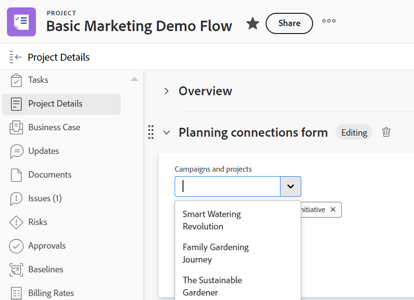

<!--add also Group and Company when they are available-->

# Workfront 개체에서 레코드 연결 관리

{{planning-important-intro}}

왼쪽 패널의 Workfront 오브젝트의 계획 섹션에서 Adobe Workfront 오브젝트에 연결된 Workfront Planning 레코드를 표시할 수 있습니다.

<!--replace above with this: 

You can display Workfront Planning records and their respective records connected to Adobe Workfront objects in the following areas in Workfront:

* The Planning section of a Workfront object: Displays all record types connected to an object and their respective connected records. 
* A Planning connection custom field: Displays one record type and its respective connected records .-->

계획 섹션은 다음 Workfront 객체에 사용할 수 있습니다.

* 프로젝트
* Portfolio
* 프로그램
<!--* Group
* Company-->

<!--move the above to a lower place below when releasing Planning connection custom field-->

## 액세스 요구 사항

+++ 를 확장하여 Workfront Planning에 대한 액세스 요구 사항을 봅니다.

이 문서의 단계를 수행하려면 다음 액세스 권한이 있어야 합니다.

<table style="table-layout:auto">
 <col>
 </col>
 <col>
 </col>
 <tbody>
    <tr>
<tr>
<td>
   
 제품
 </td>
   <td>
   <ul><li>
 Adobe Workfront
</li>
   <li>
 Adobe Workfront 계획
</li></ul></td>
  </tr>  
 <tr>
   <td role="rowheader">
Adobe Workfront 플랜*
</td>
   <td>

다음 Workfront 플랜 중 하나:

<ul><li>선택</li>
<li>Prime</li>
<li>Ultimate</li></ul>

Workfront Planning은 기존 Workfront 플랜에 사용할 수 없습니다.

   </td>

<tr>
   <td role="rowheader">
Adobe Workfront 계획 계획*
</td>
   <td>

임의

각 Workfront Planning 계획에 포함된 사항에 대한 자세한 내용은 Workfront 계정 관리자에게 문의하십시오. 

   </td>

<tr>
   <td role="rowheader">
Adobe Workfront 플랫폼
</td>
   <td>

Workfront Planning의 모든 기능에 액세스할 수 있으려면 조직의 Workfront 인스턴스가 통합 경험 Adobe에 온보딩되어야 합니다.

자세한 내용은 <a href="/help/quicksilver/workfront-basics/navigate-workfront/workfront-navigation/adobe-unified-experience.md">Workfront용 통합 경험 Adobe</a>를 참조하십시오. 

   </td>

</tr>
  </tr>
  <tr>
   <td role="rowheader">
Adobe Workfront 라이센스*
</td>
   <td>
   
표준

   
기존 Workfront 라이선스에는 Workfront Planning을 사용할 수 없습니다.

  </td>
  </tr>
  <tr>
   <td role="rowheader">
액세스 수준 구성
</td>
   <td> 
프로젝트, 프로그램 및 Portfolio에 대한 보기 또는 상위 액세스 권한
  
</td>
  </tr>
<tr>
   <td role="rowheader">
개체 권한
</td>
   <td>
   
Workfront에서 프로젝트, 포트폴리오 또는 프로그램에 대한 권한 보기 이상</a> 
 
   
Workfront Planning에서 작업 영역에 대한 Contribute 이상의 권한</a> 
  
   
시스템 관리자는 만들지 않은 작업 영역을 포함하여 모든 Workfront Planning 작업 영역에 대한 권한을 가집니다
 
  </td>
  </tr>
<tr>
   <td role="rowheader">
레이아웃 템플릿
</td>
   <td> 
Workfront 관리자를 비롯한 모든 사용자에게는 프로젝트, 포트폴리오 및 프로그램의 계획 영역과 주 메뉴의 계획 영역을 포함하는 레이아웃 템플릿을 할당해야 합니다. 
 자세한 내용은 <a href="/help/quicksilver/planning/access/access-overview.md">Adobe 계획 액세스 개요</a>를 참조하십시오. 
  
  
</td>
  </tr>
 </tbody>
</table>

*Workfront 액세스 요구 사항에 대한 자세한 내용은 Workfront 설명서의 [액세스 요구 사항](/help/quicksilver/administration-and-setup/add-users/access-levels-and-object-permissions/access-level-requirements-in-documentation.md)을 참조하십시오.

+++

## 계획 섹션의 레코드 관리

Workfront 객체의 Planning 섹션을 사용하여 Workfront 객체에 연결된 모든 레코드 유형과 해당 레코드를 볼 수 있습니다.

<!--move the section above starting with "The Planning section is available ..." here-->

### Workfront 객체의 계획 섹션에 대한 고려 사항

Workfront 객체의 계획 섹션에서 Workfront Planning 레코드를 볼 때는 다음 사항을 고려하십시오.

* Workfront Planning 레코드 유형은 먼저 Workfront 객체 유형에 연결되어야 합니다.

  자세한 내용은 다음 문서를 참조하십시오.

   * [레코드 유형 연결](/help/quicksilver/planning/architecture/connect-record-types.md)
   * [기록 연결](/help/quicksilver/planning/records/connect-records.md)
* Workfront 객체와 연관된 레코드가 없는 경우에도 Workfront 객체에서 계획 섹션을 볼 수 있습니다.

### 계획 섹션에서 레코드 연결 관리

{{step1-to-planning}}

1. 작업 영역의 카드를 클릭합니다.

   작업공간이 열리고 레코드 유형이 카드로 표시됩니다.

1. Workfront 프로젝트, 포트폴리오 또는 프로그램에 연결된 레코드 유형의 카드를 클릭합니다.
1. 테이블 보기 또는 레코드의 세부 사항 페이지에서 Workfront 개체와 연결된 연결된 레코드 필드로 이동합니다. 자세한 내용은 [레코드 연결](/help/quicksilver/planning/records/connect-records.md)을 참조하세요.
1. 연결된 레코드 필드에서 Workfront 개체의 이름을 클릭합니다.
개체의 페이지가 Workfront에서 열립니다.

   >[!NOTE]
   >
   >  Planning 레코드에 이미 연결된 Workfront 객체를 알고 있는 경우 Workfront 객체에서 Planning 섹션으로 이동할 수 있습니다.

1. 왼쪽 패널에서 **계획**&#x200B;을 클릭합니다.

   >[!NOTE]
   >
   >   Workfront 또는 그룹 관리자는 Workfront 프로젝트, 포트폴리오 또는 프로그램에 대해 표시되기 전에 레이아웃 템플릿에 계획 섹션을 추가해야 합니다.

   계획 섹션에는 다음 정보가 표시됩니다.

   * 연결된 레코드는 다음 정보가 포함된 개별 카드에 표시됩니다.
      * 레코드 이름
      * 레코드 썸네일
      * Workfront Planning에 표시되는 연결된 레코드 필드의 이름.
   * 레코드는 해당 작업 영역에 표시됩니다.

   

1. (선택 사항) 연결된 레코드가 없는 레코드 종류를 포함하여 연결된 모든 레코드 종류를 표시하려면 **모든 연결 표시**&#x200B;를 클릭합니다. 기본적으로 연결된 레코드가 없는 레코드 유형은 표시되지 않습니다.
1. 레코드에 대한 자세한 내용을 표시하려면 레코드 카드를 클릭합니다. 레코드 미리 보기 상자가 표시됩니다.
1. (선택 사항) 레코드의 미리 보기 상자에서 필드 수정을 시작합니다. 변경 사항은 자동으로 저장됩니다.
1. (선택 사항) 미리 보기 상자의 오른쪽 상단에 있는 **새 탭에서 열기** 아이콘 을(를) 클릭하여 레코드의 세부 정보 페이지를 엽니다. 레코드의 세부 사항 페이지가 Workfront Planning에 열립니다.
1. (선택 사항) 레코드 카드 위로 마우스를 가져간 다음 레코드 연결 끊기 아이콘 **-**&#x200B;을 클릭한 다음 **연결 끊기**를 클릭합니다.
다음과 같은 상황이 발생합니다.
   * 레코드가 더 이상 Workfront 개체에 연결되어 있지 않습니다.
   * Workfront 개체는 Workfront Planning에서 레코드의 연결된 필드에서도 제거됩니다.
   * 계획 레코드에 연결된 Workfront 조회 필드의 값도 삭제됩니다.
1. 연결된 레코드 형식에 대한 레코드를 더 연결하려면 **연결**&#x200B;을(를) 클릭하십시오. 자세한 내용은 [레코드 연결](/help/quicksilver/planning/records/connect-records.md)을 참조하세요.

   다음과 같은 상황이 발생합니다.

   * 레코드는 즉시 Workfront 개체에 연결되고 계획 섹션에 표시됩니다.
   * Workfront 개체가 Workfront Planning 레코드의 연결된 필드에 추가됩니다.
   * 계획 레코드에 연결된 Workfront 조회 필드의 값은 Workfront Planning에서 채워집니다.

<!--

## Manage records in the Planning connection field type

You can use a Planning connection custom field on a Workfront object to view one record type and its respective records connected to the Workfront object. 

You can control which Planning records display for the Workfront object when you create Planning connection custom fields. 

* The Planning connection field can be populated with Planning records when it is attached to forms for the following Workfront objects:

   * Project
   * Portfolio
   * Program
   * Group
   * Company

For more information, see [Create a form](/help/quicksilver/administration-and-setup/customize-workfront/create-manage-custom-forms/form-designer/design-a-form/design-a-form.md). 

### Considerations about the Planning connection field type

Consider the following when you view Workfront Planning records from a Planning connection field of a Workfront object: 

* You can associate only one record type with one Planning connection field.
* Your Workfront or group administrator must add a Planning connection field on a Workfront custom form.
* You must attach the custom form to a Workfront object that can be connected from Workfront Planning, if you have the correct access.
* Workfront Planning record types must first be connected to Workfront object types. For information, see [Connect record types](/help/quicksilver/planning/architecture/connect-record-types.md). 
* You can connect or disconnect records from the Planning connection field of a Workfront object only for objects that can have Workfront Planning connections.
* You must have Contribute permissions for a workspace in Workfront Planning to be able to connect or disconnect records from the Planning connection field of a Workfront object.
* You can view a Planning connection field for a Workfront object, even when there are no records connected to the object yet. 
* You cannot edit a Planning connection field when editing Workfront objects in bulk. 

### Manage record connections from the Planning connection field type

1. Go to one of the following object types that has been connected with a Workfront Planning record type: 

   * Project
   * Portfolio
   * Program
   * Company
   * Group

1. Click **< Object > Details** in the left panel.
1. (Conditional) Add a custom form with at least one Planning connection field for the object you selected, if one is not present. 

   >[!NOTE]
   >
   >Your Workfront or group administrator must first create the form and add a Planning connection field on it before you can add it to an object. 

1. Click inside the field to add connected records.
1. Click the downward-pointing arrow inside the field, to select records from the list. 

   

   >[!TIP]
   >
   >   You cannot add records to Planning connection fields that are associated with Workfront objects other than the object you selected. 
   >
   >For example, you cannot add records to a Planning connection field created for a Portfolio connection from a Project's custom form. 
   >
   >There is an indication that the object of the field and the object you selected don't match.  
   >
   >

1. Click outside the list to close it. 

   The following things occur:

   * The records are immediately connected to the Workfront object and they display in the Planning connection field as well as the Planning section of the Workfront object. 
   * The Workfront object is added to the Workfront Planning record's connected field. 
   * The values for the Workfront lookup fields connected to the Planning record are populated in Workfront Planning. 
1. (Optional) Click the name of a record in the Planning connection field to open it in Workfront Planning. 
   The record details tab opens in Workfront Planning. 
   You can review information about the record, or navigate to the record type page. 

1. (Optional) From the custom form in Workfront, click the **Remove** icon  on a record to remove it from the Planning connection field and disconnect it from the Workfront object. 
   The Workfront object is disconnected from the Planning record, and any lookup information from Workfront is removed from the record. 

-->