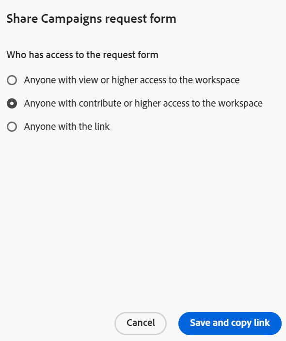

# Adobe Systems Workfront Planning에서 요청 양식 만들기 및 관리

<!--update the metadata with real information when making this available in TOC and in the left nav-->

<!--take Preview and Production references at Production time-->

이 페이지 상의 강조 표시된 정보는 아직 일반적으로 사용할 수 없는 기능을 참조합니다. 모든 고객이 미리 보기 환경에서만 사용할 수 있습니다. 프로덕션에 대한 월별 릴리스 후에는 빠른 릴리스를 활성화한 고객을 위해 프로덕션 환경에서도 동일한 기능을 사용할 수 있습니다. 

빠른 릴리스에 대한 자세한 내용은 조직에[ 대한 빠른 릴리스 활성화 또는 비활성화를 참조하세요](/help/quicksilver/administration-and-setup/set-up-workfront/configure-system-defaults/enable-fast-release-process.md).

{{planning-important-intro}}

요청 양식을 만들어 Adobe Systems Workfront Planning의 레코드 종류와 연결할 수 있습니다. 그런 다음 다른 사람과 양식을 공유할 수 있으며 다른 사용자는 레코드 생성 요청을 제출할 수 있습니다.

이 문서에서는 작업 영역 관리자가 레코드 종류와 연결된 요청 양식을 만드는 방법을 설명합니다.

레코드를 만들기 위해 레코드 종류에 요청 제출에 대한 자세한 내용은 레코드를[ 만들기 위해 Adobe Systems Workfront Planning 요청 제출을 참조하십시오](/help/quicksilver/planning/requests/submit-requests.md).

## 액세스 요구 사항

+++ 액세스 요구 사항을 보려면 확장합니다.

<table style="table-layout:auto">
 <col>
 </col>
 <col>
 </col>
 <tbody>
    <tr>
<tr>
<td>
   
 제품
 </td>
   <td>
   <ul><li>
 Adobe Workfront
</li>
   <li>
 Adobe Workfront 계획
</li></ul></td>
  </tr>  
 <tr>
   <td role="rowheader">
Adobe Systems Workfront 플랜*
</td>
   <td>

다음 Workfront 플랜 중 하나:

<ul><li>선택</li>
<li>Prime</li>
<li>Ultimate</li></ul>

Workfront Planning은 기존 Workfront 플랜에 사용할 수 없습니다

   </td>

<tr>
   <td role="rowheader">
Adobe Workfront 계획 패키지*
</td>
   <td>

임의 
  

각 Workfront Planning 계획에 포함된 사항에 대한 자세한 내용은 Workfront 계정 관리자에게 문의하십시오. </td>

<tr>
   <td role="rowheader">
Adobe Workfront 플랫폼
</td>
   <td>

Workfront Planning에 액세스하려면 조직의 Workfront 인스턴스가 Adobe 통합 경험에 온보딩되어야 합니다.

자세한 내용은 <a href="/help/quicksilver/workfront-basics/navigate-workfront/workfront-navigation/adobe-unified-experience.md">Workfront용 Adobe 통합 환경</a>을 참조하십시오. 

   </td>

</tr>
  </tr>
  <tr>
   <td role="rowheader">
Adobe Workfront 라이센스*
</td>
   <td>
   
표준

   
기존 Workfront 라이선스에는 Workfront Planning을 사용할 수 없습니다.

  </td>
  </tr>
  <tr>
   <td role="rowheader">
액세스 수준 구성
</td>
   <td> 
Adobe Workfront Planning에 대한 액세스 수준 제어가 없습니다.
  
</td>
  </tr>
<tr>
   <td role="rowheader">
개체 사용 권한
</td>
   <td>
   <ul>
   <li>
작업 영역 및 레코드 종류에 대한 사용 권한 관리
</li>
    <li>
시스템 관리자는 자신이 생성하지 않은 작업 영역을 관리 할 수 있습니다. 
</li>
    </ul>
   
Workfront Planning 객체에 대한 권한 공유에 대한 자세한 내용은  
   <a href="/help/quicksilver/planning/access/sharing-permissions-overview.md">Adobe Systems Workfront Planning의 공유 권한 개요</a> 
  </td>
  </tr>
 </tbody>
</table>

*Workfront 액세스 요구 사항에 대한 자세한 내용은 Workfront 설명서[의 액세스 요구 사항을 참조하십시오](/help/quicksilver/administration-and-setup/add-users/access-levels-and-object-permissions/access-level-requirements-in-documentation.md).

+++

## 요청 양식의 필드 및 값 표시 제한

요청을 제출한 후 특정 필드가 요청 양식에 표시되는 방식과 해당 값이 나중에 레코드 또는 요청 세부 정보 페이지에 표시되는 방식에는 제한이 있습니다.

Workfront Planning 요청 제출에 대한 자세한 내용은 Adobe Systems Workfront Planning 요청을 제출하여 레코드[ 만들기를 참조하십시오](/help/quicksilver/planning/requests/submit-requests.md).

* 다음은 특정 필드가 요청 양식, 요청 양식으로 생성된 레코드 또는 요청 세부 정보 페이지에 표시되는 방식에 대한 제한 사항입니다.

   * 다음 유형의 필드는 요청 양식에 추가할 수 없습니다.

      * 작성자, 마지막 수정자, 승인자
      * 만든 날짜, 마지막으로 수정한 날짜, 승인한 날짜
      * 공식
      * Workfront 객체의 조회 필드
      * Workfront Planning 연결된 레코드의 조회 필드

* 다음은 요청 양식 빌더에서 필드 서식이 표시되는 방식과 레코드 또는 요청 세부 정보 페이지에서 필드 값의 서식이 지정되는 방식 간의 차이점입니다.

   * 통화, 숫자 및 백분율 필드는 양식 빌더에서 단일 행 텍스트 필드 유형으로 표시됩니다.

     그러나 필드 포맷은 유지되며 필드 값은 요청이 제출된 후 레코드 유형 및 요청 세부 정보 페이지에 통화, 숫자 및 백분율로 표시됩니다.

* 다음은 일부 필드 값이 요청 양식 및 요청 세부 정보 페이지에 표시되는 방식에 대해 설명합니다.

   * 통화, 숫자 및 백분율 필드에 대한 특수 서식은 유지되지 않습니다. 예를 들어, 이러한 영역에서 이러한 필드의 값에 대해서는 소수 자릿수가 유지되지 않습니다.
   * 사람 필드 값은 ID로 표시됩니다.
   * 다른 필드 또는 계산을 참조하지 않는 수식 필드에는 값이 표시되지 않습니다. 예를 들어 `STRING` 수식이 있는 필드는 &quot;N/A&quot; 값을 표시합니다.
   * 통화 필드를 참조하는 공식 필드에는 환율을 계산하지 않고 값이 표시됩니다.
   * 단락 필드의 값은 요청 양식에 &quot;N/A&quot; 값을 표시하며, 요청 세부 정보 페이지의 서식 있는 텍스트 대신 html 태그를 표시합니다.

## 레코드 종류에 대한 요청 양식 만들기

{{step1-to-planning}}

1. 레코드를 추가할 작업 영역 클릭

   작업 영역 영역이 열리고 레코드 종류가 카드로 표시됩니다.

1. 레코드 종류 카드 클릭 레코드 종류를 만드는 방법에 대한 자세한 내용은 레코드 종류[ 만들기 항목을 참조하십시오](/help/quicksilver/planning/architecture/create-record-types.md).

   레코드 종류 페이지 가 마지막으로 액세스한 보기에서 열립니다. 기본적으로 레코드 종류 페이지 는 테이블 보기에서 열립니다.

1. **페이지 머리글의 레코드 유형 이름 오른쪽에 있는 더 보기** 메뉴  클릭한 다음, 이미 양식이 있고 추가 양식을 만들려는 경우 요청 양식&#x200B;**만들기 또는**&#x200B;요청 양식&#x200B;**관리를 클릭합니다**.
1. (조건부) 다른 양식을 추가하려면 새로 만들기 요청 양식을&#x200B;**클릭합니다**.
1. 요청 양식의 이름을 업데이트합니다. 기본적으로 양식의 이름은 제목 없는 양식&#x200B;**입니다**.<!--check this; you logged a bug to rename it to 'Untitled request form' but was it fixed?-->
1. (선택 사항) **요청 양식에 대한 설명** 추가합니다.

   <!--Not possible yet: The Description is visible when you access the request form from the Requests area of Workfront.-->

1. Click **Create**. 선택한 레코드 종류에 대한 요청 양식이 양식 탭에서 열립니다.

   

   요청 양식에는 기본적으로 다음 정보가 포함됩니다.

   * 선택한 레코드 종류의 테이블 보기에서 사용할 수 있는 레코드 필드입니다. <!--they are working on removing the limitation below-->

   * **기본 섹션**: Workfront에서 요청 양식에 적용하는 기본 섹션 나누기입니다. 모든 레코드 필드가 **기본 섹션** 영역에 표시됩니다.
   * **제목** 필드: Workfront에서 요청 항목을 식별할 필드입니다. 제목 필드의 구성 및 값은 편집할 수 없습니다.

     >[!NOTE]
     >
     >* 제목&#x200B;**필드는**&#x200B;요청 양식에 표시될 때 값이 필요합니다. 그러나 필요한 경우 제목 필드를 제거할 **수 있으며 요청자는 요청 제출 시 양식에서 제목** 필드를 볼 수 없습니다.
     >* 요청 양식에 제목 필드가 없지만 이후 레코드의 이름에 대한 이름 필드가 있는 경우 요청 이름에 생성된 레코드와 동일한 이름이 자동으로 할당됩니다.
     >* 요청 양식에 제목 필드와 이름 필드가 모두 없는 경우 요청 이름은 다음 패턴을 `< Record name > request form < Entry date of the request >`사용하여 지정됩니다. 레코드 이름은 **제목** 없음입니다.

   * 레코드 종류와 연결된 모든 필드입니다.

     요청 양식에 포함된 필드는 이 레코드 종류에 대한 요청을 제출하는 모든 사람이 볼 수 있습니다.

1. (선택 사항) 양식에서 제거할 필드 위로 마우스를 가져간 후 x **아이콘을 클릭하여**&#x200B;제거합니다. 양식 왼쪽의 **필드** 탭에 추가됩니다.

   예를 들어 **제목** 필드는 Workfront Planning에 표시되지 않으므로 제거합니다. <!--remove this example if this becomes visible in Planning?-->

1. (선택 사항) 양식에서 **기본 섹션**&#x200B;을(를) 제거하려면 다음을 수행하십시오.

   1. 기본 섹션에서 모든 필드를 제거합니다.
   1. **콘텐츠 요소**&#x200B;를 클릭하고 새 섹션을 추가한 다음 섹션 이름을 추가합니다.
   1. 필드를 새 섹션에 추가합니다.
   1. **x** 아이콘을 클릭하여 **기본 섹션**&#x200B;을(를) 제거합니다.
1. 필드를 클릭한 다음 양식의 오른쪽 패널에 있는 컨트롤을 사용하여 해당 크기나 다음 정보 중 하나를 정의합니다.

   * **레이블**: 요청 양식에 표시되는 필드 이름입니다. 레코드 필드의 이름은 변경되지 않습니다.
   * **지침**: 필드에 대한 정보를 더 추가합니다.
   * **필수 필드 만들기**: 선택한 경우 필드에 값이 있어야 합니다. 그렇지 않으면 양식을 제출할 수 없습니다.
   * **논리** 추가: 필드를 표시하거나 숨김 위해 충족해야 하는 조건을 정의합니다.

   >[!TIP]
   >
   >   각 필드의 필드 유형은 양식에서 필드를 선택하면 오른쪽 패널 맨 위에 표시됩니다.
   >     

1. (선택 사항) **양식 왼쪽에 있는 콘텐츠 요소** 탭 을 클릭하고 다음 요소 중 하나를 추가합니다.

   * **설명 텍스트**
   * **구역 나누기**

   사용자 정의 양식 작성에 대한 자세한 내용은 [사용자 정의 양식 만들기](/help/quicksilver/administration-and-setup/customize-workfront/create-manage-custom-forms/form-designer/design-a-form/design-a-form.md)를 참조하십시오.

1. (선택 사항) **미리 보기**&#x200B;를 클릭하여 다른 사용자가 새 레코드를 제출하는 데 사용할 양식을 표시할 방법을 확인합니다.

1. (선택 사항) **구성** 탭을 클릭한 다음 **승인자** 필드에 사용자를 한 명 이상 추가하여 이 레코드 양식에 대한 새 요청을 승인합니다.

   

   <!--below bullet list is duplicated in the Add approval to a request form article-->

   * 요청 양식을 승인자와 연결하는 경우 새 레코드를 생성하기 전에 모든 승인자가 새 요청을 먼저 승인해야 합니다.
   * 한 명 또는 여러 명의 승인자를 요청 양식에 추가할 수 있습니다.
   * 최소 한 명 이상의 승인자가 요청을 거부하면 요청이 거부되고 레코드가 만들어지지 않습니다.
   * 요청이 승인 또는 거부되기 전에 모든 승인자는 결정을 내려야 합니다.

     요청 양식에 승인을 추가하는 방법에 대한 자세한 내용은 [요청 양식에 승인 추가](/help/quicksilver/planning/requests/add-approval-to-request-form.md)를 참조하십시오.

1. (선택 사항) 헤더의 양식 이름 오른쪽에 있는 **자세히** 메뉴 를 클릭한 다음 **편집**&#x200B;을 클릭하여 양식 이름을 업데이트합니다.

1. 양식을 게시하고 고유한 링크를 얻으려면 **게시**&#x200B;를 클릭하십시오.

   다음과 같은 상황이 발생합니다.

   * **Publish** 버튼가 제거됩니다.
   * **[게시** 취소] 버튼 이 양식에 추가됩니다. 클릭하면 양식에 액세스할 수 없습니다.
   * **공유** 버튼 이 양식에 추가됩니다.
   * 이 양식은 Workfront의 기본 메뉴에 있는 요청 영역에서 사용할 수 있습니다.

1. 양식을 다른 사용자와 공유하려면 **공유**&#x200B;를 클릭하세요.

   요청 양식 공유에 대한 자세한 내용은 이 문서의 [요청 양식 공유](#share-a-request-form) 섹션을 참조하십시오
1. 머리글에서 양식 이름 왼쪽에 있는 왼쪽 화살표를 클릭하여 양식을 닫습니다.

   **양식** 요청 테이블 보기가 열리고 양식이 추가됩니다.

1. (선택 사항) 테이블 보기에서 요청 양식의 이름 위에 마우스를 올려 놓은 후 양식 이름 오른쪽에 있는 [자세히&#x200B;**] 메뉴**&#x200B;[더보기]  클릭하고 다음 중 하나를 클릭합니다.

   * **양식** 편집: 양식에 대한 정보를 추가로 편집하려면 클릭합니다.
   * **게시** 취소: 양식을 게시 취소하여 Workfront의 요청 영역에서 양식을 제거하려면 클릭합니다.
   * **공유**: 양식에 액세스할 수 있는 사용자를 수정하려면 클릭합니다.
   * **링크** 복사: 양식을 열지 않고 요청 양식의 링크를 빠르게 복사하려면 클릭합니다.
   * **삭제**: 설문을 삭제하려면 클릭합니다. 이 양식을 사용하여 추가된 모든 요청과 레코드는 삭제되지 않습니다. 양식을 복구할 수 없습니다.

   

1. 머리글에서 요청 양식&#x200B;**의 왼쪽**&#x200B;에 있는 왼쪽 화살표를 클릭하여 요청 양식 테이블을 닫습니다.

   레코드 종류 페이지 가 열립니다.
1. (선택 사항 및 조건부) **헤더에 있는 레코드 유형 이름 오른쪽에 있는 더 보기** 메뉴  더 보기를 클릭하고 다음 중 하나를 수행하십시오.

   1. [요청 양식&#x200B;**업데이트]를 클릭하여**&#x200B;요청 양식을 변경한 다음, 요청 양식을 클릭하여 열고 편집합니다.
   1. 요청 양식&#x200B;**에 링크 복사를 클릭하여**&#x200B;양식에 대한 링크를 다른 사람과 공유합니다.

1. (선택 사항) Workfront의 **요청** 영역으로 이동하여 공유 양식을 찾아 요청 제출을 합니다. 자세한 내용은 레코드를 만들려면[ Adobe Systems Workfront Planning 요청 제출을 참조하십시오](/help/quicksilver/planning/requests/submit-requests.md).

## 요청 양식 공유

1. 이 문서의 레코드 종류[에 대한 요청 양식 만들기 섹션에 설명된 ](#create-a-request-form-for-a-record-type)대로 요청 양식을 만들기.
1. **레코드 종류의 페이지 에서 요청 양식의 이름 오른쪽에 있는 더 보기** 메뉴  클릭합니다.
1. 공유&#x200B;**를 클릭하여**&#x200B;다른 사람과 설문지를 공유합니다.

1. 양식을 내부적으로 공유하려면 내부 공유&#x200B;**탭을**&#x200B;선택하고 이 양식&#x200B;**제출을 위한 액세스 권한 부여 필드에서**&#x200B;사용자, 팀, 직무 역할, 그룹 또는 회사의 이름을 검색한 다음 목록에 나타나면 선택합니다. **제출** 권한은 기본적으로 각 엔티티에 대해 선택됩니다.

   

1. (선택 사항) 엔터티 이름 뒤의 드롭다운 메뉴를 클릭한 다음 제거&#x200B;**를 클릭하여**&#x200B;목록에서 해당 엔터티를 제거하고 양식 공유를 중지합니다.

1. **이 양식을** 통해 요청을 제출할 수 있는 사용자 섹션에서 다음 옵션 중에서 선택하여 이 양식에 액세스할 수 있는 사용자 유형을 지정합니다.

   * 초대된 사용자만 액세스 가능
   * 작업 영역에 대한 보기 이상의 액세스 권한이 있는 모든 사용자
   * 작업 영역에 대한 참여 이상의 액세스 권한이 있는 모든 사용자
1. (선택 사항) **링크 복사**&#x200B;를 클릭하여 양식에 대한 링크를 액세스 권한이 있는 사람과 공유합니다. 링크가 클립보드에 복사됩니다.
1. 양식을 공개적으로 공유하려면 **공개 공유** 탭을 선택한 다음 **공개 링크 만들기** 설정을 활성화하십시오.

   

   >[!WARNING]
   >
   >* **공개 링크 만들기** 설정을 사용하면 조직 외부에 Workfront 계정이 없는 사람도 양식에 액세스하여 새 레코드를 제출할 수 있습니다.
   >
   >* 다음 필드 유형이 포함된 양식은 공개적으로 공유할 수 없습니다.
   >
   >     * Workfront 또는 AEM Assets 연결
   >     * 사용자
   >

1. **링크 만료 날짜를** 선택합니다.

   현재 날짜로부터 180일 이내의 미래 날짜를 선택할 수 있습니다.

   >[!TIP]
   >
   >공유 날짜가 만료되면 Workfront의 요청 영역에서 요청 양식을 더 이상 사용할 수 없으며 다른 사용자와 공유된 링크에 더 이상 액세스할 수 없습니다.

   링크가 만료되면 사용자에게 오류가 표시되며, 사용자가 양식에 다시 액세스하기 전에 링크 날짜를 업데이트하고 공유할 새 링크를 생성해야 합니다.

1. (선택 사항 및 조건부) 저장&#x200B;**을 클릭하여**&#x200B;양식에 대한 공유 세부 정보를 저장합니다.
1. (조건부) 양식이 이전에 저장된 경우 링크&#x200B;**복사를 클릭합니다**.

   설문 공유 옵션이 저장되고 링크 번호가 클립보드 형태로 복사됩니다. 이제 다른 사용자와 공유할 수 있습니다.

   요청 양식에 대한 링크를 사용하여 레코드를 만드는 방법에 대한 자세한 내용은 [Adobe Workfront Planning 요청 제출](/help/quicksilver/planning/requests/submit-requests.md)을 참조하십시오.

1. **양식** 탭의 오른쪽 아래 모서리에 있는 **저장**&#x200B;을 클릭하여 양식을 저장합니다.
