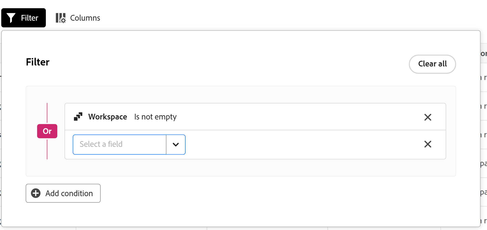

# Adobe Workfront Planning 요청을 제출하여 레코드 생성

<!--update title when there will be more functionality added to the Planning requests, besides creating records-->

<!--
The highlighted information on this page refers to functionality not yet generally available. It is available only in the Preview environment for all customers. After the monthly releases to Production, the same features are also available in the Production environment for customers who enabled fast releases.    

For information about fast releases, see [Enable or disable fast releases for your organization](/help/quicksilver/administration-and-setup/set-up-workfront/configure-system-defaults/enable-fast-release-process.md). 
-->

{{planning-important-intro}}

작업 영역 관리자가 Adobe Workfront Planning에서 레코드 유형에 대한 요청 양식을 작성한 후 이 양식을 사용하여 해당 양식과 관련된 레코드 유형에 대한 레코드를 만들 요청을 제출할 수 있습니다.

다음 영역에서 Workfront Planning 요청을 제출할 수 있습니다.

* Workfront의 요청 영역 또는 홈의 내 요청 위젯에서 가져올 수 있습니다.
* 공유된 요청 양식에 대한 직접 링크에서.
* 레코드 유형 페이지에서 요청을 제출하여 새 레코드를 추가할 때 자세한 내용은 [레코드 만들기](/help/quicksilver/planning/records/create-records.md)를 참조하세요.

이 문서에서는 Workfront의 요청 영역 또는 공유 링크에서 레코드 유형에 새 레코드를 추가하도록 요청을 제출하는 방법에 대해 설명합니다.

Workspace 관리자는 사용자 또는 외부 사용자로 사용하여 Planning 레코드 유형에 요청을 제출할 수 있는 요청 양식을 생성할 수 있습니다. 요청은 요청 양식과 연결된 레코드 유형에 대한 레코드를 만듭니다.

작업 영역 관리자가 요청 양식을 만들고 레코드 유형과 연결하는 방법에 대한 자세한 내용은 [Adobe Workfront Planning에서 요청 양식 만들기 및 관리](/help/quicksilver/planning/requests/create-request-form.md)를 참조하십시오.

## 액세스 요구 사항

+++ 이 문서의 기능에 대한 액세스 요구 사항을 보려면 확장하십시오. 

<table style="table-layout:auto"> 
<col> 
</col> 
<col> 
</col> 
<tbody> 
<tr> 
   <td role="rowheader">
Adobe Workfront 패키지
</td> 
   <td> 

모든 Workfront 또는 워크플로우 패키지

모든 Workfront Planning 패키지

각 Workfront Planning 패키지에 포함된 내용에 대한 자세한 내용은 Workfront 계정 담당자에게 문의하십시오.

   </td> </tr>
  </tr> 
  <tr> 
   <td role="rowheader">
Adobe Workfront 라이선스
</td> 
   <td>
Any
 
  </td> 
  </tr> 
  <tr> 
   <td role="rowheader">
개체 권한
</td> 
   <td>   
Workfront 사용자인 경우 작업 공간 및 레코드 유형에 대한 이상의 권한을 봅니다
  </td> 
  </tr>  
</tbody> 
</table>

Workfront 액세스 요구 사항에 대한 자세한 내용은 Workfront 설명서의 [액세스 요구 사항](/help/quicksilver/administration-and-setup/add-users/access-levels-and-object-permissions/access-level-requirements-in-documentation.md)을 참조하십시오.

+++

## 전제 조건

Workfront Planning 요청 양식에 요청을 제출하려면 먼저 다음 조건을 충족해야 합니다.

* Workfront Planning에는 다음이 있어야 합니다.

   * 작업 영역
   * 레코드 유형
   * 레코드 유형과 연결된 요청 양식입니다.

     자세한 내용은 [Adobe Workfront Planning에서 요청 양식 만들기](/help/quicksilver/planning/requests/create-request-form.md)를 참조하십시오.

* 액세스 가능한 방식으로 요청 양식을 공유해야 합니다. 다음과 같은 시나리오가 있습니다.

   * 내부적으로 작업 영역에 대한 보기 이상의 권한이 있는 사용자와 양식을 공유해야 합니다.

     Workfront 사용자는 링크에서 양식에 액세스하거나 Workfront의 요청 영역에서 요청 양식을 찾을 수 있습니다.

   * 외부에서 Workfront 계정이 없는 외부 사용자와 레코드 양식에 대한 링크를 공유합니다.

     Workfront 사용자는 외부 사용자와 공유되는 링크에 액세스할 수도 있습니다.

* 링크와 공유하는 경우 양식에 대한 링크가 만료되지 않아야 합니다.

## Workfront Planning에 요청 제출에 대한 고려 사항

* 요청을 제출한 후에는 Workfront에서 요청을 편집할 수 없습니다.
* 제출된 각 요청은 사용하는 양식과 연결된 레코드 유형, 양식이 승인과 연결되지 않은 경우 또는 모든 승인자가 승인을 부여한 경우 레코드를 만듭니다.
* 요청 양식을 제출하여 생성된 레코드는 Workfront Planning에서 다른 방법을 통해 추가된 레코드와 동일합니다.

  자세한 내용은 [레코드 만들기](/help/quicksilver/planning/records/create-records.md)를 참조하세요.
* 요청 양식을 제출하여 생성된 레코드는 원래 요청에 연결됩니다. 이 연결을 제거할 수 없습니다.
* 다음 영역에서 생성된 레코드와 레코드 만들기에 사용된 요청을 모두 볼 수 있습니다.
   * Workfront의 요청 영역입니다.
   * 요청을 연결된 레코드로 추가할 때 Workfront Planning에서 레코드 유형 페이지의 연결된 필드에서.
   * 요청을 연결된 레코드로 추가할 때 Workfront Planning에 있는 레코드 세부 사항 영역의 연결된 필드에서.

  >[!TIP]
  >
  >Workfront의 요청 영역에 있는 제목 필드 또는 Workfront Planning의 원래 요청 연결 필드에서 요청 이름을 볼 수 있습니다.

* 제출된 Planning 요청은 새 요청 경험에서만 볼 수 있습니다. 레거시 요청 환경에서는 Planning 요청을 볼 수 없습니다.

  자세한 내용은 [요청 만들기 및 제출](/help/quicksilver/manage-work/requests/create-requests/create-submit-requests.md)을 참조하십시오.
* 특정 필드 유형이 요청 양식 또는 양식 제출 후 요청 세부 정보 페이지에 표시되는 방법에는 제한이 있습니다.

  자세한 내용은 [Adobe Workfront Planning에서 요청 양식 만들기 및 관리](/help/quicksilver/planning/requests/create-request-form.md)를 참조하십시오.

<!--
Not sure how to change the request status, but dev also said: Changing the names of the statuses might lead to some inconsistency between unified-approvals-service and intake-approvals-flow.
-->

## Workfront의 요청 영역에서 Workfront Planning에 요청 제출

{{step1-to-requests}}

1. 화면 오른쪽 상단에서 **새 경험 사용** 설정을 켭니다.
이 설정을 켜면 Workfront Planning 요청 양식을 Workfront의 **요청** 영역에서 사용할 수 있습니다.

   >[!TIP]
   >
   >
   >이 영역에서 Workfront Planning 요청을 제출하려면 다음 조건을 충족해야 합니다.
   >
   >* 귀사에서 Workfront Planning 라이선스를 구입했습니다.
   >
   >* 하나 이상의 작업 영역을 볼 수 있는 액세스 권한이 있습니다.

1. **어떤 요청을 제출하시겠습니까?요청 양식 목록을 열려면** 표시줄을 사용합니다.
1. 목록에서 요청 양식을 선택하거나 요청 양식 이름을 입력한 다음 목록에 표시될 때 선택합니다.

   창이 열리고 맨 위에 요청 양식 이름이 표시됩니다.

   >[!TIP]
   >
   >Workfront 요청 대기열에는 대기열 이름과 요청 목록에 있는 양식 이름이 포함됩니다. Planning 요청 양식은 요청 목록에 양식 이름만 표시합니다.

1. **제목** 필드를 업데이트합니다. 요청 이름입니다. 필수 필드입니다.
1. **이름** 필드를 업데이트합니다. 미래의 레코드 이름입니다.

   >[!TIP]
   >
   >**이름** 필드는 조직에 고유하며 Workfront 인스턴스에 다른 레이블이 표시될 수 있습니다. 필드는 레코드의 기본 필드입니다.

1. 요청 양식의 나머지 필드를 업데이트합니다. 빨간색 별표가 있는 필드는 필수입니다.
1. (조건부) 조직에서 AI가 제공하는 **양식 채우기**&#x200B;를 허용하는 경우 문서를 프롬프트로 업로드할 수 있습니다. AI는 이러한 문서를 사용하여 양식을 채우며 요청을 제출하기 전에 AI 제안을 수락하거나 거부할 수 있습니다.

   지침은 [AI에서 제공하는 양식 채우기를 사용하여 프롬프트 또는 문서를 사용하여 요청을 채우는 방법](/help/quicksilver/manage-work/requests/create-requests/autofill-from-prompt-document.md)을 참조하십시오.
1. **제출을 클릭합니다**.

   요청 양식이 닫히고 **요청** 영역으로 돌아갑니다.

   양식이 제출되고 다음 사항이 발생합니다.

   * 요청 양식이 승인과 연결되어 있지 않은 경우, 요청은 홈의 Workfront 요청 영역 및 내 요청 위젯에 있는 요청 목록에 추가되고, 새 레코드는 해당 양식과 연결된 레코드 유형에 추가됩니다.

     다음 필드에는 요청 영역의 요청 및 레코드 정보와 홈의 내 요청 위젯이 표시됩니다.

      * **제목**: 요청 영역에 추가된 원래 요청의 이름입니다. 요청 목록에서 **제목** 필드를 숨기거나 제거할 수 없습니다. 이름에는 Planning에서 요청 페이지를 여는 링크가 있습니다.
      * **만들어진 개체**: Planning에 표시되는 요청에서 만들어진 레코드의 이름. 작성된 개체 이름에는 요청에서 작성된 레코드를 여는 링크가 있습니다.
      * **개체 형식**: Planning의 요청에서 레코드를 만든 작업 영역의 이름 및 레코드 형식입니다.
      * **상태**: 요청 개체의 상태입니다.
      * **요청 양식**: Planning의 레코드 유형과 연결된 요청 양식의 이름입니다.
      * **만들어진 개체 상태**: 만들어진 레코드의 상태입니다.

   * 요청 양식이 승인과 연결된 경우 요청이 Workfront 요청 영역의 요청 목록 및 내 요청 위젯에 **검토 보류 중** 상태로 추가됩니다. 새 레코드는 승인자가 승인한 후에만 레코드 유형 페이지에 추가됩니다.

     자세한 내용은 [요청 양식에 승인 추가](/help/quicksilver/planning/requests/add-approval-to-request-form.md)를 참조하십시오.

   * Planning의 레코드 유형에 **원본 요청** 연결 필드를 추가하여 레코드를 만든 원본 요청의 이름을 표시할 수 있습니다. 자세한 내용은 [레코드 종류 연결](/help/quicksilver/planning/architecture/connect-record-types.md)을 참조하세요.
   * 요청은 소유자, 승인자 및 작업 영역에 대해 최소 보기 권한이 있는 사람에게만 표시됩니다. Workfront 관리자는 시스템의 작업 영역에 제출된 모든 요청을 볼 수 있습니다.
   * 요청이 성공적으로 제출되었거나 검토를 위해 전송되었다는 인앱 및 이메일 알림을 받게 됩니다.
   * 요청 양식이 승인과 연결된 경우 승인자는 요청을 검토하고 승인하기 위한 인앱 및 이메일 알림을 수신합니다.

     이메일 확인 또는 승인 알림에 요청에 대한 링크가 있습니다.

1. (선택 사항) 확인 메시지에서 **요청 보기**&#x200B;를 클릭하여 요청을 열거나 **X** 아이콘을 클릭하여 확인을 닫습니다.
1. (선택 사항) 정보가 요청 목록에 표시되는 방식을 관리하려면 목록에 대해 다음 보기 요소를 갱신합니다.

   * 보기
   * 필터
   * 열
   * 그룹화
   * 셀 서식 지정
   * 행 높이

   자세한 내용은 [향상된 목록 사용](/help/quicksilver/workfront-basics/navigate-workfront/use-lists/enhanced-lists.md)을 참조하세요.

   <!-- 
   Removing this as this is covered at a higher level in the Use enhanced lists article: 
   1. (Optional) From the requests list, do any of the following:
      * Click **Filters** and start adding conditions for what requests you want to view in the Requests list. 
         
         You can filter by the following fields:  
         * **Workspace**: The workspace the request form is associated with.
         * **Object type**: The record type the request form is associated with.
         * **Entry date**: The date when the request was submitted.
         * **Request form**: The name of the request form used to submit the request.
         * **Status**: The status of the request.
         * **Entered by**: The name of the user who added the request. If the request was added by someone outside of Workfront, the **Entered by** field shows `N/A`.
        You can have multiple filters joined by either **And** or **Or**.
         The request list is filtered automatically, as you add the filter conditions. 
      * Click **Columns** to open the **Fields visibility and order** box, then hide, show, or rearrange the columns in the request list. 
         >[!TIP]
         >
         >You cannot add any more columns. 
         
      * Click the **+** icon in the upper-right corner of the request list to open the **Column manager** and add or remove columns in the requests list. 
   -->

1. 목록에서 요청 이름을 클릭합니다.

   요청 세부 정보 페이지가 열립니다.

   

1. (선택 사항) **댓글** 영역에 댓글을 입력합니다.
1. (조건부) 요청 양식이 승인과 연결되어 있지 않거나 요청이 승인된 경우 요청 이름을 클릭한 다음 **만들어진 개체** 필드에서 레코드 이름을 클릭합니다.

   레코드의 페이지가 Workfront Planning에 열립니다.

   >[!TIP]
   >
   >* 레코드의 기본 필드가 요청 양식에서 업데이트되지 않으면 요청의 레코드 필드에 있는 레코드 이름이 **제목 없음**&#x200B;으로 표시됩니다.
   >
   >* 요청 양식이 승인과 연결된 경우 요청 페이지에서 레코드에 액세스하려면 승인을 받아야 합니다. 승인은 승인될 때까지 레코드가 생성되지 않습니다.

1. (선택 사항) **레코드 종류**&#x200B;의 이름을 클릭합니다.

   Workfront Planning에서 레코드 유형 페이지가 열립니다.

## 공유 링크에서 요청 양식으로 Workfront Planning에 요청 제출

이 섹션의 정보는 공유 링크에서 요청을 제출하고 Workfront 계정이 없을 수 있는 사용자에게만 적용됩니다.

외부 사용자가 **요청** 또는 **홈**&#x200B;과 같은 Workfront 내부 영역에 액세스할 수 없습니다.

1. Workfront Planning 레코드 유형에서 사용자와 공유되는 링크로 이동합니다.

1. 양식에서 사용할 수 있는 필드를 업데이트합니다. 별표가 있는 필드는 필수입니다.

   >[!TIP]
   >
   >   **제목** 필드를 사용할 수 있는 경우 요청이 제출된 후에는 Workfront Planning에 표시되지 않습니다.
   >
   >Workfront Planning의 레코드 유형에 추가될 때 새 레코드를 식별할 수 있도록 요청의 필드를 가능한 한 많이 업데이트하는 것이 좋습니다.

1. **제출을 클릭합니다**.

   양식이 제출되고 확인 메시지가 표시됩니다.

   양식이 승인과 연결되어 있는 경우 레코드를 만들려면 먼저 해당 양식을 승인해야 합니다.

1. (선택 사항) 동일한 공유 링크를 사용하여 다른 요청을 추가하려면 **다른 요청 제출**&#x200B;을 클릭합니다.

   * 요청 양식이 승인과 연결되어 있지 않은 경우, 요청은 홈의 Workfront 요청 영역 및 내 요청 위젯에 있는 요청 목록에 추가되고, 새 레코드는 해당 양식과 연결된 레코드 유형에 추가됩니다. Workfront에 로그인하는 경우에만 사용할 수 있습니다.

   * 요청 양식이 승인과 연결된 경우 요청이 Workfront 요청 영역의 요청 목록 및 내 요청 위젯에 추가되어 검토 보류 상태로 표시됩니다. 새 레코드는 모든 승인자가 승인한 후에만 레코드 유형 페이지에 추가됩니다. Workfront에 로그인하는 경우에만 사용할 수 있습니다.

     자세한 내용은 [요청 양식에 승인 추가](/help/quicksilver/planning/requests/add-approval-to-request-form.md)를 참조하십시오.

     >[!IMPORTANT]
     >
     >볼 수 있는 권한 이상이 있는 작업 영역에 사용자 또는 다른 사람이 제출한 요청만 볼 수 있습니다. Workfront 관리자는 시스템의 작업 영역에 제출된 모든 요청을 볼 수 있습니다.

   * 요청이 성공적으로 제출되었거나 검토를 위해 전송되었다는 인앱 및 이메일 알림을 받게 됩니다.
   * 요청 양식이 승인과 연결된 경우 승인자는 요청을 검토하고 승인하기 위한 인앱 및 이메일 알림을 수신합니다.

     요청이 승인되고 레코드가 생성되면 승인자 및 승인자 일자 필드에 레코드의 승인에 대한 정보가 표시됩니다.

1. (선택 사항) Workfront에서 요청을 열려면 **요청 보기**&#x200B;를 클릭합니다.

또는

[다른 요청 제출](https://pulsar.devtest.workfront-dev.com/intake/6740a1ff44bf3a5600cf4481/request)을 클릭하여 요청 양식을 열고 새 요청을 추가합니다.

요청 세부 정보 페이지가 열립니다.

1. (선택 사항) **댓글** 영역에 댓글을 입력합니다.
1. (조건부) 요청 양식이 승인과 연결되어 있지 않거나 요청이 승인된 경우 요청 이름을 클릭한 다음 **만들어진 개체** 필드에서 레코드 이름을 클릭합니다.

   레코드의 페이지가 Workfront Planning에 열립니다.

   >[!TIP]
   >
   >* 레코드 이름이 요청 양식에 추가되지 않은 경우 요청의 레코드 필드에 있는 레코드 이름이 **제목 없음**&#x200B;으로 표시됩니다.
   >
   >* 요청 양식이 승인과 연결된 경우 요청 페이지에서 레코드에 액세스하려면 승인을 받아야 합니다.

1. (선택 사항) **개체 형식**&#x200B;의 이름을 클릭합니다.

   Workfront Planning에서 레코드 유형 페이지가 열립니다.

## 기존 요청을 복사하여 요청 만들기

Workfront의 요청 목록에서 요청을 복사한 다음 세부 사항을 편집하고 새 요청으로 제출할 수 있습니다.

새 요청 경험에서만 사용할 수 있습니다.

기존 Planning 요청을 복사하여 새 요청으로 제출하는 것은 기존 Workfront 요청을 복사하는 것과 비슷합니다.

자세한 내용은 [요청 복사 및 제출](/help/quicksilver/manage-work/requests/create-requests/copy-and-submit-requests.md)을 참조하십시오.

## 기존 초안에서 초안 및 요청 만들기

요청의 초안을 만든 다음 초안으로 돌아가 나중에 요청으로 제출할 수 있습니다.

새 요청 경험에서만 사용할 수 있습니다. Workfront Planning에서 기존 초안에서 초안 및 요청을 만드는 것은 Adobe Workfront에서 만드는 것과 동일합니다.

자세한 내용은 [초안에서 요청 만들기](/help/quicksilver/manage-work/requests/create-requests/create-requests-from-drafts.md)를 참조하십시오.

## 초안 또는 제출된 요청 삭제

새 요청 경험을 사용할 때 제출된 요청이나 초안을 삭제할 수 있습니다.

Planning 요청을 삭제하면 다음과 같은 일이 발생합니다.

* 요청을 복구할 수 없습니다.
* 요청에서 생성된 레코드는 삭제되지 않습니다.
* 삭제된 초안은 복구할 수 없습니다. 초안과 연결된 레코드가 없습니다.

Planning 요청을 삭제하는 것은 Workfront 요청을 삭제하는 것과 비슷합니다.

자세한 내용은 [제출된 요청 또는 요청 초안 삭제](/help/quicksilver/manage-work/requests/create-requests/delete-request-draft.md)를 참조하십시오.

