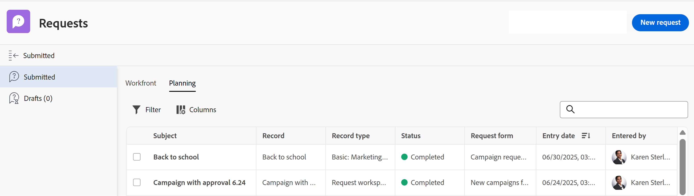

# Adobe Workfront Planning 요청을 제출하여 레코드 생성

<!--update title when there will be more functionality added to the Planning requests, besides creating records-->

이 페이지에서 강조 표시된 정보는 아직 일반적으로 사용할 수 없는 기능을 참조합니다. 모든 고객을 위한 미리보기 환경에서만 사용할 수 있습니다. 월별 프로덕션 릴리스 이후 빠른 릴리스를 활성화한 고객을 위해 프로덕션 환경에서도 동일한 기능을 사용할 수 있습니다. 

빠른 릴리스에 대한 자세한 내용은 [조직의 빠른 릴리스 사용 또는 사용 안 함](/help/quicksilver/administration-and-setup/set-up-workfront/configure-system-defaults/enable-fast-release-process.md)을 참조하세요. 

{{planning-important-intro}}

누군가가 Adobe Workfront Planning의 레코드 유형 페이지에서 요청 양식에 대한 링크를 귀하에게 공유하면 요청을 추가하여 요청 양식과 연관된 레코드 유형에 대한 레코드를 생성할 수 있습니다.

Workfront 사용자와 외부 사용자는 Planning 레코드 유형에 요청을 제출하고 레코드를 생성할 수 있습니다. <!--double check on the external users-->

이 문서에서는 레코드 유형에 새 레코드를 추가하도록 요청을 제출하는 방법에 대해 설명합니다.

작업 영역 관리자가 요청 양식을 만들고 레코드 유형과 연결하는 방법에 대한 자세한 내용은 [Adobe Workfront Planning에서 요청 양식 만들기 및 관리](/help/quicksilver/planning/requests/create-request-form.md)를 참조하십시오.

## 액세스 요구 사항

+++ 을 확장하여 이 문서의 기능에 대한 액세스 요구 사항을 봅니다.

이 문서의 단계를 수행하려면 다음 액세스 권한이 있어야 합니다.

<table style="table-layout:auto">
 <col>
 </col>
 <col>
 </col>
 <tbody>
    <tr>
<tr>
<td>
   
 제품
 </td>
   <td>
   <ul><li>
 Adobe Workfront
</li>
   <li>
 Adobe Workfront 계획
</li></ul></td>
  </tr>  
 <tr>
   <td role="rowheader">
Adobe Workfront 플랜*
</td>
   <td>

다음 Workfront 플랜 중 하나:

<ul><li>선택</li>
<li>Prime</li>
<li>Ultimate</li></ul>

Workfront Planning은 기존 Workfront 플랜에 사용할 수 없습니다.

   </td>
<tr>
   <td role="rowheader">
Adobe Workfront 계획 패키지*
</td>
   <td>

임의 
  

각 Workfront Planning 계획에 포함된 사항에 대한 자세한 내용은 Workfront 계정 관리자에게 문의하십시오. </td>
<tr>
   <td role="rowheader">
Adobe Workfront 플랫폼
</td>
   <td>

Workfront Planning의 모든 기능에 액세스할 수 있으려면 조직의 Workfront 인스턴스가 통합 경험 Adobe에 온보딩되어야 합니다.

자세한 내용은 <a href="/help/quicksilver/workfront-basics/navigate-workfront/workfront-navigation/adobe-unified-experience.md">Workfront용 통합 경험 Adobe</a>를 참조하십시오. 

   </td>

</tr>
  </tr>
  <tr>
   <td role="rowheader">
Adobe Workfront 라이센스*
</td>
   <td>
   
External, Contributor, Light 또는 Standard 라이센스

   
기존 Workfront 라이선스에는 Workfront Planning을 사용할 수 없습니다.

  </td>
  </tr>
  <tr>
   <td role="rowheader">
액세스 수준 구성
</td>
   <td> 
Adobe Workfront Planning에 대한 액세스 수준 제어가 없습니다.
  
</td>
  </tr>
<tr>
   <td role="rowheader">
개체 권한
</td>
   <td>
   
Workfront 사용자인 경우 작업 영역에 대한 이상의 권한 보기
 
  </td>
  </tr>
<tr>
   <td role="rowheader">
레이아웃 템플릿
</td>
   <td> 
Workfront의 계획 영역에 액세스하려면 주 메뉴에서 계획 영역을 포함하는 레이아웃 템플릿을 할당해야 합니다. 

   
 하지만 Workfront Planning에 요청을 제출하는 데 계획 영역에 액세스할 필요는 없습니다. 
  
</td>
  </tr>
 </tbody>
</table>

*Workfront 액세스 요구 사항에 대한 자세한 내용은 Workfront 설명서의 [액세스 요구 사항](/help/quicksilver/administration-and-setup/add-users/access-levels-and-object-permissions/access-level-requirements-in-documentation.md)을 참조하십시오.

+++

## 전제 조건

Workfront Planning 요청 양식에 요청을 제출하려면 먼저 다음 조건을 충족해야 합니다.

* Workfront Planning에는 다음이 있어야 합니다.

   * 작업 영역
   * 요청 양식과 연결된 레코드 유형입니다. 자세한 내용은 [Adobe Workfront Planning에서 요청 양식 만들기](/help/quicksilver/planning/requests/create-request-form.md)를 참조하십시오.

* 액세스 가능한 방식으로 요청 양식을 링크와 공유해야 합니다. 다음과 같은 시나리오가 있습니다.

   * Workfront 계정이 있는 경우 링크는 내부 직원하고만 공유되었으며 작업 영역에 대한 기여 이상의 액세스 권한이 있습니다. Workfront 외부 사용자는 내부적으로 공유된 링크에 액세스할 수 없습니다.
   * Workfront 계정이 없는 경우 링크가 외부 사용자와 공유되었습니다. Workfront 사용자는 외부 사용자와 공유되는 링크에 액세스할 수도 있습니다.

* 양식에 대한 링크가 만료되지 않아야 합니다.

## Workfront Planning에 요청 제출에 대한 고려 사항

* 양식에 대한 특정 링크에서만 Workfront Planning 요청에 대한 요청 양식에 액세스할 수 있습니다.
* 요청을 Workfront Planning에 제출한 후에는 요청을 편집할 수 없습니다.
* 제출된 각 요청은 <!--if the form is not associated with an approval, or if the approval has been granted. -->을(를) 사용하는 양식과 연결된 레코드 유형에 대한 레코드를 만듭니다.
* 요청 양식을 제출하여 생성된 레코드는 다른 방법을 통해 추가된 레코드와 구분할 수 없습니다. 자세한 내용은 [레코드 만들기](/help/quicksilver/planning/records/create-records.md)를 참조하세요.
* 제출된 요청은 Workfront 의 요청 영역에 있는 제출된 섹션의 계획 탭에 표시됩니다.

<!--Not sure how to change the request status, but dev also said: Changing the names of the statuses might lead to some incosistency between unified-approvals-service and intake-approvals-flow.-->

## Workfront Planning에 요청 제출

1. Workfront Planning 레코드 유형에서 사용자와 공유되는 링크로 이동합니다.

1. 양식에서 사용할 수 있는 필드를 업데이트합니다. 별표가 있는 필드는 필수입니다.

   >[!TIP]
   >
   >   **제목** 필드를 사용할 수 있는 경우 요청이 제출된 후에는 Workfront Planning에 표시되지 않습니다.
   >
   >Workfront Planning의 레코드 유형에 추가될 때 새 레코드를 식별할 수 있도록 요청의 필드를 가능한 한 많이 업데이트하는 것이 좋습니다.

1. **제출**&#x200B;을 클릭합니다.

   양식이 제출되고 다음 사항이 발생합니다.

   * <!--If the request form was not associated with an approval, or if the approval was granted, a-->양식에 연결된 레코드 유형에 새 레코드가 추가됩니다.

   * <!--If the request form was not associated with an approval, the-->  요청이 Workfront 요청 영역의 제출됨 섹션에 추가되고 새 레코드가 레코드 유형 페이지에 추가됩니다.

     

     >[!IMPORTANT]
     >
     >하나 이상의 작업 영역에 액세스할 수 있는 모든 사용자는 요청 영역에서 계획 탭을 볼 수 있습니다. 제출한 요청만 볼 수 있습니다. Workfront 관리자는 시스템의 모든 요청을 볼 수 있습니다.  <!--ensure this is correct; asking team in slack-->

   <!--
   * If the request form was associated with an approval, the request is temporarily saved to the Planning tab in the Submitted section of the Workfront Requests area. No record is created for the record type associated with the request form.

      For information, see [Add an approval to a request form](/help/quicksilver/planning/requests/add-approval-to-request-form.md).  
   -->
   <!--

   * You receive an in-app and an email notification that the request has either been submitted successfully or has been sent for review. 
   * If the request form was associated with an approval, the approvers receive an in-app and an email notification to review and approve the request. 
   -->

