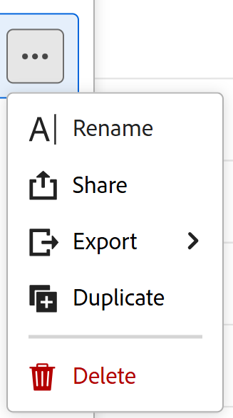

# 레코드 보기 삭제

<!--The highlighted information on this page refers to functionality not yet generally available. It is available only in the Preview environment for all customers. After the monthly releases to Production, the same features are also available in the Production environment for customers who enabled fast releases.    

For information about fast releases, see [Enable or disable fast releases for your organization](/help/quicksilver/administration-and-setup/set-up-workfront/configure-system-defaults/enable-fast-release-process.md). -->

{{planning-important-intro}}

Adobe Workfront Planning에서 더 이상 사용하지 않는 레코드 보기를 삭제할 수 있습니다.

보기에 액세스할 수 있는 권한이 있는 모든 사용자에 대해 보기가 삭제됩니다. 삭제된 보기는 복구할 수 없습니다.

## 액세스 요구 사항

+++ 을 확장하여 이 문서의 기능에 대한 액세스 요구 사항을 봅니다. 

<table style="table-layout:auto"> 
<col> 
</col> 
<col> 
</col> 
<tbody> 
    <tr> 
<tr> 
</tr>   
<tr> 
   <td role="rowheader">
Adobe Workfront 패키지
</td> 
   <td> 
   
모든 Workfront 및 모든 Planning 패키지

모든 워크플로우 및 모든 Planning 패키지

   
각 Workfront Planning 패키지에 포함된 내용에 대한 자세한 내용은 Workfront 계정 담당자에게 문의하십시오. 
 
   </td> 
  <tr> 
   <td role="rowheader">
Adobe Workfront 라이선스
</td> 
   <td>
표준

   </td> 
  </tr> 
  <tr> 
   <td role="rowheader">
개체 권한
</td> 
   <td>   
보기에 대한 권한 관리
  
</td> 
  </tr>  
</tbody> 
</table>

Workfront 액세스 요구 사항에 대한 자세한 내용은 Workfront 설명서의 [액세스 요구 사항](/help/quicksilver/administration-and-setup/add-users/access-levels-and-object-permissions/access-level-requirements-in-documentation.md)을 참조하십시오.

+++   

<!--Old:
<table style="table-layout:auto"> 
<col> 
</col> 
<col> 
</col> 
<tbody> 
    <tr> 
<tr> 
<td> 
   
 Products
 </td> 
   <td> 
   <ul><li>
 Adobe Workfront
</li> 
   <li>
 Adobe Workfront Planning
</li></ul></td> 
  </tr>   
<tr> 
   <td role="rowheader">
Adobe Workfront plan*
</td> 
   <td> 

Any of the following Workfront plans:
 
<ul><li>Select</li> 
<li>Prime</li> 
<li>Ultimate</li></ul> 

Workfront Planning is not available for legacy Workfront plans
 
   </td> 
<tr> 
   <td role="rowheader">
Adobe Workfront Planning package*
</td> 
   <td> 

Any 
 

For more information about what is included in each Workfront Planning plan, contact your Workfront account manager. 
 
   </td> 
 <tr> 
   <td role="rowheader">
Adobe Workfront platform
</td> 
   <td> 

Your organization's instance of Workfront must be onboarded to the Adobe Unified Experience to be able to access Workfront Planning.
 

For more information, see <a href="/help/quicksilver/workfront-basics/navigate-workfront/workfront-navigation/adobe-unified-experience.md">Adobe Unified Experience for Workfront</a>. 
 
   </td> 
   </tr> 
  </tr> 
  <tr> 
   <td role="rowheader">
Adobe Workfront license*
</td> 
   <td>
 Standard 

   
Workfront Planning is not available for legacy Workfront licenses
 
  </td> 
  </tr> 
  <tr> 
   <td role="rowheader">
Access level configuration
</td> 
   <td> 
There are no access level controls for Adobe Workfront Planning
   
</td> 
  </tr> 
<tr> 
   <td role="rowheader">
Object permissions
</td> 
   <td>   
Manage permissions to a view
  
   </td> 
  </tr> 
</tbody> 
</table> -->

## 레코드 보기 삭제

{{step1-to-planning}}

1. 작업 영역의 카드를 클릭합니다.

   작업공간이 열리고 레코드 유형이 카드로 표시됩니다.

1. 레코드 유형 카드를 클릭합니다.

   레코드 유형 페이지가 열립니다.

   기본적으로 선택한 유형의 모든 레코드가 테이블 뷰에 표시됩니다.

1. 보기의 탭에서 보기의 탭을 클릭하고 드롭다운 메뉴에서 보기 위로 마우스를 가져간 후 **자세히** 메뉴 를 클릭한 다음 **삭제**&#x200B;를 클릭합니다.

   

1. 확인하려면 **삭제**&#x200B;를 클릭하세요.

   레코드 영역에 액세스할 수 있는 모든 사용자에 대해 보기가 삭제됩니다.
