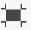
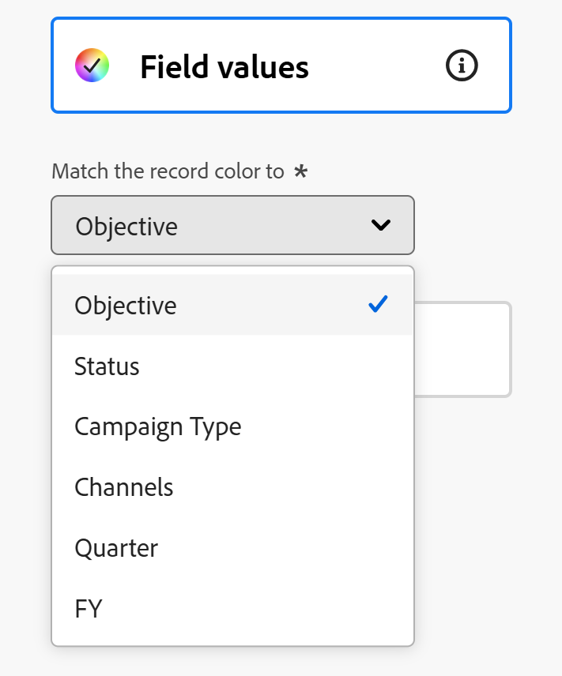

# 달력 보기 관리

이 페이지에서 강조 표시된 정보는 아직 일반적으로 사용할 수 없는 기능을 참조합니다. 모든 고객을 위한 미리보기 환경에서만 사용할 수 있습니다. 월별 프로덕션 릴리스 이후 빠른 릴리스를 활성화한 고객을 위해 프로덕션 환경에서도 동일한 기능을 사용할 수 있습니다. 

빠른 릴리스에 대한 자세한 내용은 [조직의 빠른 릴리스 사용 또는 사용 안 함](/help/quicksilver/administration-and-setup/set-up-workfront/configure-system-defaults/enable-fast-release-process.md)을 참조하세요. 

{{planning-important-intro}}

레코드 유형 페이지에서 레코드와 해당 필드를 달력 보기에 표시할 수 있습니다.

Adobe Workfront Planning 보기 및 관리 방법에 대한 자세한 내용은 [레코드 보기 관리](/help/quicksilver/planning/views/manage-record-views.md)를 참조하십시오.

## 액세스 요구 사항

+++ 를 확장하여 액세스 요구 사항을 확인합니다. 

<table style="table-layout:auto"> 
<col> 
</col> 
<col> 
</col> 
<tbody> 
    <tr> 
<tr> 
<td> 
   
 제품
 </td> 
   <td> 
   <ul><li>
 Adobe Workfront
</li> 
   <li>
 Adobe Workfront 계획
</li></ul></td> 
  </tr>   
<tr> 
   <td role="rowheader">
Adobe Workfront 플랜*
</td> 
   <td> 

다음 Workfront 플랜 중 하나:
 
<ul><li>선택</li> 
<li>Prime</li> 
<li>Ultimate</li></ul> 

Workfront Planning은 기존 Workfront 플랜에 사용할 수 없습니다.
 
   </td> 
<tr> 
   <td role="rowheader">
Adobe Workfront 계획 패키지*
</td> 
   <td> 

임의 
 

각 Workfront Planning 계획에 포함된 사항에 대한 자세한 내용은 Workfront 계정 관리자에게 문의하십시오. 
 
   </td> 
 <tr> 
   <td role="rowheader">
Adobe Workfront 플랫폼
</td> 
   <td> 

Workfront Planning에 액세스하려면 조직의 Workfront 인스턴스가 Adobe 통합 경험에 온보딩되어야 합니다.
 

자세한 내용은 <a href="/help/quicksilver/workfront-basics/navigate-workfront/workfront-navigation/adobe-unified-experience.md">Workfront용 Adobe 통합 환경</a>을 참조하십시오. 
 
   </td> 
   </tr> 
  </tr> 
    <td role="rowheader">
Adobe Workfront 라이센스*
</td> 
   <td>
 보기를 만들고 삭제하는 표준

   
기여자 이상: 보기 요소 업데이트

   
기존 Workfront 라이선스에는 Workfront Planning을 사용할 수 없습니다.
 
  </td> 
  </tr> 
  <tr> 
   <td role="rowheader">
액세스 수준 구성
</td> 
   <td> 
Adobe Workfront Planning에 대한 액세스 수준 제어가 없습니다.
   
</td> 
  </tr> 
<tr> 
   <td role="rowheader">
개체 권한
</td> 
   <td>   
보기에 대한 권한 관리
  
   
보기에 대한 권한을 보고 일시적으로 보기 설정을 변경하거나 복제합니다.
 </td> 
  </tr> 
<tr>
   <td role="rowheader">
레이아웃 템플릿
</td>
   <td> 라이트 또는 기여자 라이선스가 있는 사용자에게 Planning이 포함된 레이아웃 템플릿을 할당해야 합니다.
   
표준 사용자 및 시스템 관리자에게는 기본적으로 계획 영역이 활성화되어 있습니다.

</li></ul>
</td>
  </tr>

</tbody> 
</table>

*Workfront 액세스 요구 사항에 대한 자세한 내용은 Workfront 설명서의 [액세스 요구 사항](/help/quicksilver/administration-and-setup/add-users/access-levels-and-object-permissions/access-level-requirements-in-documentation.md)을 참조하십시오.

+++   

## 달력 보기 관리 {#manage-a-calendar-view}

<!--insert screen shot of calendar view-->

다음 사항을 고려하십시오.

* 레코드 유형과 연결된 날짜 필드가 두 개 이상 있는 경우에만 달력 보기를 만들 수 있습니다. 레코드 유형과 연결된 날짜 필드가 하나 또는 없으면 달력 보기 옵션이 흐리게 표시됩니다.

  레코드 날짜 필드에서 선택하거나 연결된 레코드 또는 개체 유형에서 날짜 필드를 조회할 수 있습니다.
* 다음과 같은 시나리오가 있습니다.

   * 시작 날짜와 종료 날짜에 값이 없으면 레코드가 달력에 표시되지 않습니다
   * 시작 또는 종료 날짜에 값이 없으면 레코드가 1일 이벤트로 표시됩니다
   * 시작 날짜가 종료 날짜 이후인 경우 기록이 캘린더에 표시되지 않습니다.

달력 보기를 관리하려면:

1. 달력을 보려는 레코드 유형 페이지로 이동합니다.
1. [레코드 보기 관리](/help/quicksilver/planning/views/manage-record-views.md) 문서에 설명된 대로 일정 보기를 만듭니다.

   

   

   선택한 레코드 유형과 연관된 레코드가 달력에 막대로 표시됩니다. 기본적으로 막대의 색상은 레코드 아이콘의 색상과 일치합니다.

   

1. 다음 중 하나를 수행하여 달력을 탐색합니다.

   * 달력의 왼쪽 위 모서리에서 왼쪽 및 오른쪽 아이콘을 클릭하거나 가로 스크롤을 사용하여 달력에서 앞뒤로 이동합니다.
   * 캘린더를 오늘 날짜로 맞추려면 오른쪽 상단의 **오늘**&#x200B;을 클릭하세요.
   * 시간 증가를 업데이트하려면 시간대 드롭다운 메뉴에서 다음 옵션 중 하나를 선택합니다.

      * **월**: 월별 달력에 레코드가 표시됩니다.

      * **주**: 다음 영역에 레코드가 표시됩니다.

         * 여러 날에 걸친 레코드가 달력 맨 위에 표시됩니다.
         * 하루나 그 이하로 지속되는 레코드는 달력 보기의 하반기에 표시됩니다. 시작 및 종료 일자의 시간을 표시하도록 선택한 경우 레코드가 발생한 날짜 내의 적절한 시간에 표시됩니다.

1. (선택 사항) **전체 화면** 아이콘 을 클릭하여 전체 화면에서 보기를 연 다음 **전체 화면 종료** 아이콘  또는 키보드에서 Esc 키를 눌러 전체 화면을 종료합니다.  

1. 일정 보기에서 레코드를 만들거나 날짜를 편집하려면 다음 중 하나를 수행하십시오.

   * 달력의 아무 곳이나 두 번 클릭하여 레코드를 만듭니다. 

     자세한 내용은 [레코드 만들기](/help/quicksilver/planning/records/create-records.md).를 참조하세요.

   * 레코드 표시줄의 왼쪽 또는 오른쪽 여백을 클릭한 다음 새 위치에 끌어서 놓습니다. 레코드 막대의 크기를 조정하면 시작 또는 종료 날짜가 즉시 업데이트됩니다. 

   * 레코드 표시줄을 끌어서 놓아 위치 및 날짜를 업데이트합니다. 레코드 표시줄을 이동하면 시작 날짜와 종료 날짜가 즉시 업데이트됩니다.

     자세한 내용은 [레코드 편집](/help/quicksilver/planning/records/edit-records.md).을 참조하세요.

1. 아래 하위 섹션에 설명된 대로 다음 보기 요소를 업데이트합니다.
   * [필터](#add-filters)
   * [행 높이](#modify-row-height)
   * [설정](#edit-the-calendar-view-settings)

   <!--* [Grouping](#add-grouping)-->
   <!--* [Sort](#add-sort) not sure if this is present in calendar views?!; also check the anchor and make sure it's correct-->

### 필터 추가

필터를 사용하여 화면에 표시되는 정보의 양을 줄일 수 있습니다.

달력 보기에서 필터를 사용할 때는 다음 사항을 고려하십시오.

<!-- this list is almost identical to the one for the table view - update both-->

* 달력 보기를 위해 만든 필터는 동일한 레코드 유형에 적용되는 다른 보기의 필터와는 독립적으로 작동합니다.

* 필터는 사용자가 선택한 보기에 고유합니다. 동일한 기록 유형의 두 달력 보기에는 서로 다른 필터가 적용될 수 있습니다.

* 동일한 달력 보기를 보고 있는 두 명의 사용자에게 현재 적용된 동일한 필터가 표시됩니다.

* 달력 보기를 위해 빌드하는 필터의 이름을 지정할 수 없습니다.

* 필터를 제거하면 사용자와 동일한 레코드 종류에 액세스하고 사용자와 동일한 보기를 표시하는 모든 사용자에서 필터가 제거됩니다.

* 연결된 레코드 필드 또는 조회 필드를 기준으로 필터링할 수 있습니다.

* 여러 값을 표시하는 조회 필드를 기준으로 필터링할 수 있습니다.

달력 보기에 필터를 추가하려면 다음 작업을 수행하십시오.

1. [레코드 보기 관리](/help/quicksilver/planning/views/manage-record-views.md) 문서에 설명된 대로 레코드 유형 페이지에 대한 일정 보기를 만듭니다.
1. 달력 보기를 선택한 다음 달력의 도구 모음에서 **필터**&#x200B;를 클릭합니다.
1. **조건 추가**&#x200B;를 클릭하고 다음 정보를 추가하십시오.

   * **(으)로 필터링할**&#x200B;필드 선택<!-- the tip below might change-->

   * **옵션**(또는 필터 수정자)을 선택하여 필드가 충족해야 하는 조건 종류를 정의합니다.

     아래 표에는 각 필드 유형에 사용할 수 있는 수정자가 표시됩니다.

     <table>
        <thead>
        <tr>
            <th><b>필드 유형</b></th>
            <th><b>수정자</b></th>
        </tr>
        </thead>
        <tbody>
        <tr>
            <td>한 줄, 단락, 공식 </td>
            <td>
다음 포함

            
다음을 포함하지 않음

            
다음과 같음

            
다음이 아님

            
비어 있음

            
비어 있지 않음
</td>
        </tr>
        <tr><td>단일 선택</td>
            <td>
다음과 같음

            
다음이 아님

            
다음 중 하나

            
다음에 해당하지 않음

            
비어 있음

            
비어 있지 않음
</td>
        </tr>
        <tr>
            <td>다중 선택, 사람</td>
            <td>
다음 중 하나 포함

            
다음을 모두 포함

            
다음이 정확함

            
다음 중 어느 것도 포함하지 않음

            
비어 있음

            
비어 있지 않음
</td>
        </tr>
        <tr>
            <td>숫자, 백분율, 통화</td>
            <td>
=

            
≠

            
 &lt; 

            
&gt;

            
≤

            
≥

            
비어 있음

            
비어 있지 않음
</td>
        </tr>
        <tr>
            <td>Date</td>
            <td>
다음과 같음

            
다음이 아님

            
다음 이후

            
다음 이전

            
다음 사이에 있음

다음 사이에 없음

            
비어 있음

비어 있지 않음
</td>
        </tr>

     <tr>
            <td>확인란</td>
            <td>
다음과 같음

        </tr>
        </tbody>
        </table>

   * 선택한 필드의 값을 선택합니다.

   

   추가할 수 있는 필터링 조건 수에는 제한이 없습니다.

1. (선택 사항) 다른 필터링 옵션을 추가하고 위의 단계를 반복하려면 **조건 추가**&#x200B;를 클릭하십시오. 적용된 필터 수는 필터 아이콘 왼쪽에 표시됩니다.
1. 다음 연산자를 클릭하여 필터 조건이 조인되고 적용되어야 하는 방식을 나타냅니다.

   * **AND**: 지정한 조건을 모두 충족해야 합니다.
   * **OR**: 지정한 조건을 모두 충족해야 합니다. 기본 옵션입니다.

   1. (선택 사항) 여러 조건 그룹화 사이에 **AND** 또는 **OR** 연산자를 더 추가합니다.

      

   레코드 목록은 자동으로 필터링됩니다.  <!--at this time, you can't name and save the filter - but will this change?!-->
   <!-- asked on the task for the simple filters whether there is a limitation for how many statements a filter can have?!-->

1. (선택 사항) 필터 조건을 제거하려면 **x** 아이콘을 클릭하십시오.
1. (선택 사항) 필터 상자를 닫으려면 **필터**&#x200B;를 클릭합니다. <!--right now you cannot "clear all" for filters, but this might come later-->

### 행 높이 수정

달력 셀의 행 높이를 수정하여 각 셀에 표시되는 레코드 막대의 수를 늘리거나 줄일 수 있습니다.

달력에 표시되는 레코드 수는 레코드 모음에 표시하는 필드 수에 따라 달라집니다.

>[!TIP]
>
>이 설정은 달력을 월별 볼 때만 사용할 수 있습니다.

1. [레코드 보기 관리](/help/quicksilver/planning/views/manage-record-views.md) 문서에 설명된 대로 레코드 유형 페이지에 대한 일정 보기를 만듭니다.
1. (조건부) 월별 달력 보기를 표시한 다음 달력의 도구 모음에서 **행 높이**&#x200B;를 클릭합니다.
1. 다음 옵션 중에서 선택합니다.

   <table>
    <thead>
    <tr>
        <th><b>행 높이 옵션</b></th>
        <th><b>기본 최대 레코드 수</b></th>
    </tr>
    </thead>
    <tbody>
    <tr>
        <td>짧음</td>
        <td>
포함:

   <ul><li>1개의 필드를 표시하는 레코드 2개</li>
    <li>1개 이상의 필드를 표시하는 레코드 1개</li></ul>
        </td>
    </tr>
    <tr><td>표준</td>
        <td>
포함:

   <ul><li>1개의 필드를 표시하는 레코드 4개</li>
    <li>1개 이상의 필드를 표시하는 레코드 2개</li></ul>
        </td>
    </tr>
    <tr>
        <td>보통</td>
        <td>
포함:

   <ul><li>1개의 필드를 표시하는 레코드 8개</li>
    <li>1개 이상의 필드를 표시하는 레코드 4개</li></ul>
        </td>
    </tr>
    <tr>
        <td>높음</td>
        <td>
포함:

   <ul><li>1개의 필드를 표시하는 12개의 레코드</li>
    <li>1개 이상의 필드를 표시하는 레코드 6개</li></ul>
        </td>
    </tr>
    <tr>
        <td>콘텐츠에 맞춤</td>
        <td>
최대 500개의 레코드까지 모든 레코드가 표시됩니다.
</td>
    </tr>
    </tbody>
    </table>

1. (선택 사항) 캘린더에 표시되지 않는 레코드가 있으면 **자세히**&#x200B;을(를) 클릭합니다.

### 달력 보기 설정 편집

보기에 정보가 표시되는 내용과 방법을 나타내도록 달력 보기 설정을 업데이트합니다.

1. [레코드 보기 관리](/help/quicksilver/planning/views/manage-record-views.md) 문서에 설명된 대로 레코드 유형에 대한 달력 보기를 만듭니다.
1. **설정**&#x200B;을 클릭합니다.
1. 왼쪽 패널에서 **날짜 및 시간**&#x200B;을 클릭한 다음 캘린더에 표시할 **시작 날짜** 및 **종료 날짜**&#x200B;를 선택하십시오. 기본 시작 및 종료 날짜를 선택하거나 사용 가능한 날짜 필드를 선택할 수 있습니다.

   레코드를 나타내는 막대는 시작 날짜에 해당하는 날짜에 시작하여 종료 날짜에 해당하는 날짜에 끝납니다.

   >[!NOTE]
   >
   >* 시작 또는 종료 날짜에 대한 값이 없거나 시작 날짜가 종료 날짜보다 늦은 레코드는 달력 보기에 표시되지 않습니다.
   >
   >* 분류 옵션을 사용하여 추가 레코드를 표시하는 경우 시작 및 종료 날짜는 기본 레코드의 날짜가 됩니다. 이 영역에서 연결된 레코드에 대한 시작 및 종료 날짜를 선택할 수 없습니다.

1. 왼쪽 패널에서 **막대 스타일**&#x200B;을 클릭하여 레코드 막대에 표시할 정보를 표시합니다.

   레코드의 테이블 보기에서 정의된 레코드의 기본 필드(또는 제목)는 기본적으로 선택됩니다.
   <!--adjust this when the primary field is released??-->

1. (선택 사항 및 조건부) 레코드에 썸네일을 추가한 경우 **썸네일** 옵션을 선택하여 레코드와 연결된 이미지를 레코드 표시줄에 표시합니다.

   >[!NOTE]
   >
   >    축소판을 달력 보기에 표시하려면 먼저 표 보기에 축소판을 추가해야 합니다. 자세한 내용은 [레코드에 썸네일 추가](/help/quicksilver/planning/records/add-thumbnails-to-records.md)를 참조하십시오.

1. **필드 추가**&#x200B;를 클릭한 다음 **필드 검색** 상자 안을 클릭하고 추가할 필드를 클릭합니다.

   >[!TIP]
   >
   >   * 필드를 레코드 표시줄에 추가하려면 먼저 필드를 만들어야 합니다.
   > 
   >   * 하나 이상의 필드를 선택해야 합니다. 기본적으로 **이름**&#x200B;이(가) 선택되어 있습니다.
   >
   >   * 최대 5개의 필드를 추가할 수 있습니다.

   캘린더에 표시되는 막대의 모양에 대한 미리 보기가 오른쪽에 표시됩니다.

   

1. 달력의 레코드 색상을 사용자 지정하려면 왼쪽 패널에서 **색상**&#x200B;을(를) 클릭합니다.

   

1. **레코드 색을**(으)로 설정 섹션에서 다음 옵션 중 하나를 선택하여 레코드의 색을 설정합니다.

   * **레코드 종류**: 일정에서 레코드 막대의 색이 선택한 레코드 종류의 색과 일치합니다. 기본 옵션입니다.
   * **필드 값**: 레코드 색이 지정한 필드 색과 일치합니다.
   * **없음**: 레코드가 흰색 막대에 표시됩니다.

1. (조건부) 레코드 색으로 **필드 값**&#x200B;을(를) 선택한 경우 **레코드 색과 일치** 드롭다운 메뉴에서 필드를 선택합니다.

   

   색상 코드 옵션이 있는 필드만 드롭다운 메뉴에 표시됩니다.

   예를 들어 다중 선택 또는 단일 선택 필드에는 색상으로 구분된 옵션이 있을 수 있습니다.

   선택한 레코드 유형에 대해 색상으로 구분된 옵션이 있는 필드가 없는 경우 이 옵션은 흐리게 표시됩니다.

1. **저장**&#x200B;을 클릭합니다.

   선택한 사양과 함께 레코드가 달력 보기에 표시됩니다.